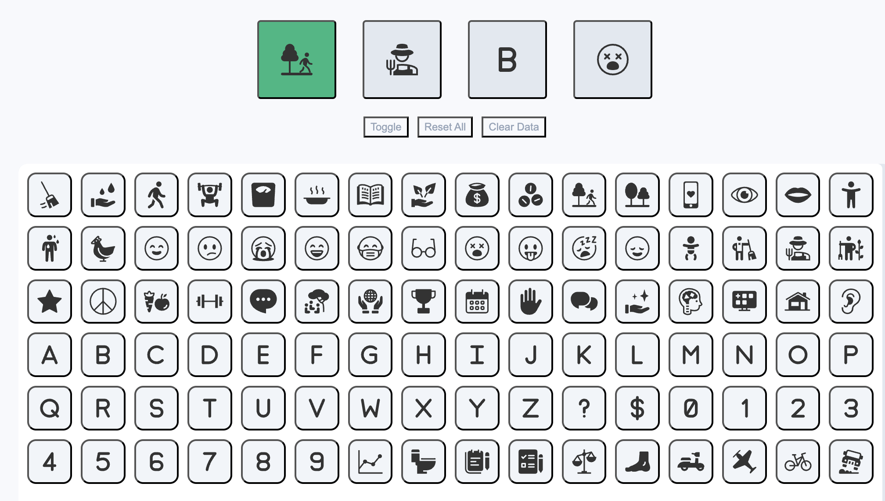

# Best Full-Stack Language!? Dopamine Box Project Powered by Imba

## Introduction

As a product manager and full-stack engineer, I'm always on the lookout for tools that enhance productivity and efficiency in web development. Recently, I discovered [**Imba**](https://imba.io/), a pioneering compile-to-JavaScript programming language tailored for crafting web applications. In this blog post, I will showcase a toy project built using Imba, known as the **Dopamine Box**, and discuss how Imba can be utilized for my future independent web development projects.

## Discovering Imba

**Imba** is a unique language designed for building web applications quickly and efficiently. Known for its exceptional speed, Imba has gained recognition after being used in the creation of [Scrimba.com](https://scrimba.com/dashboard#overview). Imba stands out with its minimal syntax, built-in tags, and styles, which streamline development and empower developers to create dynamic and efficient web applications.

### Key Features of Imba:

- **Smart, Minimal Syntax:** Imba’s syntax is concise and powerful, reducing the need for constant file switching.
- **Built-in DOM Tags & Styles:** Integrated styling and DOM manipulation for a streamlined development process.
- **Blazing Performance:** Imba’s memoized DOM is significantly faster than virtual DOM libraries.
- **Full-Stack Capabilities:** Use Imba for both frontend and backend development.

## The Essence of Dopamine Box

**Dopamine Box** is an elegant application I developed to facilitate users in logging their daily activities and moods. It offers a minimalist yet effective platform for users to record these joyous moments and reflect on them.

### Features:

- **Activity Logging:** Users can quickly jot down activities that brought them joy.
- **Mood Tracking:** It also allows users to keep track of their moods, thus recognizing patterns over time.
- **Reflection:** By looking back at the recorded moments, users can reminisce and possibly find patterns that lead to happiness.



## How to kickstart with Dopamine Box

### Set Up Environment

Before diving into the project, ensure that `node` and `npm` are installed on your system. Once the setup is ready, install the necessary project dependencies using the following command:

```bash
npm install
```

### Run the Project Locally

To see the Dopamine Box in action on your local machine, use the command:

```bash
npm run dev
```

### Build for Production

When the application is ready to be shared with the world, build it for production using:

```bash
npm run build
```

## Example Code: Drawing Application

Here’s a quick example to illustrate how I can set up a drawing application with Imba:

```javascript
import './canvas'
import './pickers'

global css body m:0 p:0 rd:lg bg:yellow1 of:hidden

const strokes = [1,2,3,5,8,12]
const colors = ['#F59E0B','#10B981','#3B82F6','#8B5CF6']
const state = {stroke: 5, color: '#3B82F6'}

tag App
    <self>
        <div[ta:center pt:20 o:0.2 fs:xl]> 'draw here'
        <app-canvas[pos:abs inset:0] state=state>
        <div.tools[pos:abs b:0 w:100% d:hgrid ja:center]>
            <stroke-picker options=strokes bind=state.stroke>
            <color-picker options=colors bind=state.color>

imba.mount <App[pos:abs inset:0]>
```

## Leveraging Imba for Future Projects

As a product manager and full-stack engineer, Imba offers a robust and efficient way for me to develop future independent projects. Here are a few ways I can utilize Imba:

### Simplified Development Process

With Imba's smart syntax and built-in tags and styles, I can reduce development time and complexity. This allows me to focus more on the features and functionality of the application rather than getting bogged down by boilerplate code. The declarative nature of Imba's syntax makes it easy to write and read, which significantly speeds up development. Additionally, the inline styling and component-based structure reduce the need for separate CSS files and complex folder structures, streamlining the workflow.

### High Performance

Imba's memoized DOM ensures my applications run faster, providing a better user experience. This is particularly beneficial for applications with dynamic interfaces and real-time updates. By leveraging Imba's performance capabilities, I can build highly responsive applications that maintain smooth performance even with complex and data-intensive operations. This is crucial for projects like the Dopamine Box, where the user interface needs to be highly interactive and real-time.

### Full-Stack Capabilities

I can utilize Imba for both the frontend and backend of my projects. Its seamless integration with Node.js and npm allows for the efficient building of comprehensive full-stack applications. For backend development, Imba provides the ability to handle server-side rendering, asset bundling, and live reloading, making the development process smooth and cohesive. This full-stack capability means I can use a single language for the entire stack, reducing the cognitive load of switching between different languages and frameworks.

### Enhanced Maintainability

Imba's concise and expressive syntax not only speeds up initial development but also makes maintaining and scaling applications easier. The clear and minimalistic codebase simplifies debugging and updating, ensuring that my projects remain maintainable in the long term. This is particularly advantageous for independent work, where managing large codebases can become challenging.

### Community and Ecosystem

Joining the Imba community allows me to collaborate with other developers, share knowledge, and contribute to the ecosystem. This engagement can lead to discovering best practices, new techniques, and valuable feedback that can enhance my projects. The active community support and continuous development of Imba also ensure that I have access to the latest features and improvements.

To learn more about Imba and how it can enhance my future projects, visit [imba.io](https://imba.io/).
