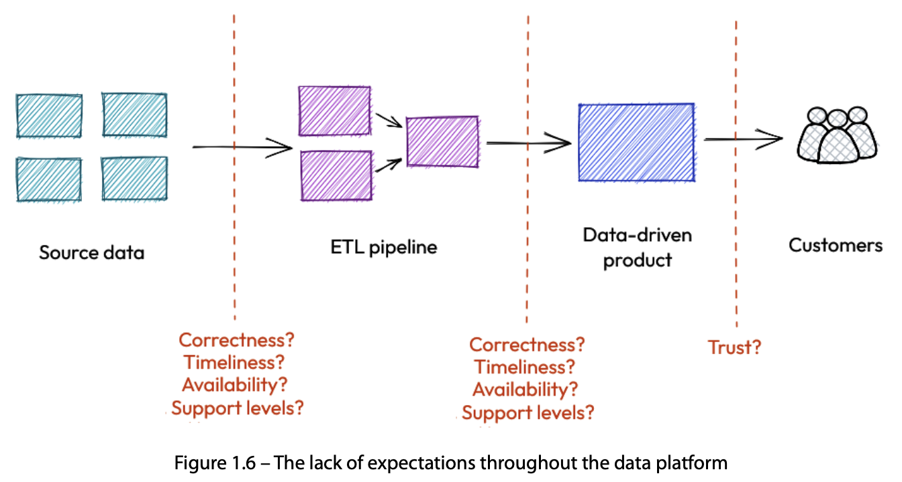
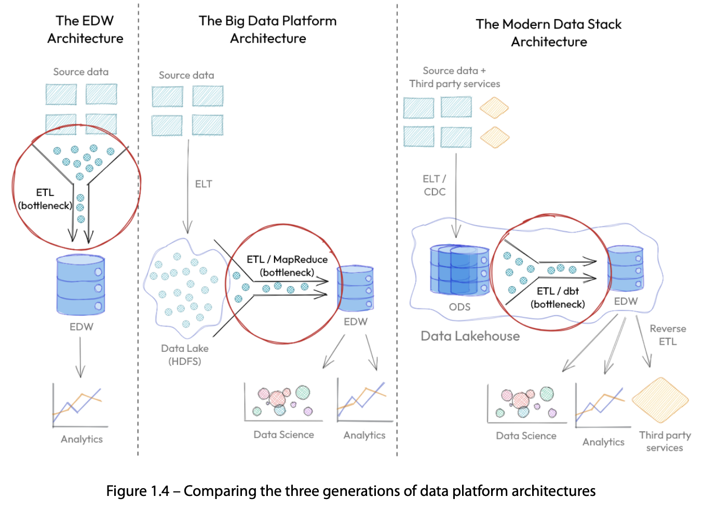
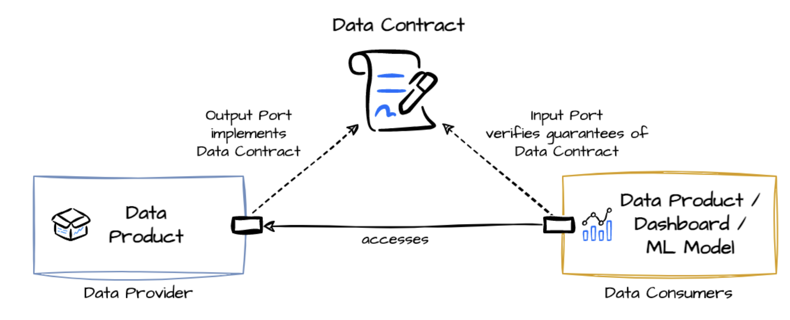

For the last two weeks, I’ve delved deep into learning about Data Contracts and I’m excited to share with you this summary of "Driving Data Quality with Data Contracts" by Andrew Jones.

In this book I’ve discovered how data contracts can solve common problems many companies have with their data. Getting good quality data is a big challenge for everyone, even with a lot of money spent. Interestingly, while each company's data may be different, the challenges are universally similar!

<!-- TOC start (generated with https://github.com/derlin/bitdowntoc) -->

- [Book Summary: Driving Data Quality with Data Contracts](#book-summary-driving-data-quality-with-data-contracts)
      + [Common Challenges](#common-challenges)
   * [**Definition**](#definition)
   * [One**-Minute Summary**](#one-minute-summary)
      + [**For a Technical Audience**](#for-a-technical-audience)
- [Deep Dive](#deep-dive)
   * [Data Contracts: **Two Main Aspects**](#data-contracts-two-main-aspects)
   * [What are the roles related to Data Contracts?](#what-are-the-roles-related-to-data-contracts)
   * [What does it mean to you?](#what-does-it-mean-to-you)
      + [For **Technical Team** 💻](#for-technical-team-)
      + [For **Business Team** 📈](#for-business-team-)
      + [For **Compliance Team** ⚖️](#for-compliance-team-)
      + [For **Strategy and Management Team** 🧐](#for-strategy-and-management-team-)
- [❓ FAQs](#-faqs)
- [**About this Summary**](#about-this-summary)
   * [**Further Readings**](#further-readings)
      + [Good resources](#good-resources)

<!-- TOC end -->
### Common Challenges

Some of the key challenges that most companies face that can be solved by data contracts include:

1. **Inconsistency Across Data Sources:** With multiple sources of data, inconsistencies often arise. Data contracts standardize the format and quality of data, ensuring that each data source conforms to a predetermined standard.
2. **Lack of Trust in Data:** It's not uncommon for stakeholders to be unsure about the accuracy or integrity of the data they're working with. Data contracts act as a form of guarantee, assuring that the data meets certain quality and accuracy thresholds.
3. **Ambiguity in Data Interpretation:** Without a clear understanding of what each data point represents, users can interpret data in varied ways. Data contracts define the semantics of data, eliminating ambiguity and promoting a consistent understanding.
4. **Costly Data Cleaning Efforts:** Poor data quality can lead to expensive and time-consuming data cleaning initiatives. By ensuring data quality at the source with data contracts, organizations can minimize or eliminate these additional costs.
5. **Poor Data Integration:** Merging data from different sources can be challenging when there's no standard format or structure. Data contracts facilitate seamless integration by stipulating the format and quality that each data source must adhere to.
6. **Difficulty in Compliance and Auditing:** Ensuring data compliance with industry standards or regulations can be complex. Data contracts can include compliance checkpoints, making audits smoother and reducing the risk of non-compliance penalties.

*The diagram shows a typical data pipeline and how at each stage the lack of defined expectations ultimately results in the consumers losing trust in business-critical data-driven products.*

*Despite the improvements in the technology and architecture over three generations of data platform architectures, we still have that bottleneck of a central team (data engineering) with a long backlog of datasets to make available to the organization.*

## **Definition**

Let us first familiarize ourselves with some important terminologies.

| Term                             | Definition                                                                                                                                                                                                                                                                                                                                                  |
| -------------------------------- | ----------------------------------------------------------------------------------------------------------------------------------------------------------------------------------------------------------------------------------------------------------------------------------------------------------------------------------------------------------- |
| Data Contract                    | A formal agreement between data providers and data consumers about the format, quality, and other properties of the data being exchanged.                                                                                                                                                                                                                   |
| Schema                           | Defines the structure of the data, including the fields, data types, and relationships. It acts as a blueprint for the data to be exchanged and helps in validating the data against the defined structure.                                                                                                                                                 |
| Metadata                         | Data about the data. It includes information like data lineage, timestamps, data quality metrics, and other details that describe the characteristics and context of the data.                                                                                                                                                                              |
| Data Quality                     | A measure of the condition or caliber of data, which considers aspects such as accuracy, completeness, reliability, relevance, and timeliness. Ensuring high data quality is pivotal for making informed decisions.                                                                                                                                         |
| Data Lineage                     | Visualization of the flow and transformation of data as it moves through the various stages of a system or process. It helps in understanding the origins, movements, and calculations applied to the data.                                                                                                                                                 |
| Data Provider                    | The entity or system that produces or supplies data. Data providers are responsible for ensuring that the data meets the agreed-upon standards and specifications outlined in the data contract.                                                                                                                                                            |
| Data Generator/Producer/Provider | These terms are often used interchangeably to describe the entity, system, or process that creates, supplies, or makes data available for use. They are responsible for maintaining the quality, accuracy, and security of the data according to the agreed-upon standards in the data contract.                                                            |
| Data Consumer                    | This entity, application, or individual utilizes the data provided by the data generator/producer/provider. Data consumers use the data for various purposes such as analysis, reporting, or to feed into other systems or processes. They rely on the data contract to understand the format, quality, and characteristics of the data they are consuming. |
| Service Level Agreement (SLA)    | A commitment between the data provider and the data consumer on the level of service, including data availability, timeliness, and quality.                                                                                                                                                                                                                 |
| Data Governance                  | The practice of managing and organizing data to ensure data quality, security, and compliance with policies and regulations. It involves defining roles, responsibilities, and processes related to data management.                                                                                                                                        |
| Versioning                       | The practice of keeping multiple versions of data to track changes and updates over time. It helps in managing and controlling modifications to the data.                                                                                                                                                                                                   |
| Data Validation                  | The process of checking and ensuring that the data meets the predefined standards and specifications before it is shared or used.                                                                                                                                                                                                                           |

## One**-Minute Summary**

💡 Explain Data Contract (**Simple Analogy)**

**Imagine a Data Contract as a Promise:**

You and your friend decide to exchange letters. You agree on what information to share, how to write it, and when to send it. This agreement is like a data contract.

1. **What's in the Letter?**
    - **Data Contract**: It details what information is shared, the structure (**Schema**) and additional details (**Metadata**) about the data. It’s like deciding what stories, news, and updates you’ll put in your letter.
2. **How is it Written?**
    - **Format and Structure**: Just like you’d write a letter with a greeting, body, and closing, data has a specific way it’s written and structured so that the other person can understand it. **Versioning** is similar to keeping copies of each letter sent, to track changes over time.
3. **Quality Check:**
    - **Accuracy and Timeliness**: You want to make sure your letter has the correct information (**Data Quality**) and reaches on time (**Service Level Agreement**). **Data Validation** is like proofreading your letter before sending it.
4. **Keeping Promises:**
    - **Trust**: When both sides keep to the agreement, it builds trust. This is similar to **Data Governance**, ensuring everyone is on the same page, building trust between the **Data Provider** and the **Data Consumer**.

### **For a Technical Audience**

**Data Contract as a Formal Agreement:**

A Data Contract is a formal agreement detailing the specification of data exchanged between a Data Provider and a Data Consumer. It serves as the backbone for smooth, reliable, and secure data exchange, involving various key concepts:

1. **Schema and Metadata:**
    - **Specification**: The contract defines the schema and metadata of the data, specifying the format, type, and structure, ensuring that data is consistent and usable.
2. **Data Quality and Integrity:**
    - **Requirements**: It outlines the quality requirements, such as accuracy, completeness, and timeliness, maintaining the reliability and integrity of the data exchanged. **Data Lineage** and **Data Validation** are integral to this process.
3. **Compliance and Governance:**
    - **Standards and Regulations**: The contract addresses compliance with data standards, regulations, and governance policies, mitigating risks associated with data misuse and breaches. **Data Governance** and **Service Level Agreements (SLA)** play crucial roles in ensuring compliance and setting expectations on data availability and quality.
4. **Dispute Resolution:**
    - **Clarity and Accountability**: It provides a clear framework for resolving disputes and ensuring accountability, fostering trust and collaboration between data producers and consumers.

# Deep Dive

## Data Contracts: **Two Main Aspects**

The solution data contracts provide consists of two aspects.

First, they set up a contract-backed architecture which makes it easier to create and use good quality data through **self-served, autonomous tooling:**

💡 **Aspect 1: Contract-Backed Architecture with Autonomous Tooling**:

- **Foundation of Agreement**: At its core, a data contract is an agreement, a formalized set of rules or guidelines, that describes the expected quality, structure, and other aspects of the data. This helps in ensuring that all parties involved have clear expectations.
- **Facilitating Self-Service**: With data contracts in place, teams and individuals can rely on self-served tools to access and manage data. This self-reliance significantly speeds up processes, as individuals no longer need to wait for approvals or undergo lengthy processes to get the data they need.
- **Enhancing Data Autonomy**: Autonomous tooling implies that these tools are intelligent enough to handle tasks on their own, often with minimal human intervention. This means that tasks like data validation, error-checking, and even some aspects of data transformation can be automated, leading to faster and more efficient data operations.

Second, they facilitate a shift in data culture, emphasizing data explicitly generated to meet use cases, fostering **collaboration between data generators and consumers**, and prioritizing data quality over quantity:

💡 **Aspect 2:** **Cultural Shift Towards Data Utility and Collaboration**:

- **Purposeful Data Creation**: Instead of producing data haphazardly, the emphasis shifts to generating data explicitly crafted to fulfill specific use cases. This means every piece of data serves a clear purpose, aligning with business objectives and reducing data redundancy.
- **Bridging Data Generators and Consumers**: Traditionally, those who produce data (data generators) and those who utilize it (data consumers) may operate in silos. Data contracts promote collaboration between these groups, ensuring that the data produced meets the requirements of those who will be using it. This mutual understanding fosters an environment where both parties work towards shared goals.
- **Quality Over Quantity**: In a data-driven world, it's easy to fall into the trap of accumulating vast amounts of data, thinking more is better. However, sifting through mountains of irrelevant or poor-quality data is counterproductive. Data contracts emphasize the importance of data quality, ensuring that the data collected and stored is of high value, relevant, and actionable.

In essence, data contracts provide a structured framework that not only streamlines data-related processes through **automation** but also promotes a **cultural shift** that prioritizes data's actual utility and quality over mere volume.

## What are the roles related to Data Contracts?

**1. Data Producers**:

- **Role**: Typically, these are teams or individuals responsible for generating data. This could be an application team logging user interactions, a manufacturing unit recording machine data, or an external partner providing data feeds.
- **Workflow**:
    1. Understand the expectations of data consumers.
    2. Create or modify data sources to meet the terms of the data contract.
    3. Validate and test the data against the contract's specifications before publishing.

**2. Data Consumers**:

- **Role**: These are entities that use the data produced. They could be analysts, machine learning engineers, business decision-makers, or even other systems and applications.
- **Workflow**:
    1. Specify requirements for the data they need.
    2. Review and agree upon the data contract provided by the data producers.
    3. Consume the data and, if discrepancies arise, refer back to the contract to resolve ambiguities or errors.

**3. Data Stewards, Contract Architects (or Data Architects)**:

- **Role**: These individuals ensure the quality, usability, and security of the data. They often act as mediators between producers and consumers and oversee the adherence to data contracts. There might also be experts in designing the structure and stipulations of the data contract. They ensure that the contract is robust, flexible, and catered to both current and future needs.
- **Workflow**:
    1. Facilitate discussions between data producers and consumers.
    2. Review and assist in drafting the data contract.
    3. Monitor adherence to contracts and mediate any issues or discrepancies that arise.
    4. Iterate on the contract with input from stakeholders until a final version is agreed upon.

## What does it mean to you?

### For **Technical Team** 💻

**What Does It Mean?**
To the technical team, a data contract is similar to how a software contract or an API works. Just as APIs have specifications detailing how they should function, data contracts specify how data should be structured, and formatted, and the quality standards it should meet.

**Day-to-Day Impact**:

Having a data contract means that the integration of new datasets into existing systems becomes more streamlined. Instead of manually reviewing and adjusting data, your ETL processes can automatically validate incoming data against the contract. Data pipelines become less prone to breaking due to inconsistent or unexpected data, which in turn reduces system downtimes and debugging sessions.

**Analogy**:
Think of it as writing code with strong typing. Just as you'd want to know the type of a variable before processing it, with data contracts, you'll know the "type" and quality of data you're working with.

**Why Do You Need It?**
Data contracts, when combined with automated validation tools and data quality monitoring systems, help in the early detection of anomalies. This ensures that only clean and compliant data enters your systems. Data cataloging tools that work in tandem with data contracts provide clarity about the data's origin, transformations, and quality, thus making data more discoverable and trustworthy.

**Takeaways**

When data contracts are in place, you will need to make adjustments to your data integration and processing workflows. You should be prepared to ensure the setup of automated validation processes that will inspect incoming data against the contract criteria. This might require you to adopt new tools or adapt existing ones to integrate seamlessly with the data contract's specifications. Further, you'll find it beneficial to have closer collaborations with the data generators and data consumers to ensure that any data produced is in line with the contract from the get-go. As the volume of data continues to grow, proactively embedding these validation and integration checks based on data contracts will save you countless hours in debugging and data cleansing down the road.

---

### For **Business Team** 📈

**What Does It Mean?**
For the business team, a data contract is like a service-level agreement (SLA) but for data. It ensures that the data they receive meets certain quality and structural standards, much like how an SLA guarantees a level of service.

**Day-to-Day Impact**:

With data contracts in place, reports and dashboards become more reliable. You won’t have to spend time verifying and cross-checking data sources, or reconciling discrepancies. This leads to quicker insights and the ability to act on them in a timely manner.

**Analogy**:
It's like ordering a customized product. You specify your requirements, and you expect the delivered product to match those. Data contracts ensure your data "deliveries" meet your specifications.

**Why Do You Need It?**
Data visualization tools and business intelligence platforms, when fed with contract-compliant data, yield more accurate representations of business metrics. The integration of data contracts with these platforms ensures that data meets business expectations in terms of quality and structure, leading to more meaningful and actionable insights.

**Takeaways**

With data contracts implemented, your day-to-day operations will be infused with a higher degree of data reliability. However, this also means you need to have a clearer understanding of the specifications outlined in these contracts. It's not just about consuming data; it's about knowing the quality and reliability benchmarks that data adheres to. You'll need to establish more regular communication lines with the technical and compliance teams, ensuring that your data needs and the evolving business requirements are continuously reflected in the data contracts. As you receive more consistent data, you can then focus on making accurate business decisions rather than spending time questioning data integrity.

---

### For **Compliance Team** ⚖️

**What Does It Mean?**
To the compliance team, a data contract represents a binding agreement that ensures data adheres to regulations, privacy laws, and internal policies.

**Day-to-Day Impact**:

Data contracts simplify audit trails. When data is ingested into the system, it's already aligned with regulatory standards. This reduces the need for retrospective adjustments and simplifies compliance reporting.

**Analogy**:
It's like a safety checklist for a manufacturing unit. Before a product rolls out, it needs to meet certain safety standards. Data contracts are your "safety checklist" for data.

**Why Do You Need It?**
Regulatory technology (RegTech) platforms, when combined with data contracts, offer real-time compliance monitoring. They ensure that data entering the systems meets regulatory standards, thus minimizing the risks of breaches. Data masking and tokenization technologies, in coordination with data contracts, also ensure that sensitive information is treated with the utmost care, reinforcing data privacy.

**Takeaways**

As a member of the compliance team, data contracts will become your allies in ensuring regulatory adherence. However, this means you'll need to be actively involved in drafting, reviewing, and updating these contracts. You'll have to work more closely with both the technical and business teams, understanding their requirements and ensuring that the data contracts address regulatory mandates effectively. The static, periodic compliance checks might evolve into real-time monitoring, and you'll need to be adept at using RegTech platforms that align with data contract validations. Your role will be proactive rather than reactive, emphasizing preventive measures over corrective actions.

---

### For **Strategy and Management Team** 🧐

**Day-to-Day Impact**:
Strategies become data-driven, and management can be assured that their strategic decisions are based on a single version of the truth. Forecasting becomes more accurate, and scenario planning becomes more reliable.

**Why Do You Need It & What Technology Enables This?**
Advanced analytics and AI models yield better results when they operate on high-quality data. Data contracts, when integrated with data lakes and analytics platforms, ensure that these models receive data of a predetermined quality and format. This harmonization, in turn, leads to better predictive insights, helping strategy and management teams in proactive decision-making.

**Takeaways**

With the introduction of data contracts, you, in the strategy and management team, will need to place greater emphasis on data-driven decision-making. This means fostering an environment where data accuracy and reliability are paramount. You should familiarize yourself with the nuances of data contracts to understand the foundation upon which your strategic insights are built. Additionally, your engagement with other teams will need to be more frequent, ensuring that the data contracts align with the organization's long-term vision and objectives. While you'll enjoy the benefits of more reliable data, it also necessitates a proactive approach in ensuring that data contracts keep pace with the evolving business landscape.

# ❓ FAQs

**1. What is a data contract?**

- **Answer**: A data contract is a formal agreement between data producers and consumers specifying the quality, structure, format, and other attributes of the data being exchanged. It acts as a reference point, ensuring clarity and consistency in data exchanges.

---

**2. Why are data contracts important?**

- **Answer**: Data contracts clarify expectations, reduce ambiguity, and promote trust between data stakeholders. They ensure that data meets quality standards, is consistent, and is fit for its intended purpose. They also enable automation and validation tools to function effectively.

---

**3. How does a data contract differ from a data model or schema?**

- **Answer**: While data models or schemas focus on the structure and relationships of data, data contracts encompass broader aspects like data quality, delivery timelines, security requirements, and more. A data contract can include a data model or schema but also incorporates other stipulations that define the data's exchange conditions.

---

**4. Who is responsible for creating and maintaining a data contract?**

- **Answer**: Typically, data contract architects or data architects draft the initial contract. However, both data producers and consumers, along with data stewards, are involved in the process to ensure that the contract meets everyone's needs. The contract's maintenance often falls under data stewards or a governance team.

---

**5. How do data contracts facilitate automation?**

- **Answer**: Data contracts, with their explicit definitions, enable the creation of tools that can automatically validate, clean, and transform data. These tools can check if data meets the contract's criteria, thus reducing manual intervention and speeding up data processing.

---

**6. What happens if there's a breach of the data contract?**

- **Answer**: Breaches can result in various consequences, depending on the terms set in the data contract. Common responses include data rejection, reprocessing, or escalation to a governance team. Clear communication and resolution pathways are generally established within the contract.

---

**7. Can data contracts be revised or updated?**

- **Answer**: Absolutely! As data needs evolve, it's crucial for data contracts to be adaptable. Revisions can be made in collaboration with all stakeholders to ensure the contract remains relevant and effective.

---

**8. How do data contracts impact data culture in an organization?**

- **Answer**: Data contracts emphasize clarity, accountability, and collaboration. They promote a culture where data is treated as a valuable asset, fostering trust between data producers and consumers, and prioritizing data quality over mere quantity.

---

9**. How can an organization start implementing data contracts?**

- **Answer**: Start by identifying key data exchanges that would benefit from clarity and standardization. Engage stakeholders from both the production and consumption side, understand their needs, and draft an initial contract. Iterate based on feedback, and once finalized, ensure that monitoring and validation tools are in place.

# **About this Summary**

Again, this summary is here to give you a quick peek and hopefully get you interested in learning more about data contracts

A one-size-fits-all explanation just doesn’t cut it for people from different backgrounds. So, I’m aiming to share stories and insights that connect with different folks because I believe that’s the way to make a real impact and understanding.

If you’re keen for more details, you can always get in touch with me or John Thomas - Staff Engineer of D&A Platforms and an expert reviewer of this book.

## **Further Readings**

The book is structured into ten chapters, divided into three distinct sections. Today, we delved into the first two sections, discussing the reasons behind "Why" Data Contracts and exploring the "What" of Data Contracts. Additionally, we touched upon the "Culture Change" associated with Data Contracts, which represents one of the core facets of the concept. The final section, "Data Architecture and Data Contract," provides insights into the practical design and incorporation of data contracts within an organization.

I am also preparing for a series of technical reviews in the near future. If you're keen on deepening your understanding of data contracts, don't miss out on the upcoming series.

And finally, your feedback and thoughts are always welcome!

### Good resources

- PayPal has recently published their data contract definition here:
  [GitHub - paypal/data-contract-template: Template for a data contract used in a data mesh.](https://github.com/paypal/data-contract-template/tree/main)

- Some other helpful initiatives:
  [Data Mesh Manager](https://www.datamesh-manager.com/)
  [Data Contract Specification](https://datacontract.com/)

#### Technical Stack to look into:

- Real-time data ingestion
    - Schema validation:
        - Messages can be serialized using Avro, Protobuf, or JSON-SR
        - [Kafka Schema Registry](https://docs.confluent.io/platform/current/schema-registry/index.html) can be used to validate the message's schema
- Batch data ingestion:
    - Schema validation:
        - When data arrives, you can validate schema using column and data type checks from [great expectations](https://greatexpectations.io/expectations/expect_column_values_to_be_of_type?filterType=Backend%20support&gotoPage=1&showFilters=true&viewType=Summary).
- Data transformation:
    - Validate data quality:
        - [Dbt tests](https://docs.getdbt.com/docs/build/tests)
        - [Great expectations](https://greatexpectations.io/expectations/)
    - Data freshness policy
        - [Big eye](https://docs.bigeye.com/docs/available-metrics)
        - [Monte carlo](https://docs.getmontecarlo.com/docs/freshness-detector)
