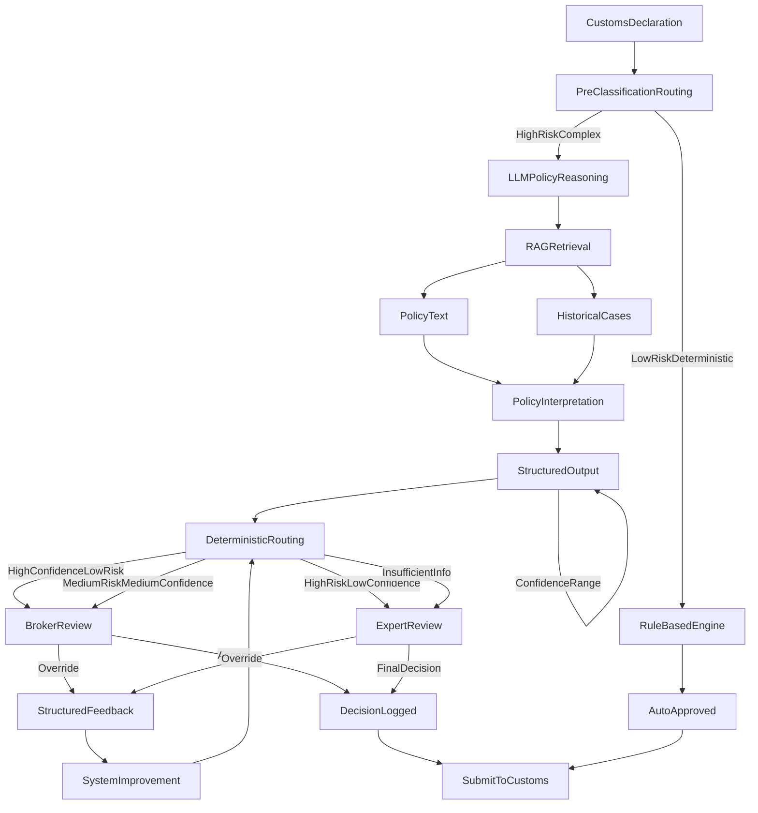

As large language models enter regulated, high-stakes domains, the hardest problems are no longer about model capability. They are about **how to manage AI systems that operate under uncertainty**, where errors are costly, delayed, and sometimes irreversible.

This article describes how I designed an AI-driven customs compliance decision system in a global trade environment and the principles that made it viable in a high-risk, audit-heavy setting.

At a automotive company, we operate import and export flows across more than 100 markets. Customs compliance decisions like HS classification, origin determination, and FTA eligibility are high-risk, high-volume, and written in natural language policy. A wrong decision may only surface years later during audit, but the financial and legal impact is real.

> **Note:** This post focuses on AI system design principles. For the measurement framework and economic optimization context that preceded this work, see [Measuring Manual Effort to Unlock Customs Optimization](/2025/11/02/eu-customs-operations.html).

---

## The Problem: Compliance Is Not an Automation Problem

In global trade, customs compliance decisions such as **HS classification**, **origin determination**, or **free trade agreement (FTA) eligibility** share three defining characteristics:

1. **High risk**
   Errors may surface years later during audits, resulting in financial penalties and regulatory exposure.

2. **High uncertainty**
   Policies are written in natural language, vary by country, evolve frequently, and contain many edge cases.

3. **High scale**
   Large organizations process thousands of import/export decisions daily, making purely manual review infeasible.

Traditional approaches struggle to balance these constraints:

| Approach              | Strength                 | Limitation                                     |
| --------------------- | ------------------------ | ---------------------------------------------- |
| Rule engines          | Deterministic, auditable | Break down on ambiguity and policy nuance      |
| Human experts         | Contextual judgment      | Slow, expensive, inconsistent at scale         |
| End-to-end automation | Scalable                 | Operationally unsafe in irreversible decisions |

The core insight was this:

> **This is not a tooling gap. It is a problem of managing uncertainty at scale.**

---

## Product Framing: A Decision System, Not a Model

The product objective was to **reduce expert workload without increasing audit risk**. That required changing behavior in two places: brokers needed fast, trustworthy evidence to act confidently, and experts needed a reliable way to sample, challenge, and refine risky decisions without reviewing everything.

Constraints shaped the product surface more than model choice:
- Decisions must be **auditable years later**
- Risk is **asymmetric** (a false negative is worse than a false positive)
- Most volume is routine and should stay deterministic
- Data and policy text are **incomplete, changing, and jurisdiction-specific**

---

## Design Alternatives and Tradeoffs

I considered three paths and rejected two:
- **Rules-only expansion**: auditable but brittle in policy nuance and costly to maintain across 100+ markets
- **Full automation**: efficient in throughput, unsafe in irreversible, high-impact decisions
- **Human-only review**: safest, but operationally unscalable

The chosen design balanced these tradeoffs: a **case-based decision system** that keeps automation for the low-risk 80% while routing ambiguous cases through structured AI reasoning and human judgment.

---

## System Architecture: A Case-Based Decision Platform

Before diving into design principles, it is important to clarify what this system is not:

> **It is not a chat interface or prompt-driven AI product.**

Users never interact with the model directly. Instead, this is a case-based decision system where the LLM runs automatically in the background as a policy reasoning layer.

### Users and Workflows

The system serves two primary user groups:

**Brokers (frontline operators)**
- Internal and external customs brokers responsible for preparing and submitting import/export declarations across 100+ markets
- They handle day-to-day classification and reporting decisions (HS codes, FTA eligibility, customs regimes)
- Their role: make and submit decisions

**Trade Compliance Experts (internal)**
- Senior specialists and compliance owners who define and interpret customs policies
- Audit broker decisions and investigate anomalies, disputes, and regulatory findings
- Tune rules, thresholds, and workflows in the system
- Their role: design the decision rubric and audit high-risk decisions

### The Case Review Workflow

For a broker handling a complex or high-risk case:

1. **Case appears in web UI** - The customs declaration has been pre-processed and classified as high-risk or complex (e.g., sensitive HS code, FTA eligibility, ambiguous description)

2. **Broker opens case** - They see:
   - Raw declaration data (product description, origin, destination, values)
   - Model's suggested decision (HS code, FTA eligibility, regime)
   - Risk score or confidence indication
   - Retrieved supporting policy text and historical similar cases (from RAG over policies and past rulings)

3. **Broker reviews and decides** - If the suggestion looks correct and well-supported, they accept it. If it looks wrong or risky, they override it with rationale or reason codes

4. **Decision is logged** - Final decision and rationale are stored for audit, traceability, and as labeled signal for future improvements

5. **Submission to customs** - The accepted decision flows into downstream declaration systems for filing and settlement

For trade compliance experts, the workflow focuses on sampling, monitoring, deep dives on risky buckets, and governance actions like adjusting thresholds or updating policy knowledge bases.

---

## Reframing the Role of AI

Instead of treating the LLM as a decision maker, I designed it as a **policy reasoning layer** inside a broader decision system.

The AI does not say *"approved"* or *"rejected."*
It produces **structured reasoning artifacts** that humans and systems can act on.

### What the AI Produces

Each case generates a structured output that includes:

* Candidate classifications or compliance paths
* Explicit policy citations (with versioning)
* Identified ambiguities or conflicts
* Confidence ranges (not single scores)
* A recommended routing decision:

  * Safe to automate
  * Requires human review
  * Insufficient information to decide

This structure turns implicit expert judgment into something **observable, measurable, and governable**.

### Scope Limiting: The 80/20 Split

A critical design choice was explicit scope limiting: not everything goes through the LLM system.

## System Flow: Case Routing and Decision Pipeline

This flow illustrates how cases are routed through the system, with the LLM handling only the complex 20% that requires policy interpretation, while deterministic rules handle the routine 80%.

**What does not go through LLM (approximately 80% of volume)**

Roughly 80% of volume is handled by existing, well-automated flows:
- Low-risk, highly repetitive cases where rule-based engines and deterministic logic are already accurate
- Examples: stable HS classifications with clear mapping rules, simple regimes with no FTA complexity
- For these, the system uses existing rules and legacy automation. No LLM inference is involved.

**What goes through the LLM/RAG system (approximately 20%)**

The new AI system is explicitly scoped to the complex, high-risk 20% of decision types:

1. **Case selection logic** - A pre-classification routing layer decides if this is a use case where:
   - Policies are complex and text-heavy
   - Historical error/dispute rate is high
   - Monetary/regulatory risk is high

2. **Within that 20%, model responsibilities** - For each selected case, the model:
   - Ingests structured declaration data, product descriptions, region-specific customs laws
   - Uses RAG retrieval to fetch relevant policy paragraphs and historical similar decisions
   - Produces suggested HS classification/FTA decision/regime, risk/confidence measure, and structured rationale

3. **Decision boundaries** - In some sub-cases, high-confidence, low-impact suggestions are effectively auto-applied as default (with broker override opportunity). In others, the model only aggregates and highlights evidence, requiring mandatory human judgment when policy is ambiguous, data is incomplete, or risk/impact is high.

The model's role is always assistive, never an unbounded black box. It either recommends and explains decisions, or summarizes and organizes relevant information for mandatory human judgment.

---

## Designing for Risk, Not Accuracy

A key design decision was to **segment decisions by risk and reversibility**.

Not all compliance decisions are equal.

### Decision Types and Automation Strategy

| Decision Type              | Frequency | Reversibility | Automation Strategy               |
| -------------------------- | --------- | ------------- | --------------------------------- |
| HS Code pre-classification | High      | Medium        | Assisted automation               |
| Origin / FTA eligibility   | Medium    | Low           | Human-led, AI screening only      |
| Regulatory exceptions      | Low       | Low           | Human decision, AI interpretation |
| Audit explanation          | Medium    | High          | AI-assisted reconstruction        |

This framework prevented a common failure mode:
**pushing automation into decisions where mistakes cannot be safely undone.**

---

## The Evaluation System: Measuring What Actually Matters

Accuracy alone was not a sufficient metric.

Instead, I designed a **risk-aware evaluation framework** with three layers.

### 1. Decision Quality (Risk-Weighted)

**Risk Bucketing**

Every case is tagged before entering the model:
- High impact / non-reversible: Origin determination, FTA eligibility
- Medium impact
- Low impact / reversible: High-frequency HS code pre-classification

These buckets are defined jointly by business and Legal, not by the model.

**Risk-Weighted Human Agreement Rate**

Method:
- Sample cases from each risk bucket
- AI produces a structured decision
- Human experts provide final judgment
- Agreement is calculated with higher weights for higher-risk cases

Purpose: validate where AI is a trusted assistant versus where it is not.

**High-Risk False Negatives (Top Priority Metric)**

Definition:
- Positive = a true high-risk case (identified later by human review or audit)
- False Negative = the system failed to flag or route the case to humans at decision time

Targets:
- Recall ≥ 0.85 (did we see the risk early?)
- Precision can be low (0.4–0.5 acceptable)

Here, recall means: did we surface the risk early enough? Over-flagging is acceptable. Missing true risk is not.

### 2. Uncertainty Management

**Auto-Escalation to Human Rate**

Monitored by country, policy, and case type. Red flags include:
- Escalation rates dropping suddenly after new policies launch
- Model confidence increasing while human overrides also increase

This usually signals the model is "pretending to understand."

**Post-Override Improvement Rate**

Every human override requires structured labeling:
- Policy interpretation error
- Missing data
- Genuine ambiguity

I monitor whether the same error types decrease over time and whether routing logic and thresholds are correctly adjusted. Repeated overrides in the same category indicate a systematic issue.

### 3. Business and Operational Impact

**Customs Clearance Cycle Time**

Measured before vs. after system launch:
- Average processing time
- Proportion of deep manual reviews

**Projected Annual Duty Savings (30–100M SEK)**

Methodology (intentionally conservative):
- Based on three years of historical transaction data
- Calculated only for clear rules, low-risk cases, paths still confirmed by humans
- No gray areas or aggressive interpretations included

This represents a conservative expected value, not an optimistic projection.

> Observed ranges after stabilization:
>
> * ~20% of decisions safely automated
> * ~60% reduction in high-intensity expert review workload
> * Projected annual duty impact in the **tens of millions SEK** range under conservative assumptions

---

## Example Metric: Risk-Segmented Confusion Matrix

Instead of a single global F1 score, I tracked performance by decision bucket.

### High-Risk, Non-Automated Decisions

| Metric                       | Target             |
| ---------------------------- | ------------------ |
| Recall (risk surfaced early) | ≥ 0.85             |
| Precision                    | 0.4–0.5 acceptable |

Here, **over-flagging is acceptable**. Missing true risk is not.

### Low-Risk, Automatable Decisions

| Metric                      | Target    |
| --------------------------- | --------- |
| Precision (trustworthiness) | 0.80–0.85 |
| Recall (coverage)           | Secondary |

This ensured automation was *worth trusting*.

> As a result, overall F1 appeared modest (~0.6–0.7), but this number was intentionally deprioritized because it obscured risk asymmetry.

---

## Closing the Loop: From Feedback to System Improvement

Every human correction was captured as **structured feedback**, not free-text notes.

### Feedback Categories

* Incorrect policy interpretation
* Missing or outdated policy data
* True regulatory ambiguity

These signals were used to:

* Adjust routing thresholds
* Refine policy representations
* Improve retrieval constraints
* Tighten or relax decision boundaries

Importantly, **model retraining was a last resort**, not the default response.

---

## Observability and Drift Detection

Drift was monitored across three layers:

### Input Drift

* Changes in policy versions
* Shifts in data structure or completeness

### Output Drift

* Confidence distribution anomalies
* Routing distribution shifts

### Outcome Drift

* Rising human override rates
* High-confidence decisions rejected by experts

When multiple signals aligned, the system degraded gracefully:

1. Tighten thresholds
2. Increase human routing
3. Update policy sources
4. Re-evaluate decision rubrics

This prioritized **reversibility over optimization**.

---

## The PM Role: Upgrading AI from Tool to Manageable System

As Product Manager for AI & Automation Platforms, my core responsibility was not to improve raw model accuracy. It was to make uncertain AI decisions controllable, explainable, and auditable.

### Defining Responsibility Boundaries

First, I defined what a "qualified decision" actually means. AI outputs are not simple yes/no answers. Each output is a structured decision recommendation that includes:
- Referenced policy clauses
- Identified uncertainties
- Risk level
- Whether human intervention is required

I explicitly defined three boundaries:
- Low-risk, reversible decisions can be automated
- High-impact, irreversible decisions require human sign-off
- Insufficient-information cases allow the model to explicitly refuse to conclude

The goal is simple: under uncertainty, the system should stop rather than fail confidently.

### System-Level Risk Constraints

Once success criteria were clear, I did not constrain how the model reasons, but I strictly constrained risk at the system level:
- The model can use RAG to retrieve country- and version-specific regulations and perform multi-step reasoning
- But all outputs must conform to a strict schema
- Policies, data, and prompts are fully versioned and rollbackable
- The model operates only within a clearly defined decision space

This prevents the system from creating false certainty.

### Risk-Bucketed Evaluation

I intentionally avoid average accuracy as an evaluation metric because it hides unacceptable failures. Instead, I evaluate by risk type and use data to answer three questions:
1. Which risks have we already surfaced?
2. Which risks might we still be missing?
3. Should AI continue making decisions here, or should we downgrade to human review?

### Evaluation Automation: High-Leverage vs Low-Leverage

**What humans should define (the 5% of high-leverage work):**
- Risk bucketing logic
- Sampling strategy (which cases enter evaluation)
- Definition of high-risk gold sets
- Which metrics trigger system downgrade, rollback, or mandatory human review

**What AI should execute (the remaining 95%):**
- The evaluation pipeline
- Automated sampling
- Metric computation
- Dashboards
- Drift and override reporting

These are execution problems, not judgment problems.

Low-leverage approaches that create bottlenecks:
- Humans manually reviewing cases
- Humans continuously watching model outputs
- Humans tweaking prompts by hand
- Humans explaining case by case why the model was wrong

Result: human effort scales linearly, and the entire system gets stuck at a bottleneck.

High-leverage approach:
- Define evaluation rules once
- Define risk priorities once
- Define, upfront, when the system must "hit the brakes"

After that, every additional 10,000 cases and every new country or policy does not require linear human workload scaling, but system capability does scale.

---

## Business Outcomes: Safety-Constrained Efficiency

I explicitly traded some automation upside for risk containment. The system aimed to increase throughput **only where reversibility was high**, while shifting expert time toward the most dangerous 10–20% of cases. This made improvements measurable and defensible: fewer high-intensity reviews, safer defaulting in low-risk buckets, and an audit trail that preserved rationale for years.

In short, I optimized for **controllable risk exposure** over maximum automation.

---

## Why This Worked

The system succeeded not because the model was unusually powerful, but because:

* Risk boundaries were explicit
* Success criteria were defined before automation
* Evaluation was aligned with real-world consequences
* Human expertise was concentrated where it mattered most
* Every decision remained explainable years later

In regulated environments, **an AI system that cannot explain itself is not merely imperfect. It is unusable**.

This project made me deeply aware that the hardest problem is not making AI smarter, but deciding when AI should not be allowed to decide.

---

## A Broader Lesson

The most dangerous failures in high-risk domains rarely come from the rarest edge cases.

They come from **high-volume, low-attention decisions that quietly accumulate risk**.

Well-designed AI systems do not eliminate uncertainty.
They **surface it earlier, route it intentionally, and make it manageable**.

That is the difference between *using* AI and *managing* it.
