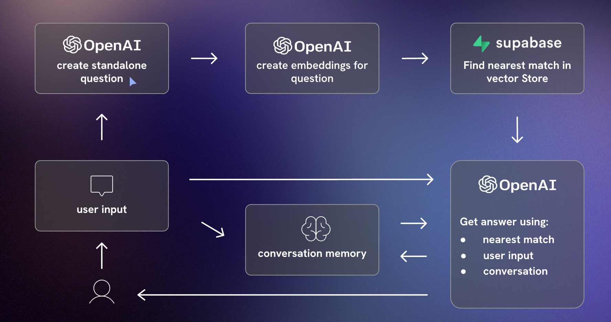
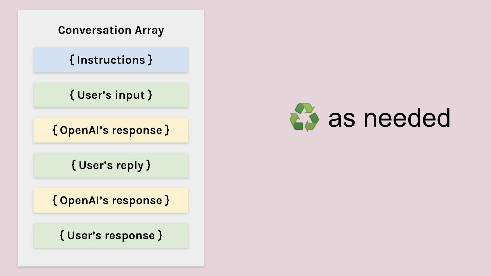
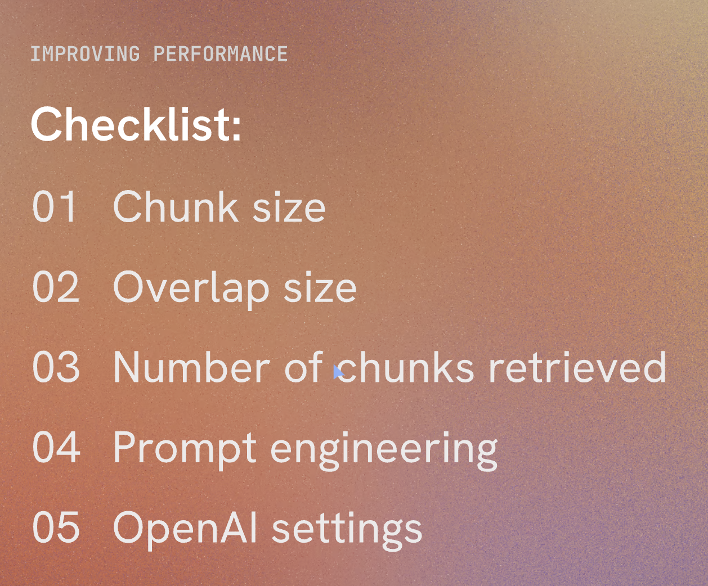

I recently delved into an enlightening piece on [Builder.io](https://www.builder.io/blog/build-ai) about the common traps in AI product development, offering a novel perspective on crafting AI applications. This piece struck a chord with me, particularly against the backdrop of the rapidly evolving AI landscape. 

It's common to see a trend where developers mimic existing AI products or simply overlay a language model. In this context, I want to highlight the potential of tools like LangChain and vector stores in creating truly valuable AI applications, rather than mere superficial replicas.

## The Pitfalls of AI Products - What to Avoid

Builder.io's article sheds light on several critical challenges developers face in AI product creation, including the temptation to use solutions like ChatGPT via an API as a quick fix. Here's why this approach might be problematic:

### 1. **Lack of Unique Features**
Many AI products are mere extensions of existing models like ChatGPT. This easy route often leads to products lacking distinctiveness, rendering them easily replicable and undifferentiated.

Even if you develop substantial technology with LLMs where OpenAI plays a minor yet vital role, you might still face two significant challenges.

### 2. **Cost and Customization Constraints**
Large Language Models (LLMs) are not only costly and slow but also often include irrelevant data for specific applications, offering limited customization. For instance, GitHub Copilot, as reported by the Wall Street Journal, was [operating at a loss per user](https://www.wsj.com/tech/ai/ais-costly-buildup-could-make-early-products-a-hard-sell-bdd29b9f), indicating a mismatch between user willingness to pay and the cost of running services on top of LLMs.

Moreover, while fine-tuning can help, it falls short of providing the level of customization needed for specific use cases.

### 3. **Performance Limitations**
The slow response time of LLMs is a significant drawback, especially in applications where immediate feedback is crucial.

## A More Effective AI Development Strategy

### 1. **Develop a Custom Toolchain**
Instead of solely depending on pre-trained models, consider creating a bespoke toolchain. This method, which combines a fine-tuned LLM with custom compilers and models, can yield faster, more reliable, and cost-effective solutions.

### 2. **Begin with Non-AI Solutions**
Start by addressing the problem with standard programming techniques. This approach helps pinpoint where AI can truly add value, avoiding the pitfall of over-relying on AI for solvable issues through traditional coding.

### 3. **Employ Specialized AI Models**
Use AI models specifically where they fill distinct gaps. For example, object detection models can be efficiently trained for specific tasks using platforms like Google's Vertex AI or LangChain for highly customized applications.

### 4. **Merge Code with AI**
A balanced mix of hand-coded logic and specialized AI models can lead to efficient and impactful solutions. This hybrid approach fosters the creation of responsive, high-quality products.

## Harnessing LangChain and Vector Stores

LangChain is a framework that simplifies the development of applications using large language models, ideal for tasks like document analysis and chatbots. Vector stores, meanwhile, are crucial for managing and retrieving vector data, essential in machine learning applications.

## **Advantages of Owning Your Models**

### **Benefit #1: Control Over Development**
Owning the models allows for continuous improvement, independent of external model providers like OpenAI.

### **Benefit #2: Enhanced Privacy Control**
This approach ensures full control over data privacy, a critical requirement for many privacy-conscious organizations.

## Conclusion

The Builder.io article underscores the need for a strategic approach in AI development. By recognizing the limitations of existing models and utilizing appropriate tools, developers can forge AI applications that are not just unique and valuable but also efficient and cost-effective. Leveraging frameworks like LangChain and vector store technologies can significantly boost the ability to build tailored and robust AI solutions.