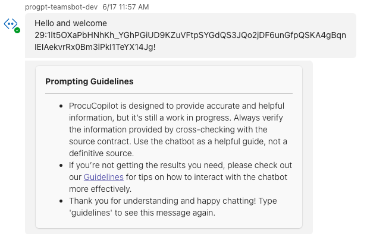
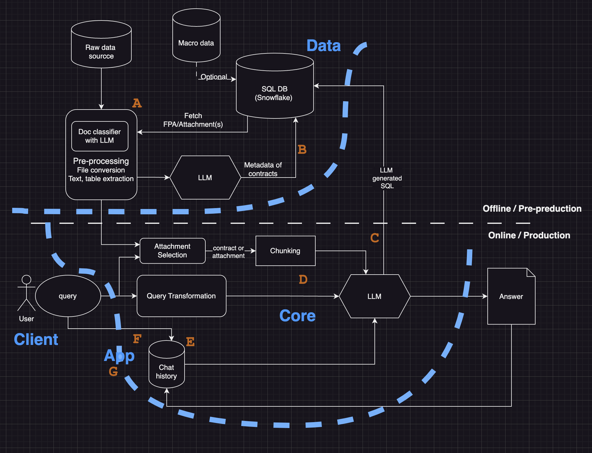

In our continuous effort to innovate and improve processes at Volvo Cars, I started on a project to integrate Generative AI (Gen AI) into our procurement process. This post will walk you through our journey, the business decisions we made, and the impact we expect from this integration.

## Project Overview

The primary goal of our project was to streamline the procurement process by leveraging Gen AI to facilitate contract management and decision-making. Our existing systems—VGS (Volvo Cars Global Sourcing), VPC (Volvo Parts Change), and SI+ (System Insköp)—operate independently, leading to inefficiencies and a higher risk of errors. With over 7,000 contracts to manage, we needed a cohesive AI-driven approach to enhance accuracy, compliance, and efficiency.

## Problem Deep Dive

### The Problem

The procurement process at Volvo Cars is currently fragmented and heavily manual. Managing over 1,169 suppliers and approximately 7,000 contracts, with numerous attachments in various formats (PDF, Excel, Word, and zip files), is both time-consuming and error-prone. The lack of integration among the VGS, VPC, and SI+ systems exacerbates these inefficiencies, increasing the risk of human error, especially during rapid regulatory changes or detailed contract term monitoring.

### How We Chose This Problem

Through stakeholder feedback and an analysis of frequent buyer inquiries, we identified that about 40% of these inquiries could be addressed with Gen AI. This highlighted the significant potential for AI to streamline the procurement process, reduce errors, and improve decision-making.

### The Solution

Integrating Gen AI with our procurement systems (VGS, VPC, and SI+) enables natural language queries, allowing users to interact with contracts more intuitively. This integration aims to automate many of the manual processes, thereby reducing errors and speeding up decision-making.

## Solution Validation Approach

### Approach

1. **Technology Integration:** I unified the VGS, VPC, and SI+ systems to work cohesively with Gen AI. This required creating data products and ensuring smooth interaction between Gen AI and Microsoft Teams.
2. **Process Simplification:** The introduction of Gen AI shifted our process from manual search and review to an AI-driven approach. Training the procurement team on these new capabilities and adjusting workflows were essential steps.
3. **Cultural Shift:** Implementing Gen AI required a shift in mindset, emphasizing a technology-first approach for routine tasks, allowing the human workforce to focus on strategic initiatives.

### Validation

- **Pilot Testing:** I conducted controlled experiments with 10 test users to benchmark metrics with and without the tool.
- **User Feedback:** I collected qualitative feedback through surveys to refine the chatbot’s functionality and user experience.

## High-Level Description of Gen AI Solution

**Contract Management:**

- **Natural Language Queries:** Gen AI enables intuitive interaction with contracts through natural language queries. For example:
    - How many suppliers do we have in VGS (both active and inactive)?
    - What are the contents of Contract00627 in VGS?
    - Can you find the contract for part number A in VPC and VGS?
    - What are the price changes for supplier part A over time?

**Change Management:**

- **Process Assistance:** Using SharePoint web information, PDF, Word, PPTX, and internal instructional videos, Gen AI assists buyers in creating RFQs, contracts, and implementing changes, such as:
    - How to add amendments to existing contracts in VGS.
    - How to handle discrepancies in price information between VPC and SI+.

## Complexity of the Use Case

The use case for Gen AI in contract management at Volvo Cars is moderately complex due to several factors:

1. **Technical Integration:** Ensuring seamless communication between Gen AI, Microsoft Teams, and the procurement systems (VGS, VPC, SI+).
2. **Data Handling:** Managing diverse document formats and data types requires sophisticated data processing capabilities.
3. **Change Management:** Training employees to adapt to new workflows and overcoming potential learning curves.
4. **Compliance and Security:** Adhering to legal standards and maintaining robust data security within the Teams environment.

## Business Impact

The introduction of Gen AI in procurement is expected to bring significant benefits:

- **Efficiency Boost:** A 25% reduction in time spent on contract searches, reviews, and document preparations.
- **Risk Avoidance:** Enhanced AI search capabilities significantly reduce the risk of missing or mishandling contracts, potentially saving millions in financial penalties.
- **Improved Data Quality:** A decrease in errors during contract management reinforces our commitment to legal and financial standards.
- **Future-Proofing:** Gen AI’s adaptability and scalability prepare the procurement department for evolving challenges and growth.
- **Boosting Employee Morale:** By automating routine tasks, employees can focus on more strategic initiatives, improving job satisfaction and productivity.

## Investigation Phase

### Pilot Execution

I focused on VGS for the Proof of Value (PoV) due to data quality challenges. The pilot involved:

1. **Data Extraction:** Extracting data from VGS for analysis.
2. **User Testing:** Engaging 8 users from the procurement department to interact with the Gen AI tool.
3. **Feedback Collection:** Gathering feedback through structured scenarios and open-ended interactions to refine the tool.

### Business Case and Impact

The PoV demonstrated significant potential value, validating the business case for further investment. Key metrics included reduced search times, improved data accuracy, and enhanced user satisfaction.

### Next Steps

Based on the success of the pilot, the next steps involve scaling the solution to include all 400 procurement users and refining the integration with Microsoft Teams. We plan to:

1. **Expand Training:** Conduct comprehensive training sessions for all users.
2. **Iterate and Improve:** Continuously refine the AI tool based on user feedback and performance metrics.
3. **Ensure Compliance:** Work closely with the cybersecurity team to maintain robust data security and compliance standards.

By integrating Gen AI into our procurement process, we are not only enhancing operational efficiency but also future-proofing our systems against evolving challenges. This project exemplifies our commitment to innovation and excellence at Volvo Cars. 🚀

Stay tuned for more updates as we continue to transform our procurement processes with cutting-edge AI technology.

---

Feel free to reach out if you have any questions or want to learn more about our AI initiatives at Volvo Cars. Let's drive the future together! 🚗✨
