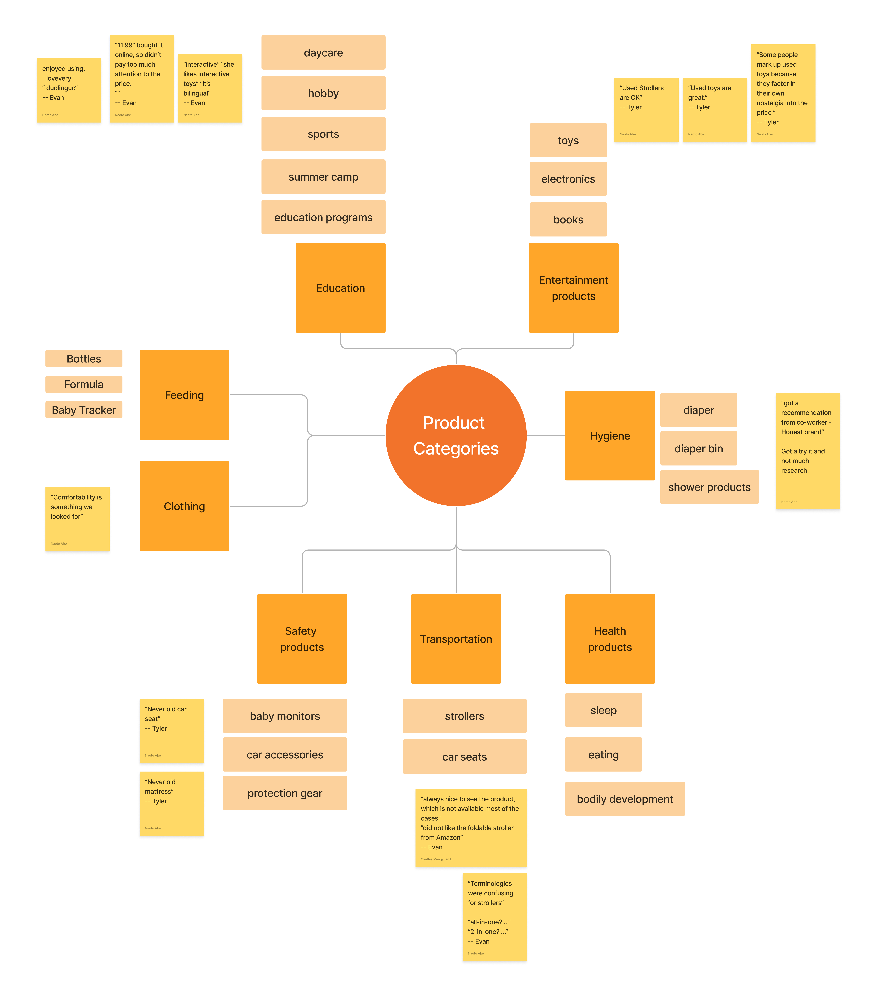
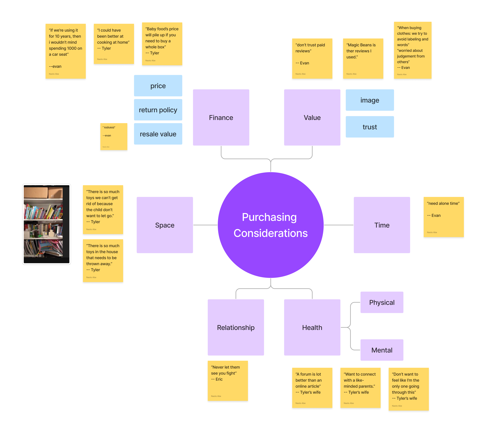

I began this project with a vague hypothesis: new parents are overwhelmed, and "something with AI" could help. That is not a product. It is a sentiment wrapped in a buzzword. The real work was figuring out *which* problems were acute enough to warrant a new tool, *where* AI would genuinely reduce friction rather than add complexity, and *what* to explicitly leave out of scope.

Through 20 one-on-one interviews, 4 focus groups, contextual in-home observations, and a 150-respondent survey, I narrowed a sprawling problem space into a single, defensible product bet: **akaTask**, an AI-assisted task management surface that automates routine parenting decisions (meal planning, activity generation, gentle parenting scripts) and reduces cognitive load by an estimated 40 minutes per day per household.

This case study walks through how I framed the problem, what I chose not to solve, the tradeoffs I evaluated, and how I arrived at a scoped MVP with clear success metrics.

---

# Research and Problem Framing

### What I set out to learn

The research had three goals, each designed to reduce a different type of uncertainty:

* **Problem validation:** Quantify the severity and frequency of parental pain points related to household micro-decisions, rather than assume they exist based on anecdotal evidence.
* **Solution fit:** Identify which pain points were high-value automation candidates where AI could reduce cognitive load without introducing new trust or safety concerns.
* **Market behavior:** Test whether parents would adopt a single integrated productivity tool or whether the market had already fragmented into single-purpose apps that parents preferred.

### Methods

| Method | Detail | Purpose |
|--------|--------|---------|
| **Interviews** | 20 one-on-one sessions (45-60 min each) | Surface unarticulated pain and observe emotional intensity |
| **Focus groups** | 4 groups of 4-6 parents | Test how pain points cluster and identify shared versus idiosyncratic needs |
| **Contextual inquiry** | In-home observation with 6 families | Verify self-reported behavior against actual routines (meal prep, bedtime, cleanup) |
| **Survey** | N=150 parents (mix of new parents and toddler parents) | Quantify frequency and severity of pain points surfaced in qualitative work |
| **Competitive benchmarking** | Breda (AI scripts), Huckleberry (sleep + tracking), used-gear marketplaces | Map existing coverage gaps and identify where incumbents under-serve |

### What the data revealed

The survey and interviews produced six statistically notable signals. I include each one with the product interpretation that shaped downstream decisions, because the raw number alone does not tell the story.

| Signal | Finding | What it actually told us |
|--------|---------|--------------------------|
| **Decision overload** | 60% reported frustration with confusing product terminologies | Parents are not struggling with information scarcity; they are overwhelmed by poorly structured information. The opportunity is curation, not more content. |
| **Social trust > brand trust** | 70% rely on friend or coworker recommendations for formula choices | Trust flows through personal networks, not advertising. Any product we build must earn trust through transparent, verifiable outputs rather than marketing claims. |
| **Cost sensitivity** | 65% valued used toys highly; 50% concerned about baby food cost | Financial pressure is real, but parents will not compromise on safety or quality. Features must reduce cost while maintaining perceived quality. |
| **Quality thresholds** | 80% emphasized comfort as the top criterion for baby bottles | Parents have non-negotiable quality standards. AI recommendations must respect hard constraints, not just optimize for convenience. |
| **Tech receptiveness** | 75% preferred interactive and bilingual baby monitors | Parents adopt technology readily when it delivers clear, bounded value, which is a strong signal for AI-assisted tools scoped to specific tasks. |
| **Physical evaluation preference** | Majority preferred seeing products in person before purchase | This is a real pain point I chose *not* to pursue in the MVP. Solving it requires retail partnerships and logistics that fall outside the product's core value proposition. |

---

# How I Narrowed the Problem

The initial research surfaced a broad landscape of parental pain: purchase decisions, cleaning routines, space management, social isolation, product safety concerns, and time scarcity. The temptation was to build a platform that addressed all of these. I deliberately narrowed the scope by applying three filters:

1. **Frequency x severity.** I mapped each pain point on a 2x2 of how often it occurs and how intensely parents feel it. Meal planning, daily scheduling, and in-the-moment parenting decisions scored highest on both axes. Purchase decisions and space management were episodic: painful when they happen, but not daily.

2. **Automation feasibility.** I evaluated which problems could be meaningfully improved by AI-generated suggestions versus those that required physical action, marketplace dynamics, or community infrastructure. Task generation, meal planning, and parenting scripts are strong AI candidates because the inputs are structured (child's age, dietary constraints, time of day) and the outputs are low-risk (a suggestion, not a binding action).

3. **Trust threshold.** Some pain points, such as formula selection and safety-critical product choices, carry high stakes where parents are unlikely to trust an AI recommendation without extensive validation. I explicitly scoped these out of the MVP to avoid the trust deficit that kills early-stage AI products.

### What I explicitly decided not to solve

Scoping decisions reveal product judgment as clearly as feature decisions. I cut four categories that had clear user demand but poor fit for a v1 AI product:

* **Product marketplace or recommendation engine.** While 60% of parents reported terminology confusion, solving this requires a content-heavy, review-dependent platform with different unit economics. I chose not to build it.
* **Community or social features.** Parents expressed a strong desire to connect with peers, but community products require critical mass to deliver value. Including community in v1 creates a cold-start problem that would distract from the core productivity value proposition.
* **Physical product evaluation.** The preference for in-person testing is valid, but addressing it requires retail partnerships and logistics infrastructure. That is a business development problem, not a product problem.
* **Safety-critical recommendations.** I drew a firm line: the AI would never recommend specific formulas, medications, or safety equipment. These decisions carry liability and trust requirements that an early-stage product cannot meet. The product helps parents *organize* decisions, not *make* them in high-stakes domains.

---

# Decision Framework and Key Tradeoffs

Building an AI-powered product for parents required navigating several tensions where there was no obviously correct answer. I documented the key tradeoffs and the reasoning behind each decision.

| Tradeoff | Option A | Option B | Decision and rationale |
|----------|----------|----------|------------------------|
| **Automation vs. human-in-the-loop** | Fully automated task lists generated without user input | User confirms preferences before each generation | Chose a middle path: the AI generates a default task list proactively, but the user can adjust constraints (dietary needs, schedule blocks) at any time. Fully automated output risks losing trust; fully manual input defeats the purpose of reducing cognitive load. |
| **Breadth vs. depth** | Cover many parenting domains (gear, meals, sleep, social) | Go deep on 2-3 high-frequency use cases | Chose depth. Meal planning, daily task lists, and parenting scripts address daily pain. A broad product spreads trust-building too thin and increases onboarding friction. |
| **Personalization vs. speed to value** | Require an extensive onboarding questionnaire to personalize from day one | Start with sensible defaults and learn over time | Chose speed to value. Parents are time-scarce; a long onboarding flow creates abandonment risk. The product ships with age-appropriate defaults and refines through usage signals over the first two weeks. |
| **Build vs. buy (AI layer)** | Build proprietary models trained on parenting content | Use off-the-shelf LLMs with structured prompts and guardrails | Chose buy + guardrails. Proprietary models require training data, compute budget, and iteration cycles that a v1 product cannot justify. Off-the-shelf LLMs with carefully designed prompt templates and output validation deliver 80% of the value at 10% of the cost. |
| **Scope vs. scalability** | Build a polished mobile app from day one | Ship as a lightweight web-first MVP to validate demand before investing in native | Chose web-first. A native app requires platform-specific development and app store review cycles. A responsive web app can ship in weeks, iterate daily, and validate whether the core value proposition resonates before committing to native development. |

---

# Where AI Fits, and Where It Does Not

I treated AI as infrastructure for reducing cost and friction, not as the product itself. This distinction shaped every feature decision.

### Where AI fit naturally

* **Task list generation.** The inputs are well-structured (child's age, time of day, parent's schedule), the outputs are low-stakes (a list of suggestions, not binding actions), and the failure mode is mild (a bad suggestion is skipped, not dangerous). AI reduces the cost of producing personalized daily plans from hours of manual research to seconds.
* **Meal planning.** Dietary constraints, pantry inventory, and family preferences create a combinatorial problem that AI handles well. The output is a recipe and grocery list, fully verifiable by the user before acting on it.
* **Parenting scripts.** In-the-moment parenting responses benefit from pre-generated, research-backed scripts that the parent can glance at during a stressful moment. AI generates these based on the child's developmental stage, the situation type, and the parenting philosophy the user selected.

### Where AI did not belong

* **Safety-critical decisions.** Formula selection, car seat compatibility, and medication dosing are domains where a wrong recommendation carries real harm. I refused to automate these, even though users requested it.
* **Emotional support.** Parents expressed a need for mental health support and connection with peers. AI-generated empathy is not a substitute for human community, and positioning it as such would erode trust across the entire product.
* **Product reviews and recommendations.** AI-generated product reviews carry an inherent trust problem: users cannot verify whether the AI's recommendation is based on genuine quality signals or training data artifacts. I left this out of scope entirely.

### How I handled trust and validation

Trust is the primary risk for any AI product targeting parents. I built three guardrails into the MVP design:

1. **Transparent sourcing.** Every parenting script cites the developmental framework it draws from (e.g., RIE, Montessori, AAP guidelines). Users can see *why* the AI suggested something, not just *what* it suggested.
2. **User override as first-class feature.** Every generated task list, meal plan, and script can be edited, dismissed, or regenerated. The AI proposes; the parent disposes.
3. **No invisible automation.** The product never takes action without the user's knowledge. There are no background processes that silently modify schedules or send notifications based on AI inference alone.

---

# Cross-Functional Coordination

This project required alignment across research, engineering, content, and (for future phases) legal, each with different incentives and constraints.

### Stakeholder tensions I navigated

* **Engineering wanted to ship a general-purpose AI assistant.** The engineering team was excited about LLM capabilities and pushed for a broad, flexible assistant that could answer any parenting question. I argued for a constrained, task-specific tool because unconstrained AI outputs are harder to validate, harder to trust, and harder to measure. I won this argument by framing it as a trust and liability question, not a technical one.
* **Content advisors pushed for medically reviewed outputs.** External parenting content advisors wanted every AI-generated script to go through medical review before surfacing to users. This would have made iteration impossibly slow. I proposed a compromise: scripts are generated from pre-approved content frameworks (RIE, Montessori, AAP), and the AI assembles them situationally rather than generating novel medical advice. This satisfied the content team's safety concerns without creating a review bottleneck.
* **Business stakeholders wanted a marketplace.** Early stakeholders saw the parent audience as a monetization opportunity through a baby gear marketplace. I pushed back by presenting the research data showing that a marketplace requires trust infrastructure (verified reviews, return policies, seller vetting) that would consume the entire engineering roadmap. I reframed the business model around subscription revenue from the productivity tool itself.

### How I drove alignment without authority

I had no formal authority over engineering priorities or business model decisions. I drove alignment through three mechanisms:

1. **Shared artifact.** I created a single research-backed decision document that mapped every proposed feature to a specific user pain point, an automation feasibility score, and a trust threshold rating. When debates arose, I pointed to the document rather than arguing from opinion.
2. **Explicit kill criteria.** I defined upfront what would cause us to kill a feature: if user testing showed trust scores below 3.5/5, or if time-to-value exceeded 2 minutes during onboarding, the feature would be cut regardless of engineering investment.
3. **Sequenced roadmap with gates.** Instead of debating the full product vision, I proposed a phased roadmap where each phase had a validation gate. Phase 1 (task lists and meal planning) had to hit activation and retention targets before Phase 2 (parenting scripts and community) would be funded. This turned abstract strategy disagreements into concrete, measurable milestones.

---

# Research Evidence: Quotes and Insights

The following table captures representative quotes from user interviews, organized by theme. Each theme directly informed a product decision documented earlier in this case study.

| **Theme** | **Representative quotes** | **Product decision it informed** |
|-----------|--------------------------|----------------------------------|
| **Time scarcity** | "I spent SO MUCH time washing bottles and pump parts." (Izzy) "Need time to recharge." (Evan) "Turn off my brain when they are asleep." (Yaeko) | Prioritized features that save time on recurring tasks. The AI task list targets 40+ minutes of daily planning time reclaimed. |
| **Decision anxiety** | "Worried that I'm not going to be buying the right one." (Evan) "Confused and lost if I'm doing this right?" (Izzy) "Self-doubting about my choice, having buyer's remorse." (Izzy) | Built transparent AI outputs with cited sources. Every suggestion can be traced to a framework, not a black-box recommendation. |
| **Confusion and overwhelm** | "What do all these terminologies mean?" (Evan) "100% cotton, organic, bamboo, microfiber... What the heck is the difference?" (Izzy) "There are so many types of formulas! Which one is the best one?" (Izzy) | Decided *not* to build a product recommendation engine. The confusion stems from information overload, and adding more AI-generated content would make it worse. |
| **Community and isolation** | "Want to connect with like-minded parents." (Tyler's wife) "A forum is a lot better than an online article." (Tyler's wife) "Am I the only one going through this?" (Tyler's wife) | Deferred community features to Phase 2. Validated that the need is real but requires critical mass that a v1 product cannot deliver. |
| **Cost sensitivity** | "Used toys are great." (Tyler) "Baby food's price will pile up if you need to buy a whole box." (Tyler) "Some clothes are such a waste of money and space." (Izzy) | Built the meal planner with cost-awareness: recipes default to budget-friendly ingredients and minimize food waste through portioned grocery lists. |
| **Safety and trust** | "Don't trust paid reviews." (Evan) "Look at negative reviews because I don't know if these reviews are accurate." (Izzy) "Fearful about what my kids will absorb from what I say or do." (Eric) | Drew a hard boundary: no safety-critical AI recommendations. Built user-override and transparent sourcing into every AI output. |

---

# Research Frameworks

### Product category segmentation

I categorized parental concerns into Education, Entertainment, Feeding, Hygiene, Clothing, Safety, Transportation, and Health. This segmentation provided a structured framework for analyzing interview data and ensuring that each product category received targeted attention. For example, educational and entertainment products were evaluated for interactivity and developmental value, while feeding products were scrutinized for comfort and safety, each with distinct decision criteria.

### Purchasing decision dimensions

I mapped purchasing considerations across six dimensions: Finance, Value, Space, Time, Relationship, and Health. This framework revealed how different pressures intersect. For instance, time constraints directly impact purchasing decisions (parents buy the first option that seems "good enough" rather than researching the best one), and trust in a brand influences perceived value disproportionately for safety-critical items.

This structured approach proved essential for translating raw interview data into actionable product decisions. Parents articulated their needs more precisely when discussing well-defined categories, and the framework made it possible to identify which pain points clustered together and which were orthogonal.

---

# From Insight to Product Bet

The research translated directly into akaTask's MVP scope, success metrics, and explicit constraints.

| Research insight | Product decision | Success metric |
|-----------------|-----------------|----------------|
| **Cognitive load and decision anxiety** are the highest-frequency, highest-severity pain points | AI task list generator is the primary feature; everything else is secondary | Time to first completed task < 2 minutes; daily active usage within first week |
| **Time scarcity** means parents will not invest time in setup | Onboarding must deliver value in under 60 seconds with minimal input | Activation within 48 hours of signup; onboarding completion rate > 70% |
| **Trust flows through transparency**, not authority | Every AI output cites its source framework; all suggestions are editable | User satisfaction > 4.5/5; trust score > 3.5/5 in post-session surveys |
| **Cost sensitivity** is a daily friction point, not just a purchasing concern | Meal planner defaults to budget-friendly recipes with portioned grocery lists | Reported weekly grocery spend reduction; meal plan adoption rate |
| **Parents adopt AI for bounded, specific tasks**, not open-ended assistants | Product scope is limited to three use cases: task lists, meal plans, parenting scripts | Feature usage distribution confirms concentrated engagement on core features |
| **Safety-critical decisions are out of scope** for AI in v1 | Hard guardrail: no formula, medication, or safety equipment recommendations | Zero instances of safety-critical AI output in production logs |

The deliberate constraints matter as much as the features. By saying no to a marketplace, community, and safety-critical recommendations, I kept the MVP focused on a problem space where AI can deliver measurable value without introducing unacceptable risk, and where a small team can ship, measure, and iterate within a single quarter.
