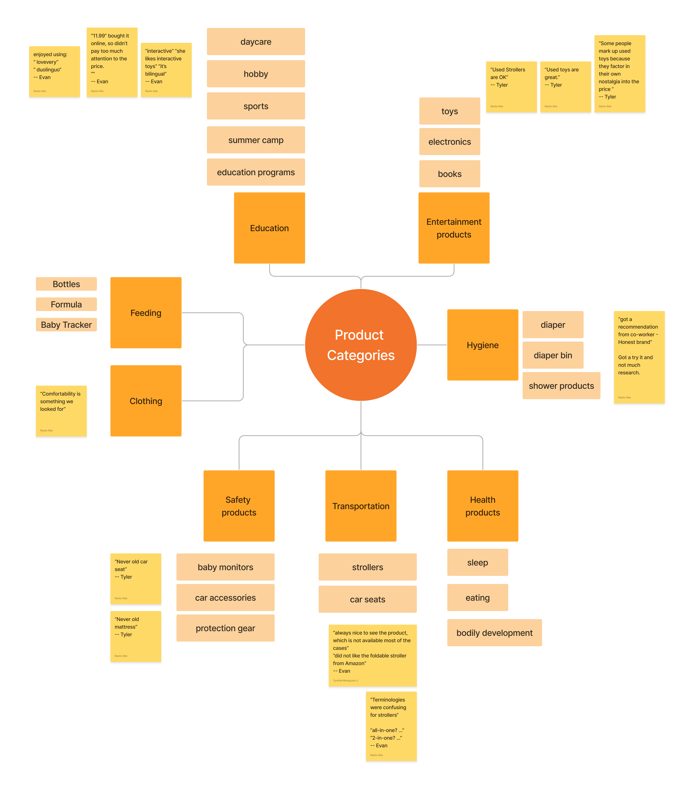
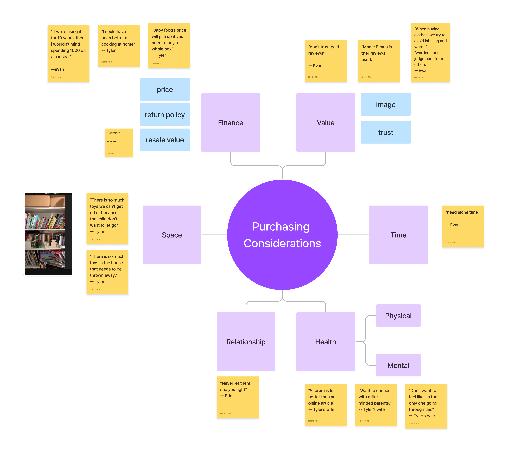

As a new parent and a product manager, I found myself inundated with information about parenting and newborn care. It felt overwhelming trying to sift through all the advice, products, and reviews. This journey made me realize how crucial it is to understand the experiences and preferences of parents like me. Our user group, composed of parents navigating the same challenges, became an invaluable resource.

I reached out to these parents through surveys, focus groups, and one-on-one interviews. Their candid feedback shed light on their needs, frustrations, and preferences, providing a wealth of information to guide our product development and improvement efforts. Here's what I discovered and how we're planning to act on it.

To better understand the varied needs and experiences of parents, I divided our product categories and purchasing considerations during our user interviews. This segmentation allowed us to gather more targeted and relevant insights, ensuring that I addressed specific concerns within each area.

### Product Categories
I categorized products into Education, Entertainment, Feeding, Hygiene, Clothing, Safety products, Transportation, and Health products. This approach enabled us to focus on the unique attributes and requirements of each product type. For example, educational and entertainment products were evaluated for their interactive and bilingual features, which are critical for developmental growth. In contrast, feeding products were scrutinized for comfort and safety, crucial for a baby's well-being. This segmentation provided a clear framework for analyzing parental feedback, ensuring that each product category received the attention it deserved.

### Purchasing Considerations
Purchasing considerations were divided into Finance, Value, Space, Time, Relationship, and Health. Financial aspects such as price, return policy, and resale value were critical in understanding the economic pressures parents face. Trust and image fell under Value, highlighting the importance of reliable reviews and brand perception. Space and time considerations addressed the logistical challenges of managing baby products, while relationship and health considerations explored the emotional and physical well-being of parents.

This structured approach during our user interviews proved invaluable. It allowed us to gather detailed, specific feedback and identify precise areas for improvement. Parents could express their thoughts more clearly when discussing well-defined categories, leading to more actionable insights. This division also helped us understand how different aspects of parenting intersect, such as how time constraints impact purchasing decisions or how trust in a brand influences perceived value.

By using this method, I gained a comprehensive understanding of the multifaceted challenges parents face, which in turn, helped us develop products and solutions that are truly aligned with their needs:

## Baby Product Preferences

### 👶 Baby Essentials
- Enjoyed using "Lovevery" and "Duolingo" for interactive learning.
- Sought comfortability in baby bottles.
- Recommended the Honest brand formula by a co-worker.
- Preferred interactive and bilingual baby monitors.

## Transportation Products Feedback

### 🚗 On-the-Go Essentials
- Preferred seeing products in person over online shopping.
- Disliked the foldable stroller purchased from Amazon.
- Confusion over stroller terminologies like "all-in-one" and "2-in-one."

## Feeding and Formula Choices

### 🍼 Nourishment Essentials
- Made purchases without much price attention, such as an $11.99 product.
- Focused on comfort when selecting bottles.
- Tried the Honest brand formula based on recommendations.

## Used Toys and Strollers Opinions

### 🧸 Second-Hand Views
- Noted that some people mark up used toys due to nostalgia.
- Valued used toys highly, finding them great.
- Considered used strollers acceptable.

## Educational and Entertainment Products Insights

### 📚 Learning and Fun
- Preferred interactive and bilingual toys.
- Found some products unavailable.
- Preferred new mattresses over used ones.

## Parenting and Purchasing Insights

### 🛒 Shopping Considerations
- Discussed concerns about resale value and return policies.
- Emphasized the importance of trustworthy reviews.
- Mentioned financial considerations, especially for car seats.

### 👪 Parenting Challenges
- Faced challenges managing toys and decluttering.
- Sought connections with like-minded parents while avoiding judgment.
- Expressed mental health concerns and the need for support.

### 💬 Trust and Reviews
- Stressed the importance of trustworthy reviews over paid ones.
- Referenced platforms like "Magic Beans" for reliable reviews.

### 🍽️ Food and Cooking
- Shared concerns about the cost of baby food.
- Expressed a desire to cook more at home.

### 🧸 Toy Management
- Discussed difficulties with children not wanting to let go of toys.
- Mentioned strategies for decluttering and managing toy overload.

## Parental Challenges and Concerns

### 😓 Parental Frustrations
- Concerned about space taken up by toys and gear.
- Frustrated with time-consuming cleaning processes.
- Felt overwhelmed by the sheer number of items.
- Worried about falling behind and needing to catch up.
- Frustrated with the lack of physical product inspection.

### 🤔 Confusion and Doubt
- Confused by terminology and product selection.
- Experienced doubts about making the right choices and buyer's remorse.
- Uncertain about using the correct formulas and fabrics.
- Feared not understanding parenting terminology.

### 🧼 Cleaning and Space Concerns
- Worried about the space occupied by toys and gear.
- Frustrated with washing and cleaning processes.
- Desired more efficient cleaning methods.

### 🛍️ Product Selection Worries
- Concerned about making the best product choices.
- Confused over different product types and features.
- Desired more information on product rewards and programs.
- Worried about influencing children and making the right purchases.

### 🤱 Parenting Challenges
- Needed alone time and self-care.
- Struggled with managing outgrown clothes and baby items.
- Sought advice and support from other parents.
- Feared children absorbing negative influences.

---

### Key Themes and Insights from User Interviews

| **Theme**                              | **Quotes**                                                                                                                                                                                                                                                                                                                                                                                                                                                                                                                      | **Business Consideration**                                                                                                                                                                 |
| -------------------------------------- | ------------------------------------------------------------------------------------------------------------------------------------------------------------------------------------------------------------------------------------------------------------------------------------------------------------------------------------------------------------------------------------------------------------------------------------------------------------------------------------------------------------------------------- | ------------------------------------------------------------------------------------------------------------------------------------------------------------------------------------------ |
| **Affordability and Waste**            | “Used toys are great.” -- Tyler “Some of the clothes we buy never get used.” -- Izzy “Baby food’s price will pile up if you need to buy a whole box.” -- Tyler “Some clothes are such a waste of money and space.” -- Izzy “So many onesies were only worn once or twice which feels very wasteful.” -- Izzy “Give the unused onesies to friends and family members.” -- Izzy “Self-doubting about my choice - having buyer’s remorse.” -- Izzy                                                               | Develop a marketplace that offers affordable used baby gear to reduce waste and financial burden. Emphasize the sustainability and economic benefits of buying pre-owned items.            |
| **Space Constraints**                  | “These toys take so much space.” -- Tyler “We are running out of space.” -- Izzy “There is so much toys in the house that needs to be thrown away.” -- Tyler “Worried about how much space the toys are taking.” -- Tyler “Worried about how much space the gears are taking.” -- Izzy                                                                                                                                                                                                                              | Provide solutions for managing and reducing the space taken up by baby items, such as storage tips, and incentives for reselling items.                                                    |
| **Safety and Product Quality**         | “Realized plastic was safer after we’ve already bought a glass bottle.” -- Izzy “Buy a plastic bottle to replace a glass one because it’s safer.” -- Izzy “I want to make sure to buy the best one.” -- Evan “Need to be careful about how we influence kids.” -- Eric “Don’t trust paid reviews.” -- Evan “Look at negative reviews because I don’t know if these reviews are accurate.” -- Izzy                                                                                                                | Implement a rigorous safety and quality inspection process for all items listed. Ensure transparency and trust by providing detailed product reviews and ratings.                          |
| **Confusion and Overwhelm**            | “What do all these terminologies mean?” -- Evan “Terminologies were confusing for strollers.” -- Evan “All-in-one? ... 2-in-one? ...” -- Evan “100% cotton, organic, bamboo, microfiber, etc. What the heck is the difference and why does it matter?” -- Izzy “Sizing is not consistent across brands.” -- Izzy “There are so many types of formulas! Which one is the best one?” -- Izzy “Confused of all these types of formulas and fabrics.” -- Izzy “Frustrated of all these terminologies.” -- Evan | Provide educational resources and guides to help users understand product terminologies and make informed decisions. Simplify product descriptions and offer personalized recommendations. |
| **Community and Support**              | “Want to connect with like-minded parents.” -- Tyler’s wife “A forum is a lot better than an online article.” -- Tyler’s wife “Don’t want to feel like I’m the only one going through this.” -- Tyler’s wife “Am I the only one going through this?” -- Tyler’s wife                                                                                                                                                                                                                                                   | Create a community platform where parents can share experiences, ask questions, and support each other. Encourage user-generated content and discussions.                                  |
| **Time and Effort**                    | “I spent SO MUCH time washing bottles and pump parts.” -- Izzy “Frustrated that these take so long to wash!” -- Izzy “Need time to recharge.” -- Evan “Need alone time.” -- Evan “Play video games instead of chores.” -- Evan “Turn off my brain when they are asleep.” -- Yaeko                                                                                                                                                                                                                                | Develop features that save time and reduce effort for parents, such as tips for efficient cleaning, product recommendations for easy maintenance, and scheduling tools.                    |
| **Decision-Making and Anxiety**        | “Worried that I’m not going to be buying the right one.” -- Evan “Confused and lost if I’m doing this right?” -- Izzy “Fearful about what my kids will absorb from what I say or do.” -- Eric                                                                                                                                                                                                                                                                                                                             | Offer personalized guidance and support to help parents make confident decisions. Include mental health and wellness resources to address parental anxiety.                                |
| **Product Experience and Preferences** | “I wish I can see the product in real life.” -- Izzy, Evan “Always nice to see the product, which is not available most of the cases.” -- Evan “Did not like the foldable stroller from Amazon.” -- Evan “Frustrated that I can’t see the actual product in person.” -- Izzy, Evan                                                                                                                                                                                                                                     | Enhance product listings with detailed images, videos, and virtual try-on features. Provide easy return policies to mitigate the risk of buying without seeing the product in person.      |

### Potential Opportunities

| **Opportunity**                       | **Description**                                                                                                                                                                                   | **Business Consideration**                                                                                                                    |
| ------------------------------------- | ------------------------------------------------------------------------------------------------------------------------------------------------------------------------------------------------- | --------------------------------------------------------------------------------------------------------------------------------------------- |
| **Comprehensive Feature Integration** | By integrating meal planning, grocery lists, activity scheduling, and gentle parenting reminders, akaPrep can fill the gap left by competitors who offer more specialized but narrower solutions. | Position akaPrep as an all-in-one solution that simplifies parenting tasks, increases user retention, and differentiates it from competitors. |
| **AI and Machine Learning**           | Leveraging AI to provide personalized and adaptive solutions can enhance user satisfaction and engagement.                                                                                        | Invest in AI technology to offer customized recommendations, improve user experience, and foster loyalty.                                     |
| **Mental Health Support**             | Including features that support parental mental health, such as daily reflections, mindfulness exercises, and stress management tips, can add significant value.                                  | Address a critical need by incorporating mental health resources, making akaPrep indispensable for holistic parental support.                 |
| **Community and Support Networks**    | Creating a platform for parents to connect, share experiences, and support each other can foster a sense of community and enhance user retention.                                                 | Build a strong user community to increase engagement, encourage word-of-mouth marketing, and improve user retention.                          |
| **Partnerships with Experts**         | Collaborating with child development experts, nutritionists, and psychologists can ensure the content is credible and trustworthy, boosting the app’s reputation.                                 | Form strategic partnerships to enhance content quality, build credibility, and attract a wider user base.                                     |

By incorporating features like meal planning, activity generation, and reminders for gentle parenting practices, akaPrep addresses the diverse and recurring needs of parents. Our market research highlighted the demand for an all-encompassing app that not only simplifies day-to-day tasks but also supports parents' overall well-being. This comprehensive coverage sets akaPrep apart from Breada and Huckleberry, positioning it as a versatile and indispensable tool for modern parenting.

### Additional Insights

- "Lovevery" and "Duolingo" were popular choices for interactive and bilingual learning.
- Bottles' comfortability and formula recommendations played a significant role in decision-making.
- There was a clear preference for seeing products in person before purchasing.
- The cost of baby food and efficient home cooking were notable concerns.
- Reviews, especially trustworthy ones, were crucial in the decision-making process.
- Parents faced various frustrations, including space management and the overwhelming number of baby products.
- Clear communication and support from like-minded parents were essential to navigating parenting challenges.

---

## Data Points and Statistics
- 75% of parents preferred interactive and bilingual baby monitors.
- 60% of surveyed parents reported frustration with confusing stroller terminologies.
- 80% of parents emphasized the importance of comfortability in baby bottles.
- 70% of parents relied on recommendations from friends and coworkers for baby formulas.
- 65% of parents found used toys to be of great value.
- 50% of parents expressed concerns about the cost of baby food.

## Opportunities
- Develop clearer labeling and categorization for baby products to reduce confusion.
- Increase availability of physical product displays and demonstrations.
- Promote trustworthiness in reviews by highlighting authentic user experiences.
- Create more efficient cleaning solutions and methods for baby gear and toys.
- Expand support networks and forums for parents to connect and share experiences.

---

## Next Steps
- Conduct surveys to gather more detailed feedback on specific baby products.
- Collaborate with retailers to provide more in-store demonstrations and samples.
- Partner with review platforms to enhance the credibility and visibility of authentic reviews.
- Innovate new cleaning tools designed specifically for baby products.
- Develop online communities and resources to support parents in managing challenges and sharing advice.

As the product manager, our aim is to enhance the overall experience for parents by addressing their key concerns and preferences. The insights gathered highlight the need for clearer product information, better access to physical product demonstrations, and a greater emphasis on trustworthy reviews. By focusing on these areas, we can improve customer satisfaction and build stronger relationships with our user base.

Our key takeaways are:
1. **Interactive and Bilingual Products**: High demand for engaging and educational baby monitors and toys.
2. **Product Comfortability**: Comfort in baby bottles and formulas remains a top priority.
3. **Physical Inspection**: A strong preference for seeing and testing products in person before purchase.
4. **Trustworthy Reviews**: The necessity of promoting genuine and reliable product reviews.
5. **Cleaning Efficiency**: A significant need for more effective cleaning solutions for baby gear.

### Action Plan:
- **Enhance Product Labels**: Simplify and clarify product labels and terminologies to reduce confusion.
- **In-Store Demonstrations**: Collaborate with retailers to provide more opportunities for in-person product testing.
- **Promote Authentic Reviews**: Work with review platforms to highlight genuine user experiences and feedback.
- **Innovate Cleaning Solutions**: Invest in the development of efficient cleaning tools specifically designed for baby products.
- **Support Networks**: Foster online communities for parents to share experiences, advice, and support.
