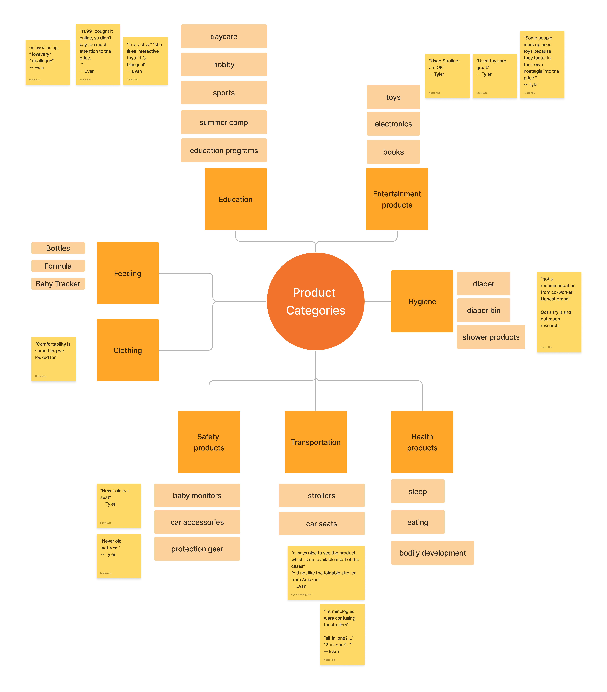
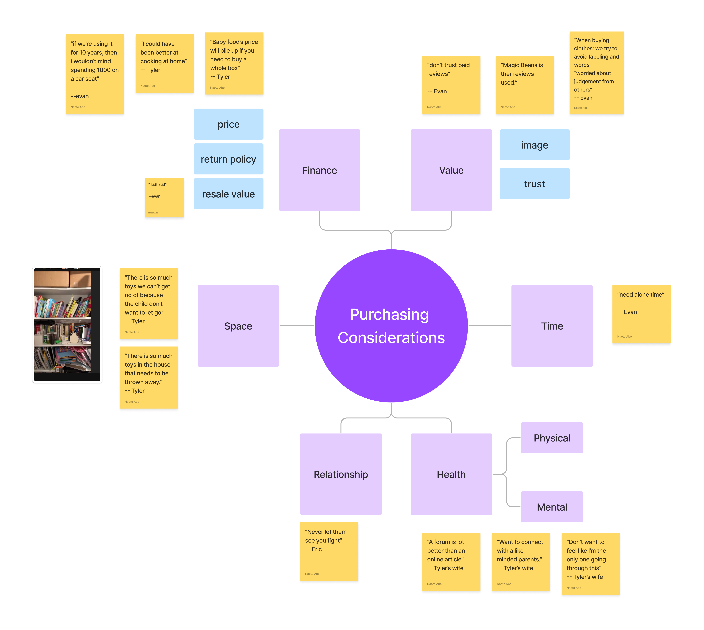

The starting point was a sentiment, not a product: new parents are overwhelmed, and AI could help. That framing is useless for product work. "Overwhelmed" spans hundreds of micro-problems across feeding, sleep, purchases, social isolation, and daily logistics. AI is a capability, not a solution. The real question was which specific problem is frequent enough, painful enough, and structured enough that an AI-assisted tool would be obviously better than whatever parents are cobbling together today.

This case study covers the research that answered that question: 20 interviews, 4 focus groups, 6 in-home observations, and a 150-person survey that narrowed a sprawling problem space into a single product bet. The product itself, [akaTask](https://cynthialmy.github.io/2024-01-05-akatask/), is documented separately. This piece focuses on how the research shaped what to build and, more importantly, what to refuse to build.

---

# Research Design

I structured the research around three uncertainties, each requiring a different method to resolve.

**Is the pain real and recurring?** Interviews and contextual inquiry answered this. I conducted 20 one-on-one sessions (45-60 minutes each) and observed 6 families in their homes during meal prep, bedtime, and cleanup routines. The in-home observations mattered because parents systematically underreport how much time they spend on planning. Izzy estimated she spent "maybe 10 minutes" deciding what to cook each day. I observed her spend 35 minutes across three separate episodes: checking the fridge, searching recipes, texting her partner about groceries, and ultimately defaulting to pasta.

**Which problems can AI actually improve?** Focus groups (4 groups of 4-6 parents) helped here. By watching parents discuss their workarounds in groups, I could distinguish between problems that needed better tools and problems that needed human connection. The parents who talked about loneliness lit up when other parents validated their experience. No app replaces that. The parents who talked about daily planning showed frustration, not loneliness. They wanted the problem solved, not shared.

**Would parents use an integrated tool, or do they prefer single-purpose apps?** The 150-person survey quantified this. I also benchmarked against Breda (AI parenting scripts), Huckleberry (sleep tracking), and several used-gear marketplaces to map where incumbents left gaps.

---

# What the Data Showed

Six findings shaped every downstream decision. I present them with the reasoning that connected data to product choices, because the numbers alone are ambiguous.

**60% reported frustration with confusing product terminologies.** The obvious interpretation is "build a glossary or recommendation engine." The correct interpretation is that the problem is information structure, not information scarcity. Parents are drowning in content. Adding more AI-generated content would make it worse. This signal told me what *not* to build.

**70% rely on friend or coworker recommendations for formula choices.** Trust flows through personal networks. Any AI product in this space must earn trust through transparent, verifiable outputs. Marketing claims and brand authority are insufficient. This became a design constraint: every AI output must show its reasoning, not just its recommendation.

**65% valued used toys; 50% were concerned about baby food cost.** Financial pressure is constant, but parents have hard quality floors. They will buy used toys but will not compromise on car seat safety. This asymmetry meant the product needed to operate in the low-stakes zone (meal suggestions, activity ideas) and stay out of the high-stakes zone (safety equipment, medical choices).

**75% preferred interactive, bilingual baby monitors.** Parents adopt technology readily when the value is clear and bounded. This was the strongest signal that a focused AI tool with a specific job could achieve adoption. The key word is "bounded." Open-ended AI assistants trigger skepticism; narrow tools that do one thing well earn trust.

**The majority preferred seeing products in person before buying.** A real pain point that I deliberately excluded. Solving it requires retail partnerships and logistics infrastructure. That is a different business, not a feature.

**80% emphasized comfort as the top criterion for baby bottles.** Parents have non-negotiable quality thresholds. Any AI recommendation system must treat user-defined constraints as hard boundaries, not optimization parameters to trade off against convenience.

---

# Narrowing: Three Filters

The research surfaced pain across purchases, cleaning, space management, isolation, safety, and time scarcity. I applied three filters to decide what to pursue.

**Frequency × severity.** I mapped each pain point on how often it occurs and how intensely parents feel it. Meal planning, daily scheduling, and in-the-moment parenting decisions scored highest on both axes. Purchase decisions and space management are painful but episodic. Daily friction compounds; episodic friction does not.

**Automation feasibility.** Task generation, meal planning, and parenting scripts are strong AI candidates: structured inputs (child's age, dietary constraints, time of day), low-risk outputs (suggestions, not actions), and mild failure modes (a bad suggestion gets skipped). Community features, product marketplaces, and physical product evaluation require infrastructure that AI cannot substitute for.

**Trust threshold.** Formula selection, medication, and safety equipment carry stakes where parents will not accept AI recommendations without extensive validation. Building trust in these domains takes years of clinical credibility. I scoped them out entirely. The product helps parents organize routine decisions, not make high-stakes ones.

The intersection of these three filters pointed to one problem: daily planning friction. It is universal (appeared in every interview), frequent (daily), automatable (structured inputs, low-risk outputs), and within the trust threshold (suggestions that parents can edit or ignore).

---

# What I Decided Not to Build

These cuts mattered as much as the features. Each had real user demand behind it.

**Product recommendation engine.** 60% of parents reported terminology confusion. Building a recommendation system requires verified reviews, return policies, and a content pipeline that would consume the entire engineering roadmap. I left the problem to incumbents with the right infrastructure.

**Community features.** Every focus group surfaced a desire for peer connection. But community products need critical mass to deliver value, and building moderation infrastructure before validating core utility is premature. Phase 2 at earliest.

**Safety-critical AI recommendations.** Users requested this directly. I refused. The product would never recommend specific formulas, medications, or safety equipment. The liability exposure and trust requirements are incompatible with an early-stage product. The AI helps parents plan their day, not make medical decisions.

---

# Stakeholder Alignment

The research had to survive contact with three stakeholder groups who each wanted a different product.

**Engineering pushed for a general-purpose AI assistant.** The team was excited about LLM capabilities and wanted a flexible chatbot that could answer any parenting question. I argued that unconstrained outputs are harder to validate, harder to trust, and harder to measure. I reframed the debate as a trust and liability question rather than a technical one, and the team agreed to a constrained, task-specific tool.

**Content advisors wanted medical review of every AI output.** External parenting advisors wanted each generated script reviewed before surfacing to users, which would have made iteration impossibly slow. The compromise: scripts draw from pre-approved frameworks (RIE, Montessori, AAP guidelines), and the AI assembles them situationally rather than generating novel medical advice. Safety without bottleneck.

**Business stakeholders wanted a marketplace.** They saw the parent audience as a monetization opportunity through baby gear commerce. I presented the research showing that marketplace trust infrastructure (verified reviews, return policies, seller vetting) would consume the engineering roadmap. The business model shifted to subscription revenue from the productivity tool itself.

I drove these outcomes without formal authority over any of these teams, using a shared research-backed decision document that mapped features to pain points, automation feasibility scores, and trust thresholds. When debates arose, I pointed to the data rather than arguing from opinion.

---

# Research Evidence

The quotes below are selected because each one directly changed a product decision. I am not presenting them as color commentary.

**Time scarcity drove the core feature.** "I spent SO MUCH time washing bottles and pump parts" (Izzy). "Need time to recharge" (Evan). "Turn off my brain when they are asleep" (Yaeko). These parents were not asking for advice. They were asking for someone to take planning off their plate. This confirmed that the primary feature should generate a ready-to-use daily plan, not provide information for parents to plan with.

**Decision anxiety shaped the trust model.** "Worried that I'm not going to be buying the right one" (Evan). "Confused and lost if I'm doing this right?" (Izzy). The anxiety was not about lacking options. It was about lacking confidence. This meant AI outputs needed cited sources and editable formats. The parent must feel in control, not dependent.

**Community needs were real but mismatched to the product.** "Want to connect with like-minded parents" (Tyler's wife). "A forum is a lot better than an online article" (Tyler's wife). "Am I the only one going through this?" (Tyler's wife). These quotes validated the pain but also made clear that no task management tool can solve loneliness. Building a half-baked community feature would have diluted the product without addressing the actual need.

**Cost sensitivity extended beyond purchases.** "Baby food's price will pile up if you need to buy a whole box" (Tyler). "Some clothes are such a waste of money and space" (Izzy). This informed the meal planner design: default to budget-friendly ingredients, minimize food waste through portioned grocery lists. Cost awareness baked into the AI's output logic, not bolted on as a filter.

**Trust was earned through transparency, not authority.** "Don't trust paid reviews" (Evan). "Look at negative reviews because I don't know if these reviews are accurate" (Izzy). "Fearful about what my kids will absorb from what I say or do" (Eric). These quotes established the design principle that every AI output must show its reasoning. No black boxes. No "trust us" messaging. Cite the framework, let the parent decide.

---

# Research Frameworks

I built two analytical frameworks to structure the interview data and ensure coverage across the problem space.

### Product category segmentation

I categorized parental concerns into Education, Entertainment, Feeding, Hygiene, Clothing, Safety, Transportation, and Health. This segmentation ensured each category received targeted analysis with distinct decision criteria. Educational products were evaluated for interactivity and developmental value; feeding products were scrutinized for comfort and safety.

### Purchasing decision dimensions

I mapped purchasing considerations across six dimensions: Finance, Value, Space, Time, Relationship, and Health. The key insight from this mapping was how dimensions interact. Time constraints directly impact purchasing decisions: parents buy the first "good enough" option rather than researching the best one. Brand trust influences perceived value disproportionately for safety-critical items.

These frameworks made it possible to identify which pain points clustered together (daily logistics) and which were orthogonal (community needs vs. planning needs), directly informing the scoping decisions that shaped the product.

---

# From Insight to Product Bet

The research converged on a single product hypothesis: if parents can generate a personalized daily task plan in under one minute, their perceived cognitive load will decrease and task completion will increase, because planning friction is removed at the point of need.

This translated into three design constraints and three explicit exclusions:

**Design constraints:** (1) Every AI output cites its source framework and is fully editable. (2) Onboarding delivers value in under 60 seconds with minimal input. (3) The product scope is limited to three use cases: task lists, meal plans, and parenting scripts.

**Explicit exclusions:** (1) No safety-critical AI recommendations, ever. (2) No community features until core utility is validated. (3) No product marketplace or recommendation engine.

The full product design, feature specs, and go-to-market strategy are documented in the [akaTask case study](https://cynthialmy.github.io/2024-01-05-akatask/). This research provided the evidence base. The product case study documents what I built with it.
