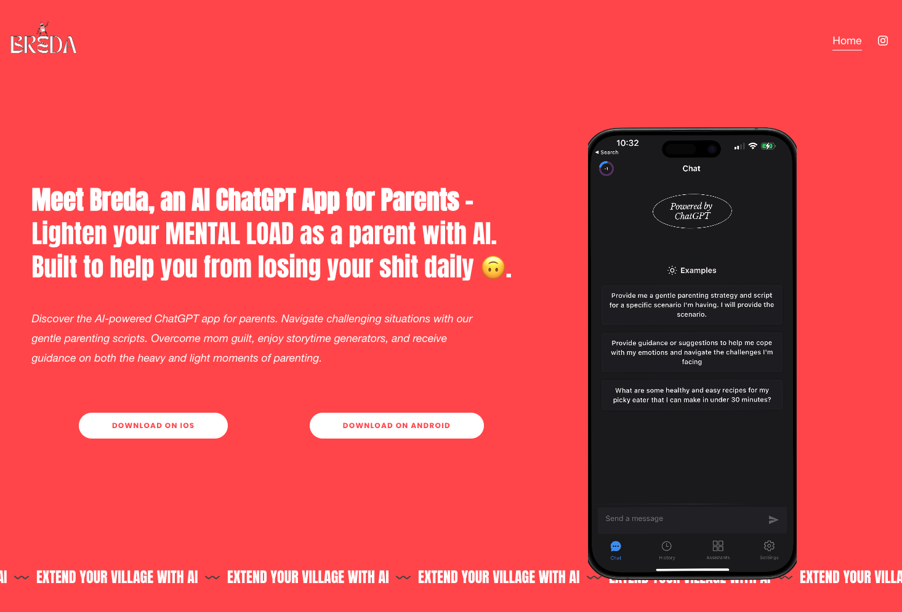
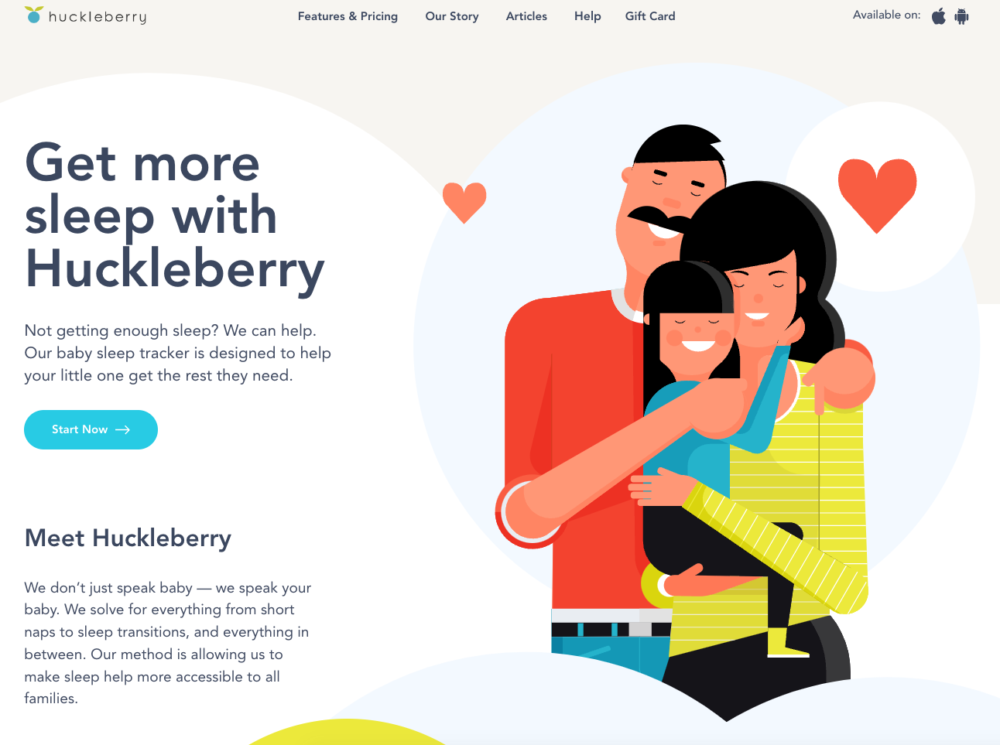
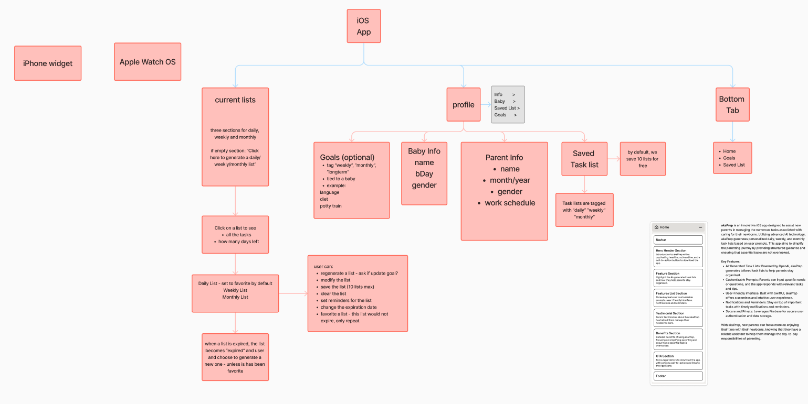
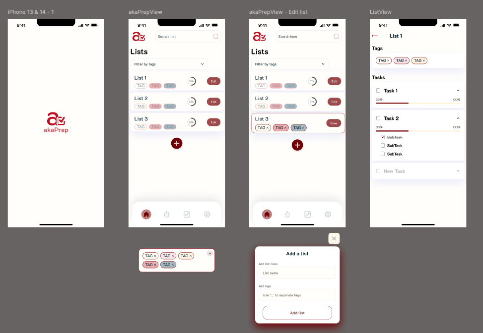
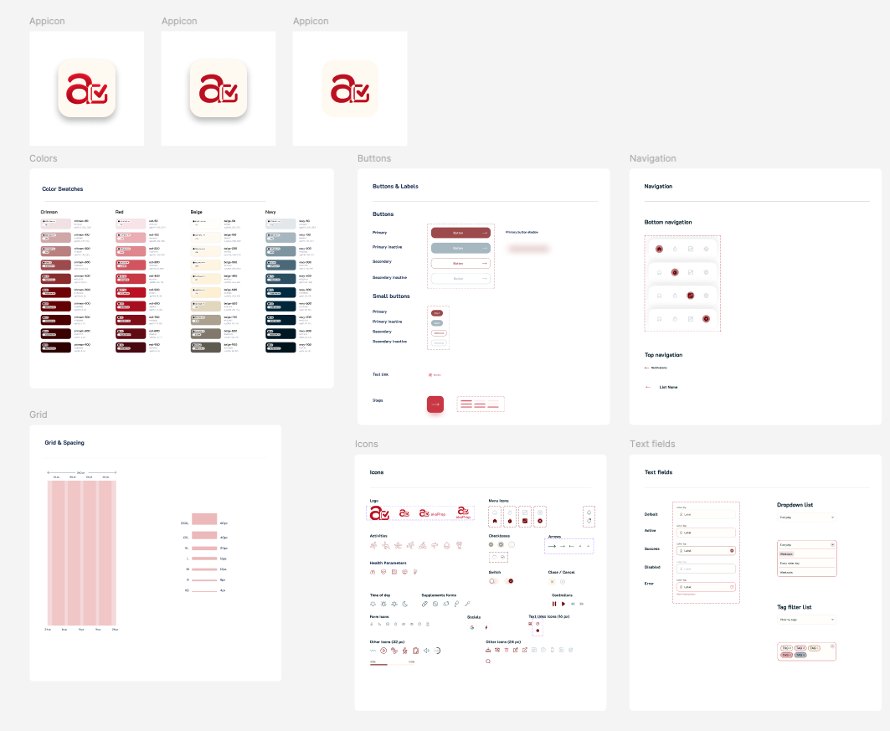
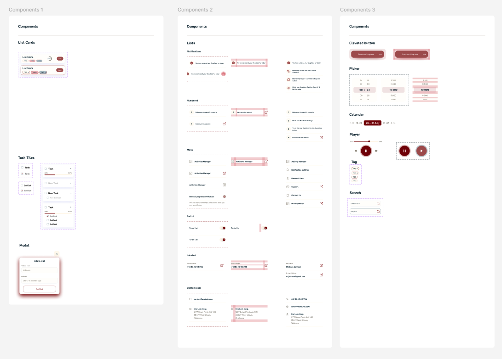
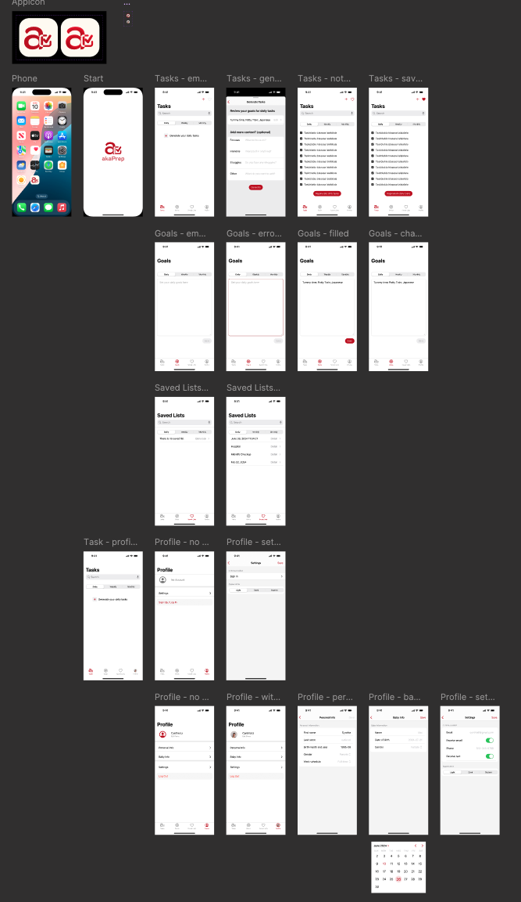

As mentioned before, I’ve been on a mission to create an app that makes life a whole lot easier for new parents, and today, I’m thrilled to introduce you to akaPrep. My team and I have poured our hearts into this intelligent task management application designed specifically for new parents. AkaPrep helps parents streamline daily, weekly, and ad hoc (which we call "Later") task planning. With advanced AI and a user-friendly interface, akaPrep ensures you stay organized, focused, and productive, making parenthood just a bit easier and a lot more fun. 🌟

## Problem Statement

New parents face a multitude of challenges in managing their daily tasks, including meal planning, activity scheduling, and providing emotional support to their children. They often feel overwhelmed by the amount of information and choices available, and struggle to find reliable, expert-backed advice. Additionally, the lack of integrated solutions forces parents to use multiple apps, leading to increased stress and inefficiency.

### How We Chose This Problem

Through extensive user interviews, we identified common pain points and challenges faced by new parents. From these interviews, we identified several Parental Challenges and Pain Points. For more detailed insights, check out my previous post on [Navigating Parenthood: Product Preferences and Parental Challenges](https://cynthialmy.github.io/2024-01-03-new-parents/). 🌟

Through these conversations, we discovered that parents are already leveraging AI to aid in their parenting tasks in various ways. These include:

- **Meal Planning and Grocery Lists:** Parents often struggle with meal planning and grocery lists. Each week, coming up with nutritious, toddler-friendly meal ideas can be daunting. AI can generate a weekly vegetarian menu tailored to the foods their toddlers love or tolerate. Within seconds, parents receive a meal plan and a categorized shopping list, making grocery trips more efficient and stress-free.

- **Activity Generator:** For activity planning, minimizing screen time requires a lot of creativity and effort. AI can suggest countless creative activities based on items parents already have at home. Whether for indoor or outdoor fun, AI provides age-appropriate suggestions, ensuring that children stay engaged without the need for excessive screen time.

- **Gentle Parenting Scripts:** When it comes to gentle parenting, finding the right words during a child’s meltdown can be challenging. AI can help by generating gentle parenting scripts tailored to specific situations, helping parents navigate tough moments with calm and effective communication.

- **Budgeting and Financial Tips:** Budgeting is a task many parents dread. AI can simplify this process by providing personalized financial advice and tips. For instance, parents can ask AI for step-by-step guidance on managing their spending, receiving one question at a time to gradually improve their financial situation.

- **Daily Guided Journal:** Finally, daily guided journaling has been shown to have numerous benefits, but starting the habit can be difficult. AI can assist by engaging in conversations that help parents reflect on their thoughts and feelings, making it easier to practice gratitude and find balance in their motherhood journey.

## User Persona

Certainly! Here are the user personas with added emojis for visual distinction:

| **User Persona**    | **👶 New Parent Nora**                                                                                                                        | **🏡 Stay-at-Home Dad Dave**                                                                                                                                   | **👩‍💻 Working Mom Maya**                                                                                                                                  | **👩‍🏫 Part-Time Worker Patricia**                                                                                                                                          | **💼 Busy Professional Ben**                                                                                                                               |
| ------------------- | -------------------------------------------------------------------------------------------------------------------------------------------- | ------------------------------------------------------------------------------------------------------------------------------------------------------------- | ------------------------------------------------------------------------------------------------------------------------------------------------------- | ------------------------------------------------------------------------------------------------------------------------------------------------------------------------ | --------------------------------------------------------------------------------------------------------------------------------------------------------- |
| **Demographics**    | Age: 28   Gender: Female   Marital Status: Married   Occupation: Marketing Manager   Location: Urban area                        | Age: 35   Gender: Male   Marital Status: Married   Occupation: Stay-at-home parent   Location: Suburban area                                      | Age: 32   Gender: Female   Marital Status: Single   Occupation: Software Engineer   Location: Urban area                                    | Age: 40   Gender: Female   Marital Status: Married   Occupation: Part-time teacher   Location: Rural area                                                    | Age: 38   Gender: Male   Marital Status: Divorced   Occupation: Financial Analyst   Location: Metropolitan area                               |
| **Background**      | First-time mom with a 6-month-old baby, balancing career and parenthood.                                                                     | Stay-at-home dad with two kids, managing household and childcare responsibilities.                                                                            | Single mom with a 3-year-old daughter, balancing a demanding job with parenting.                                                                        | Part-time teacher with three children, balancing work and household duties.                                                                                              | Divorced father with shared custody, balancing a demanding job with parenting.                                                                            |
| **Needs and Goals** | Simplified meal planning   Engaging activities   Reliable advice on gentle parenting   Time management tools   Emotional support | Creative and educational activities   Efficient meal planning   Routine and schedule management   Gentle parenting resources   Parental community | Quick meal planning solutions   Structured activities for her daughter   Gentle parenting scripts   Mental health support   Reliable advice | Educational activities   Meal planning for dietary needs   Schedule management   Gentle parenting support   Mental well-being strategies                     | Efficient meal planning   Engaging activities for custody periods   Gentle parenting advice   Work-life balance support   Schedule management |
| **Pain Points**     | Overwhelmed with information   Limited time for meals and activities   Work-life balance struggles   Need for reliable information  | Difficulty finding new activities   Time-consuming meal planning   Managing different schedules   Need for consistent advice                         | Juggling work and parenting   Need for engaging activities   High stress levels   Reliable and consistent advice                               | Finding activities for different ages   Complex meal planning   Managing busy family schedules   Need for reliable advice                                       | Limited time for meal planning   Need for engaging activities   Balancing work and parenting duties   Need for reliable advice                   |
| **Tech-Savviness**  | Comfortable with technology, uses various apps for productivity and lifestyle management.                                                    | Proficient with technology, actively uses social media and parenting forums.                                                                                  | Highly tech-savvy, prefers digital solutions and uses various apps for work and personal life.                                                          | Moderate tech skills, uses apps for planning and educational purposes.                                                                                                   | Highly tech-savvy, relies on apps for managing work and personal life.                                                                                    |
| **Persona Quote**   | "I need something that can help me manage my time better and give me reliable advice without adding more stress to my day."                  | "I want to find fun and educational activities for my kids and make meal planning less of a chore, so I can spend more quality time with them."               | "I need an app that helps me manage my busy schedule, keep my daughter entertained, and provide reliable parenting advice all in one place."            | "Finding activities that suit all my children and managing our busy schedules is tough. I need an app that helps me streamline these tasks and provide reliable advice." | "I need an app that helps me manage my time with my kids efficiently and provides quick solutions for meals and activities."                              |

### User Needs

1. **Integrated Solutions**:
   - Parents need an all-in-one app that simplifies various aspects of parenting, from meal planning to managing activities and providing emotional support.

2. **Personalization**:
   - Personalized advice and solutions tailored to individual children’s needs and family dynamics are highly sought after.

3. **Ease of Use**:
   - An intuitive and user-friendly interface is crucial for busy parents who need quick access to tools and information.

4. **Trustworthiness**:
   - Reliable and expert-backed information is essential, as parents need to trust the advice and solutions provided by the app.

### Potential Opportunities

1. **Comprehensive Feature Integration**:
   - By integrating meal planning, grocery lists, activity scheduling, and gentle parenting reminders, akaPrep can fill the gap left by competitors who offer more specialized but narrower solutions. This was a top priority to ensure our app provides a holistic solution to parenting challenges.

2. **AI and Machine Learning**:
   - Leveraging AI to provide personalized and adaptive solutions can enhance user satisfaction and engagement. We prioritized this to make sure akaPrep offers tailored support that evolves with the user’s needs.

3. **Mental Health Support**:
   - Including features that support parental mental health, such as daily reflections, mindfulness exercises, and stress management tips, can add significant value. This was incorporated early on to ensure akaPrep supports the overall well-being of parents.

4. **Community and Support Networks**:
   - Creating a platform for parents to connect, share experiences, and support each other can foster a sense of community and enhance user retention. This feature was prioritized to help parents feel connected and supported.

5. **Partnerships with Experts**:
   - Collaborating with child development experts, nutritionists, and psychologists can ensure the content is credible and trustworthy, boosting the app’s reputation. Establishing these partnerships was critical to building a trusted platform.

---

## Market Research

### Market Trends
1. **Increasing Use of Technology in Parenting**:
   - More parents are turning to technology to manage their parenting duties efficiently. Apps that offer practical solutions for everyday tasks are seeing significant growth.
   - AI and machine learning are becoming integral in developing personalized parenting solutions, providing tailored advice, and automating routine tasks.

2. **Focus on Holistic Parenting Solutions**:
   - There is a growing demand for apps that provide a comprehensive suite of tools rather than single-purpose applications.
   - Parents prefer integrated solutions that cover multiple aspects of parenting, from feeding and activity planning to emotional support and educational resources.

3. **Health and Wellness Emphasis**:
   - Apps focusing on both physical and mental health for parents and children are gaining popularity.
   - Features that support gentle parenting, stress management, and mindfulness are particularly valued.

### Comparing akaPrep with Breda and Huckleberry
During our market research, I compared our akaPrep app with two leading parenting apps: Breda and Huckleberry. This comparison helped us identify unique features, understand market gaps, and refine our approach to better serve new parents.

[Breda](https://www.bredaapp.com/) is known for its AI-powered ChatGPT capabilities, offering gentle parenting scripts, storytime generators, and guidance on various parenting challenges. It focuses on lightening the mental load of parents by providing immediate AI-generated support. While Breda excels in offering quick solutions for specific situations, akaPrep goes further by integrating meal planning, grocery lists, activity planning, and reflection reminders all in one app. This comprehensive approach addresses multiple daily tasks, making it a more holistic solution for busy parents.

- **Features**:
  - AI-powered ChatGPT for gentle parenting scripts.
  - Storytime generators and guidance for parenting challenges.
  - Focus on mental load reduction and providing immediate AI-generated support.
- **Strengths**:
  - Comprehensive support for emotional and mental aspects of parenting.
  - Easy-to-use AI assistants for quick solutions.
- **Weaknesses**:
  - Limited integration of practical daily tasks like meal planning and grocery lists.
  - Focuses primarily on emotional support and less on logistical daily needs.

[Huckleberry](https://huckleberrycare.com/), on the other hand, specializes in sleep tracking and improvement, with personalized advice from sleep experts. It helps parents understand their child’s sleep patterns and offers tailored tips to enhance sleep quality. While Huckleberry provides valuable sleep insights, it primarily focuses on one aspect of parenting. akaPrep distinguishes itself by covering a broader range of parenting needs, including nutrition, activities, and emotional support through gentle parenting scripts and daily reflection prompts.

- **Features**:
  - Sleep tracking and improvement with personalized advice from sleep experts.
  - Detailed tracking of daily schedules and long-term patterns.
  - Focus on sleep solutions and developmental milestones.
- **Strengths**:
  - Strong emphasis on sleep, a critical aspect of child development.
  - Personalized and expert-backed advice.
- **Weaknesses**:
  - Narrow focus on sleep-related issues.
  - Lacks comprehensive tools for other daily parenting tasks such as meal planning and activities.

## Ideation

**AkaPrep App:**
AkaPrep addresses these issues by offering a dynamic task management platform that adapts to the unique schedules and needs of new parents. With features like AI-generated task suggestions based on pediatricions recommendation, editable task lists, and integration with daily, weekly, and ad hoc planning, AkaPrep provides a holistic approach to task management, specifically designed to support new parents.

### Key Features and Prioritization Rationale

To ensure akaPrep effectively meets the needs of new parents, we prioritized key features based on their potential to provide immediate value, reduce stress, and differentiate our app from competitors. Here’s a breakdown of these prioritized features and the rationale behind them:

| **Feature**                       | **Description**                                                                                                                                                                                                                                            | **Why Prioritize**                                                                                                                                                                                                                                                                                                                  |
| --------------------------------- | ---------------------------------------------------------------------------------------------------------------------------------------------------------------------------------------------------------------------------------------------------------- | ----------------------------------------------------------------------------------------------------------------------------------------------------------------------------------------------------------------------------------------------------------------------------------------------------------------------------------- |
| **1. AI-Powered Task Generation** | Generates personalized task lists based on user input and preferences, considering the unique needs of new parents. It adapts to changing priorities and schedules, ensuring important tasks like feeding times and medical appointments are never missed. | **User Demand**: Parents consistently expressed the need for personalized, adaptive planning tools.  **Value Proposition**: High potential to reduce parental stress by automating task creation.  **Competitive Advantage**: Differentiates akaPrep from competitors by offering a smart, responsive task generation system. |
| **2. Customizable Task Lists**    | Allows parents to create, edit, and delete tasks easily, such as tracking baby milestones, organizing family activities, and managing household chores. Supports inline editing for quick adjustments, making it easy to update tasks on the go.           | **Flexibility**: Parents need the ability to adjust tasks to suit their changing schedules and priorities.  **User Control**: Empowers users by allowing them to tailor the app to their specific needs.                                                                                                                         |
| **3. Flexible Task Planning**     | Offers daily, weekly, and ad-hoc task views to cater to different planning styles, helping parents stay on top of short-term and long-term responsibilities. Enables task completion toggles and swipe-to-delete functionality for easy task management.   | **Varied Planning Styles**: Recognizes the diversity in how parents plan their days and weeks.  **Holistic Management**: Provides a comprehensive view of tasks, aiding both short-term and long-term planning.                                                                                                                  |
| **4. Task Activation**            | Parents can activate saved task lists, converting them into active tasks for immediate action. Automatically updates the status of liked lists, maintaining user preferences and ensuring that important tasks are highlighted.                            | **Immediate Action**: Simplifies the transition from planning to execution, ensuring tasks are acted upon.  **User Experience**: Enhances the user experience by making task management seamless and intuitive.                                                                                                                  |

### Summary of Prioritization

| **Feature**                    | **User Demand** | **Value Proposition**    | **Competitive Advantage**   | **Metrics for Success**                 |
| ------------------------------ | --------------- | ------------------------ | --------------------------- | --------------------------------------- |
| **AI-Powered Task Generation** | High            | Reduces stress           | Differentiates akaPrep      | DAU, Task Completion Rates              |
| **Customizable Task Lists**    | High            | Flexibility              | Empowers users              | User Satisfaction, Retention Rates      |
| **Flexible Task Planning**     | Medium          | Aids holistic management | Comprehensive view of tasks | Planning Efficiency, User Feedback      |
| **Task Activation**            | Medium          | Simplifies execution     | Enhances UX                 | Task Activation Rates, Completion Speed |

By incorporating features like meal planning, activity generation, and reminders for gentle parenting practices, akaPrep addresses the diverse and recurring needs of parents. Our market research highlighted the demand for an all-encompassing app that not only simplifies day-to-day tasks but also supports parents' overall well-being. This comprehensive coverage sets akaPrep apart from Breada and Huckleberry, positioning it as a versatile and indispensable tool for modern parenting.

## Wireframing and Design

The wireframing process for akaPrep began with meticulous planning and user-centric design. I started by developing a comprehensive sitemap that outlined all the key features and functionalities I wanted to include in the app. This sitemap served as a blueprint, ensuring that our design was well-organized and user-friendly.

Next, I created a low-fidelity wireframe to visualize the basic structure and layout of akaPrep. This initial wireframe helped us map out the user journey and identify any potential usability issues early on. It was a crucial step in shaping the app's overall design and functionality.

To enhance the visual appeal and user experience, I designed a color theme and a initial design system based on our initial user studies. Version one of akaPrep featured a vibrant yet soothing palette that resonated well with our target audience. This color scheme was chosen to create a pleasant and engaging user experience, reflecting the app's supportive nature.

After finishing the first version prototype, I conducted several follow-up interviews to gather feedback from our users. Based on their input, I simplified and streamlined the design to make it even clearer and more intuitive. Our goal was to minimize complexity and enhance usability, ensuring that parents could easily navigate and utilize all the features of akaPrep.

To facilitate rapid prototyping and efficient development, I built most of the UI using SwiftUI. This approach allowed us to quickly iterate on the design and incorporate user feedback, leading to a more polished and user-friendly final product. By focusing on simplicity and clarity, we created an app that truly meets the needs of modern parents, making their lives easier and more organized.

## Next

akaPrep is still in active development, and we are continuously working to enhance its features and usability based on ongoing feedback from parents. Our goal is to provide a comprehensive, user-friendly solution that addresses the varied needs of modern parenting. We are excited about the progress we’ve made and look forward to sharing more updates soon.

Stay tuned for future developments, and if you’re interested in learning more or have any feedback, feel free to reach out to me. With akaPrep can make parenting a little bit easier, one day at a time.

<!-- ## Solution Validation Approach

**Validation Approach:**
- **User Testing:** Conducted pilot tests with a group of new parents to validate the platform’s functionality and user experience.
- **Feedback Collection:** Collected qualitative and quantitative feedback through surveys and interviews to refine features and address pain points.
- **Iterative Development:** Used agile methodologies to iterate on feedback, continuously improving the platform to meet user needs.

**Metrics and KPIs:**
- **User Satisfaction:** Measured through feedback and Net Promoter Score (NPS).
- **Task Completion Rate:** Tracked the number of tasks completed versus created.
- **Engagement Rate:** Monitored active users and frequency of app usage.
- **Churn Rate:** Analyzed user retention and reasons for discontinuation.

## The Impact

**Efficiency:**
- **Improved Organization:** Simplified task management, reducing the mental load on new parents.
- **Time Savings:** Streamlined task planning and execution, freeing up time for parents to spend with their children.

**Savings:**
- **Cost-Effective:** Provided a free tier with essential features, making effective task management accessible to all.

**User Experience:**
- **Personalized Support:** Tailored task suggestions and adaptable schedules ensured tasks were relevant and manageable for new parents.

## My Role vs. Team Contributions

**My Contributions:**
- Led the project from initial concept to launch.
- Conducted market research and user surveys to identify the problem and validate the solution.
- Coordinated cross-functional teams, including design, development, and marketing.
- Developed the pilot testing framework and analyzed user feedback to refine the platform.

**Team Contributions:**
- **Design Team:** Created the user-friendly interface and branding.
- **Development Team:** Built and tested the platform’s functionality.
- **Marketing Team:** Promoted AkaPrep to potential users and gathered initial user feedback.

## Case Studies

### Raising the Bar on Product Work

**Case Study: AI-Powered Task Generation**

**Challenge:**
Creating a task management tool that adapts to the dynamic needs of new parents.

**Solution:**
Developed AI algorithms that analyze user behavior and preferences to generate personalized task lists.

**Impact:**
Enhanced user satisfaction and engagement, as tasks were highly relevant and timely.

### Showcasing Strengths

**Case Study: Customizable Task Lists**

**Weakness Turned Strength:**
My meticulous nature, often seen as a weakness, became a strength in ensuring detailed customization options.

**Solution:**
Worked closely with the design team to implement flexible task list features that allow parents to tailor their task management.

**Impact:**
High user adoption and positive reviews on the platform’s flexibility and ease of use.

### Demonstrating Real PM Skills

**Case Study: Iterative User Feedback Integration**

**Real PM Aspect:**
Focused on continuous improvement through user feedback loops.

**Solution:**
Implemented an agile development process that incorporated regular user feedback to refine features and improve user experience.

**Impact:**
Consistently high user satisfaction and a low churn rate, showcasing my ability to adapt and iterate based on real user needs.

## Conclusion

AkaPrep is set to revolutionize task management for new parents with its innovative AI-powered features and user-friendly design. By addressing a significant market gap with a user-centric and sustainable solution, I demonstrated my ability to lead a project from concept to successful implementation. This portfolio showcases my strengths in problem-solving, user experience design, and cross-functional team coordination, illustrating why I am a ‘real’ product manager. -->

<!-- 1. **Product Roadmap**: A strategic document outlining the vision, direction, and progress of akaPrep over time. It includes key milestones, features, and timelines.

2. **Market Research Report**: A comprehensive analysis of market trends, competitive landscape (including comparisons with apps like Breda and Huckleberry), user needs, and potential opportunities.

3. **User Personas**: Detailed profiles representing the different types of users who will be interacting with akaPrep. These personas help in understanding the target audience and tailoring the app’s features to meet their needs.

4. **Requirements Document**: A clear and detailed list of the app’s functional and non-functional requirements, including user stories and acceptance criteria.

5. **Wireframes and Prototypes**: Low-fidelity wireframes and high-fidelity prototypes created during the design phase to visualize the app’s layout, navigation, and user interface.

6. **UI/UX Design**: High-quality design assets, including color schemes, typography, icons, and other visual elements, ensuring a cohesive and user-friendly interface.

7. **Sprint Plans**: Detailed plans for each development sprint, outlining the tasks, responsible team members, timelines, and goals for each iteration.

8. **User Feedback Reports**: Summarized feedback from user interviews and testing sessions, highlighting key insights, pain points, and areas for improvement.

9. **Feature Specifications**: Detailed specifications for each feature, including functionality, user flow diagrams, wireframes, and design mockups.

10. **Development Backlog**: A prioritized list of tasks and features to be developed, managed in a tool like Jira or Trello, ensuring transparency and organization in the development process.

11. **Testing Plans**: Comprehensive plans for both functional and non-functional testing, including test cases, testing environments, and bug tracking.

12. **Launch Plan**: A detailed plan outlining the steps for launching akaPrep, including marketing strategies, press releases, user onboarding processes, and metrics for success.

13. **Marketing Materials**: Collateral such as blog posts, social media content, email campaigns, and promotional videos to support the app’s launch and ongoing user engagement.

14. **Analytics Dashboard**: A setup for monitoring key performance indicators (KPIs), user engagement metrics, and other data to track the app’s performance and user satisfaction post-launch.

15. **Documentation**: Comprehensive documentation for developers, designers, and other stakeholders, including API documentation, user guides, and onboarding manuals.

16. **Post-Launch Support Plan**: A strategy for providing ongoing support to users, including a system for handling feedback, bug reports, and feature requests. -->
