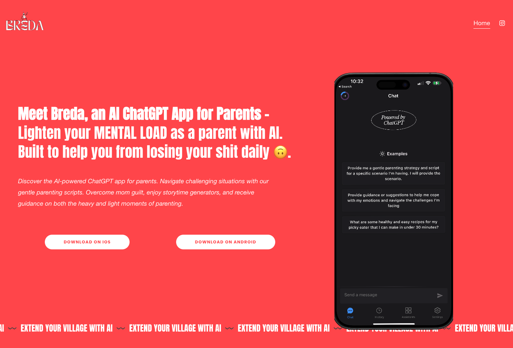
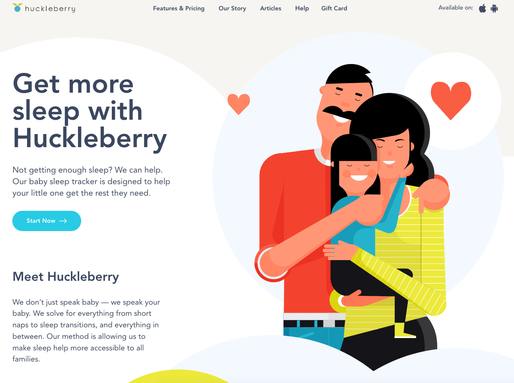
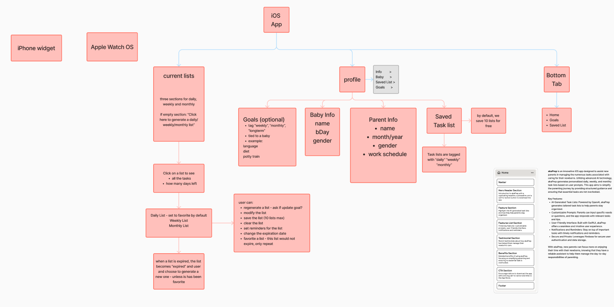
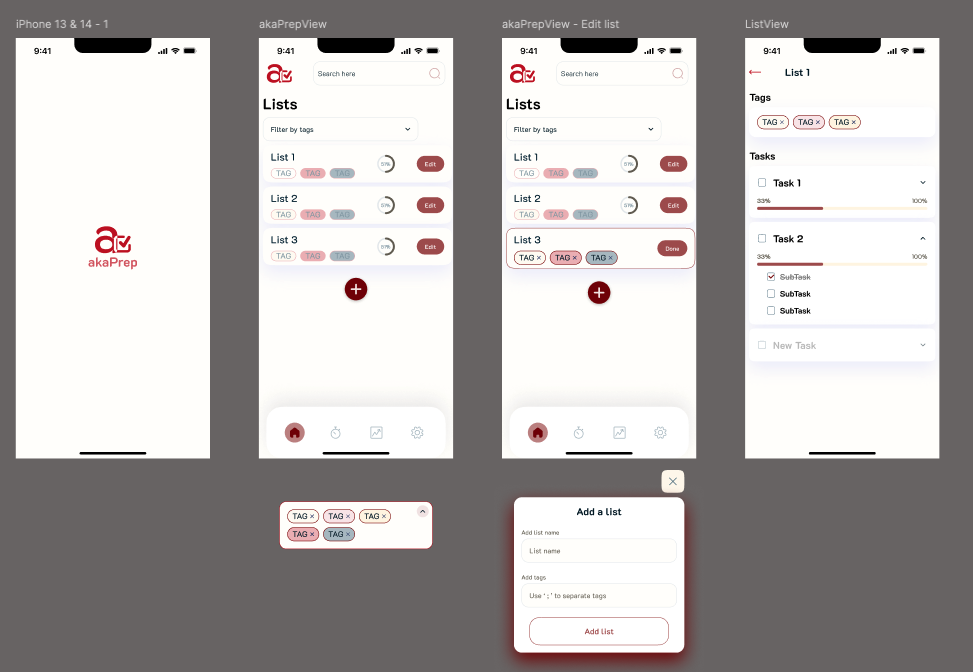
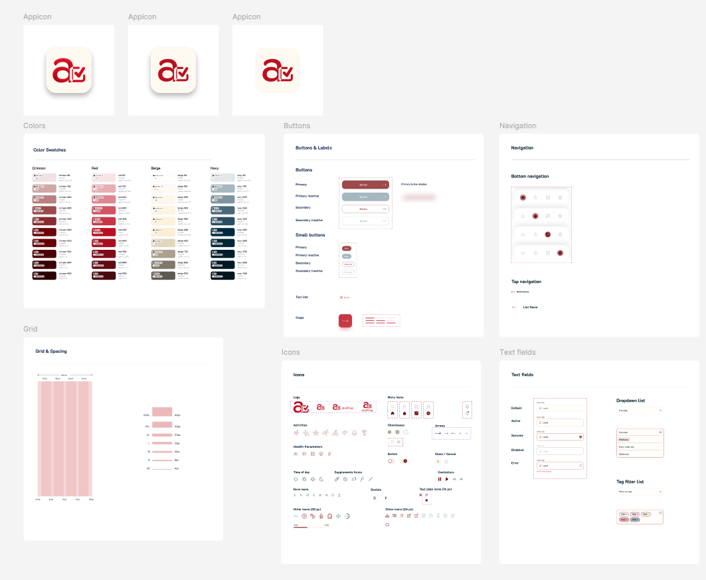
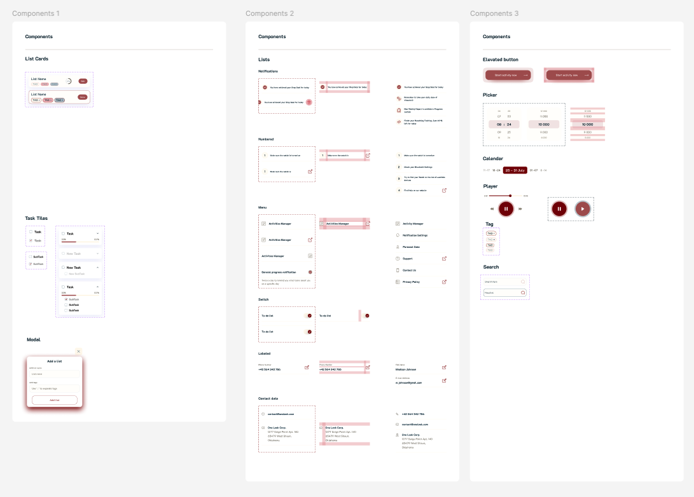
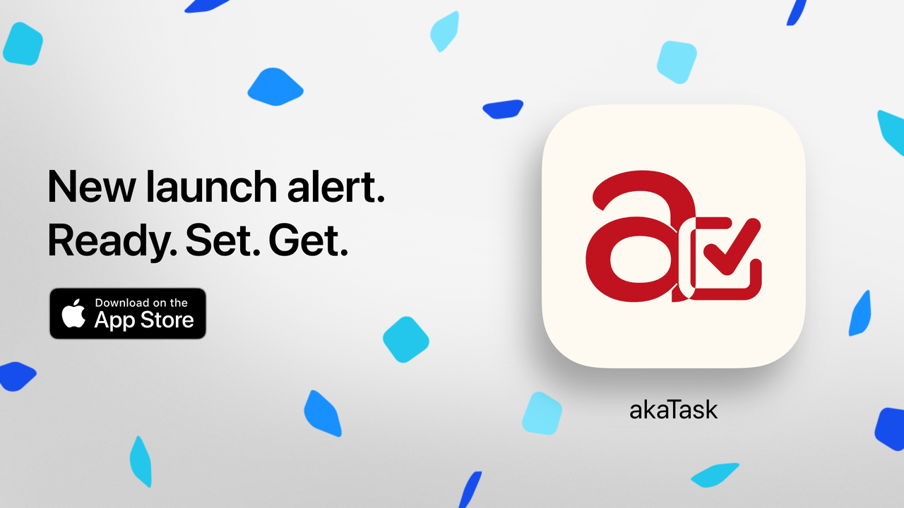

As mentioned before, I’ve been on a mission to create an app that makes life easier for new parents. Now let me introduce this task management application designed specifically for new parents - akaTask helps parents streamline daily, weekly, and monthly task planning. With advanced AI and a user-friendly interface, akaTask ensures you stay organized, focused, and productive, making parenthood just a bit easier.

# PART B — Product, MVP & Launch (Case Study 2)

# Product Vision

Build the world’s simplest AI productivity assistant for parents: one place to generate, edit, and execute parenting workflows that save time, reduce worry, and connect parents to trusted advice.

### Strategic objectives (12 months)

* Reach 50k installs and 10k MAU within 12 months of launch.
* Achieve 30% 7‑day retention and 15% 30‑day retention for MVP cohort.
* Drive 40% task completion rate for AI-generated task lists within 14 days of activation.
* Validate willingness to pay: 3% conversion to premium in first 6 months.

### Success metrics (North Star and supporting metrics)

* **North Star:** Daily Active Users (DAU) * Task Completion Rate
* **Acquisition:** Installs, Cost Per Install (CPI), organic %
* **Activation:** Time to first task completion, % users who complete generated task list within 48 hours
* **Engagement:** DAU/MAU, average tasks created per user, weekly sessions
* **Retention:** 7-day, 30-day retention
* **Monetization:** Conversion rate to paid tier, LTV, ARPU
* **Trust/Quality:** NPS, % of reviews marked "helpful", average review rating

### How We Chose This Problem

Through extensive user interviews, we identified common pain points and challenges faced by new parents. From these interviews, we identified several Parental Challenges and Pain Points. For more detailed insights, check out my previous post on [Navigating Parenthood: Product Preferences and Parental Challenges](https://cynthialmy.github.io/2024-01-03-new-parents/). 🌟

## User Persona

* **New Parent Nora (Primary):** Time-scarce, tech-comfortable. Wants meal planning + activity generation + mental load reduction.
* **Working Mom Maya:** Needs fast, reliable routines and quick scripts for behavior management.
* **Stay-at-Home Dad Dave:** Seeks variety of activities and structure.

## Core value proposition

Deliver immediate time savings and reduced anxiety via AI-generated, actionable task lists tailored to the family schedule and preferences.

## MVP Scope (v1) — Must-haves

1. **AI Task List Generator** (core): Input: child age(s), day type (workday/weekend), dietary constraints, time availability. Output: prioritized task list (3–8 items) with estimated time and quick actions.
2. **Meal Planner + Grocery List**: Generate 7-day meal plan and categorized shopping list; integrate basic pantry toggles.
3. **Gentle Parenting Script Generator**: Short scripts for common scenarios (meltdowns, setting boundaries, praise) — editable.
4. **Inline Editing & Activation**: Users can edit generated lists and activate a saved list to make it actionable.
5. **Basic Analytics & Tracking**: Track task completion, time to complete, and simple engagement signals for experimentation.
6. **Onboarding & Activation Flow**: Fast onboarding capturing household details and preferences to improve AI relevance.

### MVP Constraints

* No complex device integrations (deferred).
* No payments in v1 (free launch to validate core demand). Monetization experiments start v2.
* Community features are deferred to v2 — focus on AI value first.

## Differentiation vs Competitors

see [Comparing akaTask with Breda and Huckleberry](#comparing-aka-task-with-breda-and-huckleberry) in the [Market Research](#market-research) section for more details.

* **vs Breda:** akaTask integrates logistic tasks (meal planning, grocery lists, task activation) with Breda-style scripts, creating a productivity-first AI assistant instead of a primarily mental-load chat tool.
* **vs Huckleberry:** akaTask is broader — it automates diverse daily parenting workflows beyond sleep tracking.

## Product Features (detailed)

### 1) AI Task List Generator — Product spec

* **Inputs:** child age(s), household constraints (time, dietary), mood, day type (workday/weekend), selected goals (sleep, screen-time, education).
* **Outputs:** 3–8 prioritized tasks with estimated times, rationale for each suggestion, optional quick links (e.g., add to calendar, share to partner).
* **Acceptance criteria:** 70% of test users should rate lists "helpful" or "very helpful" in pilot.

### 2) Meal Planner & Grocery

* One-click generate meal plan + auto categorized grocery list (pantry-aware later).
* Export to shareable checklist and calendar reminders.
* Acceptance: 60% of users use grocery export within first 3 sessions.

### 3) Gentle Parenting Scripts

* Structured templates tuned by age and situation; editable output.
* Acceptance: >60% of users report scripts improved confidence in pilot.

### 4) Analytics & Instrumentation

* Events: `generate_task_list`, `activate_list`, `complete_task`, `edit_task`, `export_grocery`, `script_use`.
* Capture context: child_age, day_type, time_of_day, source_of_activation.

## Data & AI requirements

* Lightweight LLM usage: prompt templates + retrieval of pared-down context (user preferences, recent tasks).
* Safety guardrails: avoid medical/legal advice; include disclaimers and "consult expert" CTA for critical situations.
* Privacy: store minimal PII, GDPR/CCPA ready. Provide clear data usage in onboarding.

## Experiments & Validation plan

1. **Onboarding A/B test** — short (3-question) vs long (detailed preferences) onboarding. Metric: activation (first task completion) within 48 hours.
2. **Task List Length Test** — 3-item vs 6-item lists. Metric: completion rate per list.
3. **Script Prompting UI** — inline prompt vs separate chat. Metric: script adoption and session length.
4. **Grocery Export CTA** — top CTA placement vs inline. Metric: export rate.

## Metrics & Targets (MVP)

* Activation: 40% users complete the first generated list within 48 hours.
* Engagement: DAU/MAU = 25% within first 30 days.
* Retention: 7-day = 30%, 30-day = 15%.
* Task completion rate: 40% average per generated list.

## Go-to-Market & Growth

* **Initial channels:** parenting newsletters, micro-influencers (parent bloggers/podcasters), App Store featuring optimization targeting "parenting" + "productivity".
* **Partnerships:** pediatric clinics for flyer distribution, baby stores for QR codes to try the app in-store.
* **Virality mechanics:** partner sync (share task list), referral reward (premium free month when converted).

## Monetization hypotheses (post-MVP)

* **Premium subscription ($4.99/mo):** advanced personalization (multi-child profiles, pantry sync, calendar integration), prioritized AI generation, advanced analytics.
* **Retail partnerships revenue:** affiliate revenue from recommended items or in-store demo referrals.

## Compliance & Privacy

* No storage of sensitive medical info. If collected (e.g., allergies), keep encrypted and provide clear consent.
* Data retention policy and export/Delete account feature in v1.

## Risks & Mitigations

* **Risk:** Low retention due to low perceived ongoing value.

  * **Mitigation:** Focus on habit loops (daily checklist, reflection prompts), push notifications with meaningful context.
* **Risk:** AI hallucinations; bad advice undermines trust.

  * **Mitigation:** Restrict generative outputs to safe domains (scripts, meal ideas) and add conservative system prompts; human-in-the-loop review for content templates.
* **Risk:** Privacy concerns.

  * **Mitigation:** Transparent onboarding, minimal data collection, clear opt-ins.

## Launch checklist (pre-launch)

* Instrument core analytics events and dashboards.
* Beta test with 200 active parents and gather qualitative feedback.
* App Store metadata and assets optimized for parenting/productivity keywords.
* Support docs and help center (basic FAQs and data privacy page).

## Post-launch measurement & iterating

* Weekly dashboard review for activation and completion metrics.
* Bi-weekly ship cycles for quick fixes and prioritized A/B tests.
* Monthly growth review to evaluate CPI, retention, and engagement against targets.

---

# Appendix

## Market Research

### Market Trends
1. **Increasing Use of Technology in Parenting**:
   - More parents are turning to technology to manage their parenting duties efficiently. Apps that offer practical solutions for everyday tasks are seeing significant growth.
   - AI and machine learning are becoming integral in developing personalized parenting solutions, providing tailored advice, and automating routine tasks.

2. **Focus on Holistic Parenting Solutions**:
   - There is a growing demand for apps that provide a comprehensive suite of tools rather than single-purpose applications.
   - Parents prefer integrated solutions that cover multiple aspects of parenting, from feeding and activity planning to emotional support and educational resources.

3. **Health and Wellness Emphasis**:
   - Apps focusing on both physical and mental health for parents and children are gaining popularity.
   - Features that support gentle parenting, stress management, and mindfulness are particularly valued.

### Comparing akaTask with Breda and Huckleberry
During our market research, I compared our akaTask app with two leading parenting apps: Breda and Huckleberry. This comparison helped us identify unique features, understand market gaps, and refine our approach to better serve new parents.

[Breda](https://www.bredaapp.com/) is known for its AI-powered ChatGPT capabilities, offering gentle parenting scripts, storytime generators, and guidance on various parenting challenges. It focuses on lightening the mental load of parents by providing immediate AI-generated support. While Breda excels in offering quick solutions for specific situations, akaTask goes further by integrating meal planning, grocery lists, activity planning, and reflection reminders all in one app. This comprehensive approach addresses multiple daily tasks, making it a more holistic solution for busy parents.

- **Features**:
  - AI-powered ChatGPT for gentle parenting scripts.
  - Storytime generators and guidance for parenting challenges.
  - Focus on mental load reduction and providing immediate AI-generated support.
- **Strengths**:
  - Comprehensive support for emotional and mental aspects of parenting.
  - Easy-to-use AI assistants for quick solutions.
- **Weaknesses**:
  - Limited integration of practical daily tasks like meal planning and grocery lists.
  - Focuses primarily on emotional support and less on logistical daily needs.

[Huckleberry](https://huckleberrycare.com/), on the other hand, specializes in sleep tracking and improvement, with personalized advice from sleep experts. It helps parents understand their child’s sleep patterns and offers tailored tips to enhance sleep quality. While Huckleberry provides valuable sleep insights, it primarily focuses on one aspect of parenting. akaTask distinguishes itself by covering a broader range of parenting needs, including nutrition, activities, and emotional support through gentle parenting scripts and daily reflection prompts.

- **Features**:
  - Sleep tracking and improvement with personalized advice from sleep experts.
  - Detailed tracking of daily schedules and long-term patterns.
  - Focus on sleep solutions and developmental milestones.
- **Strengths**:
  - Strong emphasis on sleep, a critical aspect of child development.
  - Personalized and expert-backed advice.
- **Weaknesses**:
  - Narrow focus on sleep-related issues.
  - Lacks comprehensive tools for other daily parenting tasks such as meal planning and activities.

## Ideation

**akaTask App:**
akaTask addresses these issues by offering a dynamic task management platform that adapts to the unique schedules and needs of new parents. With features like AI-generated task suggestions based on pediatricions recommendation, editable task lists, and integration with daily, weekly, and ad hoc planning, akaTask provides a holistic approach to task management, specifically designed to support new parents.

### Key Features and Prioritization Rationale

To ensure akaTask effectively meets the needs of new parents, we prioritized key features based on their potential to provide immediate value, reduce stress, and differentiate our app from competitors. Here’s a breakdown of these prioritized features and the rationale behind them:

| **Feature**                       | **Description**                                                                                                                                                                                                                                            | **Why Prioritize**                                                                                                                                                                                                                                                                                                                  |
| --------------------------------- | ---------------------------------------------------------------------------------------------------------------------------------------------------------------------------------------------------------------------------------------------------------- | ----------------------------------------------------------------------------------------------------------------------------------------------------------------------------------------------------------------------------------------------------------------------------------------------------------------------------------- |
| **1. AI-Powered Task Generation** | Generates personalized task lists based on user input and preferences, considering the unique needs of new parents. It adapts to changing priorities and schedules, ensuring important tasks like feeding times and medical appointments are never missed. | **User Demand**: Parents consistently expressed the need for personalized, adaptive planning tools.  **Value Proposition**: High potential to reduce parental stress by automating task creation.  **Competitive Advantage**: Differentiates akaTask from competitors by offering a smart, responsive task generation system. |
| **2. Customizable Task Lists**    | Allows parents to create, edit, and delete tasks easily, such as tracking baby milestones, organizing family activities, and managing household chores. Supports inline editing for quick adjustments, making it easy to update tasks on the go.           | **Flexibility**: Parents need the ability to adjust tasks to suit their changing schedules and priorities.  **User Control**: Empowers users by allowing them to tailor the app to their specific needs.                                                                                                                         |
| **3. Flexible Task Planning**     | Offers daily, weekly, and ad-hoc task views to cater to different planning styles, helping parents stay on top of short-term and long-term responsibilities. Enables task completion toggles and swipe-to-delete functionality for easy task management.   | **Varied Planning Styles**: Recognizes the diversity in how parents plan their days and weeks.  **Holistic Management**: Provides a comprehensive view of tasks, aiding both short-term and long-term planning.                                                                                                                  |
| **4. Task Activation**            | Parents can activate saved task lists, converting them into active tasks for immediate action. Automatically updates the status of liked lists, maintaining user preferences and ensuring that important tasks are highlighted.                            | **Immediate Action**: Simplifies the transition from planning to execution, ensuring tasks are acted upon.  **User Experience**: Enhances the user experience by making task management seamless and intuitive.                                                                                                                  |

### Summary of Prioritization

| **Feature**                    | **User Demand** | **Value Proposition**    | **Competitive Advantage**   | **Metrics for Success**                 |
| ------------------------------ | --------------- | ------------------------ | --------------------------- | --------------------------------------- |
| **AI-Powered Task Generation** | High            | Reduces stress           | Differentiates akaTask      | DAU, Task Completion Rates              |
| **Customizable Task Lists**    | High            | Flexibility              | Empowers users              | User Satisfaction, Retention Rates      |
| **Flexible Task Planning**     | Medium          | Aids holistic management | Comprehensive view of tasks | Planning Efficiency, User Feedback      |
| **Task Activation**            | Medium          | Simplifies execution     | Enhances UX                 | Task Activation Rates, Completion Speed |

By incorporating features like meal planning, activity generation, and reminders for gentle parenting practices, akaTask addresses the diverse and recurring needs of parents. Our market research highlighted the demand for an all-encompassing app that not only simplifies day-to-day tasks but also supports parents' overall well-being. This comprehensive coverage sets akaTask apart from Breada and Huckleberry, positioning it as a versatile and indispensable tool for modern parenting.

## Wireframing and Design

The wireframing process for akaTask began with meticulous planning and user-centric design. I started by developing a comprehensive sitemap that outlined all the key features and functionalities I wanted to include in the app. This sitemap served as a blueprint, ensuring that our design was well-organized and user-friendly.

Next, I created a low-fidelity wireframe to visualize the basic structure and layout of akaTask. This initial wireframe helped us map out the user journey and identify any potential usability issues early on. It was a crucial step in shaping the app's overall design and functionality.

To enhance the visual appeal and user experience, I designed a color theme and a initial design system based on our initial user studies. Version one of akaTask featured a vibrant yet soothing palette that resonated well with our target audience. This color scheme was chosen to create a pleasant and engaging user experience, reflecting the app's supportive nature.

After finishing the first version prototype, I conducted several follow-up interviews to gather feedback from our users. Based on their input, I simplified and streamlined the design to make it even clearer and more intuitive. Our goal was to minimize complexity and enhance usability, ensuring that parents could easily navigate and utilize all the features of akaTask.

To facilitate rapid prototyping and efficient development, I built most of the UI using SwiftUI. This approach allowed us to quickly iterate on the design and incorporate user feedback, leading to a more polished and user-friendly final product. By focusing on simplicity and clarity, we created an app that truly meets the needs of modern parents, making their lives easier and more organized.

## Next

akaTask is still in active development, and we are continuously working to enhance its features and usability based on ongoing feedback from parents. Our goal is to provide a comprehensive, user-friendly solution that addresses the varied needs of modern parenting. We are excited about the progress we’ve made and look forward to sharing more updates soon.

## Download akaTask on the App Store
We've designed it to streamline task management for busy parents, making it easy to stay organized with a simple, intuitive interface. You can download it here: [akaTask on the App Store](https://apps.apple.com/us/app/akatask/id6566193664?ign-itscg=30200&ign-itsct=apps_box_link&mttnsubad=6566193664&platform=iphone).

For a deeper dive into the vision behind akaTask and our approach to building a parenting task management tool, check out our previous post here: [akaTask: Simplify Parenthood with AI Task Management](https://cynthialmy.github.io/2024-01-05-akatask/).

### What to Expect in This Version 📋
This initial release provides a streamlined **task list generator** designed to simplify your daily planning with ease and clarity. We've kept it lightweight and focused to get early feedback and ensure it fits into your busy life seamlessly.

### What's Coming Next 🔜
Our team is actively working on additional features to create a comprehensive solution for parenting-related tasks and beyond. Stay tuned for:
- **Customizable Task Categories**: Organize tasks by type (daily, weekly, or ad hoc) to fit your lifestyle.
- **Personalized Reminders and Notifications**: Never miss an important task with tailored notifications.
- **AI-Powered Recommendations**: Based on your preferences and patterns, akaTask will soon help you with suggestions to make planning even easier.

### We Need Your Feedback! 💬
Your input is crucial as we shape akaTask into a powerful task management tool for parents. Download the app, try it out, and let us know what you think. Every piece of feedback will help us bring more value to you in the upcoming versions.

Thank you for supporting us on this journey. We’re excited to keep improving akaTask to make parenthood a little bit easier, one task at a time. 🌟

