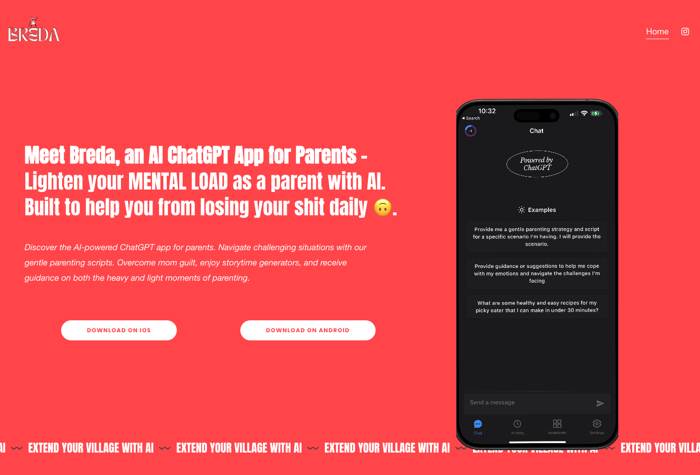
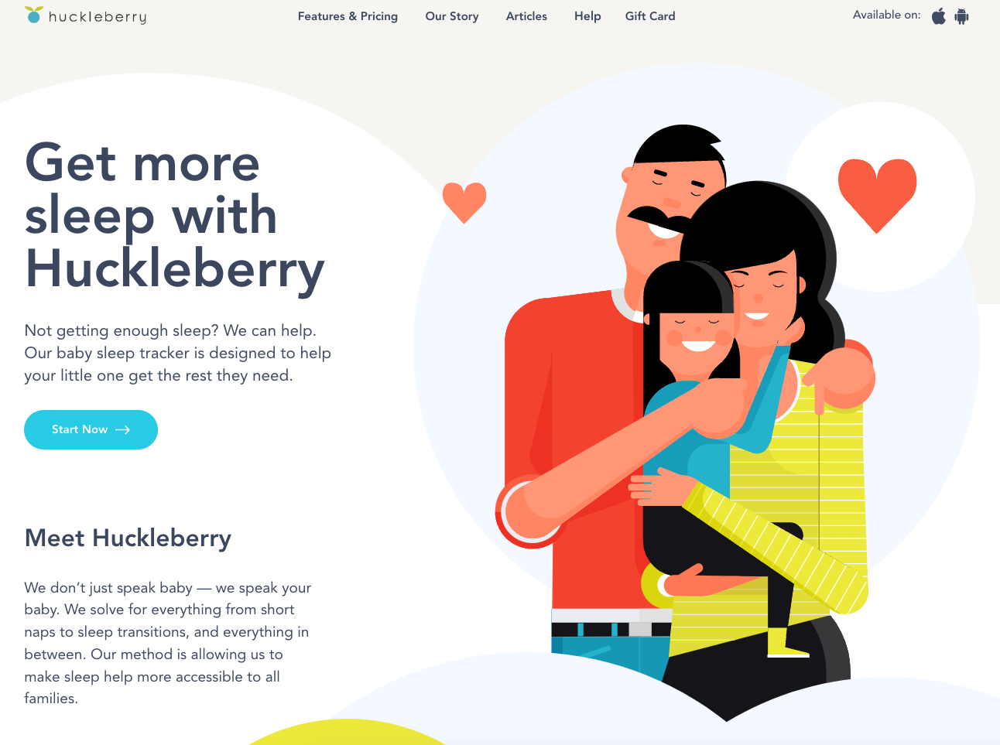
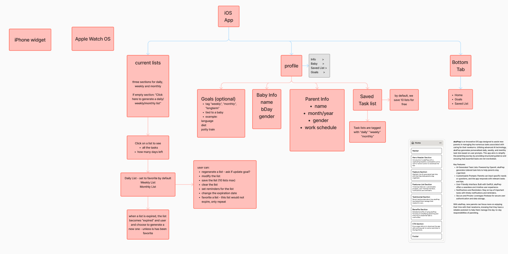
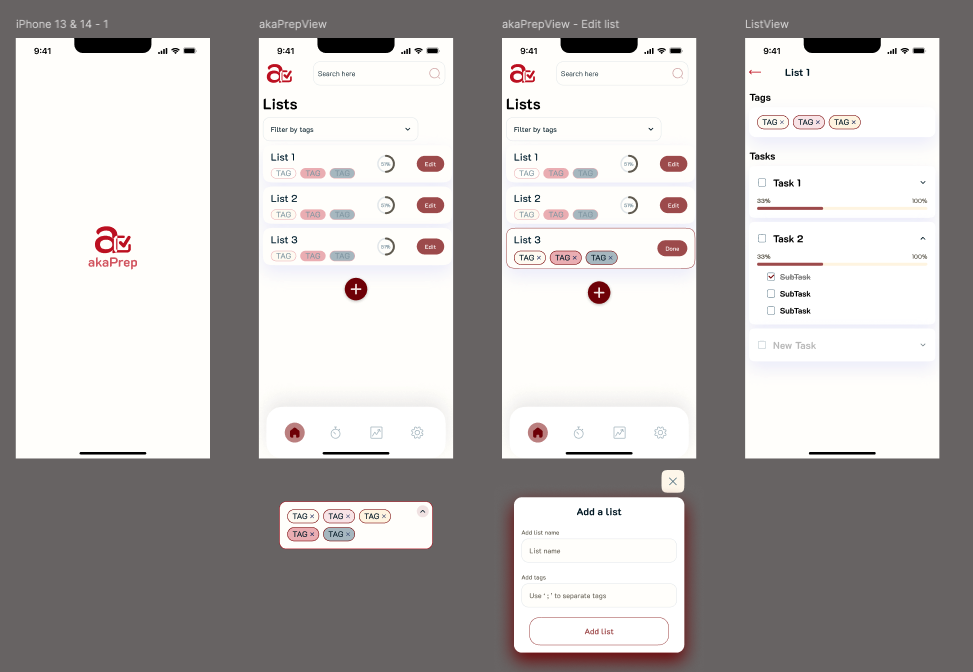
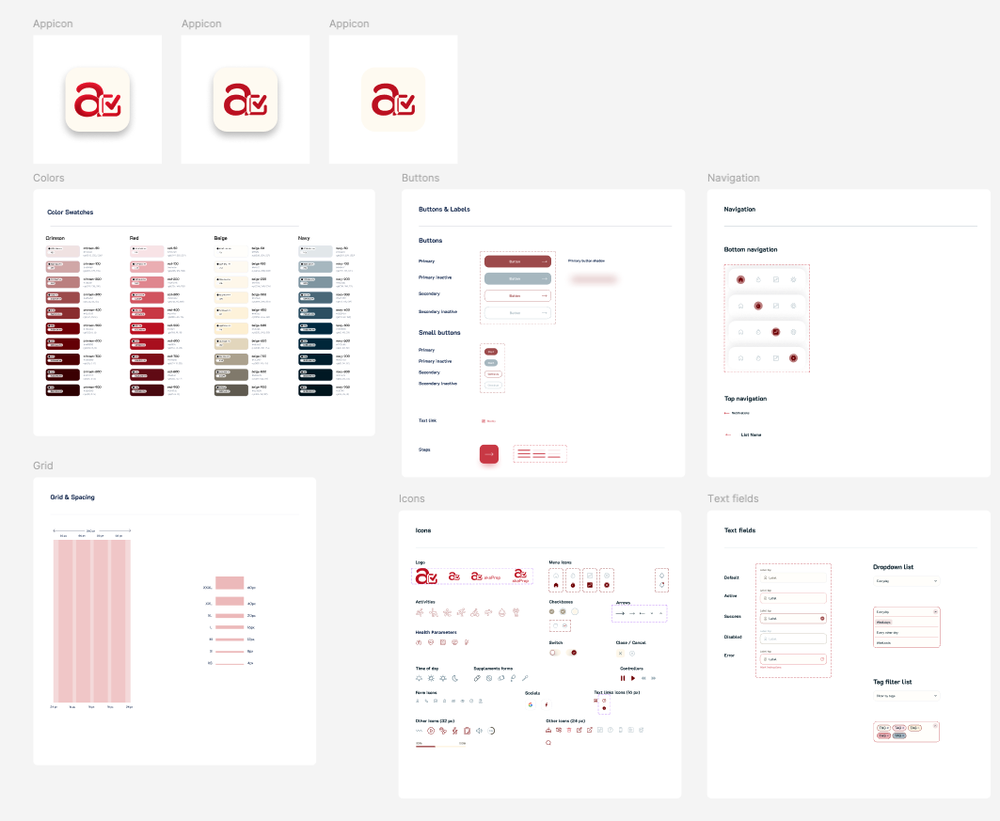
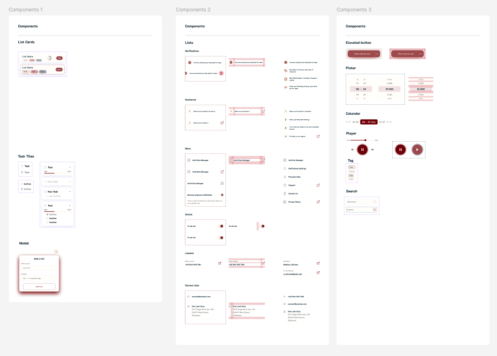
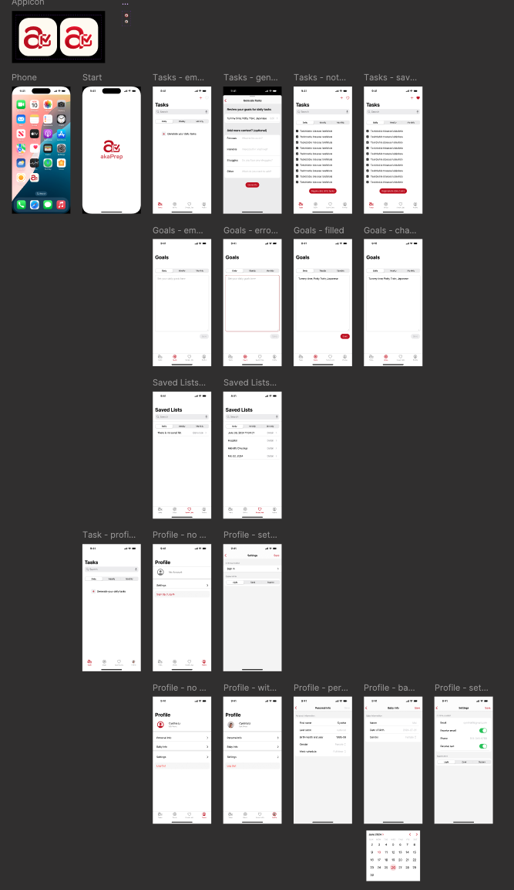
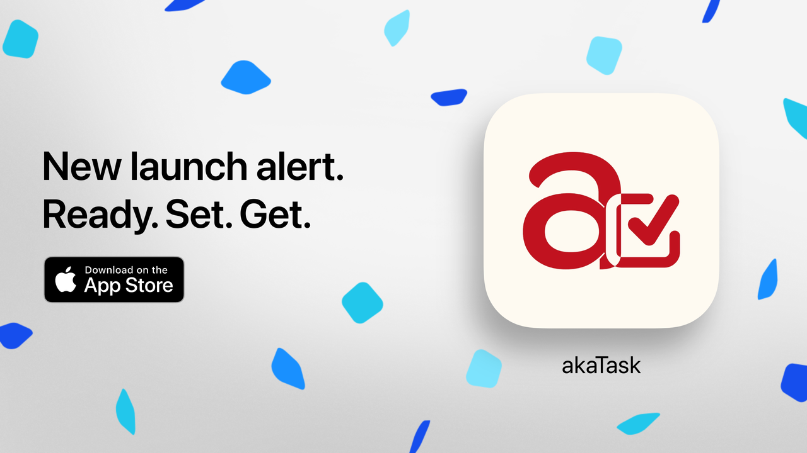

I turned a messy, emotionally charged problem space into a shipped iOS app. The research that informed it is covered in [Navigating Parenthood: Product Preferences and Parental Challenges](https://cynthialmy.github.io/2024-01-03-new-parents/). Starting where research ended: translating validated insights into a product with clear scope, measurable targets, and deliberate constraints on where AI belongs in the workflow.

The short version: through 15+ interviews and shadowing sessions, I identified daily planning friction as the highest-frequency, highest-severity pain point for parents of children aged 0 to 3. No existing tool addressed it well. Parents were cobbling together Notes apps, shared Google Docs, and group chats. I built akaTask to replace that patchwork with an AI task generator that produces a personalized daily plan in under 30 seconds.

# Product Vision and Strategic Targets

**Vision:** The simplest AI productivity assistant for parents. A single surface to generate, edit, and execute daily parenting workflows.

I set four 12-month objectives designed to create clear go/no-go thresholds:

- 50,000 installs, 10,000 MAU
- 30% 7-day retention, 15% 30-day retention
- 40% task completion rate on AI-generated lists within 14 days of activation
- 3% conversion to premium tier within 6 months

The North Star metric is **DAU × Task Completion Rate**. This composite forces optimization for both reach and depth simultaneously. High DAU with low completion means the product attracts curiosity but fails to deliver value. High completion with low DAU means the product works but lacks staying power.

### Working Backward to Set Targets

I derived activation and retention targets from arithmetic, not aspiration:

**MAU = installs × activation rate × 30-day retention**

50k installs × 40% activation × 50% 30-day retention = 10k MAU

This revealed that activation, not installs, was the binding constraint. Doubling installs would not hit the target if activation stayed below 30%. Two v1 decisions followed directly: I prioritized onboarding speed over depth, and I defined activation as first-task completion rather than account creation. Most productivity apps conflate signup with activation, inflating early numbers while masking whether users experienced core value.

---

# How the Problem Narrowed

I started with an open question: where do new parents lose the most time and energy, and why do existing tools fail them? Three signals from the research narrowed the answer.

**Universality.** Daily planning friction appeared in every single interview, regardless of family structure, income, or parenting philosophy. Sleep anxiety and milestone guilt were intense but episodic.

**Solution gap.** No dedicated tool addressed the logistical coordination layer. Huckleberry owns sleep tracking. Breda covers emotional support scripts. Neither touches daily task management.

**Measurability.** Mental load and emotional support are hard to validate with an MVP. Daily task planning has clear input-output loops: generate a plan, track completion, measure whether it saves time.

I explicitly ruled out three adjacent problem spaces that had strong qualitative demand:

- **Sleep tracking.** Huckleberry owns this with clinical credibility I could not replicate.
- **Emotional support chat.** Breda covers this. Competing without a differentiated insight would be a commodity play.
- **Community features.** Real demand, wrong timing. Community needs critical mass and moderation infrastructure that would distract from validating core utility.

This narrowing was the most important product decision I made.

---

# User Personas

Three archetypes recurred across interviews, each with a distinct constraint profile but a shared need: less friction between knowing what to do and doing it.

**New Parent Nora (Primary).** Time-scarce, tech-comfortable first-time parent. Her problem is cognitive overhead, not knowledge deficit. She knows she should do tummy time and prep purees. She lacks a system to sequence it all into an actionable day.

**Working Mom Maya.** Juggles a demanding job with parenting. Needs fast, reliable routines she can hand off to a partner or caregiver without lengthy explanation. Speed and shareability over depth.

**Stay-at-Home Dad Dave.** Has time but craves structure and variety. Wants activity suggestions that adapt to his child's developmental stage and go beyond the same playground rotation.

---

# Feature Prioritization

I used a lightweight RICE model to force tradeoff conversations, not to generate precise scores. The value was in the debates the scoring provoked.

| Feature | Reach | Impact | Confidence | Effort | RICE Score | Decision |
| --- | --- | --- | --- | --- | --- | --- |
| AI Task List Generator | 5 | 5 | 4 | 2 | 50 | Must-have |
| Meal Planner + Grocery | 4 | 4 | 3 | 3 | 16 | Should-have |
| Gentle Parenting Scripts | 3 | 4 | 3 | 3 | 12 | Should-have |
| Task Activation | 3 | 3 | 3 | 2 | 13.5 | Should-have |
| Community Features | 2 | 2 | 2 | 5 | 1.6 | Defer |

Three decisions embedded in this table deserve explanation:

**Community scored lowest despite strong qualitative demand.** I deferred it because community features need critical mass to deliver value, and investing in moderation before validating core utility would have been premature.

**I kept both Meal Planner and Parenting Scripts.** Scripts served an emotional need distinct from meal planning, and they reused the same LLM infrastructure as the task generator. Bundling them created perceived breadth without proportional engineering cost.

**Task Activation was "should-have" despite being essential to the completion loop.** A basic "tap to complete" version could ship fast. The full activation flow (converting saved lists into active checklists) could iterate post-launch.

---

# MVP Scope

I optimized for the fastest path to answering one question: do AI-generated task lists deliver enough perceived value to drive repeat usage?

**What shipped:**

1. **AI Task List Generator.** Parents input child age(s), day type, dietary constraints, and time availability. The system generates 3-8 prioritized tasks with estimated durations and quick actions. Acceptance criteria: 70% of pilot users rate lists as "helpful" or "very helpful."

2. **Meal Planner and Grocery List.** One-click weekly meal plan with categorized shopping list. Pantry-awareness deferred to v2. Acceptance criteria: 60% use the grocery export within three sessions.

3. **Gentle Parenting Scripts.** Editable templates tuned by child age and situation, built on the same LLM infrastructure as the task generator. Acceptance criteria: 60% of pilot users report improved confidence handling difficult parenting moments.

4. **Inline Editing and Activation.** Users modify generated lists and convert them to active checklists. Bridges the gap between AI output and real-world execution.

5. **Analytics Infrastructure.** Core events (`generate_task_list`, `activate_list`, `complete_task`, `edit_task`, `export_grocery`, `script_use`) instrumented before any feature code shipped. Without analytics from day one, every day of early usage would have been wasted learning.

6. **Onboarding Flow.** Captures household details and preferences to improve AI relevance from the first interaction. Beta testing simplified this from 8 steps to 4 based on drop-off data.

**What I cut:**

- **Calendar sync.** Most-requested integration, but coupling the release timeline to third-party API complexity was the wrong tradeoff for v1.
- **Payments.** Launching free removed a conversion barrier that would have muddied activation data.
- **Community.** Deferred to v2. Core utility first.

---

# AI Architecture: Where It Fits, Where It Does Not

AI in akaTask is infrastructure that reduces a specific friction: the time parents spend planning each day. It is not the product surface. This distinction shaped every design decision.

The LLM generates task lists, meal plans, and scripts from structured prompt templates combined with lightweight retrieval of user preferences. It operates on-demand (when a parent opens the app and needs a plan), not continuously in the background. This keeps costs predictable and latency perceptible only at generation time.

Without AI, this would be a manual task manager in a crowded category with low switching costs. AI transforms the value proposition from "organize your tasks" to "get a ready-made plan in 30 seconds and refine it." The user's role shifts from planner to editor. That is a fundamentally different interaction model.

### Trust and Guardrails

Parenting is a domain where one piece of bad advice can destroy trust permanently. Three layers of protection:

**Domain restriction.** The system prompt constrains outputs to task suggestions, meal ideas, and behavioral scripts. It declines medical, dosage, and safety-critical queries with a "consult your pediatrician" response and relevant resource links.

**Human-in-the-loop editing.** Every AI output is editable before activation. Parents review and modify, not blindly execute. The AI augments parental judgment; it does not replace it.

**Conservative prompt tuning.** Prompts favor well-established, cautious recommendations over novel or trending advice. This reduces hallucination surface area and builds trust through consistency.

### Privacy

Minimal PII collection. User preferences are stored as structured data (age ranges, dietary flags) rather than free-text profiles. Data retention policy, export, and account deletion are all v1 features, not deferred. GDPR and CCPA compliance is a baseline, not a differentiator.

---

# Differentiation

Two well-established players occupied vertical slices of the parenting experience. Neither addressed the horizontal coordination layer.

**vs Breda.** Breda excels at emotional support through conversational AI. akaTask integrates logistical tasks (meal planning, grocery lists, scheduling) with similar script capabilities, creating a productivity-first tool rather than a support chatbot. I chose breadth of daily utility over depth of emotional engagement.

**vs Huckleberry.** Huckleberry specializes in sleep tracking with clinician-backed recommendations. akaTask avoids competing on clinical depth and instead addresses the broader daily planning problem that sleep tracking leaves untouched. Competing with Huckleberry on sleep would require expert partnerships and credibility built over years.

The strategic insight: both competitors own depth in narrow domains. Neither owns the daily logistics coordination layer. That is akaTask's positioning.

---

# Experiments and Validation

Four post-launch experiments, each targeting a specific uncertainty with a single primary metric to prevent post-hoc rationalization:

1. **Onboarding depth.** Short (3 questions) vs. detailed (8+ inputs). Primary metric: activation rate (first task completion within 48 hours). Hypothesis: shorter onboarding wins because speed to value outweighs personalization accuracy at this stage.

2. **Task list length.** 3-item vs. 6-item lists. Primary metric: completion rate per list. Shorter lists may feel more achievable; longer lists may deliver more perceived value.

3. **Script UI placement.** Inline (embedded in task flow) vs. separate chat-style interface. Primary metric: script adoption rate. Determines whether scripts belong in the primary workflow or need their own surface.

4. **Grocery export CTA.** Top-of-page vs. inline within meal plan. Primary metric: export rate. Grocery export is the strongest indicator of meal planner utility.

---

# Metrics and Targets

Each target anchored to the backward math from strategic objectives:

- **Activation:** 40% complete first AI-generated list within 48 hours. The most important v1 metric.
- **Engagement:** DAU/MAU ratio of 25% within 30 days. Indicates daily or near-daily routine integration.
- **Retention:** 30% at 7 days, 15% at 30 days. Conservative but realistic without brand recognition or paid acquisition at scale.
- **Task completion:** 40% average per list. Below this threshold, AI output is likely misaligned with actual needs.

---

# Go-to-Market

Trust is a prerequisite for adoption in the parenting category. Parents install apps recommended by people they trust, not apps they see in ads.

**Initial channels:** Parenting newsletters and micro-influencers (parent bloggers, podcasters) reach an engaged audience at a fraction of paid social costs. App Store optimization targeted the "parenting" × "productivity" keyword intersection, a lower-competition niche than either category alone.

**Physical touchpoints:** Pediatric clinic flyers and in-store QR codes at baby retail stores reach parents at moments when planning stress peaks: waiting rooms and shopping trips.

**Virality mechanics:** Partner sync (share task lists with a co-parent) and referral rewards build on the app's natural two-person use case. Most parenting apps are single-user tools. Making sharing a first-class feature creates organic distribution.

---

# Risks

Organized by severity of impact, because in a zero-to-one product the highest-impact risks kill momentum before you can iterate.

**AI output becomes predictable, tanking retention.** This is the biggest threat. Mitigation: variety signals (season, recent completion patterns, developmental milestones) reduce output staleness. Daily checklists with reflection prompts create engagement beyond generation.

**AI hallucination undermines trust.** One unsafe food recommendation or inappropriate script can cause lasting damage. Mitigation: outputs restricted to low-consequence domains. Approved ingredient lists for meals, published frameworks for scripts. All outputs editable before activation.

**Privacy backlash.** Parents are protective of children's information. Mitigation: minimal data collection, structured preference data rather than free-text profiles, plain-language disclosures, opt-in design. Privacy architecture reviewed against GDPR/CCPA before collecting any user data.

**Scope creep from beta feedback.** Beta testers asked for calendar sync, sleep tracking, community forums. Mitigation: every request evaluated against one question: does this help us learn whether AI-generated task lists drive repeat usage? If no, it goes to backlog with documented rationale.

---

# Design Process

The design followed a deliberate sequence: information architecture first, interaction design second, visual polish last.

I developed a sitemap mapping every feature to a screen and every screen to a user goal. This served as the structural contract between product vision and implementation.

Low-fidelity wireframes validated the core journey: open app → generate task list → review and edit → activate for the day. Testing with five parents revealed users wanted to reach their first generated list within two taps of launch. This shaped the home screen layout.

The design system and color palette drew from user feedback. Parents reported that overly bright, child-oriented designs felt patronizing. The visual language needed to communicate "capable adult tool" rather than "baby product."

Follow-up interviews surfaced a critical finding: the initial design had too many options visible per screen. Parents with limited attention (often operating one-handed while holding a child) needed fewer choices, not more. I simplified the interface through progressive disclosure for secondary features.

I built the UI in SwiftUI for rapid iteration. Its declarative syntax allowed design changes within hours rather than days, matching the pace of weekly interview cycles. The final design prioritizes single-hand usability, minimal cognitive load per screen, and fast time-to-value.

---

# Retrospective

**What worked:**

The narrow problem scope let us validate the core loop fast. RICE was more valuable for what it told us to defer than what it told us to build. Treating AI as infrastructure behind a task management UI (rather than building a chatbot) avoided the trust and engagement challenges that conversational parenting AI faces. Analytics-first development meant actionable data from day one.

**What I would change:**

I should have tested pricing earlier. A willingness-to-pay survey during beta would have informed the feature roadmap without adding a paywall. The 200-person beta was too large; 30-50 deeply engaged parents with weekly check-ins would have generated richer qualitative signal. And even with RICE prioritization, v1 included meal planning and scripts alongside the core task generator. Shipping only the task generator and measuring retention in isolation would have produced a cleaner hypothesis test.

**The single biggest lesson:** In a zero-to-one product, the most impactful decisions are about what you choose not to build.

---

# What Comes Next

The roadmap is driven by usage data, not feature requests. Near-term priorities: calendar integration (most-requested beta feature), multi-child profiles, and the first monetization experiment via a premium tier ($4.99/month for advanced personalization, pantry sync, and calendar integration).

The strategic question the product must answer next: does AI-generated daily planning create enough sustained value to support a subscription business, or does the product need to expand into adjacent workflows to hit retention thresholds?

---

# Resources

The app is live on the App Store: [akaTask on the App Store](https://apps.apple.com/us/app/akatask/id6566193664?ign-itscg=30200&ign-itsct=apps_box_link&mttnsubad=6566193664&platform=iphone).

For the user research that informed this product, see [Navigating Parenthood: Product Preferences and Parental Challenges](https://cynthialmy.github.io/2024-01-03-new-parents/).

If you try the app, feedback on three areas is especially valuable: onboarding speed, perceived task relevance, and whether generated lists actually save time compared to manual planning.

