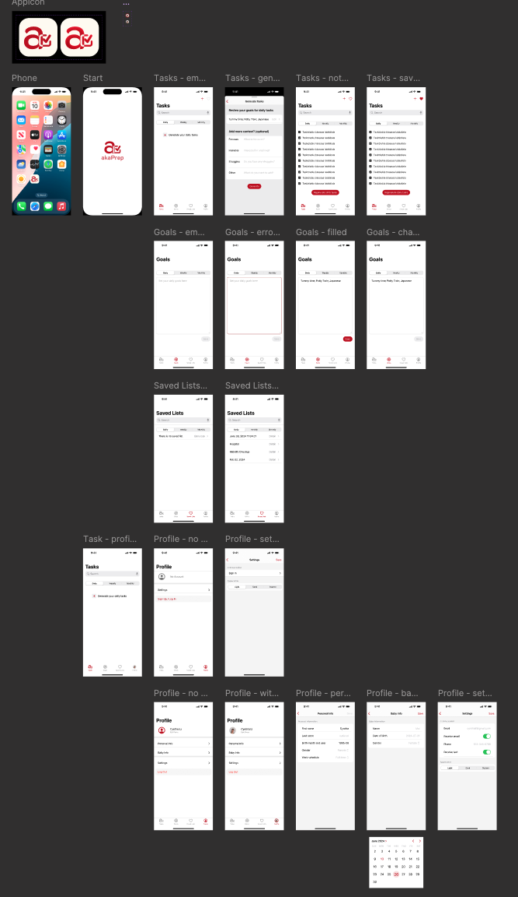

New parents face a sprawling, emotionally charged problem space: sleep deprivation, information overload, shifting routines, and constant decision fatigue. When I started exploring this space, there was no single well-defined problem to solve, only a tangle of anxieties, fragmented workarounds, and strong opinions from every direction. This case study walks through how I moved from that ambiguity to a shipped iOS app by applying structured problem framing, rigorous feature prioritization, and deliberate decisions about where AI belongs in the workflow and where it does not.

# Product Vision

Build the simplest AI productivity assistant for parents: a single surface to generate, edit, and execute parenting workflows that save time, reduce worry, and connect parents to trusted advice.

### Strategic Objectives (12 Months)

These objectives were set to create accountability and to provide clear thresholds for deciding whether to invest further or pivot:

* Reach 50,000 installs and 10,000 monthly active users within 12 months of launch.
* Achieve 30% 7-day retention and 15% 30-day retention for the MVP cohort.
* Drive a 40% task completion rate for AI-generated task lists within 14 days of activation.
* Validate willingness to pay by reaching 3% conversion to a premium tier within the first 6 months.

### Success Metrics (North Star and Supporting Indicators)

The North Star metric is **DAU × Task Completion Rate**, a composite that captures both reach and depth of engagement. A product that attracts daily users but fails to drive task completion is not delivering value; a product with high completion but low daily usage has a retention problem. Multiplying the two forces the team to optimize for both simultaneously.

Supporting metrics are organized by funnel stage:

* **Acquisition:** Total installs, cost per install, and organic acquisition percentage. These metrics determine whether growth channels are sustainable.
* **Activation:** Time to first task completion and the percentage of users who complete a generated task list within 48 hours. Activation is the leading indicator of whether the product delivers value fast enough.
* **Engagement:** DAU/MAU ratio, average tasks created per user, and weekly sessions. These track whether usage deepens over time.
* **Retention:** 7-day and 30-day retention rates. These are the lagging indicators that determine whether the product has staying power.
* **Monetization:** Conversion rate to the paid tier, lifetime value, and average revenue per user. These are tracked from day one even though monetization is deferred to v2.
* **Trust and Quality:** Net Promoter Score, percentage of App Store reviews marked "helpful," and average review rating. For a parenting product, trust erosion is an existential risk, so these signals receive dedicated monitoring.

### How the Problem Emerged, and Why It Was Not Obvious

The problem I ultimately chose to solve was not the one I started with. I began with an open-ended question: *Where do new parents lose the most time and energy, and why do existing tools fail them?*

Through 15+ in-depth user interviews and shadowing sessions with parents of children aged 0 to 3, I surfaced a long list of pain points: sleep anxiety, feeding confusion, milestone tracking guilt, partner coordination breakdowns, and general overwhelm. For detailed findings, see [Navigating Parenthood: Product Preferences and Parental Challenges](https://cynthialmy.github.io/2024-01-03-new-parents/).

Three signals narrowed my focus:

1. **Frequency and universality.** Daily planning friction appeared in every single interview, regardless of family structure, income, or parenting philosophy. Sleep tracking and milestone anxiety were intense but episodic.
2. **Existing solution gap.** Parents were cobbling together Notes apps, shared Google Docs, and group chats to coordinate daily tasks. No dedicated tool addressed the logistical coordination layer effectively.
3. **Actionability.** Mental load and emotional support are real problems, but they are difficult to validate with an MVP. Daily task planning, by contrast, has clear input-output loops that can be measured immediately.

**What I explicitly decided not to solve in v1:**

- **Sleep tracking.** Huckleberry already owns this space with expert-backed features. Competing here would require clinical credibility I did not have.
- **Emotional support chat.** Breda covers this with AI-generated scripts. Replicating a chatbot without a differentiated insight would be a commodity play.
- **Community and social features.** Multiple interviewees mentioned wanting peer connection, but community products require critical mass and moderation infrastructure that would distract from validating core utility.

This narrowing process was the most important product decision I made. By ruling out adjacent-but-tempting problem spaces, I was able to focus engineering effort on the one area where AI could deliver immediate, measurable value: reducing the daily planning burden.

## User Personas

I built three personas grounded in recurring interview archetypes, each representing a distinct constraint profile:

* **New Parent Nora (Primary):** A time-scarce, tech-comfortable first-time parent. Nora's core frustration is the cognitive overhead of deciding what to do each day. She does not lack parenting knowledge; she lacks a system to operationalize it.
* **Working Mom Maya:** Maya juggles a demanding job with parenting. She needs fast, reliable routines she can hand off to a partner or caregiver without lengthy explanation. Speed and shareability matter more than depth.
* **Stay-at-Home Dad Dave:** Dave has time but craves structure and variety. He wants activity suggestions that go beyond the same playground rotation and adapt to his child's developmental stage.

The common thread across all three personas was not "I need more information" but rather "I need less friction between knowing what to do and actually doing it."

## Core Value Proposition

Deliver immediate time savings and reduced anxiety by generating actionable, personalized task lists tailored to each family's schedule, constraints, and preferences, eliminating the planning step that consumes 20 to 30 minutes of a parent's morning.

## Product Strategy and Prioritization

### Problem Hypothesis

The central hypothesis driving this product is: if new parents can generate a personalized daily task plan in under one minute, then their perceived mental load will decrease and their task completion rate will increase, because planning friction is removed at the exact moment of need. This hypothesis is deliberately narrow. It does not claim to solve the broader mental health challenges of parenting, only the specific bottleneck of daily planning overhead.

### Feature Prioritization Framework (RICE)

I used a lightweight RICE model to rank candidate features for v1. The scores are relative and designed for ordering decisions, not absolute precision. More importantly, the value of this exercise was in the conversations it forced about tradeoffs, not in the numbers themselves.

| Feature | Reach | Impact | Confidence | Effort | RICE Score | Decision |
| --- | --- | --- | --- | --- | --- | --- |
| AI Task List Generator | 5 | 5 | 4 | 2 | 50 | Must-have |
| Meal Planner + Grocery | 4 | 4 | 3 | 3 | 16 | Should-have |
| Gentle Parenting Scripts | 3 | 4 | 3 | 3 | 12 | Should-have |
| Task Activation | 3 | 3 | 3 | 2 | 13.5 | Should-have |
| Community Features | 2 | 2 | 2 | 5 | 1.6 | Defer |

**Key tradeoff decisions embedded in this table:**

- **Community Features scored lowest despite strong qualitative demand.** Several interviewees asked for parent forums and peer support. I deferred this because community features require critical mass to deliver value, and investing in moderation and safety infrastructure before validating core utility would have been premature. This was a "right idea, wrong timing" call.
- **Gentle Parenting Scripts scored lower than Meal Planner, but I kept both.** The scripts served a distinct emotional need that meal planning did not address, and they were low-effort to implement because they relied on the same LLM infrastructure as the task generator. Bundling them created a perception of breadth without proportional engineering cost.
- **Task Activation was a "should-have" rather than a "must-have" despite being essential to the completion loop.** I made this call because a basic version (tap to mark complete) could ship fast, while the full activation flow (convert saved lists into active checklists) could iterate post-launch.

### Quantitative Reasoning for Targets

I set activation and retention targets by working backward from the 10k MAU objective, rather than picking aspirational numbers.

**MAU = installs × activation rate × 30-day retention**

Example: 50k installs × 40% activation × 50% 30-day retention = 10k MAU

This arithmetic revealed that activation, not installs, was the leading lever. Even doubling installs would not hit the target if activation remained below 30%. This insight directly shaped two v1 decisions: I prioritized onboarding speed over onboarding depth, and I made first-task completion the primary activation metric rather than account creation. The distinction matters because many productivity apps count sign-up as activation, which inflates early numbers but masks whether users experienced core value.

## MVP Scope (v1)

The v1 scope was deliberately narrow. I optimized for the fastest path to validating whether AI-generated task lists deliver enough perceived value to drive repeat usage, and cut everything that did not directly serve that question.

**What shipped:**

1. **AI Task List Generator** (core loop): Parents input child age(s), day type (workday or weekend), dietary constraints, and time availability. The system generates a prioritized task list of 3 to 8 items with estimated durations and quick actions. This is the feature the entire product thesis depends on.
2. **Meal Planner and Grocery List**: Generates a 7-day meal plan and a categorized shopping list with basic pantry toggles. This feature extends the core value proposition into a high-frequency adjacent use case.
3. **Gentle Parenting Script Generator**: Produces short, editable scripts for common parenting scenarios such as meltdowns, boundary-setting, and positive reinforcement. Built on the same LLM infrastructure as the task generator, keeping marginal engineering cost low.
4. **Inline Editing and Activation**: Users can modify generated lists and convert saved lists into active checklists. This bridges the gap between AI output and real-world execution.
5. **Basic Analytics and Tracking**: Instruments task completion, time to complete, and engagement signals needed to run experiments and measure activation.
6. **Onboarding and Activation Flow**: A fast onboarding sequence that captures household details and preferences to improve AI relevance from the first interaction.

**What I explicitly cut, and why:**

* **Device integrations (smart home, calendar sync):** High engineering effort with uncertain adoption. Calendar sync was the most requested integration, but I deferred it to avoid coupling our release timeline to third-party API complexity.
* **Payments and monetization:** Launching free removed a conversion barrier that would have muddied activation data. I needed to know whether the core loop worked before introducing pricing friction.
* **Community features:** Deferred to v2. Building community before establishing core product-market fit would have split attention and introduced moderation risk without a clear payoff.

## Differentiation vs Competitors

See [Comparing akaTask with Breda and Huckleberry](#comparing-aka-task-with-breda-and-huckleberry) in the [Market Research](#market-research) section for a detailed breakdown.

The differentiation strategy was not about building more features. It was about occupying a distinct position in the workflow that competitors had left unaddressed:

* **vs Breda:** Breda focuses on emotional support through AI-generated parenting scripts and chat. akaTask integrates logistical tasks (meal planning, grocery lists, daily scheduling) with similar script capabilities, creating a productivity-first assistant rather than a conversational support tool. The key tradeoff: I chose breadth of daily utility over depth of emotional engagement.
* **vs Huckleberry:** Huckleberry specializes deeply in sleep tracking with expert-backed recommendations. akaTask intentionally avoids competing on clinical depth and instead addresses the broader daily planning problem that sleep tracking does not solve. Competing with Huckleberry on sleep would have required clinical credibility and expert partnerships that were outside the scope of our resources.

## Product Features (Detailed Specs)

Each feature below includes acceptance criteria that I defined before development began. These criteria served as the contract between product and engineering: they prevented scope creep and gave us a clear threshold for what "done" meant.

### 1) AI Task List Generator

* **Inputs:** Child age(s), household constraints (time and dietary), current mood, day type (workday or weekend), and selected goals (sleep, screen-time reduction, education focus).
* **Outputs:** A prioritized list of 3 to 8 tasks with estimated durations, a brief rationale for each suggestion, and optional quick links (add to calendar, share with partner).
* **Acceptance criteria:** 70% of pilot test users rate generated lists as "helpful" or "very helpful." This threshold was set based on comparable benchmarks from productivity app pilots where below 65% satisfaction correlated with poor retention.

### 2) Meal Planner and Grocery List

* One-click generation of a weekly meal plan and an auto-categorized grocery list. Pantry-awareness was deferred to v2 to avoid dependency on manual inventory input.
* Export to a shareable checklist and calendar reminders.
* **Acceptance criteria:** 60% of users use the grocery export feature within their first three sessions. This measures whether the feature delivers enough standalone value to drive adoption beyond the core task generator.

### 3) Gentle Parenting Scripts

* Structured templates tuned by child age and situation, with fully editable output so parents can adapt language to their family's tone.
* **Acceptance criteria:** More than 60% of pilot users report that the scripts improved their confidence handling difficult parenting moments. This is a self-reported metric. I chose it over usage frequency because script quality matters more than volume.

### 4) Analytics and Instrumentation

* **Core events:** `generate_task_list`, `activate_list`, `complete_task`, `edit_task`, `export_grocery`, `script_use`.
* **Context captured:** child age, day type, time of day, source of activation.
* I instrumented these events before any feature code shipped. Without analytics infrastructure in place from day one, we would have been flying blind on activation and retention, the two metrics the entire product thesis depends on.

## AI as a System: Design Decisions, Trust, and Validation

AI in akaTask is not the product. It is the engine that reduces a specific friction: the time and cognitive effort parents spend planning each day. Framing AI this way shaped every design decision.

**Where AI fits naturally into the workflow:**

The LLM generates task lists, meal plans, and parenting scripts based on structured prompt templates combined with lightweight retrieval of user preferences and recent task history. The AI operates at the moment of need, when a parent opens the app and needs a plan, rather than running continuously in the background. This keeps costs predictable and latency perceptible only at generation time.

**How I handled trust and risk:**

Parenting is a domain where bad advice carries real consequences. I implemented three layers of guardrails:

1. **Domain restriction:** The system prompt explicitly constrains outputs to safe domains: task suggestions, meal ideas, and behavioral scripts. It does not generate medical advice, dosage information, or legal guidance. If a user query touches these areas, the system returns a "consult your pediatrician" response with relevant resource links.
2. **Human-in-the-loop editing:** Every AI-generated output is editable before activation. Parents review and modify task lists rather than blindly executing them. This design choice reflects the principle that AI should augment parental judgment, not replace it.
3. **Conservative system prompts:** I tuned prompts to err on the side of cautious, well-established recommendations rather than novel or trending parenting advice. This reduces the hallucination surface area and builds trust through consistency.

**How AI changed the process, not just the output:**

Without AI, the app would be a manual task manager, a crowded category with low switching costs. AI transforms the value proposition from "organize your tasks" to "generate your plan in 30 seconds and then refine it." This shifts the user's role from planner to editor, which is a fundamentally different interaction model that reduces time-to-value from minutes to seconds.

**Privacy by design:**

The system stores minimal personally identifiable information. User preferences are kept in structured form (child age ranges, dietary flags) rather than free-text profiles. The app is designed to be GDPR and CCPA compliant, with clear data usage disclosures during onboarding and a data export and account deletion feature included in v1.

## Experiments and Validation Plan

I designed four experiments for the post-launch phase, each targeting a specific uncertainty in the product thesis. Every experiment has a single primary metric to prevent post-hoc rationalization.

1. **Onboarding depth test:** Compare a short onboarding flow (3 questions) against a detailed one (8+ preference inputs). Primary metric: activation rate, defined as first task completion within 48 hours. The hypothesis is that shorter onboarding reduces drop-off even if AI relevance is slightly lower, because getting to value faster outweighs personalization accuracy at this stage.
2. **Task list length test:** Compare 3-item lists against 6-item lists. Primary metric: completion rate per list. Shorter lists may feel more achievable for sleep-deprived parents, but longer lists may deliver more perceived value.
3. **Script prompting UI test:** Compare inline script prompts (embedded in the task flow) against a separate chat-style interface. Primary metric: script adoption rate and session duration. This test determines whether scripts belong in the primary workflow or deserve a dedicated surface.
4. **Grocery export CTA placement:** Compare top-of-page placement against inline placement within the meal plan. Primary metric: export rate. This is a smaller experiment, but grocery export is the strongest indicator of meal planner utility.

## Metrics and Targets (MVP)

Each target below is anchored to the backward math from strategic objectives, not to industry averages or aspirational guesses.

* **Activation:** 40% of users complete their first AI-generated list within 48 hours of sign-up. This is the single most important metric for v1 because it validates whether the core loop delivers perceived value fast enough to overcome initial skepticism.
* **Engagement:** DAU/MAU ratio of 25% within the first 30 days. This threshold indicates that the app is becoming part of a daily or near-daily routine rather than a one-time novelty.
* **Retention:** 30% at 7 days and 15% at 30 days. These targets are conservative relative to top-tier consumer apps but realistic for a new entrant without brand recognition or paid acquisition at scale.
* **Task completion rate:** 40% average per generated list. If users consistently complete fewer than 40% of suggested tasks, the AI output is likely misaligned with real needs: either too ambitious, too generic, or too disconnected from context.

## Go-to-Market and Growth

The go-to-market strategy prioritized low-cost, high-trust channels over paid acquisition. For a parenting product, trust is a prerequisite for adoption. Parents do not install apps from ads; they install apps recommended by people they trust.

* **Initial channels:** Parenting newsletters and micro-influencers (parent bloggers and podcasters) were chosen because they reach an already-engaged audience at a fraction of the cost of paid social. App Store optimization targeted the intersection of "parenting" and "productivity" keywords, a positioning niche with lower competition than pure parenting apps.
* **Partnerships:** Pediatric clinic flyer distribution and in-store QR codes at baby retail stores were selected because they reach parents at the physical moments when planning stress is highest: waiting rooms and shopping trips.
* **Virality mechanics:** Partner sync (share a task list with a co-parent) and referral rewards (one free month of premium for each converted referral) were designed to leverage the app's natural two-person use case. Most parenting apps are single-user tools; making sharing a first-class feature creates organic distribution.

## Monetization Hypotheses (Post-MVP)

I deliberately deferred monetization to v2. Introducing a paywall before validating core value would have muddied the most important signal: do parents return because the product is useful, or because they already paid?

* **Premium subscription ($4.99/month):** Unlocks advanced personalization including multi-child profiles, pantry sync for meal planning, calendar integrations, and prioritized AI generation. This tier targets the subset of power users who use the app daily and want deeper customization.
* **Retail partnerships:** Affiliate revenue from recommended items and in-store demo referrals. This revenue stream requires scale to be meaningful, so it is positioned as a v3+ opportunity rather than a near-term focus.

## Compliance and Privacy

Parenting products operate in a trust-sensitive domain. A single data breach or privacy misstep would be existential for a young product without brand equity.

* No sensitive medical information is stored. When health-adjacent data is collected (such as allergies for meal planning), it is stored in encrypted structured fields with explicit user consent at the point of collection.
* A data retention policy, data export feature, and account deletion flow are all included in v1, not deferred. I made this decision because privacy features are harder to retrofit than to build from the start, and because GDPR and CCPA compliance is a baseline expectation, not a differentiator.

## Risks and Mitigations

I organized risks by severity of impact rather than likelihood, because in a zero-to-one product the highest-impact risks are the ones that kill momentum before you can iterate.

* **Risk: Low retention because AI output becomes predictable.**
  Once parents see similar task lists repeatedly, the perceived value drops. This is the biggest threat to the product thesis.
  * **Mitigation:** I built habit-forming loops (daily checklists with reflection prompts and contextual push notifications) to create recurring engagement beyond task generation. I also designed the system to incorporate variety signals (time of year, recent completion patterns, child developmental milestones) to reduce output staleness over time.

* **Risk: AI hallucinations or poor advice that undermines trust.**
  In a parenting context, even one piece of bad advice (an unsafe food recommendation or an inappropriate behavioral script) can cause lasting reputational damage.
  * **Mitigation:** I restricted generative outputs to domains where errors have low real-world consequence: task sequencing, meal ideas from approved ingredient lists, and behavioral scripts based on published gentle parenting frameworks. I added conservative system prompts that instruct the model to decline medical, dosage, and safety-critical queries. All AI outputs are editable before activation, keeping the parent in a supervisory role.

* **Risk: Privacy backlash from parents sharing family data.**
  Parents are protective of children's information. Even the perception of data misuse could trigger negative press or App Store reviews.
  * **Mitigation:** I adopted a minimal data collection approach from the start. Onboarding captures structured preference data (age ranges, dietary flags) rather than free-text profiles. Data usage is explained in plain language during onboarding, with clear opt-in rather than opt-out design. The v1 privacy architecture was reviewed against GDPR and CCPA requirements before any user data was collected.

* **Risk: Scope creep from user-requested features that dilute focus.**
  Beta testers asked for calendar sync, partner chat, sleep tracking, and community forums, all reasonable requests that would have expanded the product surface area beyond what a small team could maintain.
  * **Mitigation:** I maintained a strict "validate the core loop first" policy. Every feature request was evaluated against a single question: does this help us learn whether AI-generated task lists drive repeat usage? If the answer was no, the request went into a backlog with a clear rationale for deferral.

## Launch Checklist

Before launch, I ensured four categories of readiness that would be difficult to add retroactively:

* **Analytics infrastructure:** Core events and dashboards were instrumented and tested before the first external user touched the product. Without this, every day of early usage would have been wasted learning opportunity.
* **Beta validation:** 200 active parents participated in a closed beta. Their qualitative feedback directly informed two significant design changes: simplifying the onboarding flow from 8 steps to 4, and increasing the default task list size from 3 to 5 items based on completion rate data.
* **App Store optimization:** Metadata and assets were optimized for the intersection of parenting and productivity keywords, targeting a lower-competition niche than either category alone.
* **Support readiness:** Basic FAQs, a data privacy page, and a feedback submission flow were in place to handle early user questions without requiring manual support responses for every inquiry.

## Post-Launch Measurement and Iteration

The post-launch operating rhythm was designed to match the speed of learning to the speed of shipping:

* **Weekly:** Dashboard review of activation and completion metrics, with automated alerts for significant drops in 7-day retention or task completion rate.
* **Bi-weekly:** Ship cycles focused on quick fixes and prioritized A/B experiments. Each cycle had a single stated learning goal to prevent unfocused iteration.
* **Monthly:** Growth review evaluating cost per install, retention cohorts, and engagement trends against targets. This cadence provided enough data to make meaningful strategic adjustments without over-reacting to weekly noise.

---

# Appendix

## Market Research

### Market Trends

Three macro trends shaped the opportunity space and informed the positioning strategy:

1. **Growing adoption of technology in parenting workflows:**
   Parents are increasingly using apps to manage day-to-day parenting logistics. The shift from passive information consumption (reading parenting blogs) to active workflow automation (generating meal plans, scheduling activities) signals demand for tools that do work rather than provide advice. AI and machine learning are accelerating this transition by enabling personalization at a scale that manual content curation cannot match.

2. **Demand for integrated, multi-function solutions:**
   Parents report fatigue from juggling multiple single-purpose apps (one for sleep, one for feeding, one for activities). There is a growing preference for consolidated platforms that address several aspects of parenting within a single interface. This trend favors products that can deliver breadth without sacrificing usability.

3. **Health, wellness, and parental well-being as product categories:**
   Apps that address both the child's needs and the parent's emotional well-being (stress management, gentle parenting techniques, mindfulness) are gaining traction. This signals that parenting products should serve the whole family system, not just the child.

### Comparing akaTask with Breda and Huckleberry

During market research, I conducted a structured comparison of akaTask against two leading parenting apps: Breda and Huckleberry. The goal was not to identify features to copy, but to find the whitespace: the unmet need that neither competitor adequately addressed.

[Breda](https://www.bredaapp.com/) is an AI-powered parenting assistant that excels at emotional support. It offers gentle parenting scripts, storytime generators, and guidance for handling parenting challenges through a ChatGPT-style interface. Breda's strength lies in reducing mental load through conversational AI. However, its weakness is that it focuses almost entirely on the emotional dimension of parenting and does not address logistical daily tasks like meal planning, grocery coordination, or daily scheduling.

- **Breda's strengths:** Strong emotional and mental health support through conversational AI; intuitive interface for quick parenting guidance.
- **Breda's gap:** Limited integration of practical daily tasks such as meal planning, grocery lists, and structured scheduling.

[Huckleberry](https://huckleberrycare.com/) specializes in sleep tracking with personalized, expert-backed recommendations. It provides detailed schedule tracking and developmental milestone insights. Huckleberry's depth in the sleep domain is a significant competitive advantage, but its narrow focus means parents must use separate tools for everything else. akaTask chose not to compete on sleep tracking depth. Doing so would require clinical partnerships and expert credibility that Huckleberry has spent years building.

- **Huckleberry's strengths:** Deep expertise in sleep science with personalized, clinician-backed advice.
- **Huckleberry's gap:** Narrow problem scope that does not extend to daily planning, meal preparation, or behavioral guidance.

**The strategic insight from this analysis:** Both competitors own vertical slices of the parenting experience (emotional support and sleep, respectively). Neither addresses the horizontal coordination layer, the daily logistics of running a household with young children. This is the positioning akaTask was built to occupy.

## Ideation

akaTask was designed as a dynamic task management platform that adapts to the unique schedules and constraints of new parents. Rather than building another generic to-do app or another parenting advice chatbot, I focused on the intersection: AI-generated task suggestions grounded in pediatric recommendations, combined with editable task lists and flexible daily, weekly, and ad hoc planning views.

### Key Features and Prioritization Rationale

I prioritized features based on three criteria: potential to deliver immediate measurable value, ability to reduce daily stress, and differentiation from existing competitors. Each feature was evaluated against these criteria before earning a place in the v1 scope.

| **Feature**                       | **Description**                                                                                                                                                                                                                                            | **Why Prioritize**                                                                                                                                                                                                                                                                                                                  |
| --------------------------------- | ---------------------------------------------------------------------------------------------------------------------------------------------------------------------------------------------------------------------------------------------------------- | ----------------------------------------------------------------------------------------------------------------------------------------------------------------------------------------------------------------------------------------------------------------------------------------------------------------------------------- |
| **1. AI-Powered Task Generation** | Generates personalized task lists based on user input and preferences, considering the unique needs of new parents. It adapts to changing priorities and schedules, ensuring important tasks like feeding times and medical appointments are never missed. | **User Demand**: Parents consistently expressed the need for personalized, adaptive planning tools.  **Value Proposition**: High potential to reduce parental stress by automating task creation.  **Competitive Advantage**: Differentiates akaTask from competitors by offering a smart, responsive task generation system. |
| **2. Customizable Task Lists**    | Allows parents to create, edit, and delete tasks easily, such as tracking baby milestones, organizing family activities, and managing household chores. Supports inline editing for quick adjustments, making it easy to update tasks on the go.           | **Flexibility**: Parents need the ability to adjust tasks to suit their changing schedules and priorities.  **User Control**: Empowers users by allowing them to tailor the app to their specific needs.                                                                                                                         |
| **3. Flexible Task Planning**     | Offers daily, weekly, and ad-hoc task views to cater to different planning styles, helping parents stay on top of short-term and long-term responsibilities. Enables task completion toggles and swipe-to-delete functionality for easy task management.   | **Varied Planning Styles**: Recognizes the diversity in how parents plan their days and weeks.  **Holistic Management**: Provides a comprehensive view of tasks, aiding both short-term and long-term planning.                                                                                                                  |
| **4. Task Activation**            | Parents can activate saved task lists, converting them into active tasks for immediate action. Automatically updates the status of liked lists, maintaining user preferences and ensuring that important tasks are highlighted.                            | **Immediate Action**: Simplifies the transition from planning to execution, ensuring tasks are acted upon.  **User Experience**: Enhances the user experience by making task management seamless and intuitive.                                                                                                                  |

### Summary of Prioritization

| **Feature**                    | **User Demand** | **Value Proposition**    | **Competitive Advantage**   | **Metrics for Success**                 |
| ------------------------------ | --------------- | ------------------------ | --------------------------- | --------------------------------------- |
| **AI-Powered Task Generation** | High            | Reduces stress           | Differentiates akaTask      | DAU, Task Completion Rates              |
| **Customizable Task Lists**    | High            | Flexibility              | Empowers users              | User Satisfaction, Retention Rates      |
| **Flexible Task Planning**     | Medium          | Aids holistic management | Comprehensive view of tasks | Planning Efficiency, User Feedback      |
| **Task Activation**            | Medium          | Simplifies execution     | Enhances UX                 | Task Activation Rates, Completion Speed |

By integrating meal planning, activity generation, and gentle parenting scripts into a single task-oriented interface, akaTask addresses the diverse and recurring needs of parents without requiring them to switch between multiple apps. The market research confirmed demand for this type of consolidated solution, and the competitive analysis showed that neither Breda nor Huckleberry occupied this positioning.

## Wireframing and Design

The design process followed a deliberate sequence: information architecture first, interaction design second, visual polish last. This ordering ensured that the product's structure was validated before investing in aesthetics.

I started by developing a comprehensive sitemap that mapped every feature to a screen and every screen to a user goal. This sitemap served as the structural contract between product vision and implementation. It prevented feature creep by making the boundaries of v1 visible to everyone involved.

From the sitemap, I created low-fidelity wireframes to validate the core user journey: open app, generate task list, review and edit, activate for the day. Testing this flow with five parents revealed that users wanted to reach their first generated list within two taps of launching the app. This finding directly shaped the onboarding and home screen layout.

I developed an initial design system and color palette informed by user study feedback. The palette was chosen to feel calming rather than playful. Parents reported that overly bright, child-oriented designs felt patronizing. The visual language needed to communicate "capable adult tool" rather than "baby product."

After completing the first prototype, I conducted follow-up interviews that surfaced a critical insight: the initial design had too many options visible on each screen. Parents with limited attention spans (often operating one-handed while holding a child) needed fewer choices per screen, not more. I simplified the interface by reducing visible actions per view and relying on progressive disclosure for secondary features.

I built the UI in SwiftUI to enable rapid iteration. SwiftUI's declarative syntax allowed me to test design changes within hours rather than days, which was critical for incorporating user feedback at the pace of weekly interview cycles. The final design reflects a focus on single-hand usability, minimal cognitive load per screen, and fast time-to-value from launch.

## Retrospective

Looking back, three decisions shaped the outcome most:

**What worked well:**
- **Narrow problem scoping.** Choosing daily task planning over the broader "mental load" problem let us validate the core loop fast. The RICE framework enforced discipline about what to defer, which was more valuable than what it told us to build.
- **AI as infrastructure, not interface.** Treating the LLM as a generation engine behind a task management UI, rather than building a chatbot, avoided the trust and engagement challenges that conversational parenting AI products face.
- **Analytics-first development.** Instrumenting events before shipping features meant we had actionable data from day one. This is a practice I will carry into every future product.

**What I would change:**
- **Test pricing earlier.** I deferred monetization to v2 to avoid muddying activation signals, but in retrospect I could have run a willingness-to-pay survey during beta without adding a paywall. Understanding price sensitivity earlier would have shaped the feature roadmap differently.
- **Tighter beta scope.** The 200-person beta was valuable, but a smaller cohort of 30 to 50 deeply engaged parents with weekly check-ins would have generated richer qualitative signal faster.
- **More aggressive cuts to v1 scope.** Even with RICE prioritization, v1 included meal planning and parenting scripts alongside the core task generator. In hindsight, shipping only the task generator and measuring retention in isolation would have produced a cleaner signal about whether the core hypothesis held.

The single biggest lesson: in a zero-to-one product, the most impactful decisions are about what you choose not to build.

## What Comes Next

akaTask is in active development. The roadmap is driven by what the data reveals about how parents use the core loop, not by feature requests alone. Near-term priorities include calendar integration (the most-requested feature during beta), multi-child profile support, and the first monetization experiment via a premium tier.

The broader strategic question the product must answer next: does AI-generated daily planning create enough sustained value to support a subscription business, or does the product need to expand into adjacent workflows (partner coordination, developmental tracking) to reach retention thresholds that justify continued investment?

## Resources

The app is live on the App Store: [akaTask on the App Store](https://apps.apple.com/us/app/akatask/id6566193664?ign-itscg=30200&ign-itsct=apps_box_link&mttnsubad=6566193664&platform=iphone).

For the user research that informed this product, see [Navigating Parenthood: Product Preferences and Parental Challenges](https://cynthialmy.github.io/2024-01-03-new-parents/).

### Current Release
This initial release ships a focused **task list generator** designed to reduce daily planning time. The scope is intentionally narrow to validate the core hypothesis before expanding.

### Planned Additions
The roadmap focuses on deepening the core workflow based on usage data:
- **Customizable Task Categories:** Organize tasks by type (daily, weekly, or ad hoc) to match different planning styles.
- **Personalized Reminders and Notifications:** Context-aware notifications that are timed to when parents actually need them, not arbitrary daily alerts.
- **AI-Powered Recommendations:** Pattern-based suggestions that improve over time as the system learns household preferences and completion patterns.

### Feedback
If you try the app, feedback on three areas is especially valuable: onboarding speed, perceived task relevance, and whether the generated lists actually save time compared to manual planning.

