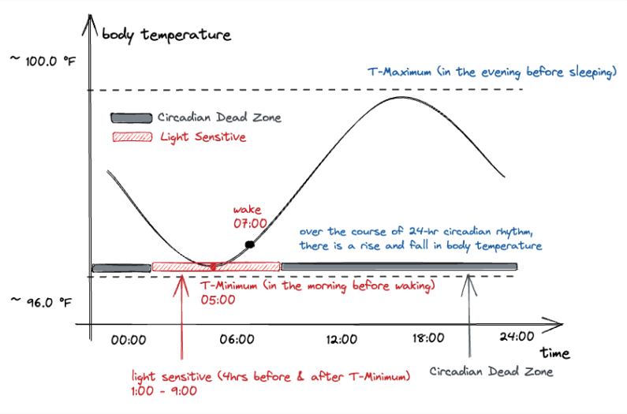
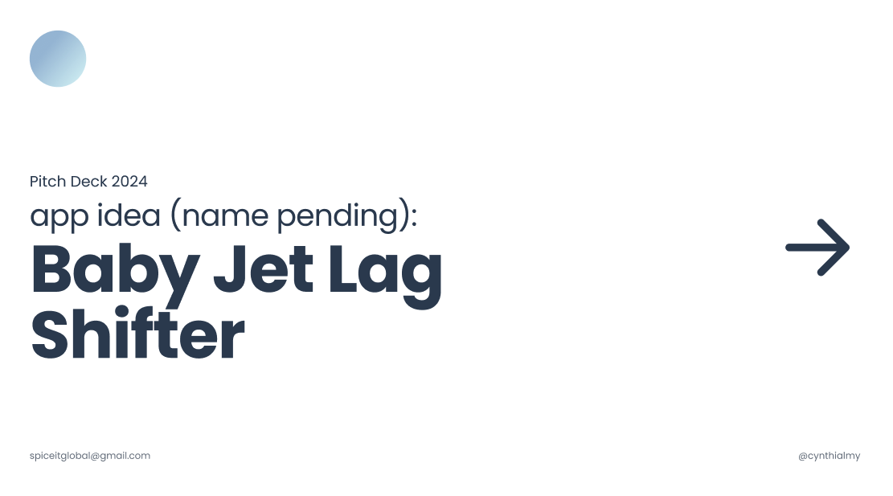

When my family faced a long-haul flight with a 3-month-old, I realized every piece of jet lag advice I could find was designed for solo business travelers. Nothing addressed the cascading failure that happens when a baby, a toddler, and two exhausted parents all lose their sleep anchors at once. A baby who cannot nap disrupts the toddler's bedtime, which wrecks both parents' sleep, which degrades everyone's ability to cope the next day. The recovery takes 3 to 5 days of a trip that might only last 10.

I saw a gap between well-established circadian science and tools families could actually use. The science exists. The consumer product does not.

---

## The Problem

Jet lag affects adults through fatigue, brain fog, and irritability. For infants and young children, the impact is disproportionately severe because their circadian systems are still maturing. Even a two-hour shift can trigger fussiness, feeding disruptions, nighttime wake-ups, and shorter naps. The compounding effect across a family means the first 3 to 5 days of a trip are often consumed by recovery rather than the trip itself.

Existing solutions (blog posts, YouTube videos, generic sleep apps) share a common flaw: they offer one-size-fits-all advice that ignores age-specific biology. A 3-month-old's circadian system responds to shifts differently than a 3-year-old's, and both respond differently than an adult's. No product on the market combines circadian science, age-constrained scheduling, and travel-direction logic into a single family plan.

### What I Scoped Out

Before building, I eliminated three directions that seemed obvious but were wrong for a v1:

**General sleep tracking.** Dozens of sleep trackers exist. Adding another one would not address the core problem: proactive circadian shifting before and during travel.

**Real-time biometric monitoring.** Wearable data could improve accuracy, but requiring hardware would exclude most parents and slow adoption. Self-reported schedules are the v1 input method.

**Clinical sleep therapy.** Positioning the product as a clinical tool would introduce regulatory complexity (FDA review, 6-12 months of delay) without proportional user benefit at the concept stage.

---

## Scientific Foundation

The algorithm is built on four principles from circadian research. My contribution was translating these into product rules, logic tables, and user-facing workflows.

### Temperature Minimum (t-min)

A person's lowest body temperature occurs roughly 90 to 120 minutes before habitual wake time. This marker, called the temperature minimum, is the single most important anchor for shifting the internal clock. All timing recommendations in the product derive from this value.

### Light Sensitivity Windows

Light exposure timing determines whether the circadian clock shifts earlier or later:

- Light **after** t-min advances the clock (shifts sleep earlier, useful for eastward travel).
- Light **before** t-min delays the clock (shifts sleep later, useful for westward travel).
- Light between roughly 10 AM and 4 PM falls in a "dead zone" with minimal phase-shifting effect.

These rules are embedded directly in the algorithm's timing recommendations.

### Gradual Shifts Over Sudden Changes

Research consistently shows that small daily adjustments (15 to 60 minutes depending on age) produce better outcomes than abrupt schedule changes. This is especially critical for children, whose developing circadian systems are more sensitive to disruption and whose caregivers have less margin for error.

### Secondary Zeitgebers

Meals, physical activity, and social interaction reinforce the primary light-driven shift. Including these cues in the plan increases adherence and accelerates adaptation.

---

## Product Vision

A mobile app that helps every member of a family transition smoothly into a new time zone through a personalized, science-backed daily plan. Instead of trial and error, parents receive specific, actionable guidance:

- "Tonight, move bedtime 30 minutes earlier."
- "Get outside for morning light between 8 and 9 AM."
- "Shift the first feeding by 15 minutes today."
- "Today's nap should start 20 minutes earlier than yesterday."

The design principle: turn complex circadian logic into calm, intuitive daily steps that require no scientific background to follow.

---

## Hypotheses

**Problem hypothesis.** If families shift sleep and light exposure gradually before travel, time-to-adjust on arrival decreases because circadian change is smoother and more compliant.

**Solution hypothesis.** If guidance is personalized by age, direction, and t-min, plan adherence increases because the steps are smaller and more realistic.

### Quantitative Logic

The daily shift plan derives from two calculations:

**Total shift needed** = time zones crossed × 60 minutes

**Daily shift** = total shift needed / preparation days, capped by age limits

Age caps prevent unrealistic schedules:

| Age Group | Daily Shift Cap (Either Direction) |
| --------- | ---------------------------------- |
| Infant (0-12 months) | 10-20 minutes |
| Toddler (1-3 years) | 15-30 minutes |
| Child / Adult | 30-60 minutes |

These caps are derived from literature on circadian sensitivity by developmental stage. They keep the plan feasible while still moving the clock before arrival.

---

## Tradeoffs

| Decision | Options | Choice and Rationale |
| --- | --- | --- |
| Input method | Wearable biometrics vs. self-reported schedules | Self-reported. Wearables would improve accuracy by an estimated 10-15% but exclude most parents who lack compatible devices. Adoption speed over marginal precision in v1. |
| Regulatory posture | Clinical tool vs. planning/wellness tool | Planning tool. Clinical positioning requires FDA or equivalent review, adding 6-12 months with no clear user benefit at concept stage. |
| Scope | Pre-trip + in-transit + post-arrival vs. pre-trip focus | Pre-trip focus with lightweight arrival guidance. Dynamic rescheduling during travel introduces too many uncontrolled variables (delays, missed connections, infant mood). Validate the core algorithm first. |
| Personalization depth | Per-individual circadian modeling vs. age-group heuristics | Age-group heuristics. Individual modeling requires longitudinal data the app does not yet have. Literature-backed age caps are sufficient for v1. |

---

## Target Users

**Parents with infants (0-12 months).** Feeding and nap disruptions cascade into nighttime wake-ups. Need tiny, gradual adjustments (10-20 min/day) with caregiver-friendly reminders.

**Parents with toddlers (1-3 years).** Bedtime resistance and overtiredness after travel. Need small bedtime and wake shifts (15-30 min/day) plus nap guidance.

**Parents with older children (4-12 years).** Difficulty falling asleep at the right time in new zones. Need clear light exposure and meal timing schedules.

**Adults traveling solo.** Lost productivity in the first days after arrival. Need fast, efficient circadian optimization with minimal friction.

**Caregivers with multiple children.** The hardest use case: coordinating different age groups with conflicting shift limits into a unified family calendar.

---

## Core Algorithm

The engine processes six steps to generate a personalized plan:

**Step 1: Estimate t-min.** Calculated from average wake time minus 90-120 minutes.

**Step 2: Determine phase direction.** Eastward travel requires a phase advance (sleep earlier). Westward requires a phase delay (sleep later).

**Step 3: Assign daily shift by age.** Apply the age-capped daily shift values from the table above.

**Step 4: Generate sleep/wake timeline.** Apply shifts across available pre-departure days.

**Step 5: Layer supporting cues.** Light timing windows, meal timing shifts, feeding adjustments for infants, exercise/active play blocks, and nap adjustments.

**Step 6: Convert to narrative plan.** Parents receive human-friendly daily instructions rather than data tables.

The algorithm's inputs are structured (trip details, ages, schedules) and its outputs are low-stakes (suggestions the family can follow, adjust, or ignore). This structure makes it a strong candidate for automation. A wrong recommendation means a slightly off bedtime, not a safety incident.

---

## App Experience

### Customizable Sleep Plans

Parents enter travel details, children's schedules, nap frequency, and feeding times. The app produces a day-by-day adjustment plan leading up to the trip. Each day's plan builds on the previous day's shift, creating a smooth ramp toward the destination time zone.

### Guided Light Exposure

The app recommends morning light for eastward travel and evening light for westward travel, timed relative to each family member's estimated t-min. Notifications are brief and specific: "Time to step outside with your baby for 15 minutes of light exposure."

### Feeding and Meal Timing

For infants: 5-20 minute feeding shifts per day. For older children and adults: gradual breakfast, lunch, and dinner timing changes, with macronutrient suggestions (protein in the morning to promote alertness, carbohydrates in the evening to promote sleep).

### Nap and Quiet Time

Age-appropriate nap shifts prevent the nighttime disruption that happens when a child is overtired from a missed or mistimed nap.

### Progress Tracking

Parents see their family's progress toward destination alignment, which serves both as motivation and as a practical check on whether the plan is working.

### In-Flight Guidance

When to let the baby nap, how to handle screens, and sleep-friendly routines for the plane. This is lightweight guidance, not a full rescheduling engine. The pre-trip plan does the heavy lifting; in-flight guidance prevents parents from undoing progress.

---

## Non-Functional Requirements

**Clarity first.** No parent running on broken sleep has energy for confusing instructions. Every recommendation is one sentence or less.

**Feasible timing.** Shift amounts respect age-specific biological limits. The system never suggests a shift a child cannot realistically follow.

**Multi-child coordination.** The app handles families with children at different developmental stages, generating a unified plan without requiring parents to reconcile conflicts manually.

**Emotionally supportive tone.** Copy and notifications reduce parental stress rather than adding to it. The product feels like a calm guide, not a clinical tool.

---

## Success Metrics

Two questions structure the measurement framework: "Are families using the plan?" and "Is the plan actually reducing jet lag?"

### Leading Indicators

- Onboarding completion for families with 2+ profiles (target: above 70%)
- Percentage of daily steps marked completed during the pre-trip window (target: above 60%)
- Retention from first plan generation through 3 days post-arrival

### Outcome Indicators

- Self-reported adjustment time on arrival. Goal: reduce from the 3-5 day baseline to 1-2 days.
- Parent satisfaction compared to previous trips without a plan (post-trip survey, target NPS above 50).
- Reduction in nighttime wake-ups for children during the first 3 nights after arrival (self-reported, target: 40% fewer than unassisted baseline).

---

## Future Opportunities

Scoped out of v1 but representing the natural expansion path once the core algorithm is validated:

**Wearable integration.** Skin temperature and heart rate from consumer wearables would allow more precise t-min estimation instead of relying on self-reported wake times.

**Automatic itinerary import.** Parsing flight confirmation emails to auto-populate trip details reduces onboarding friction and improves data accuracy.

**Real-time circadian modeling.** As the app collects longitudinal data across trips, it could build per-user circadian models that improve recommendations over time.

**Family dashboard.** A single view showing each member's readiness-to-travel score, helping parents see progress at a glance and identify who needs extra support.

---

## Design Approach

Starting from a real, personal problem rather than a feature list. Translating peer-reviewed research into structured product logic (t-min estimation, age-constrained shift caps, phase-direction rules) that can be implemented as an algorithm. Making explicit tradeoffs between precision and accessibility, clinical positioning and consumer positioning, scope ambition and validation speed. Defining success through measurable user outcomes (days to adjustment, nighttime wake-up reduction) rather than engagement vanity metrics.

A product concept grounded in evidence, scoped for feasibility, built to reduce real suffering for families navigating international travel with young children.

## Links

View the pitch deck for the app concept: [Baby Jet Lag Shifter](https://www.figma.com/deck/xEzXhm4H1wuRNK2Vq6FpuD).

---

# Science Deep-Dive

This section provides the full scientific and algorithmic rationale for readers who want to understand the research behind the product logic.

### Temperature Minimum as a Circadian Anchor

The algorithm centers on each user's estimated temperature minimum (t-min): the lowest point in their 24-hour body temperature cycle and the key marker for determining when interventions will advance or delay the internal clock. For most people, t-min occurs 90-120 minutes before habitual wake time. This estimate is imperfect (individual variation exists), but it is well-supported by research and sufficient for a consumer planning tool. Wearable integration in future versions would narrow the estimation error.

### Light Sensitivity and the Dead Zone

The circadian system's response to light varies predictably across the 24-hour cycle. Light after t-min shifts the clock earlier; light before t-min shifts it later. The period between roughly 10 AM and 4 PM is a dead zone where light has minimal phase-shifting effect. The algorithm uses these windows to schedule light exposure recommendations that maximize effectiveness while staying practical for families (morning outdoor time is easier to schedule than precise 3 AM light avoidance).

### Inputs That Drive Personalization

| Input Category | Example Data | How It Affects the Plan |
| --- | --- | --- |
| Travel itinerary | Departure/arrival times, direction, zones crossed | Determines total circadian shift required |
| User profile | Age group, baseline wake/sleep patterns | Sets safe daily shift increments |
| Preparation window | Days until departure | Controls how gradually shifts occur |
| Family composition | Adults, children, toddlers, infants | Generates unique schedules per traveler |

### Meal and Activity Timing

| Direction | Meal Shift | Activity Timing |
| --- | --- | --- |
| Eastward | Earlier each day | Morning exercise |
| Westward | Later each day | Evening exercise |

These secondary zeitgebers reinforce the primary light-driven shift and improve overall plan adherence.

### Arrival Strategy

Once travelers land, the product delivers adaptive instructions: align meals to local time immediately, avoid light during the circadian dead zone, and seek or avoid bright light depending on the intended direction of shift. These real-time adjustments help stabilize into the new time zone faster.

### What the User Receives

Each family member gets a personalized plan with three components: daily sleep and wake shifts (gradual, age-appropriate), light exposure windows (optimized using their t-min), and meal and activity schedules (reinforcing the intended shift). The plan is presented as plain-language daily instructions, not data tables.

### References

- Huberman, A. (2021). Find Your Temperature Minimum to Defeat Jetlag, Shift Work, and Sleeplessness. [Podcast episode]. In Huberman Lab. Retrieved from [https://www.hubermanlab.com/episode/find-your-temperature-minimum-to-defeat-jetlag-shift-work-and-sleeplessness](https://www.hubermanlab.com/episode/find-your-temperature-minimum-to-defeat-jetlag-shift-work-and-sleeplessness)
