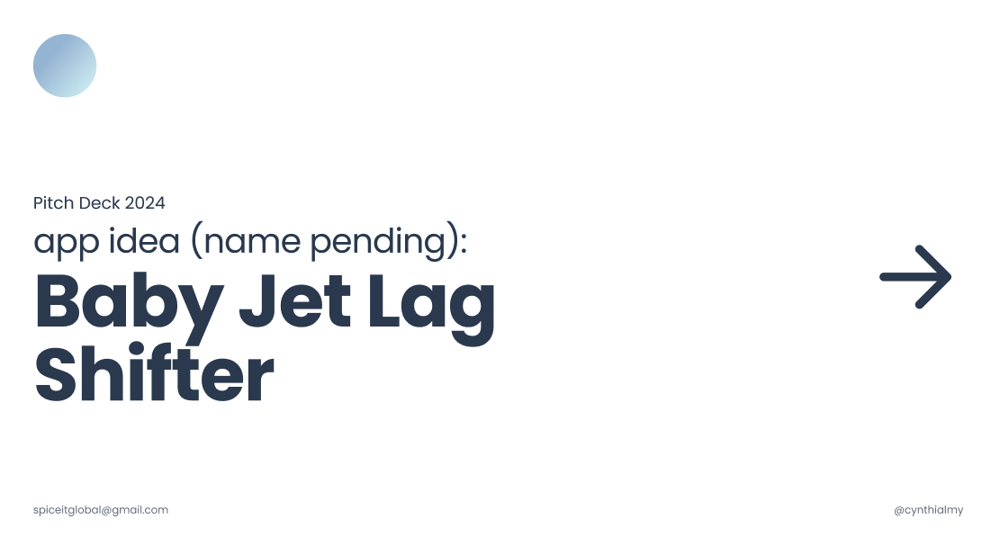

When my family faced a long-haul flight with a 3-month-old, I realized that every piece of jet lag advice I could find was designed for solo business travelers. Nothing addressed the cascading failure that happens when a baby, a toddler, and two exhausted parents all lose their sleep anchors at once. I saw a gap between well-established circadian science and tools that families could actually use, and I set out to close it.

## Where This Idea Began

The initial signal was personal, but the problem turned out to be structural. When I started researching, I found that:

- Parents reported 3 to 5 days of disrupted routines after crossing more than 4 time zones with young children.
- Existing solutions (blog posts, YouTube videos, generic sleep apps) offered one-size-fits-all advice that ignored age-specific biology.
- There was no product on the market that combined circadian science, age-constrained scheduling, and travel-direction logic into a single plan.

The question I set out to answer was clear: could I translate peer-reviewed circadian research into a personalized, day-by-day adjustment plan that works for every member of a family, including infants whose sleep systems are still developing?

---

## Why Jet Lag Hits Families Harder

Jet lag affects adults through fatigue, brain fog, irritability, and reduced productivity. For babies and children, the impact is more severe because their circadian systems are still maturing. Even a two-hour shift can trigger fussiness, difficulty feeding, nighttime wake-ups, shorter naps, and a cascading increase in stress for the entire household.

The result is that parents often lose the first 3 to 5 days of a trip to recovery rather than enjoyment. That is not just inconvenient; for families who travel infrequently, it can ruin the trip entirely.

### What I Decided Not to Solve

Before jumping to features, I deliberately scoped out several directions that seemed obvious but wrong:

* **General sleep tracking.** The market already has dozens of sleep trackers. Adding another one would not address the core problem of proactive circadian shifting.
* **Real-time biometric monitoring.** While wearable data could improve accuracy, requiring hardware would exclude most parents and slow adoption. I chose self-reported schedules as the v1 input method.
* **Medical or clinical sleep therapy.** Positioning the product as a clinical tool would introduce regulatory complexity without proportional user benefit at this stage.

This narrowing was essential. It focused the product on the one thing no existing tool does well: converting circadian science into age-appropriate, daily action steps that parents can follow without medical supervision.

### Core User Needs

* A clear, structured plan that prepares the family for time zone changes before departure.
* Personalized recommendations that adapt to each family member's age, schedule, travel direction, and circadian biology.
* Reduced confusion about when to sleep, eat, seek light, and exercise during the transition.

---

## Scientific Foundation and How I Translated It

Circadian science is well-established in research but poorly translated into consumer products. My role was to bridge that gap by distilling the literature into product rules, logic tables, and user-facing workflows. Here are the four principles that anchor the algorithm.

### **Temperature Minimum (t-min)**

A person's lowest body temperature point occurs roughly 90 to 120 minutes before their habitual wake time. This marker, called the temperature minimum, is the single most important anchor for shifting the internal clock. All timing recommendations in the product are derived from this value.

For the full scientific rationale, see the [Science Deep-Dive](#science-deep-dive) section.

### **Light Exposure Sensitivity**

* Light exposure **after** t-min shifts the circadian clock earlier (useful for eastward travel).
* Light exposure **before** t-min shifts the circadian clock later (useful for westward travel).
* Midday light (roughly 10 AM to 4 PM) falls in a "dead zone" where it has minimal phase-shifting effect.

### **Gradual Shifts Over Sudden Changes**

Research consistently shows that small daily adjustments (15 to 60 minutes depending on age) produce better outcomes than abrupt schedule changes. This principle is especially critical for children, whose developing circadian systems are more sensitive to disruption.

### **Meal Timing and Exercise as Secondary Cues**

Meals, physical activity, and social interaction act as secondary zeitgebers (time-givers) that reinforce the primary light-driven shift. Including these cues in the plan increases adherence and accelerates adaptation.

## Product Vision

The product is a mobile app that helps every member of a family, from infants to adults, transition smoothly into a new time zone through a personalized, science-backed daily plan.

Instead of trial and error, parents receive clear, specific guidance such as:

* "Tonight, move bedtime 30 minutes earlier."
* "Get outside for morning light between 8 and 9 AM."
* "Shift the first feeding by 15 minutes today."
* "Today's nap should start 20 minutes earlier than yesterday."

The key design principle is to turn complex circadian logic into calm, intuitive daily steps that require no scientific background to follow.

## Product Hypotheses and Quantitative Logic

### Problem Hypothesis

If families shift sleep and light exposure gradually before travel, then time-to-adjust on arrival decreases, because circadian change is smoother and more compliant.

### Solution Hypothesis

If guidance is personalized by age, direction, and t-min, then plan adherence increases, because the steps are smaller and more realistic.

### Quantitative Reasoning

The daily shift plan is derived from two inputs:

**Total shift needed** = time zones crossed * 60 minutes
**Daily shift** = total shift needed / preparation days, capped by age limits

Age caps avoid unrealistic schedules:
- Infant: 10 to 20 minutes per day
- Toddler: 15 to 30 minutes per day
- Child and adult: 30 to 60 minutes per day

This logic keeps the plan feasible while still moving the clock before arrival.

---

## Tradeoffs and Non-Goals

Every product decision involves tradeoffs. I want to make the ones I evaluated here explicit, because they shaped the entire product direction.

| Decision | Options Considered | Choice and Rationale |
| --- | --- | --- |
| Input method | Wearable biometrics vs. self-reported schedules | Self-reported schedules. Wearables would increase accuracy by an estimated 10 to 15 percent but would exclude most parents who do not own compatible devices. Adoption speed mattered more than marginal precision in v1. |
| Regulatory posture | Clinical sleep tool vs. planning and wellness tool | Planning tool. Positioning as a clinical product would require FDA or equivalent review, adding 6 to 12 months of delay with no clear user benefit at the concept stage. |
| Scope of adjustment | Pre-trip plus in-transit plus post-arrival vs. pre-trip only | Pre-trip focus with lightweight arrival guidance. Dynamic rescheduling during travel introduces too many uncontrolled variables (delays, missed connections, infant mood). Validating the core algorithm on pre-trip data first reduces risk. |
| Personalization depth | Per-individual circadian modeling vs. age-group heuristics | Age-group heuristics. Individual modeling requires longitudinal data the app does not yet have. Age-based caps (infant: 10 to 20 min/day, toddler: 15 to 30 min/day, adult: 30 to 60 min/day) are well-supported by literature and sufficient for a first release. |

These constraints protected usability, reduced regulatory risk, and allowed the core circadian logic to be validated before adding complexity.

---

## Target Users

| Segment | Core Pain Point | What They Need from the Product |
| --- | --- | --- |
| Parents with infants (0 to 12 months) | Feeding and nap disruptions cascade into nighttime wake-ups | Tiny, gradual feeding and nap adjustments (10 to 20 min/day) with caregiver-friendly reminders |
| Parents with toddlers (1 to 3 years) | Bedtime resistance and overtiredness after travel | Small bedtime and wake shifts (15 to 30 min/day) plus nap guidance |
| Parents with older children (4 to 12 years) | Difficulty falling asleep at the right time in new time zones | Clear light exposure and meal timing schedules |
| Adults traveling solo | Lost productivity during the first days after arrival | Fast, efficient circadian optimization with minimal friction |
| Caregivers with multiple children | Coordinating different age groups with conflicting schedules | Multi-profile planning that generates a unified family calendar |

---

## Inputs the App Collects

### **Trip Inputs**

* Departure and arrival times
* Direction (east/west)
* Number of time zones
* Days until departure

### **User Inputs**

* Age (infant, toddler, child, adult)
* Sleep/wake patterns
* Nap schedule (if applicable)
* Feeding schedule (infants)

These become the “variables” that feed into the personalization engine.

---

## Jet Lag Personalization Engine (Core Algorithm)

### **Step 1: Estimate Temperature Minimum (t-min)**

Calculated from average wake time minus 90–120 minutes.

### **Step 2: Determine Phase Direction**

* Eastward travel requires a phase advance (sleeping and waking earlier).
* Westward travel requires a phase delay (sleeping and waking later).

### **Step 3: Assign Daily Shift Amount (by age)**

| Age Group   | Eastward Shift | Westward Shift |
| ----------- | -------------- | -------------- |
| Adult/Child | 30–60 min/day  | 30–60 min/day  |
| Toddler     | 15–30 min/day  | 15–30 min/day  |
| Infant      | 10–20 min/day  | 10–20 min/day  |

### **Step 4: Generate Sleep/Wake Timeline**

Applied across available pre-departure days.

### **Step 5: Layer in Supporting Cues**

* Light timing
* Meal timing
* Feeding shifts (infants)
* Exercise/active play blocks
* Nap adjustments

### **Step 6: Convert Into a Narrative Daily Plan**

Parents receive a simple, human-friendly plan:

> “Today, shift bedtime 20 minutes earlier. Get outside between 8–9 AM. Move the first feeding 10 minutes earlier.”

---

## App Experience

### **1. Customizable Sleep Plans**

Parents enter:

* travel details
* children’s schedules
* nap frequency
* feeding times

The app produces a day-by-day adjustment plan leading up to the trip.

### **2. Guided Light Exposure**

The app recommends:

* Morning light for eastward travel
* Evening light for westward travel

Notifications are friendly and easy to follow:

> “Time to step outside with your baby for 15 minutes of light exposure.”

### **3. Feeding and Meal Time Adjustments**

For babies:

* 5–20 minute feeding shifts per day

For older kids:

* gradual breakfast/lunch/dinner timing changes
* macronutrient suggestions (protein in AM, carbs in PM)

### **4. Nap and Quiet Time Adjustments**

Age-appropriate nap shifts prevent nighttime disruption.

### **5. Real-Time Reminders and Tracking**

Parents see progress toward destination alignment.

### **6. In-Flight Guidance**

Including:

* When to let baby nap
* How to handle screens
* Sleep-friendly routines on the plane

---

## Non-Functional Requirements

* **Clarity first.** No parent running on broken sleep has energy for confusing instructions. Every recommendation must be one sentence or less.
* **Feasible timing.** Shift amounts must respect age-specific biological limits. The system should never suggest a shift that a child cannot realistically follow.
* **Multi-child flexibility.** The app must handle families with children at different developmental stages, generating a coordinated plan without asking parents to reconcile conflicts manually.
* **Emotionally supportive tone.** Copy and notifications must reduce parental stress, not add to it. The product should feel like a calm guide, not a clinical tool.

---

## Success Metrics

I structured metrics around two questions: "Are families using the plan?" and "Is the plan actually reducing jet lag severity?"

### **Leading Indicators (Adoption and Engagement)**

* Onboarding completion rate for families with 2 or more profiles (target: above 70%).
* Percentage of daily adjustment steps marked as completed during the pre-trip window (target: above 60%).
* Retention rate during the travel window, measured from first plan generation to 3 days post-arrival.

### **Outcome Indicators (Business and User Impact)**

* Self-reported adjustment time on arrival. The goal is to reduce reported adjustment from the baseline of 3 to 5 days down to 1 to 2 days.
* Parent satisfaction score compared to previous trips without a plan (measured via post-trip survey, target NPS above 50).
* Reduction in nighttime wake-ups for children during the first 3 nights after arrival (self-reported, target: 40% fewer than unassisted baseline).

---

## Future Opportunities

These are scoped out of v1 but represent the natural expansion path once the core algorithm is validated:

* **Wearable integration.** Adding skin temperature and heart rate data from consumer wearables would allow the algorithm to estimate t-min more precisely instead of relying on self-reported wake times.
* **Automatic itinerary import.** Parsing flight confirmation emails to auto-populate trip details would reduce onboarding friction and improve data accuracy.
* **Real-time circadian estimation.** As the app collects longitudinal data across trips, it could build a per-user circadian model that improves recommendations over time.
* **Family dashboard.** A single view showing each family member's readiness-to-travel score would help parents see progress at a glance and identify who needs extra support.

---

## Conclusion

This case study demonstrates my approach to zero-to-one product work:

* **Starting from a messy, real-world problem** (family jet lag) rather than from a feature list.
* **Translating complex scientific literature into structured product logic** (t-min estimation, age-constrained shift caps, phase-direction rules) that can be implemented as an algorithm.
* **Making explicit tradeoffs** between precision and accessibility, clinical positioning and consumer positioning, and scope ambition and validation speed.
* **Defining success in terms of measurable user outcomes** (days to adjustment, nighttime wake-up reduction) rather than vanity metrics.

The result is a product concept that is grounded in evidence, scoped for feasibility, and designed to reduce real suffering for families navigating international travel with young children.

## Links

View the pitch deck for the app concept: [Baby Jet Lag Shifter](https://www.figma.com/deck/xEzXhm4H1wuRNK2Vq6FpuD).

# Science Deep-Dive

This deep-dive outlines the scientific and algorithmic foundation behind the Jet Lag Personalization Engine, the core system powering the app's customized sleep and circadian adjustment plans. The goal is to help travelers arrive alert, aligned, and ready regardless of how many time zones they cross.

### Problem Overview

Jet lag remains one of the top pain points for long-haul travelers. While general travel tips exist, users lack:

- Personalized guidance based on their own sleep behavior

- Science-backed adjustments aligned with circadian biology

- Actionable plans that adapt to direction, duration, age, and schedule constraints

The product solves this by generating dynamic, evidence-based pre-travel and on-arrival plans tailored to each family member.

### Foundational Science Behind the Algorithm

**Temperature Minimum (t-min) as a Personal Circadian Anchor**

The algorithm identifies each user's estimated temperature minimum (t-min), which is the lowest point in their 24-hour body temperature cycle and a key marker for circadian shifts.

- Typically occurs 90–120 minutes before habitual wake time

- Determines when light or activity will advance or delay the internal clock

- Enables the app to calculate precise light and sleep timing recommendations

**Light Sensitivity and the Circadian Dead Zone**

Because sensitivity to light varies over the day:

- Light after t-min shifts the clock earlier.

- Light before t-min shifts the clock later.

- The dead zone (roughly 10 AM to 4 PM) is a period where light has minimal phase-shifting effect.

These principles are built into the algorithm to optimize timing recommendations for each travel direction.

### Inputs That Drive Personalization

The personalization engine ingests a structured set of user and trip variables:

| Input Category     | Example Data Points                               | How It Impacts the Plan                             |
| ------------------ | ------------------------------------------------- | --------------------------------------------------- |
| Travel Itinerary   | Departure/arrival times, direction, zones crossed | Determines total circadian shift required           |
| User Profile       | Age group, baseline wake/sleep patterns           | Sets safe and realistic daily time-shift increments |
| Preparation Window | Days until departure                              | Controls how aggressively or gradually shifts occur |
| Family Composition | Adults, children, toddlers, infants               | Allows unique schedules per traveler                |

These factors feed into a rules-based model that outputs individualized recommendations.

---

### Sleep and Schedule Adjustment Logic
To reduce jet lag severity, the system creates a daily phase-shift schedule for each user.

**Daily Shift Values (by Age Group)**

| Age Group | Eastward (Earlier) | Westward (Later) |
| --------- | ------------------ | ---------------- |
| Adult     | 30–60 mins/day     | 30–60 mins/day   |
| Child     | 30–60 mins/day     | 30–60 mins/day   |
| Toddler   | 15–30 mins/day     | 15–30 mins/day   |
| Infant    | 10–20 mins/day     | 10–20 mins/day   |

The app calculates a daily_shift value and applies it across:

- bedtime
- wake time
- nap windows (if applicable)

This ensures a smooth circadian transition rather than a sudden shift post-arrival.

### Light Exposure Timing Engine

Light recommendations reinforce the intended circadian direction:

| Travel Direction | Optimal Light Timing |
| ---------------- | -------------------- |
| Eastward         | Morning exposure     |
| Westward         | Evening exposure     |

The engine dynamically aligns light timing with the user’s t-min to ensure maximum effectiveness.

### Meal and Activity Timing Recommendations

Meal timing and physical activity are included as secondary zeitgebers (time cues).

| Direction | Meal Shift       | Activity Timing  |
| --------- | ---------------- | ---------------- |
| Eastward  | Earlier each day | Morning exercise |
| Westward  | Later each day   | Evening exercise |

These factors increase plan adherence and improve the likelihood of circadian adaptation.

### Arrival Strategy
Once travelers land, the product delivers adaptive instructions:

- Align meals to local time immediately

- Avoid light during the circadian dead zone

- Seek or avoid bright light depending on the intended direction of shift

These real-time adjustments help users stabilize into the new timezone faster.

### What the User Receives

Each traveler (or family member) receives a personalized, structured plan that includes:

1. Daily Sleep and Wake Shifts
Gradual adjustments matched to travel direction and age group.

2. Light Exposure Windows
Optimized using the user’s t-min to efficiently shift the circadian clock.

3. Meal and Activity Schedules
Complementary cues that reinforce the desired shift.

This is how the app helps travelers arrive alert, aligned, and ready regardless of how many time zones they cross.

### References

- Huberman, A. (2021). Find Your Temperature Minimum to Defeat Jetlag, Shift Work, and Sleeplessness. [Podcast episode]. In Huberman Lab. Retrieved from [https://www.hubermanlab.com/episode/find-your-temperature-minimum-to-defeat-jetlag-shift-work-and-sleeplessness](https://www.hubermanlab.com/episode/find-your-temperature-minimum-to-defeat-jetlag-shift-work-and-sleeplessness)
