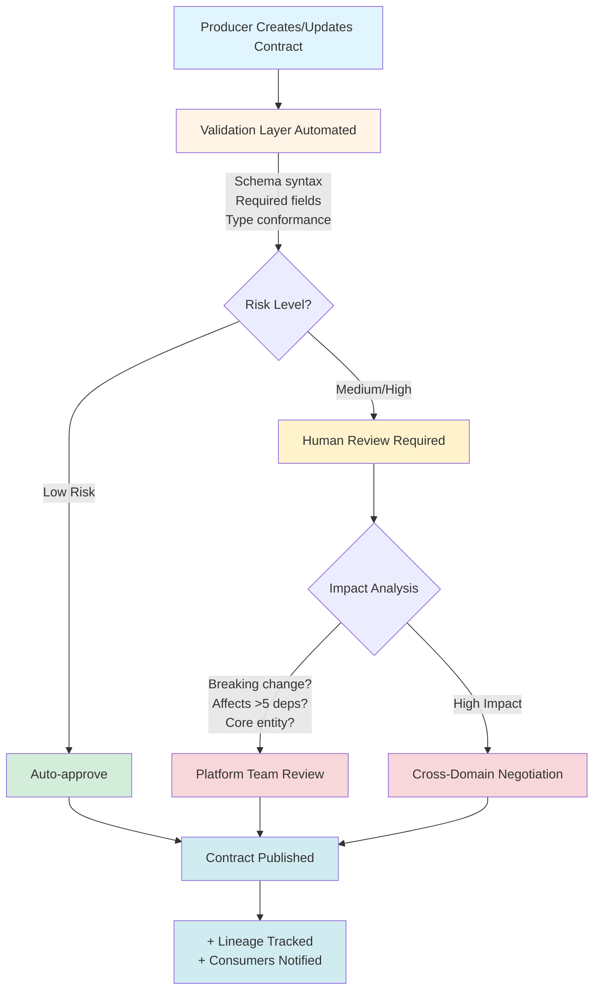

At Volvo Cars, dozens of teams gained the ability to publish data products independently. Speed increased dramatically. So did the rate of silent failures.

Cross-domain integrations broke without warning, leaving consumers scrambling to identify root causes. Schema drift caused downstream pipeline failures that took hours or days to debug. Data quality issues surfaced late in the process, creating expensive remediation work while pointing fingers at no one specifically responsible.

The real problem wasn't technical—it was **unmanaged risk in a federated system** where autonomy and reliability were treated as opposing forces.

**My approach:** I turned this ambiguous governance challenge into a controllable decision system by categorizing risk explicitly across multiple dimensions, designing clear validation boundaries that define where automation ends, and building human-in-the-loop gates at critical decision points where machine judgment alone would be insufficient.

---

## 1. How I Framed Risk (Not Just Solved Problems)

Most governance systems treat all failures equally. I didn't.

### Risk Categorization Matrix

I classified data contract violations across three dimensions:

| Risk Type | Impact | Reversibility | Detection Window | Response |
|-----------|--------|---------------|------------------|----------|
| **Schema Breaking Changes** | High | Low | Immediate | Block at validation |
| **Quality Rule Violations** | Medium | Medium | Hours-Days | Alert + human review |
| **Semantic Drift** | Medium | High | Weeks | Flag for collaboration |
| **Missing Metadata** | Low | High | N/A | Soft warning only |

### Decision Boundaries: Where Automation Stops

**Fully Automated (No Human Gate)**

Certain validations are deterministic and low-risk enough to run without human oversight. These include schema syntax validation to ensure the YAML structure is well-formed, required field presence checks that verify mandatory elements exist, data type conformance validation to prevent type mismatches, and standard naming convention enforcement that maintains consistency across the organization. These checks execute automatically on every contract submission, providing immediate feedback to producers.

**AI-Assisted + Human Review**

For ambiguous scenarios, I designed a hybrid approach where AI surfaces potential issues but humans make final decisions. The system uses NLP to detect semantic consistency problems across domains—for instance, when "customer_id" in one domain might conflict with "client_id" in another—but routes these findings to domain owners who understand the business context. Similarly, cross-domain impact analysis automatically flags dependencies and affected consumers, but requires the contract owner to review and approve the changes. Breaking change classification runs through automated detection algorithms, but platform engineers review flagged items to distinguish true breaking changes from false positives.

**Always Human-in-the-Loop**

High-stakes decisions always require human judgment. Deprecating widely-used fields affects multiple teams and requires negotiation about migration timelines. Changing semantic definitions of core business entities like "customer," "order," or "product" can ripple across the entire data ecosystem and demands careful coordination. Resolving conflicting contracts between domains often involves business logic trade-offs that no algorithm can make. Exception requests for compliance-sensitive data require legal and privacy team approval that cannot be delegated to automation.

**Never Automated**

Some decisions are inherently human and should never be delegated to machines. Defining what constitutes "valid" for subjective business logic requires domain expertise and organizational context. Choosing which downstream consumers to break intentionally is a strategic business decision with political and relationship implications. Setting organizational data governance policies reflects company values, risk tolerance, and regulatory requirements that require executive-level judgment.

### Why This Framing Mattered

Traditional governance asks: *"Is this data good?"*  
I reframed it as: *"What's the worst that happens if this passes?"*

This shifted conversations from compliance theater to risk-adjusted decision-making.

---

## 2. System Design Under Uncertainty

The Data Contract Manager isn't a form builder—it's a **decision routing system** disguised as a UX layer.

### Decision Flow Architecture

### Failure Modes & Safe Degradation

**What happens when things break?**

| Failure Scenario | System Response | Fallback Path |
|------------------|----------------|---------------|
| Validation service down | Queue contracts for async processing | Email-based review as backup |
| Schema registry unreachable | Cache last-known-good schemas | Manual schema submission with delayed sync |
| Breaking change deployed | Reject pipeline ingestion | Producer must roll back or create new version |
| Consumer dependency unknown | Soft-warning only | Post-deployment monitoring catches issues |

### Inputs, Decisions, Outputs

**Inputs:**

The system ingests four primary input streams to make informed routing decisions. First, the producer-defined schema arrives as a YAML document containing field definitions, data types, and quality rules. Second, historical contract versions provide context about how this data structure has evolved and what changes have been made over time. Third, the downstream dependency graph reveals which consumers currently rely on this data and how they use it. Fourth, organizational policy rules encode company-specific governance requirements, compliance constraints, and business logic that must be enforced.

**Decisions Made:**

With these inputs, the system makes four critical determinations. It evaluates whether the contract is valid by checking syntax correctness and completeness of required fields. It assesses whether the proposed changes would break existing consumers by comparing the new schema against downstream usage patterns. It determines whether the change requires human review by evaluating risk factors like impact scope, entity type, and change severity. Finally, it identifies who needs to be notified based on the dependency graph and change type.

**Outputs:**

Successful processing generates four key outputs. The validated contract is stored in Azure Blob Storage for long-term persistence and disaster recovery. A version-controlled schema is registered in the schema registry to enable runtime validation by data pipelines. Targeted notifications are sent to affected consumers, alerting them to upcoming changes with appropriate lead time. An immutable audit log captures the decision trail for compliance reporting and post-incident investigation.

---

## 3. Human-in-the-Loop as a First-Class Design Choice

Unlike "full automation" platforms, I designed human judgment as a **reliability feature, not a fallback**.

### Reviewer Workflows

**Low-Risk Path (Automated Approval)**

For straightforward changes with minimal downstream impact, the system provides an express lane. When a producer submits a contract, the validation layer runs automated checks, and if all criteria pass, the contract is immediately published without human intervention. This path handles the majority of routine updates—adding new optional fields, updating documentation, or relaxing validation rules. The override rate remains below 2%, meaning producers voluntarily request manual review only in rare edge cases where they want extra certainty despite automated approval.

**Medium-Risk Path (Platform Team Review)**

When the system detects potential breaking changes but the impact appears contained, it routes the contract to platform engineers for review. A platform engineer examines the impact scope by checking the dependency graph and evaluating whether downstream consumers can handle the change. They have three options: approve the change and allow publication, reject it with an explanation of why it's too risky, or request modifications that would make the change acceptable. The median review time is four hours, making this path fast enough to avoid blocking producers while still catching genuinely problematic changes. The acceptance rate sits at 87%, indicating that most flagged changes either pass review or can be easily modified to meet requirements.

**High-Risk Path (Cross-Domain Negotiation)**

The most complex scenario arises when a contract change affects more than five downstream consumers or modifies the definition of a core business entity. In these cases, the system automatically routes the proposal to all impacted domain owners, initiating an in-tool negotiation process. Producers explain their rationale, consumers voice concerns about migration costs or timing, and the platform team serves as a neutral mediator when conflicts arise. This collaborative process takes a median of two days but results in a 94% acceptance rate after negotiation, demonstrating that given sufficient communication, most cross-domain conflicts can be resolved to everyone's satisfaction.

### How Feedback Changes System Behavior

**Early System (Month 1-3):**
- Flagged 40% of contracts for human review
- Over-cautious breaking change detection
- High false-positive rate on "semantic drift"

**Feedback Loop Implementation:**
- Platform team marks false positives
- Accepted breaking changes tagged with justification
- System learns organizational risk tolerance

**Mature System (Month 6+):**
- Human review rate dropped to 18%
- False positive rate: 12% → 3%
- Zero undetected breaking changes in production

**Key Insight:** The system doesn't just validate contracts—it **learns organizational boundaries** through human signals.

### Why This Matters

Most platforms treat human review as friction to eliminate.  
I designed it as **the mechanism that makes automation trustworthy**.

---

## 4. Trade-Offs I Consciously Accepted

Every design is a series of deliberate "no" decisions. Here are mine.

### What We Intentionally Did NOT Do

**❌ Did not pursue full automation**  
*Why:* High-stakes changes (core entities, wide-impact deprecations) require human judgment on business context the system cannot infer.  
*Cost:* 18% of contracts wait hours-to-days for human review.  
*Benefit:* Zero major production incidents from unreviewed breaking changes.

**❌ Did not optimize for contract creation speed early**  
*Why:* Fast, wrong contracts are worse than slow, correct ones.  
*Cost:* Early adopters complained about "too many validation errors."  
*Benefit:* Schema breakages in downstream pipelines dropped 73% in 6 months.

**❌ Did not enforce contracts retroactively on existing datasets**  
*Why:* Would have blocked 200+ legacy pipelines, killing adoption.  
*Cost:* ~40% of organizational data remains uncontracted.  
*Benefit:* New data products adopted contracts willingly; legacy systems migrated gradually.

**❌ Did not cover edge cases initially**  
*Why:* 90% of contracts follow 3 standard patterns (event streams, dimension tables, aggregated metrics).  
*Cost:* Advanced users (ML teams, real-time analytics) needed custom workarounds.  
*Benefit:* Core user base (data engineers, BI teams) onboarded 3x faster.

**❌ Did not use the strongest validation rules from day one**  
*Why:* Organizational data quality culture was immature.  
*Cost:* Early contracts had looser quality guarantees.  
*Benefit:* Teams built trust in the system before tightening rules. Adoption grew 10x in 8 months.

### What This Reveals

Seniority isn't knowing all the answers—it's **knowing which problems to defer**.

---

## 5. Evolution Over Time (Not Static Success)

The system that exists today is not the system we launched.

### What Broke

**Month 2: Schema Registry Integration Failed**
- Azure schema registry had intermittent connection issues
- Contracts validated but failed to publish
- **Fix:** Added async retry queue + manual override path

**Month 4: "Breaking Change" Detection Was Too Sensitive**
- Flagged 62% of updates as breaking (mostly false positives)
- Added new nullable field? Flagged as breaking.
- **Fix:** Refined detection logic; backwards-compatible changes auto-approved

**Month 7: Cross-Domain Negotiation Became a Bottleneck**
- High-impact changes took 2+ weeks to resolve
- Platform team became arbiters of business logic disputes
- **Fix:** Added expiration timers + escalation paths to VP-level stakeholders

### What Drifted

**Assumption:** "Producers will define quality rules eagerly."  
**Reality:** 80% of early contracts had zero quality rules. Producers optimized for speed, not reliability.

**Response:** Changed default templates to include basic quality checks (nullability, uniqueness, freshness). Opt-out rather than opt-in.

**Assumption:** "Consumers will monitor contract changes proactively."  
**Reality:** Notifications were ignored. Breaking changes still caused surprises.

**Response:** Added breaking change preview environment. Consumers test against proposed changes before they go live.

### How Automation Boundaries Changed

**Early System:**

When we first launched, the system operated with a conservative 40% human review rate. We erred on the side of caution, flagging any change that seemed remotely ambiguous or potentially impactful. This conservative automation strategy was intentional—we needed to build organizational trust and observe failure patterns before expanding automation boundaries.

**Current System:**

After six months of learning from human decisions, the review rate dropped to 18%. We expanded automation to confidently handle scenarios that initially seemed risky but proved routine in practice. Backwards-compatible schema additions—like adding new optional fields or expanding enums—now auto-approve because they cannot break existing consumers. Metadata-only updates that change descriptions, examples, or documentation proceed without review since they affect discoverability but not data structure. Quality rule relaxations, such as allowing wider value ranges or accepting null values, can be automated because they make validation less strict. However, quality rule tightening still requires human review because it can cause existing data to suddenly fail validation.

**What stayed human-only:**

Despite expanded automation, certain scenarios remain firmly in the human judgment zone. Breaking changes to core entities like customer, order, or product definitions always require review because these concepts anchor the entire data ecosystem. Cross-domain semantic conflicts—where two teams define the same concept differently—need human negotiation to resolve business logic disagreements. Exception requests for compliance-sensitive data must go through legal and privacy review, a responsibility we will never delegate to automation regardless of how sophisticated our systems become.

### Lessons from Real Incidents

**Incident 1:** Producer deprecated a field still used by 12 downstream dashboards.  
**Root cause:** Dependency graph was incomplete (consumers self-registered pipelines but not BI tools).  
**System change:** Added BI tool lineage tracking. Breaking change detection now scans dashboards, not just pipelines.

**Incident 2:** Quality rule change caused 3-day pipeline backlog.  
**Root cause:** Producer tightened a rule; 40% of historical data suddenly failed validation.  
**System change:** New quality rules apply only to new data by default. Retroactive enforcement requires explicit flag + platform approval.

### Why This Section Matters

Static portfolios show success.  
Evolution shows **how you think when reality fights back**.

---

## Closing: What This System Really Does

The Data Contract Manager doesn't just validate schemas.

It turns **"Who owns this data?"** into a routing decision.  
It turns **"Is this change safe?"** into a risk classification.  
It turns **"Should we allow this?"** into a controllable system with known degradation paths.

**The single narrative:**  
I took an ambiguous governance problem—how to enable autonomy without breaking trust—and built a decision system with clear boundaries, explicit trade-offs, and human judgment where it matters most.

---

## Explore Further

* GitHub: **Data Contract Manager**  
  [https://github.com/volvo-cars/data-contract-manager](https://github.com/volvo-cars/data-contract-manager)

* Book: *Driving Data Quality with Data Contracts* - Andrew Jones
