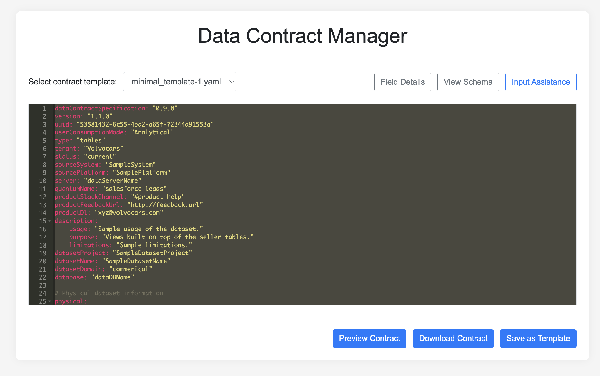

As organizations move toward decentralized data ownership and data mesh architectures, the question is no longer *whether* teams can publish data independently - but **how they do so without breaking trust across the ecosystem**.

At Volvo Cars, increasing domain autonomy meant dozens of teams could ship data products at speed. But without shared, enforceable agreements on structure, semantics, and quality, cross-domain integrations became fragile, slow, and expensive to maintain.

This is where **data contracts** moved from an abstract governance concept to a concrete product need.

In this post, I combine two perspectives:

1. **What we built** - the *Data Contract Manager*, a product that operationalizes contracts in a federated data platform.
2. **Why it works** - drawing on frameworks from *Driving Data Quality with Data Contracts* to explain how contracts improve quality, culture, and scalability.

---

## The Core Problem

**How do you allow autonomous teams to ship data independently - without breaking each other?**

Decentralization brings speed, but also predictable failure modes:

* Producers define fields differently for the same concept
* Consumers rely on undocumented assumptions
* Schema drift causes silent or breaking failures
* Data quality issues surface late, downstream, and expensively

Traditional metadata tools help with *discoverability*, but they don’t enforce expectations. What we needed was a product that made **agreements explicit, validated, and easy to maintain** - even for non-expert users.

---

## Metadata ≠ Data Contracts

One early blocker was conceptual confusion.

> **Metadata explains what the data is.**
> **Data contracts define what the data must be.**

Metadata supports discovery and understanding. Data contracts support **reliability and interoperability**.

Clarifying this distinction unlocked multiple product decisions:

* What fields must be validated vs. merely described
* Which rules are enforced automatically
* What schemas must be standardized across domains

It also shaped the UX: schema visibility and contract validation live in the same workflow, so users see *context and constraints together*.

---

## What We Built: The Data Contract Manager

The **Data Contract Manager** is a web application that helps teams create, validate, and maintain YAML-based data contracts - without needing to be data governance experts.

### Key Product Capabilities

* **Template-based contract creation**
  Reduces onboarding friction and reinforces cross-domain standards.

* **Inline guidance and smart input assistance**
  Explains required fields, constraints, and best practices at the moment of decision.

* **Schema and rule validation**
  Contracts are validated *before* being committed, preventing downstream breakages.

* **Version control and secure storage (Azure Blob)**
  Enables auditability, rollback, and long-term governance at scale.

* **Review before finalization**
  Encourages early alignment between producers, consumers, and platform teams.

* **Reusable templates**
  Allows teams with similar data structures to move faster while staying consistent.

The guiding principle was: **governance should feel supportive, not bureaucratic**.

---

## Data Contracts as a Data Mesh Enabler

From a product perspective, the Data Contract Manager acts as:

* A **governance guardrail** for decentralized teams
* A **reliability layer** for data consumers
* A **contract-driven backbone** for evolving pipelines
* A **collaboration interface** between producers, consumers, and platform teams

This aligns closely with modern data contract theory: contracts are not documents - they are **interfaces between teams**.

---

## Why Data Contracts Improve Data Quality

Andrew Jones’ *Driving Data Quality with Data Contracts* frames contracts as both a **technical mechanism** and a **cultural shift**.

### Aspect 1: Contract-Backed Architecture

Contracts enable self-service and automation:

* Data is validated at ingestion, not cleaned downstream
* Pipelines fail fast when expectations are broken
* Schema, quality, and freshness checks become codified rules

In practice, this means fewer silent failures and less reactive firefighting.

### Aspect 2: Cultural Shift

Contracts also change *how teams think about data*:

* Data is produced for explicit use cases
* Producers and consumers collaborate earlier
* Quality is prioritized over sheer volume

This shift matters as much as the tooling itself.

---

## What Data Contracts Mean for Different Teams

### For Technical Teams

Think of data contracts like **strong typing for data pipelines**.

* ETL and ingestion can validate automatically
* Fewer late-night debugging sessions
* Clear expectations reduce integration friction

When combined with tools like dbt tests, Great Expectations, or schema registries, contracts become executable specifications.

### For Business Teams

A data contract is effectively an **SLA for data**.

* Dashboards become more reliable
* Less time spent reconciling numbers
* Faster, more confident decision-making

The focus shifts from *"Can I trust this metric?"* to *"What should we do about it?"*

### For Compliance Teams

Contracts act as **preventive controls**:

* Compliance rules are enforced before data lands
* Audit trails are clearer and more consistent
* Fewer retrospective fixes and exceptions

Governance becomes proactive rather than reactive.

### For Strategy & Management

High-quality inputs lead to better outputs:

* More reliable forecasting
* Stronger AI and analytics results
* A genuine single version of the truth

Data contracts quietly raise the ceiling of what the organization can do with data.

---

## Product Reflections

Building the Data Contract Manager reinforced a few lessons:

**Clarity is UX in decentralized systems.**
If users understand expectations without training, you’re winning.

**Invisible value still compounds.**
Nobody celebrates validation rules - until failures disappear.

**Governance is a product.**
When rules are embedded in workflows, teams feel supported, not constrained.

---

## Explore Further

* GitHub: **Data Contract Manager**
  [https://github.com/volvo-cars/data-contract-manager](https://github.com/volvo-cars/data-contract-manager)

* Book: *Driving Data Quality with Data Contracts* - Andrew Jones

* External references:

  * PayPal Data Contract Template
  * Data Contract Specification (datacontract.com)
  * Data Mesh Manager

  ---

  ## Closing Thought

Data contracts work best when they stop being slides and start being **interfaces** - interfaces between teams, systems, and expectations.

When done well, they don’t slow teams down. They let teams move fast **without breaking trust**.
