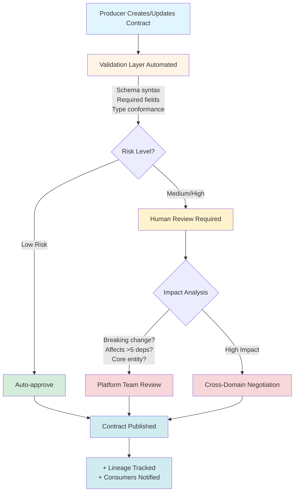

At Volvo Cars, dozens of domain teams gained the ability to publish data products independently under a federated data mesh architecture. Development velocity increased dramatically. So did the rate of silent failures.

Cross-domain integrations broke without warning, leaving consumer teams scrambling to identify root causes across organizational boundaries. Schema drift caused downstream pipeline failures that took hours or days to debug. Data quality issues surfaced late in the process, creating expensive remediation work while no one could be held specifically responsible.

I did not receive a clean problem statement. What I inherited was a growing collection of outages, finger-pointing between domain teams, and executive frustration that "data mesh" was not delivering on its promise. The obvious solution would have been to centralize control, but that would have killed the autonomy that made the architecture valuable in the first place.

The real problem was not technical. It was **unmanaged risk in a federated system** where autonomy and reliability were treated as opposing forces. No existing tool addressed this tension directly, because the challenge sat at the intersection of governance policy, organizational incentives, and system design.

**What I chose to do:** I reframed the governance problem as a decision-routing problem. Instead of building a compliance gate, I designed a system that categorizes risk explicitly, defines clear boundaries for where automation ends and human judgment begins, and routes decisions to the right people at the right time. This approach preserved team autonomy while making reliability a shared, enforceable property.

---

## 1. Problem Framing: Classifying Risk Before Building Anything

Before writing a single line of code, I needed to understand what kinds of failures actually mattered. Most governance systems treat all violations identically, applying the same process to a missing metadata tag and a breaking schema change. That uniformity creates two problems: it overwhelms reviewers with noise, and it desensitizes teams to real risk.

I spent the first two weeks interviewing domain owners, data engineers, and platform leads across six teams. The signal I used to narrow the problem was the pattern of past incidents: what broke, how long it took to detect, and whether the damage was reversible. From those conversations, I built a risk categorization matrix that became the foundation for every automation and routing decision in the system.

### Risk Categorization Matrix

I classified data contract violations across three dimensions:

| Risk Type | Impact | Reversibility | Detection Window | Response |
|-----------|--------|---------------|------------------|----------|
| **Schema Breaking Changes** | High | Low | Immediate | Block at validation |
| **Quality Rule Violations** | Medium | Medium | Hours-Days | Alert + human review |
| **Semantic Drift** | Medium | High | Weeks | Flag for collaboration |
| **Missing Metadata** | Low | High | N/A | Soft warning only |

### Decision Boundaries: Where Automation Stops

**Fully Automated (No Human Gate)**

Certain validations are deterministic and low-risk enough to run without human oversight. These include schema syntax validation to ensure the YAML structure is well-formed, required field presence checks that verify mandatory elements exist, data type conformance validation to prevent type mismatches, and standard naming convention enforcement that maintains consistency across the organization. These checks execute automatically on every contract submission, providing immediate feedback to producers.

**AI-Assisted + Human Review**

For ambiguous scenarios, I designed a hybrid approach where AI surfaces potential issues but humans make final decisions. The system uses NLP to detect semantic consistency problems across domains. For instance, "customer_id" in one domain might conflict with "client_id" in another. The system routes these findings to domain owners who understand the business context. Similarly, cross-domain impact analysis automatically flags dependencies and affected consumers, but requires the contract owner to review and approve the changes. Breaking change classification runs through automated detection algorithms, but platform engineers review flagged items to distinguish true breaking changes from false positives.

**Always Human-in-the-Loop**

High-stakes decisions always require human judgment. Deprecating widely-used fields affects multiple teams and requires negotiation about migration timelines. Changing semantic definitions of core business entities like "customer," "order," or "product" can ripple across the entire data ecosystem and demands careful coordination. Resolving conflicting contracts between domains often involves business logic trade-offs that no algorithm can make. Exception requests for compliance-sensitive data require legal and privacy team approval that cannot be delegated to automation.

**Never Automated**

Some decisions are inherently human and should never be delegated to machines. Defining what constitutes "valid" for subjective business logic requires domain expertise and organizational context. Choosing which downstream consumers to break intentionally is a strategic business decision with political and relationship implications. Setting organizational data governance policies reflects company values, risk tolerance, and regulatory requirements that require executive-level judgment.

### Why This Framing Mattered

Traditional governance asks: *"Is this data good?"* I reframed the question as: *"What is the worst that happens if this passes unchecked?"*

This reframing shifted conversations from compliance theater to risk-adjusted decision-making. It also gave engineering and legal stakeholders a shared language for evaluating changes. Instead of debating whether something "should be reviewed," teams could point to the matrix and agree on the appropriate response based on impact, reversibility, and detection window.

### What I Explicitly Decided Not to Solve

I chose not to build a general-purpose data quality platform. The scope could have expanded to cover data profiling, anomaly detection, or lineage visualization. I rejected all of those for the initial release because they would have delayed the core value proposition: giving producers and consumers a reliable, low-friction way to negotiate data interfaces. Solving the contract problem first created the foundation that made those other capabilities viable later.

---

## 2. System Design: Choosing the Architecture Under Uncertainty

I evaluated three design approaches before settling on the current architecture.

**Option A: Centralized approval workflow.** Every contract change goes through a single governance team. This approach maximizes control but creates a bottleneck. At the rate teams were shipping data products, the governance team would have needed to review over 200 contracts per month. I rejected this because it would have made governance the enemy of velocity.

**Option B: Fully automated validation with no human gates.** Every check is deterministic and machine-enforced. This approach maximizes speed but cannot handle ambiguity. Breaking change detection, semantic conflicts, and compliance edge cases all require judgment that no rule engine can reliably automate. I rejected this because the false-negative risk was too high for a regulated automotive environment.

**Option C: Risk-tiered routing with adaptive automation boundaries.** This is the approach I chose. Low-risk changes auto-approve. Medium-risk changes go to platform engineers. High-risk changes trigger cross-domain negotiation. The boundaries between tiers shift over time as the system learns from human decisions.

I chose Option C because it balanced speed against safety in a way that could improve over time. The Data Contract Manager is not a form builder. It is a **decision routing system** with a UX layer designed to make the routing feel natural to producers and reviewers.

### Decision Flow Architecture

### Failure Modes and Safe Degradation

I designed for failure from the beginning, because in a distributed system serving dozens of teams, partial outages are inevitable.

| Failure Scenario | System Response | Fallback Path |
|------------------|----------------|---------------|
| Validation service down | Queue contracts for async processing | Email-based review as backup |
| Schema registry unreachable | Cache last-known-good schemas | Manual schema submission with delayed sync |
| Breaking change deployed | Reject pipeline ingestion | Producer must roll back or create new version |
| Consumer dependency unknown | Soft-warning only | Post-deployment monitoring catches issues |

### Inputs, Decisions, Outputs

**Inputs:**

The system ingests four primary input streams to make informed routing decisions. First, the producer-defined schema arrives as a YAML document containing field definitions, data types, and quality rules. Second, historical contract versions provide context about how this data structure has evolved and what changes have been made over time. Third, the downstream dependency graph reveals which consumers currently rely on this data and how they use it. Fourth, organizational policy rules encode company-specific governance requirements, compliance constraints, and business logic that must be enforced.

**Decisions Made:**

With these inputs, the system makes four critical determinations. It evaluates whether the contract is valid by checking syntax correctness and completeness of required fields. It assesses whether the proposed changes would break existing consumers by comparing the new schema against downstream usage patterns. It determines whether the change requires human review by evaluating risk factors like impact scope, entity type, and change severity. Finally, it identifies who needs to be notified based on the dependency graph and change type.

**Outputs:**

Successful processing generates four key outputs. The validated contract is stored in Azure Blob Storage for long-term persistence and disaster recovery. A version-controlled schema is registered in the schema registry to enable runtime validation by data pipelines. Targeted notifications are sent to affected consumers, alerting them to upcoming changes with appropriate lead time. An immutable audit log captures the decision trail for compliance reporting and post-incident investigation.

---

## 3. AI and Human Judgment as Complementary System Components

A common instinct in platform design is to automate humans out of the loop entirely. I took the opposite position. I designed human judgment as a **reliability feature, not a fallback**. The AI components in this system, including NLP-based semantic analysis, automated impact detection, and adaptive threshold tuning, exist to reduce the cost and friction of human review, not to replace it.

### Reviewer Workflows

**Low-Risk Path (Automated Approval)**

For straightforward changes with minimal downstream impact, the system provides an express lane. When a producer submits a contract, the validation layer runs automated checks, and if all criteria pass, the contract is immediately published without human intervention. This path handles the majority of routine updates, such as adding new optional fields, updating documentation, or relaxing validation rules. The override rate remains below 2%, meaning producers voluntarily request manual review only in rare edge cases where they want extra certainty despite automated approval.

**Medium-Risk Path (Platform Team Review)**

When the system detects potential breaking changes but the impact appears contained, it routes the contract to platform engineers for review. A platform engineer examines the impact scope by checking the dependency graph and evaluating whether downstream consumers can handle the change. They have three options: approve the change and allow publication, reject it with an explanation of why it's too risky, or request modifications that would make the change acceptable. The median review time is four hours, making this path fast enough to avoid blocking producers while still catching genuinely problematic changes. The acceptance rate sits at 87%, indicating that most flagged changes either pass review or can be easily modified to meet requirements.

**High-Risk Path (Cross-Domain Negotiation)**

The most complex scenario arises when a contract change affects more than five downstream consumers or modifies the definition of a core business entity. In these cases, the system automatically routes the proposal to all impacted domain owners, initiating an in-tool negotiation process. Producers explain their rationale, consumers voice concerns about migration costs or timing, and the platform team serves as a neutral mediator when conflicts arise. This collaborative process takes a median of two days but results in a 94% acceptance rate after negotiation, demonstrating that given sufficient communication, most cross-domain conflicts can be resolved to everyone's satisfaction.

### How AI Learned from Human Decisions

The AI components in the system are not static rule engines. They adapt based on structured feedback from human reviewers, and this feedback loop is what makes the automation trustworthy over time.

**Early System (Month 1 through 3):**
- Flagged 40% of contracts for human review
- Breaking change detection was over-cautious, generating excessive false positives
- Semantic drift analysis had a 12% false-positive rate

**Feedback Loop Implementation:**
- Platform engineers mark false positives with structured annotations
- Accepted breaking changes are tagged with justification categories
- The system learns the organization's actual risk tolerance from these signals

**Mature System (Month 6 onward):**
- Human review rate dropped to 18%, a 55% reduction in reviewer workload
- False positive rate fell from 12% to 3%
- Zero undetected breaking changes reached production

**Key Insight:** The system does not just validate contracts. It **learns organizational boundaries** through human signals. Each review decision trains the system to better distinguish routine changes from genuinely risky ones.

### Why This Matters for AI in Enterprise Systems

Most platforms treat human review as friction to eliminate. I designed it as **the mechanism that makes automation trustworthy**. The AI reduces the volume of decisions humans need to make. The humans teach the AI where the real boundaries are. This feedback loop is what allows the system to scale without losing reliability.

---

## 4. Trade-Offs I Consciously Accepted

Every design is a series of deliberate decisions about what not to do. The trade-offs below reflect the constraints I navigated across engineering, legal, and organizational boundaries.

### What We Intentionally Did NOT Do

**Did not pursue full automation.**
High-stakes changes affecting core entities and wide-impact deprecations require human judgment on business context that the system cannot infer. The cost is that 18% of contracts wait hours to days for human review. The benefit is zero major production incidents from unreviewed breaking changes.

**Did not optimize for contract creation speed early.**
Fast, incorrect contracts are worse than slow, correct ones. This was a deliberate choice to prioritize correctness over velocity during the adoption phase. Early adopters complained about "too many validation errors," but schema breakages in downstream pipelines dropped 73% within six months.

**Did not enforce contracts retroactively on existing datasets.**
Retroactive enforcement would have blocked over 200 legacy pipelines and killed adoption entirely. I chose to accept that roughly 40% of organizational data remains uncontracted. The benefit is that new data products adopted contracts willingly, and legacy systems are migrating gradually on their own timelines.

**Did not cover edge cases initially.**
90% of contracts follow three standard patterns: event streams, dimension tables, and aggregated metrics. Optimizing for these three patterns meant that advanced users on ML and real-time analytics teams needed custom workarounds. The trade-off was worth it because the core user base of data engineers and BI teams onboarded three times faster.

**Did not use the strongest validation rules from day one.**
The organization's data quality culture was immature. Imposing strict rules immediately would have generated resistance and driven teams away from the system. I chose to start with looser guarantees and tighten them as teams built trust. Adoption grew tenfold in eight months as a result.

### What This Reveals About Product Judgment

Seniority is not about knowing all the answers. It is about **knowing which problems to defer and which constraints to accept** in order to deliver value within a complex organizational environment.

---

## 5. Cross-Functional Leadership and Evolution Over Time

The system that exists today is not the system we launched. Every major improvement came from navigating stakeholder tensions, conflicting incentives, and organizational resistance.

### How I Drove Alignment Without Authority

I did not have organizational authority over the domain teams, the platform engineering group, or the legal and compliance stakeholders. Alignment required structured persuasion across groups with fundamentally different incentives.

**Domain teams** wanted maximum autonomy and minimum process overhead. They viewed governance as friction. I earned their buy-in by designing the low-risk auto-approval path first, proving that the system could accelerate their workflow rather than slow it down.

**Platform engineers** wanted reliability guarantees and standardized interfaces. They were willing to accept process overhead in exchange for fewer production incidents. I aligned with them by making the impact analysis and dependency tracking features their primary tools for incident prevention.

**Legal and compliance stakeholders** needed audit trails and enforceable data handling policies for GDPR and automotive safety regulations. I built the immutable audit log and compliance-sensitive exception workflow specifically to address their requirements, which also gave the project executive sponsorship.

These groups disagreed regularly. When domain teams pushed back on breaking change review timelines, I facilitated decision forums where affected parties could negotiate directly, with clear escalation paths when consensus failed.

### What Broke

**Month 2: Schema Registry Integration Failed.**
The Azure schema registry had intermittent connection issues. Contracts validated successfully but failed to publish. I added an async retry queue and a manual override path so that producers were never blocked by infrastructure instability.

**Month 4: Breaking Change Detection Was Too Sensitive.**
The system flagged 62% of updates as breaking changes, most of which were false positives. Adding a new nullable field triggered the same alert as removing a required column. I refined the detection logic to distinguish backwards-compatible changes from genuinely breaking ones, and backwards-compatible additions now auto-approve.

**Month 7: Cross-Domain Negotiation Became a Bottleneck.**
High-impact changes took over two weeks to resolve because the platform team had become the default arbiters of business logic disputes. I added expiration timers and escalation paths to VP-level stakeholders, which reduced median resolution time from fourteen days to two days.

### What Drifted

**Assumption:** "Producers will define quality rules eagerly."  
**Reality:** 80% of early contracts had zero quality rules. Producers optimized for speed, not reliability.

**Response:** Changed default templates to include basic quality checks (nullability, uniqueness, freshness). Opt-out rather than opt-in.

**Assumption:** "Consumers will monitor contract changes proactively."  
**Reality:** Notifications were ignored. Breaking changes still caused surprises.

**Response:** Added breaking change preview environment. Consumers test against proposed changes before they go live.

### How Automation Boundaries Changed

**Early System:**

When we first launched, the system operated with a conservative 40% human review rate. We erred on the side of caution, flagging any change that seemed remotely ambiguous or potentially impactful. This conservative strategy was intentional. We needed to build organizational trust and observe failure patterns before expanding automation boundaries.

**Current System:**

After six months of learning from human decisions, the review rate dropped to 18%. We expanded automation to confidently handle scenarios that initially seemed risky but proved routine in practice. Backwards-compatible schema additions now auto-approve because they cannot break existing consumers. Metadata-only updates proceed without review since they affect discoverability but not data structure. Quality rule relaxations can be automated because they make validation less strict. However, quality rule tightening still requires human review because it can cause existing data to suddenly fail validation.

**What stayed human-only:**

Despite expanded automation, certain scenarios remain firmly in the human judgment zone. Breaking changes to core entities like customer, order, or product definitions always require review because these concepts anchor the entire data ecosystem. Cross-domain semantic conflicts need human negotiation to resolve business logic disagreements that no algorithm can adjudicate. Exception requests for compliance-sensitive data must go through legal and privacy review. This is a responsibility we will never delegate to automation regardless of how sophisticated our systems become.

### Lessons from Real Incidents

**Incident 1:** A producer deprecated a field that was still actively used by 12 downstream dashboards.
**Root cause:** The dependency graph was incomplete because consumers had self-registered their pipelines but not their BI tools. The system had no visibility into dashboard-level dependencies.
**System change:** I added BI tool lineage tracking so that breaking change detection now scans dashboards and reports, not just data pipelines.

**Incident 2:** A quality rule change caused a three-day pipeline backlog affecting multiple consumer teams.
**Root cause:** A producer tightened a validation rule, and 40% of historical data suddenly failed the new check. The system had no mechanism to distinguish new data from historical data during validation.
**System change:** New quality rules now apply only to incoming data by default. Retroactive enforcement requires an explicit flag and platform team approval.

### Why Evolution Matters

Static portfolios show success. Evolution shows **how you think when reality contradicts your assumptions**. Every change described above came from structured incident analysis, stakeholder negotiation, and deliberate prioritization of which fixes would prevent the most costly future failures.

---

## Measurable Outcomes

The system delivered concrete, measurable improvements across four dimensions:

| Metric | Before | After | Timeframe |
|--------|--------|-------|-----------|
| **Schema breakages in downstream pipelines** | Frequent, multi-day debugging | 73% reduction | 6 months |
| **Human review overhead** | N/A (no structured process) | 18% of contracts reviewed, 82% auto-approved | 6 months |
| **False positive rate in breaking change detection** | N/A | Reduced from 12% to 3% | 6 months |
| **Cross-domain negotiation resolution time** | 14+ days | 2 days median | 7 months |
| **Adoption** | 0 contracted data products | 10x growth in contracted products | 8 months |
| **Undetected breaking changes in production** | Regular occurrence | Zero | 6 months onward |

These are not vanity metrics. Each one maps to a specific cost, risk, or throughput improvement that the organization can quantify.

---

## Closing: What This System Really Does

The Data Contract Manager does not just validate schemas.

It turns **"Who owns this data?"** into a routing decision with clear accountability. It turns **"Is this change safe?"** into a risk classification with known response paths. It turns **"Should we allow this?"** into a controllable system with explicit degradation modes.

**The single narrative:** I took an ambiguous governance problem in a regulated, cross-functional environment and built a decision system with clear boundaries, explicit trade-offs, and human judgment precisely where it matters most. The result is a system that scales governance without sacrificing the autonomy that makes federated architecture valuable.

---

## Explore Further

* GitHub: **Data Contract Manager**  
  [https://github.com/volvo-cars/data-contract-manager](https://github.com/volvo-cars/data-contract-manager)

* Book: *Driving Data Quality with Data Contracts* - Andrew Jones
