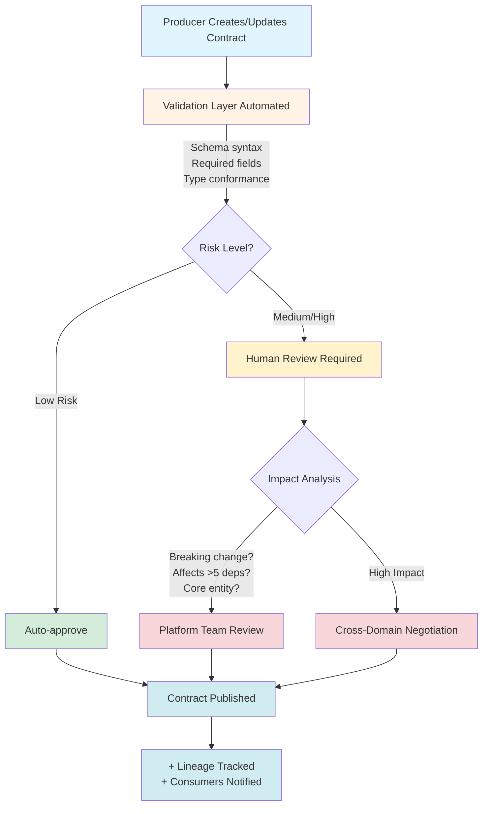
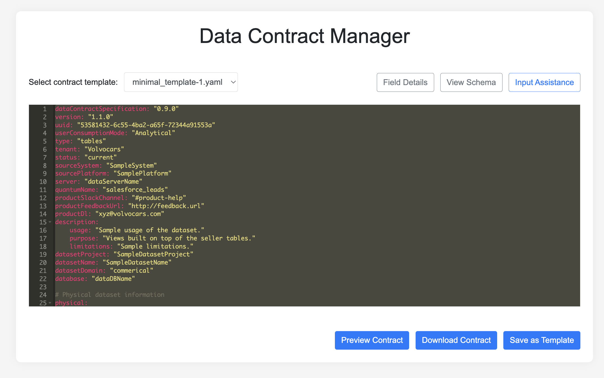

At Volvo Cars, dozens of domain teams gained the ability to publish data products independently under a federated data mesh architecture. Development velocity increased dramatically. So did the rate of silent failures.

Cross-domain integrations broke without warning. Schema drift caused downstream pipeline failures that took hours or days to debug. Data quality issues surfaced late, creating expensive remediation work with no clear ownership. I did not receive a clean problem statement. What I inherited was outages, finger-pointing, and executive frustration that "data mesh" was not delivering on its promise.

The obvious fix would have been to centralize control. That would have killed the autonomy that made the architecture valuable. I reframed the problem: this was not a governance gap. It was a decision-routing problem. Categorize risk explicitly, define clear boundaries for where automation ends and human judgment begins, route decisions to the right people at the right time. Preserve autonomy while making reliability a shared, enforceable property.

---

## 1. Classifying Risk Before Building Anything

Most governance systems treat all violations identically. A missing metadata tag triggers the same process as a breaking schema change. That creates two problems: reviewer overload from noise, and desensitization to real risk.

I spent the first two weeks interviewing domain owners, data engineers, and platform leads across six teams. The signal I used to narrow the problem was the pattern of past incidents: what broke, how long it took to detect, and whether the damage was reversible.

### Risk Categorization Matrix

| Risk Type | Impact | Reversibility | Detection Window | Response |
|-----------|--------|---------------|------------------|----------|
| **Schema Breaking Changes** | High | Low | Immediate | Block at validation |
| **Quality Rule Violations** | Medium | Medium | Hours to days | Alert + human review |
| **Semantic Drift** | Medium | High | Weeks | Flag for collaboration |
| **Missing Metadata** | Low | High | N/A | Soft warning only |

This matrix became the foundation for every automation and routing decision.

### Where Automation Stops

**Fully automated (no human gate):** Schema syntax validation, required field presence, data type conformance, naming convention enforcement. Deterministic, low-risk, executed on every submission with immediate feedback.

**AI-assisted with human review:** NLP-based semantic consistency detection (e.g., "customer_id" in one domain conflicting with "client_id" in another). Cross-domain impact analysis. Breaking change classification where automated detection runs first, but platform engineers review flagged items.

**Always human-in-the-loop:** Deprecating widely-used fields. Changing semantic definitions of core business entities ("customer," "order," "product"). Resolving conflicting contracts between domains. Exception requests for compliance-sensitive data.

**Never automated:** Defining what constitutes "valid" for subjective business logic. Choosing which consumers to break intentionally. Setting organizational governance policies.

The key reframe: traditional governance asks "Is this data good?" I asked "What is the worst that happens if this passes unchecked?" That shifted conversations from compliance theater to risk-adjusted decision-making and gave engineering and legal stakeholders a shared evaluation language.

### Scope Decisions

I chose not to build a general-purpose data quality platform. Data profiling, anomaly detection, lineage visualization: all rejected for v1. They would have delayed the core value proposition (a reliable, low-friction interface for producers and consumers to negotiate data contracts). Solving contracts first created the foundation for those capabilities later.

---

## 2. Architecture: Why Risk-Tiered Routing

I evaluated three approaches.

**Option A: Centralized approval.** Every contract change goes through a single governance team. At the rate teams were shipping, this team would review 200+ contracts per month. Governance becomes the bottleneck. Rejected.

**Option B: Fully automated validation.** Every check is deterministic and machine-enforced. Cannot handle ambiguity. In a regulated automotive environment, the false-negative risk was too high. Rejected.

**Option C: Risk-tiered routing with adaptive boundaries.** Low-risk changes auto-approve. Medium-risk changes go to platform engineers. High-risk changes trigger cross-domain negotiation. Boundaries shift over time as the system learns from human decisions. Chosen.

### Decision Flow

```mermaid
graph TD
    A[Producer Creates/Updates Contract] --> B[Validation Layer Automated]
    B -->|Schema syntax<br/>Required fields<br/>Type conformance| C{Risk Level?}
    
    C -->|Low Risk| D[Auto-approve]
    C -->|Medium/High| E[Human Review Required]
    
    E --> F{Impact Analysis}
    F -->|Breaking change?<br/>Affects >5 deps?<br/>Core entity?| G[Platform Team Review]
    F -->|High Impact| H[Cross-Domain Negotiation]
    
    D --> I[Contract Published]
    G --> I
    H --> I
    
    I --> J[+ Lineage Tracked<br/>+ Consumers Notified]
    
    style A fill:#e1f5ff
    style B fill:#fff4e6
    style D fill:#d4edda
    style E fill:#fff3cd
    style G fill:#f8d7da
    style H fill:#f8d7da
    style I fill:#d1ecf1
    style J fill:#d1ecf1
```

### Failure Modes

| Failure Scenario | System Response | Fallback |
|------------------|----------------|----------|
| Validation service down | Queue for async processing | Email-based review |
| Schema registry unreachable | Cache last-known-good schemas | Manual submission with delayed sync |
| Breaking change deployed | Reject pipeline ingestion | Producer must roll back or version |
| Consumer dependency unknown | Soft warning only | Post-deployment monitoring |

### Inputs and Outputs

The system ingests four streams: producer-defined schema (YAML with field definitions, types, quality rules), historical contract versions, downstream dependency graph, and organizational policy rules. It makes four determinations: is the contract valid, will changes break consumers, does the change require human review, and who needs notification.

Outputs: validated contract stored in Azure Blob Storage, version-controlled schema in the schema registry, targeted notifications to affected consumers, and an immutable audit log for compliance reporting.

---

## 3. How AI Learned from Human Decisions

The AI components (NLP-based semantic analysis, automated impact detection, adaptive thresholds) exist to reduce the cost and friction of human review, not to replace it. Human judgment is a reliability feature.

Three review paths operate in parallel. Low-risk contracts auto-approve with an override rate below 2%. Medium-risk contracts go to platform engineers for dependency analysis, with a median 4-hour review time and 87% acceptance rate. High-risk contracts (affecting 5+ consumers or core entity definitions) trigger negotiation with all impacted domain owners, resolving in a median of 2 days with 94% eventual acceptance.

### The Feedback Loop

In the first three months, the system flagged 40% of contracts for human review. Breaking change detection was overcautious. Semantic drift analysis had a 12% false-positive rate.

Platform engineers began marking false positives with structured annotations. Accepted breaking changes were tagged with justification categories. The system learned organizational risk tolerance from these signals.

By month six: human review rate dropped to 18% (55% reduction in reviewer workload). False-positive rate fell from 12% to 3%. Zero undetected breaking changes reached production.

Each review decision trained the system to better distinguish routine changes from genuinely risky ones. The system does not just validate contracts. It learns where the real organizational boundaries are.

---

## 4. Trade-Offs I Accepted

**No full automation.** 18% of contracts wait hours to days for human review. Zero major production incidents from unreviewed breaking changes.

**No optimization for creation speed.** Early adopters complained about validation errors. Schema breakages in downstream pipelines dropped 73% within six months.

**No retroactive enforcement on existing datasets.** Roughly 40% of organizational data remains uncontracted. Retroactive enforcement would have blocked 200+ legacy pipelines and killed adoption entirely. New data products adopted contracts willingly. Legacy systems migrate on their own timelines.

**No edge case coverage initially.** 90% of contracts follow three patterns: event streams, dimension tables, aggregated metrics. ML and real-time analytics teams needed custom workarounds. The core user base (data engineers, BI teams) onboarded 3× faster.

**No strict validation from day one.** The organization's data quality culture was immature. Imposing strict rules immediately would have generated resistance. Loose initial guarantees with gradual tightening drove 10× adoption growth in eight months.

---

## 5. What Broke and What Drifted

### Cross-Functional Alignment

I had no organizational authority over domain teams, platform engineering, or compliance. Alignment required structured persuasion with groups that had different incentives.

Domain teams wanted maximum autonomy. I earned buy-in by shipping the auto-approval path first, proving the system accelerated their workflow. Platform engineers wanted reliability guarantees. Impact analysis and dependency tracking became their primary tools for incident prevention. Legal and compliance needed audit trails for GDPR and automotive safety. The immutable audit log and compliance-sensitive exception workflow secured executive sponsorship.

### Incidents

**Month 2: Schema registry integration failed.** Azure schema registry had intermittent connection issues. Contracts validated but failed to publish. Fix: async retry queue and manual override so producers were never blocked by infrastructure instability.

**Month 4: Breaking change detection too sensitive.** 62% of updates flagged as breaking, most falsely. Adding a nullable field triggered the same alert as removing a required column. Fix: refined detection to distinguish backwards-compatible changes (auto-approve) from genuinely breaking ones.

**Month 7: Cross-domain negotiation bottleneck.** High-impact changes took two weeks because the platform team became the default arbiter of business logic disputes. Fix: expiration timers and VP-level escalation paths. Median resolution dropped from 14 days to 2 days.

### Assumption Drift

**"Producers will define quality rules eagerly."** Reality: 80% of early contracts had zero quality rules. Response: default templates now include basic checks (nullability, uniqueness, freshness). Opt-out, not opt-in.

**"Consumers will monitor contract changes proactively."** Reality: notifications were ignored. Breaking changes still caused surprises. Response: added a breaking change preview environment where consumers test against proposed changes before they go live.

### Incidents That Changed the System

A producer deprecated a field still used by 12 downstream dashboards. The dependency graph only tracked data pipelines, not BI tools. Fix: added BI tool lineage tracking.

A quality rule tightening caused a three-day pipeline backlog: 40% of historical data suddenly failed the new check. Fix: new quality rules now apply only to incoming data by default. Retroactive enforcement requires an explicit flag and platform team approval.

---

## 6. How Automation Boundaries Evolved

Early (months 1 to 3): 40% human review rate. Conservative by design. The system needed to observe patterns and build trust before expanding automation.

Current (month 6+): 18% human review rate. Backwards-compatible schema additions auto-approve. Metadata-only updates proceed without review. Quality rule relaxations auto-approve; tightenings still require review because they can cause existing data to fail validation.

What stayed human-only: breaking changes to core entities, cross-domain semantic conflicts, and compliance-sensitive exception requests. These require contextual judgment that no algorithm can reliably provide.

---

## Measurable Outcomes

| Metric | Before | After | Timeframe |
|--------|--------|-------|-----------|
| Schema breakages in downstream pipelines | Frequent, multi-day debugging | 73% reduction | 6 months |
| Human review overhead | No structured process | 18% reviewed, 82% auto-approved | 6 months |
| False positive rate (breaking change detection) | N/A | 12% → 3% | 6 months |
| Cross-domain negotiation resolution | 14+ days | 2 days median | 7 months |
| Adoption | 0 contracted products | 10× growth | 8 months |
| Undetected breaking changes in production | Regular occurrence | Zero | 6 months onward |

---

## What This System Does

It turns "Who owns this data?" into a routing decision with clear accountability. It turns "Is this change safe?" into a risk classification with defined response paths. It turns "Should we allow this?" into a system with explicit degradation modes and adaptive boundaries.

The result: governance that scales without sacrificing the autonomy that makes federated architecture valuable.

---

## Explore Further

* GitHub: **Data Contract Manager**
  [https://github.com/volvo-cars/data-contract-manager](https://github.com/volvo-cars/data-contract-manager)

* Book: *Driving Data Quality with Data Contracts* - Andrew Jones
