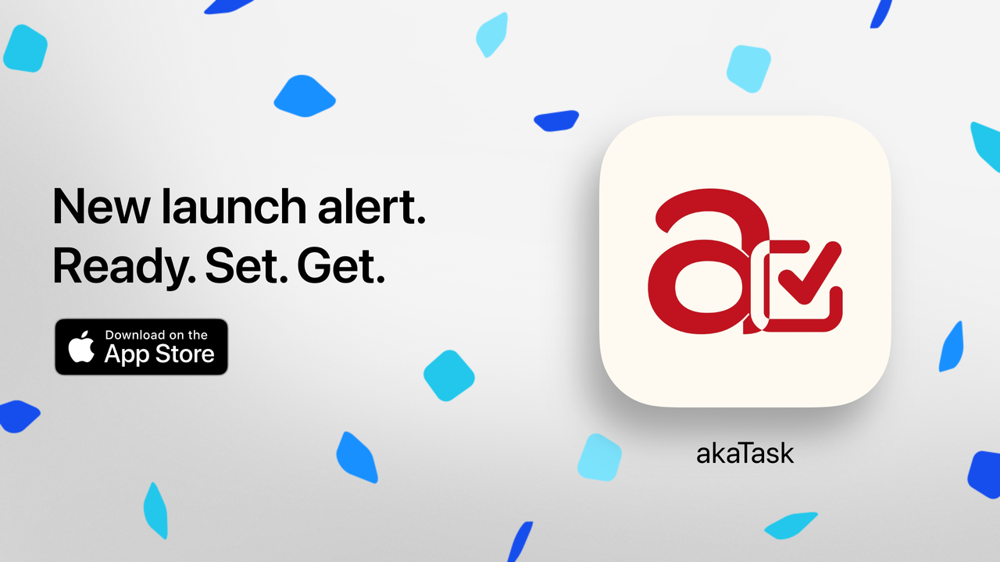

I'm thrilled that **akaTask** is officially available on the App Store as a **Minimum Viable Product (MVP)**! This initial release, version 1, focuses on the core function of our app: **task list generation**. We've designed it to streamline task management for busy parents, making it easy to stay organized with a simple, intuitive interface. You can download it here: [akaTask on the App Store](https://apps.apple.com/us/app/akatask/id6566193664?itscg=30200&itsct=apps_box_link&mttnsubad=6566193664).

For a deeper dive into the vision behind akaTask and our approach to building a parenting task management tool, check out our previous post here: [akaTask: Simplify Parenthood with AI Task Management](https://cynthialmy.github.io/2024-01-05-akatask/).

### What to Expect in This Version 📋
This initial release provides a streamlined **task list generator** designed to simplify your daily planning with ease and clarity. We've kept it lightweight and focused to get early feedback and ensure it fits into your busy life seamlessly.

### What's Coming Next 🔜
Our team is actively working on additional features to create a comprehensive solution for parenting-related tasks and beyond. Stay tuned for:
- **Customizable Task Categories**: Organize tasks by type (daily, weekly, or ad hoc) to fit your lifestyle.
- **Personalized Reminders and Notifications**: Never miss an important task with tailored notifications.
- **AI-Powered Recommendations**: Based on your preferences and patterns, akaTask will soon help you with suggestions to make planning even easier.

### We Need Your Feedback! 💬
Your input is crucial as we shape akaTask into a powerful task management tool for parents. Download the app, try it out, and let us know what you think. Every piece of feedback will help us bring more value to you in the upcoming versions.

Thank you for supporting us on this journey. We’re excited to keep improving akaTask to make parenthood a little bit easier, one task at a time. 🌟

