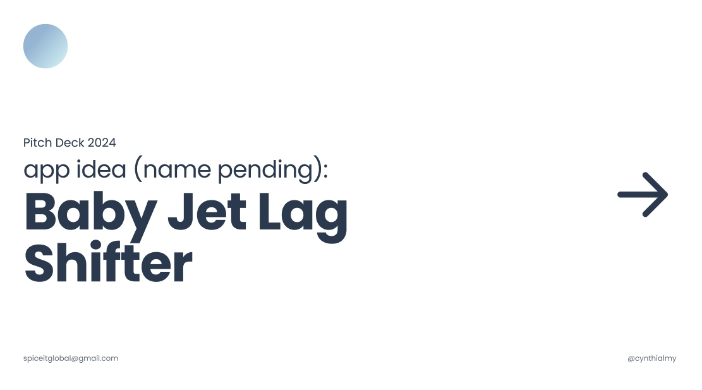

As a mom to a 3-month-old and a product manager, I know firsthand the challenge of getting a baby to sleep on schedule. Add travel to the mix, and the usual sleep routine can get completely upended. Moving across time zones disrupts our internal clocks, causing jet lag that’s tough on adults—and even tougher on little ones. That’s why I’m building an app to help parents adjust their family’s sleep schedules smoothly when traveling, allowing everyone to settle into a new time zone as quickly as possible. Here is the pitch deck for the app idea [Baby Jet Lag](https://www.figma.com/deck/xEzXhm4H1wuRNK2Vq6FpuD).

### Why Does Jet Lag Matter So Much for Families?

For adults, jet lag means feeling tired, groggy, and less able to focus—all of which make travel more challenging. But for babies and young children, who are still developing their sleep routines, a major time change can completely throw off their circadian rhythms. Studies show that regular sleep is essential for babies’ physical and cognitive growth. Even short disruptions can make them fussy, reduce their ability to adapt to new environments, and leave parents exhausted. Sleep-deprived parents and babies make for a rough travel experience, especially when the whole family is adjusting to a new schedule.

### The Science Behind Our Jet Lag Solution

Our app’s design is rooted in the latest research on circadian rhythms, sleep schedules, and effective jet lag management. The plan adapts strategies that have been shown to reduce the effects of jet lag and ensure restful sleep, including:

1. **Gradual Bedtime and Wake-Up Adjustments**: Small daily adjustments in bedtime and wake-up times can ease the transition, aligning with the body’s natural circadian shifts.
2. **Light Exposure Recommendations**: Light at specific times helps “reset” our body clocks. Exposure to morning light helps the body adjust to an earlier wake-up time, while evening light can push the schedule back, both crucial in managing time shifts.
3. **Adjustments to Feeding and Meal Times**: Shifting meal schedules also helps adjust the body clock to a new time zone. For babies, small shifts in feeding times are recommended, while older children benefit from gradually shifted meal times and meal types (like protein-rich breakfasts or carb-focused dinners).

### How the App Works

Here’s how the app will help families navigate time zone shifts and minimize jet lag:

1. **Customizable Sleep Plans**: You’ll start by entering basic travel details—departure time, arrival time, number of time zones crossed, and your child’s usual sleep schedule. The app then creates a daily plan with minor bedtime and wake-up shifts. If you’re headed east, for example, it will move bedtimes slightly earlier each day. Traveling west? The app will gradually push bedtimes later.

2. **Guided Light Exposure**: Since exposure to light is critical in resetting our body clocks, the app will remind you of the best times for light exposure based on your direction of travel. You’ll get prompts to go outdoors in the morning (for eastward adjustments) or in the evening (for westward travel). Natural light exposure is especially effective for young children and can be as simple as a morning stroll or afternoon playtime outside.

3. **Feeding and Meal Timing Adjustments**: The app also suggests feeding time shifts to help babies gradually align with the destination’s new schedule. For toddlers and older children, meal time adjustments are designed to ease digestion and enhance sleep and wakefulness at appropriate times.

4. **Nap and Quiet Time Adjustments**: We know that daytime naps are as important as nighttime sleep, so the app helps you adjust nap times too. Based on your child’s age and the time change, the app will help you keep naps on track without interfering with their nighttime sleep schedule. Quiet time prompts also help create a soothing routine as part of the sleep transition.

5. **Real-Time Reminders and Tracking**: To make things easier, the app sends reminders for key actions, such as bedtime shifts and light exposure times. You’ll also be able to track your family’s adjustment progress, seeing how close everyone is to being fully adapted to the new schedule.

6. **In-Flight Tips**: Travel itself can be disruptive, so the app offers guidance for on-board adaptations too. For example, you’ll get tips on when to let your child nap, how to create a sleep-friendly environment on the flight, and when to avoid screens that may disrupt sleep.

### A Smooth Transition for the Whole Family

Creating a jet lag app for families means combining science with the realities of parenting. It’s about making the adjustment as seamless as possible for everyone, from infants to parents. Travel doesn’t have to mean several days of sleepless chaos, and with a little planning and guidance, you can make family trips smoother and more enjoyable.

By following the plan in our app, parents can help babies, toddlers, and even older children adjust to new time zones gradually, easing the effects of jet lag on arrival. Whether you’re planning an overseas vacation or visiting family across the country, this app is here to support your family’s well-being—so you can make the most of your time together.

Stay tuned as we bring this app to life and support families in having restful, adaptable, and peaceful travels!
