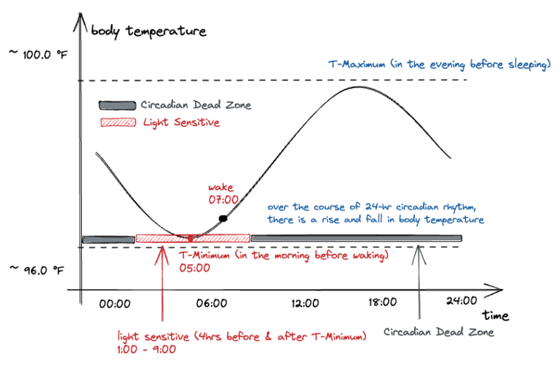

Here’s a look under the hood at how the app calculates your custom plan to help you arrive feeling refreshed and ready.

### Temperature Minimum and Light Exposure

Before we dive into the algorithm, let’s understand the science behind jet lag and how our bodies adjust to new time zones.

**Temperature Minimum (t-min):**
Your body temperature follows a daily cycle, reaching its lowest point, known as the "temperature minimum" or t-min, around 90 minutes to two hours before you typically wake up. This t-min acts as an anchor for your circadian rhythm, helping regulate your sleep-wake cycle. To estimate your t-min, average your wake-up time over a week and subtract 90–120 minutes.

**Light Sensitivity & Circadian Dead Zone:**
Light exposure significantly influences circadian rhythms, but its effects vary throughout the day. Close to your t-min, your body is highly sensitive to light, which can shift your circadian clock. The "circadian dead zone," usually from 10 AM to 4 PM, is when light exposure has minimal impact on your rhythm. To support your circadian rhythm, aim to get bright light (ideally 100,000 lux) in the morning before the dead zone begins.

### Inputs to Customize Your Plan
To make your plan truly effective, the app considers key factors like your departure and arrival times, number of time zones crossed, and days remaining until your trip. It also customizes based on age, with different sleep, light exposure, and meal adjustments for adults, children, toddlers, and infants.

**Key Inputs Include:**
1. **Departure & Arrival Times**: Departure and destination times help determine sleep and activity timing.
2. **Time Zones Crossed**: Number of time zones you’re moving through to estimate adjustment requirements.
3. **Days Until Departure**: More days allow for smaller, gradual shifts.
4. **Current Sleep Schedule**: Knowing your usual wake-up and sleep times makes for smoother adjustment.
5. **Direction of Travel**: Eastward travel requires advancing the sleep schedule, while westward requires delaying it.
6. **Age Group**: Determines the amount of daily time shift that is comfortable and effective for each family member.

---

### Adjusting Sleep, Nap, and Wake Times
One of the most effective ways to prepare for a new time zone is to gradually adjust sleep and wake times in the days leading up to your trip. The app’s algorithm adjusts your schedule based on the number of time zones you’re crossing and how much time you have before departure.

**Using t-min for Jet Lag Adjustment:**
When shifting time zones, you can use light exposure relative to your t-min to adjust your internal clock:
- **Phase Advance (Shift Earlier):** Expose yourself to bright light after your t-min to fall asleep and wake up earlier.
- **Phase Delay (Shift Later):** View bright light before your t-min to stay up and wake up later.

Physical activity also influences the circadian clock similarly to light exposure. Exercising in the four hours after your t-min advances your clock, while exercise before your t-min delays it. Preparing for jet lag by adjusting your clock two to three days before travel can reduce its severity, making adaptation smoother.

#### Sleep Adjustment Logic Table by Age Group

| Age Group | Eastward Travel (Sleep Earlier) | Westward Travel (Sleep Later) |
| --------- | ------------------------------- | ----------------------------- |
| Adult     | Shift 30-60 min earlier daily   | Shift 30-60 min later daily   |
| Child     | Shift 30-60 min earlier daily   | Shift 30-60 min later daily   |
| Toddler   | Shift 15-30 min earlier daily   | Shift 15-30 min later daily   |
| Infant    | Shift 10-20 min earlier daily   | Shift 10-20 min later daily   |

For example, if you’re traveling east and need to sleep earlier, the app will gradually move your wake and sleep times up by 30-60 minutes daily for adults and older children, and by smaller increments for toddlers and infants.

#### How It Works in the App
The app calculates a `daily_shift` value, tailored to your age group, and gradually adjusts your wake and sleep times in the days before travel. For eastward travel, it shifts your wake-up and sleep times earlier. For westward travel, it moves them later.

---

### Light Exposure Recommendations
Light exposure plays a crucial role in helping your body clock adjust. The timing of light exposure is tailored based on your direction of travel.

#### Light Exposure Logic Table

| Direction of Travel | Recommended Light Exposure Time |
| ------------------- | ------------------------------- |
| Eastward            | Morning                         |
| Westward            | Evening                         |

By exposing yourself to light at specific times, your body clock naturally shifts. Eastward travelers are recommended to get morning light exposure, which helps them adjust to sleeping earlier. For those traveling west, evening light helps delay the internal clock for a later bedtime.

---

### Meal and Activity Timing Adjustments
Meal and activity schedules can also support the body’s natural rhythm adjustments. The app provides meal and exercise timing recommendations to reinforce the shift in your internal clock.

#### Meal & Activity Timing Logic Table

| Direction of Travel | Meal Schedule Shift       | Activity Timing                |
| ------------------- | ------------------------- | ------------------------------ |
| Eastward            | Shift meals earlier daily | Morning exercise for alertness |
| Westward            | Shift meals later daily   | Evening exercise for alertness |

If you’re traveling east, the app will gradually move your meal times earlier, encouraging an earlier sleep schedule. Exercising in the morning promotes alertness when adjusting to an earlier day. For westward travelers, the app suggests shifting meal times later and moving exercise to the evening, which helps delay sleep onset.

### Arrival Tips for Jet Lag
Once in a new time zone, align your meal times to the local schedule, as eating can help anchor your body to the new time. Avoid light exposure in the dead zone upon arrival to prevent any conflicting shifts to your circadian rhythm.

---

### The Personalized Plan You Receive
Using these inputs, the app calculates a structured daily adjustment plan tailored to each individual in your travel group. Here’s what it provides:

1. **Sleep and Wake Adjustments**: Daily incremental shifts in sleep and wake times for smoother alignment with the destination.
2. **Light Exposure Timing**: Ideal times to get natural light for optimizing body clock adjustments.
3. **Meal and Activity Timing**: Suggested meal times and exercise slots that encourage alertness or restfulness as needed.

By creating a gradual and personalized transition, our app helps minimize jet lag so you can enjoy your trip from the moment you arrive.

---

### References

- Huberman, A. (2021). Find Your Temperature Minimum to Defeat Jetlag, Shift Work, and Sleeplessness. [Podcast episode]. In Huberman Lab. Retrieved from
https://www.hubermanlab.com/episode/find-your-temperature-minimum-to-defeat-jetlag-shift-work-and-sleeplessness
