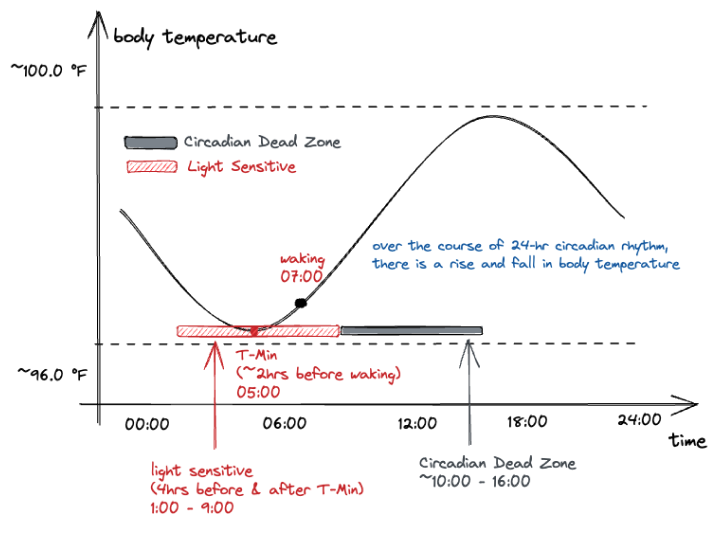

As a mom to a 3-month-old and a product manager, I found myself juggling two very different worlds that suddenly collided:
baby sleep schedules and international travel. I knew I needed to find a solution that would help me and my family adjust to the new time zone as quickly as possible.

**Role:** PM + Researcher

**Type:** Concept Case Study

## Where This Idea Began

Anyone who has tried to help a newborn or toddler adjust to time zones knows the ordeal:

- Days of overtired crying

- Parents awake at 3 AM

- Meal times that no longer make sense

Schedules completely derailed

It was clear that jet lag wasn’t just an inconvenience, it created full-family dysfunction.

That’s where this concept began:
Could an app translate circadian science into personalized, actionable plans for families? Not just adults?

---

## Why Jet Lag Hits Families Harder

Jet lag impacts everyone, but its effects on families are uniquely disruptive.

### For adults:

* Fatigue
* Brain fog
* Irritability
* Reduced productivity

### For babies and children:

* Their circadian systems are still maturing
* Even small disruptions lead to:

  * fussiness
  * difficulty feeding
  * nighttime wake-ups
  * shorter naps
  * increased stress for the entire family

Parents become exhausted and less present during the trip — often wasting the first several days recovering.

Families need more than generic tips.
They need **personalized, step-by-step guidance tailored to age, biology, and travel direction**.

Users need:

* A clear, simple plan that helps them prepare for time zone changes
* Personalized recommendations that adapt to their age, schedule, direction of travel, and circadian biology
* A way to reduce confusion around *when* to sleep, eat, get light, and exercise

Current workarounds (Googled tips, YouTube videos, scattered advice) are inconsistent and not tailored to individual needs.

---

## Scientific Foundation (and How I Simplified It)

Understanding circadian science is complex, but here’s the core insight I translated into product requirements:

### **Temperature Minimum (t-min)**

A person’s lowest body temperature point — occurring 90–120 minutes before habitual wake time — is the anchor for shifting the internal clock.

For more details, please refer to the [Science Deep-Dive](#science-deep-dive) section.

### **Light Exposure Sensitivity**

* Light **after** t-min → shifts the clock *earlier*
* Light **before** t-min → shifts the clock *later*
* Midday light has minimal effect (“dead zone”)

### **Small daily shifts > big sudden changes**

Science shows that gradual alignment reduces jet lag severity, especially for children.

### **Meal timing & exercise also shift circadian rhythm**

These auxiliary cues (called zeitgebers) help reinforce the intended shift.

My job as PM + Researcher was to convert this science into **rules**, **logic tables**, and **user-friendly workflows** for parents.

## Product Vision

A mobile app that helps families — babies, toddlers, older kids, and adults — transition smoothly into a new time zone through a personalized, science-backed daily plan.

Instead of trial and error, parents receive **clear, simple guidance**:

* “Tonight, move bedtime 30 minutes earlier.”
* “Get outside for morning light between 8–9 AM.”
* “Shift the first feeding by 15 minutes today.”
* “Today’s nap should be 20 minutes earlier.”

The key design principle:
**Turn complex circadian logic into calm, intuitive daily steps.**

---

## Target Users

| Segment                                     | Needs                                   |
| ------------------------------------------- | --------------------------------------- |
| Parents with infants                        | Tiny, gradual feeding & nap adjustments |
| Parents with toddlers                       | Small bedtime/wake shifts, nap guidance |
| Parents with older kids                     | Clear light and meal schedules          |
| Adults traveling solo                       | Fast, efficient optimization            |
| Caregivers traveling with multiple children | Multi-profile planning                  |

---

## Inputs the App Collects

### **Trip Inputs**

* Departure and arrival times
* Direction (east/west)
* Number of time zones
* Days until departure

### **User Inputs**

* Age (infant, toddler, child, adult)
* Sleep/wake patterns
* Nap schedule (if applicable)
* Feeding schedule (infants)

These become the “variables” that feed into the personalization engine.

---

## Jet Lag Personalization Engine (Core Algorithm)

### **Step 1: Estimate Temperature Minimum (t-min)**

Calculated from average wake time minus 90–120 minutes.

### **Step 2: Determine Phase Direction**

* East → phase advance
* West → phase delay

### **Step 3: Assign Daily Shift Amount (by age)**

| Age Group   | Eastward Shift | Westward Shift |
| ----------- | -------------- | -------------- |
| Adult/Child | 30–60 min/day  | 30–60 min/day  |
| Toddler     | 15–30 min/day  | 15–30 min/day  |
| Infant      | 10–20 min/day  | 10–20 min/day  |

### **Step 4: Generate Sleep/Wake Timeline**

Applied across available pre-departure days.

### **Step 5: Layer in Supporting Cues**

* Light timing
* Meal timing
* Feeding shifts (infants)
* Exercise/active play blocks
* Nap adjustments

### **Step 6: Convert Into a Narrative Daily Plan**

Parents receive a simple, human-friendly plan:

> “Today, shift bedtime 20 minutes earlier. Get outside between 8–9 AM. Move the first feeding 10 minutes earlier.”

---

## App Experience

### **1. Customizable Sleep Plans**

Parents enter:

* travel details
* children’s schedules
* nap frequency
* feeding times

The app produces a day-by-day adjustment plan leading up to the trip.

### **2. Guided Light Exposure**

The app recommends:

* Morning light for eastward travel
* Evening light for westward travel

Notifications are friendly and easy to follow:

> “Time to step outside with your baby for 15 minutes of light exposure.”

### **3. Feeding & Meal Time Adjustments**

For babies:

* 5–20 minute feeding shifts per day

For older kids:

* gradual breakfast/lunch/dinner timing changes
* macronutrient suggestions (protein in AM, carbs in PM)

### **4. Nap & Quiet Time Adjustments**

Age-appropriate nap shifts prevent nighttime disruption.

### **5. Real-Time Reminders & Tracking**

Parents see progress toward destination alignment.

### **6. In-Flight Guidance**

Including:

* When to let baby nap
* How to handle screens
* Sleep-friendly routines on the plane

---

## Non-Functional Requirements

* **Clarity first:** No parent has energy for confusing instructions.
* **Feasible timing:** Shifts must respect age-specific limits.
* **Flexible:** Multiple children with different needs.
* **Emotionally supportive:** Tone must reduce parental stress, not add to it.

---

## Success Metrics

### **Leading Indicators**

* % of users completing onboarding with multiple children
* % following daily adjustment plan
* App retention during travel window

### **Outcome Indicators**

* Users reporting smoother family transition
* Shorter adjustment time upon arrival
* Higher satisfaction compared to “no plan” trips

---

## Future Opportunities

* Wearable integration
* Automatic itinerary import
* Real-time circadian estimation
* A “Family Dashboard” visualizing each member’s readiness

---

## Conclusion

This concept case study showcases how I:

* **translate complex science into actionable product features**, and
* **simplify technical domains into intuitive workflows**, especially for families navigating real-world challenges.

The Jet Lag Shifter helps parents prepare their entire family — from infants to adults — for seamless, restful travel using evidence-based circadian strategies delivered through a compassionate, easy-to-follow digital experience.

## Links
Here is the pitch deck for the app idea [Baby Jet Lag Shifter](https://www.figma.com/deck/xEzXhm4H1wuRNK2Vq6FpuD).

# Science Deep-Dive

This deep-dive outlines the scientific and algorithmic foundation behind the Jet Lag Personalization Engine, the core system powering our app’s customized sleep and circadian-adjustment plans. The goal of the feature is simple: help travelers arrive alert, aligned, and ready—regardless of how many time zones they cross.

### Problem Overview

Jet lag remains one of the top pain points for long-haul travelers. While general travel tips exist, users lack:

- Personalized guidance based on their own sleep behavior

- Science-backed adjustments aligned with circadian biology

- Actionable plans that adapt to direction, duration, age, and schedule constraints

Our product solves this by generating dynamic, evidence-based pre-travel and on-arrival plans, tailored to each family member.

### Foundational Science Behind the Algorithm

**Temperature Minimum (t-min) as a Personal Circadian Anchor**

The algorithm identifies each user’s estimated temperature minimum (t-min)—the lowest point in their 24-hour body temperature cycle and a key marker for circadian shifts.

- Typically occurs 90–120 minutes before habitual wake time

- Determines when light or activity will advance or delay the internal clock

- Enables the app to calculate precise light and sleep timing recommendations

**Light Sensitivity & the Circadian Dead Zone**

Because sensitivity to light varies over the day:

- Light after t-min → shifts clock earlier

- Light before t-min → shifts clock later

- Dead zone (10am–4pm) → light has minimal effect

These principles are built into the algorithm to optimize timing recommendations for each travel direction.

### Inputs That Drive Personalization

The personalization engine ingests a structured set of user and trip variables:

| Input Category     | Example Data Points                               | How It Impacts the Plan                             |
| ------------------ | ------------------------------------------------- | --------------------------------------------------- |
| Travel Itinerary   | Departure/arrival times, direction, zones crossed | Determines total circadian shift required           |
| User Profile       | Age group, baseline wake/sleep patterns           | Sets safe & realistic daily time-shift increments   |
| Preparation Window | Days until departure                              | Controls how aggressively or gradually shifts occur |
| Family Composition | Adults, children, toddlers, infants               | Allows unique schedules per traveler                |

These factors feed into a rules-based model that outputs individualized recommendations.

---

### Sleep & Schedule Adjustment Logic
To reduce jet lag severity, the system creates a daily phase-shift schedule for each user.

**Daily Shift Values (by Age Group)**

| Age Group | Eastward (Earlier) | Westward (Later) |
| --------- | ------------------ | ---------------- |
| Adult     | 30–60 mins/day     | 30–60 mins/day   |
| Child     | 30–60 mins/day     | 30–60 mins/day   |
| Toddler   | 15–30 mins/day     | 15–30 mins/day   |
| Infant    | 10–20 mins/day     | 10–20 mins/day   |

The app calculates a daily_shift value and applies it across:

- bedtime
- wake time
- nap windows (if applicable)

This ensures a smooth circadian transition rather than a sudden shift post-arrival.

### Light Exposure Timing Engine

Light recommendations reinforce the intended circadian direction:

| Travel Direction | Optimal Light Timing |
| ---------------- | -------------------- |
| Eastward         | Morning exposure     |
| Westward         | Evening exposure     |

The engine dynamically aligns light timing with the user’s t-min to ensure maximum effectiveness.

### Meal & Activity Timing Recommendations

Meal timing and physical activity are included as secondary zeitgebers (time cues).

| Direction | Meal Shift       | Activity Timing  |
| --------- | ---------------- | ---------------- |
| Eastward  | Earlier each day | Morning exercise |
| Westward  | Later each day   | Evening exercise |

These factors increase plan adherence and improve the likelihood of circadian adaptation.

### Arrival Strategy
Once travelers land, the product delivers adaptive instructions:

- Align meals to local time immediately

- Avoid light during the circadian dead zone

- Seek or avoid bright light depending on the intended direction of shift

These real-time adjustments help users stabilize into the new timezone faster.

### What the User Receives

Each traveler (or family member) receives a personalized, structured plan that includes:

1. Daily Sleep & Wake Shifts
Gradual adjustments matched to travel direction and age group.

2. Light Exposure Windows
Optimized using the user’s t-min to efficiently shift the circadian clock.

3. Meal & Activity Schedules
Complementary cues that reinforce the desired shift.

This is how the app helps travelers arrive alert, aligned, and ready—regardless of how many time zones they cross.

### References

- Huberman, A. (2021). Find Your Temperature Minimum to Defeat Jetlag, Shift Work, and Sleeplessness. [Podcast episode]. In Huberman Lab. Retrieved from [https://www.hubermanlab.com/episode/find-your-temperature-minimum-to-defeat-jetlag-shift-work-and-sleeplessness](https://www.hubermanlab.com/episode/find-your-temperature-minimum-to-defeat-jetlag-shift-work-and-sleeplessness)
