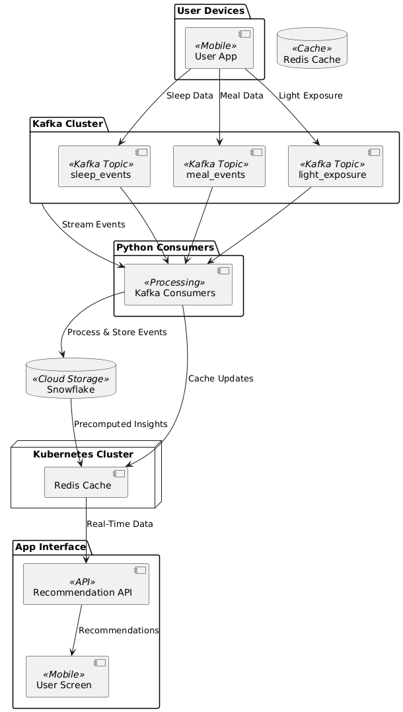
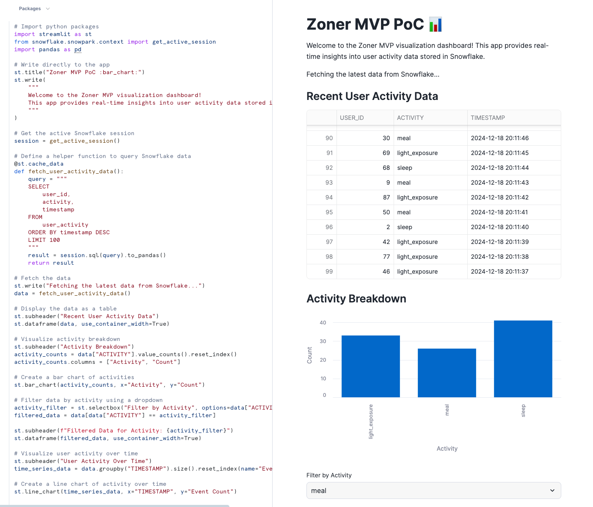
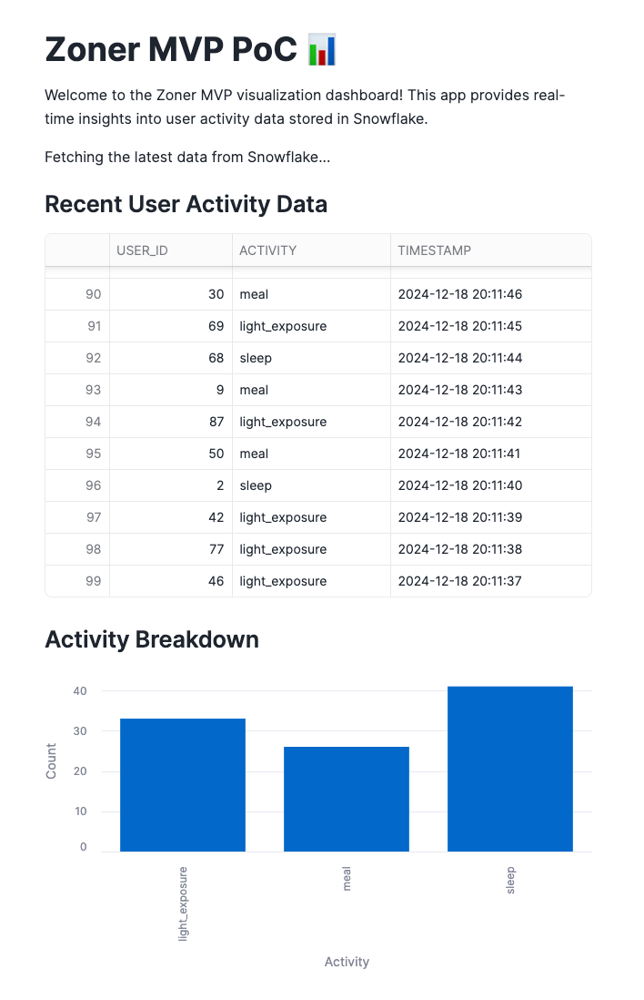
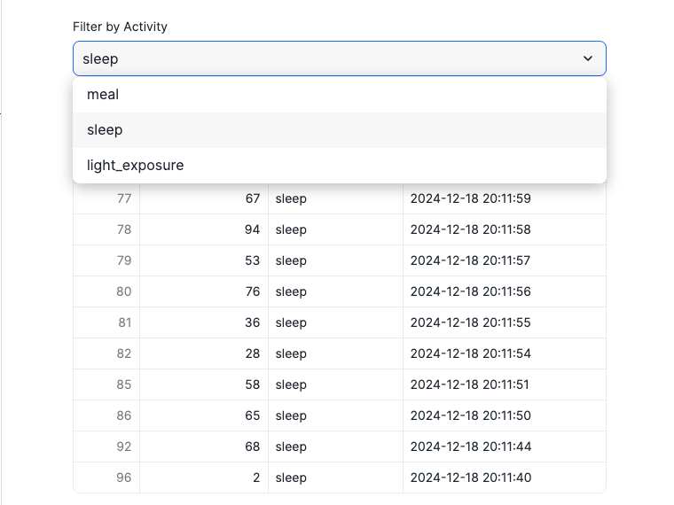

In my [first post](https://cynthialmy.github.io/2024-11-01-jetlag-logic/), I shared the vision behind **Zoner**—an app that helps families adjust their sleep schedules when traveling across time zones.

Then, in my [second post](https://cynthialmy.github.io/2024-11-01-jetlag-logic/), we dug deeper into the **science** of circadian rhythms, light exposure, and meal timing, key strategies for overcoming jet lag.

Today, I’m going to talk about the **backend design** that will power Zoner’s adaptive, data-driven recommendations. I’ve built the **Zoner MVP Proof of Concept (PoC)** [GitHub](https://github.com/cynthialmy/zoner-mvp). This PoC demonstrates the real-time backend architecture that will power Zoner’s adaptive sleep schedule recommendations. 🛠️

## **Table of Contents**
- [**Table of Contents**](#table-of-contents)
- [**The Challenge: Real-Time, Personalized Adjustments**](#the-challenge-real-time-personalized-adjustments)
- [**Zoner’s Backend Architecture**](#zoners-backend-architecture)
    - [**1. Real-Time Data Ingestion with Kafka**](#1-real-time-data-ingestion-with-kafka)
    - [**2. Event Processing with Python Consumers**](#2-event-processing-with-python-consumers)
    - [**3. Analytics and Storage with Snowflake**](#3-analytics-and-storage-with-snowflake)
    - [**4. Real-Time Recommendations with Redis**](#4-real-time-recommendations-with-redis)
    - [**5. Scalability and Resilience with Kubernetes**](#5-scalability-and-resilience-with-kubernetes)
  - [**Ensuring Data Integrity and Security**](#ensuring-data-integrity-and-security)
  - [**Future Enhancements**](#future-enhancements)
- [**The Zoner PoC**](#the-zoner-poc)
  - [**Data Analysis and Visualization: Streamlit + Snowflake**](#data-analysis-and-visualization-streamlit--snowflake)
  - [**What is Streamlit?**](#what-is-streamlit)
  - [**Features of the Zoner Dashboard**](#features-of-the-zoner-dashboard)
    - [**1. Visualizing All User Activity**](#1-visualizing-all-user-activity)
    - [**2. Filtering User Activity**](#2-filtering-user-activity)
- [**What’s Next?**](#whats-next)

---

## **The Challenge: Real-Time, Personalized Adjustments**

Zoner must address the complexities of **real-world disruptions**:

1. **Capture user activity**—sleep, meals, and light exposure—in real time.
2. **Process and analyze** continuous data streams accurately and quickly.
3. **Adapt dynamically** to changes like flight delays or missed naps.
4. **Scale seamlessly** without performance drops as user activity increases.

To solve these challenges, we designed a **real-time event-driven architecture** using **Kafka**, **Snowflake**, **Python**, and **Kubernetes**.

---

## **Zoner’s Backend Architecture**

Here’s the proposed design:



Let’s explore each component in detail.

---

#### **1. Real-Time Data Ingestion with Kafka**

At the core of Zoner is **Apache Kafka**, a distributed event-streaming platform that ingests real-time user events like sleep, meal times, and light exposure.

**Design Decisions:**
- **Topic Separation**: Events are categorized into separate topics (`sleep_events`, `meal_events`, `light_exposure`) for logical separation.
- **Partitioning Strategy**: Events are partitioned by `user_id` to maintain **ordering** of events for each user.
- **Scalability**: Kafka consumer groups enable parallel processing, ensuring linear scalability as user activity increases.

**Deduplication:**
Kafka’s idempotent producer ensures that duplicate events aren’t written at the source. Downstream consumers validate events using a combination of `event_id` and timestamp for extra reliability.

---

#### **2. Event Processing with Python Consumers**

Python consumers process Kafka events, validate their integrity, enrich data if needed, and push it to **Snowflake** for analytics.

**Key Features:**
- **Idempotent Event Handling**: Deduplication logic avoids reprocessing duplicate events.
- **Snowpipe for Ingestion**: Snowflake’s **Snowpipe** enables near real-time ingestion of validated data.
- **Lightweight Consumers**: Python, paired with the **confluent-kafka** library, is sufficient for the MVP.

**Why Python?**
Python’s flexibility and readability make it ideal for rapid prototyping. However, for high-throughput pipelines, we plan to integrate tools like **Kafka Streams** or **Apache Flink** to handle real-time transformations and aggregations.

---

#### **3. Analytics and Storage with Snowflake**

Snowflake serves as the **data warehouse**, storing raw events and enabling advanced analytics.

**How It Works:**
1. **Raw Event Storage**: Kafka events are stored in Snowflake for historical analysis and model training.
2. **Pre-Aggregated Insights**: Metrics like **sleep duration** and **missed light exposure** are pre-aggregated to minimize query latency.
3. **Streaming Updates**: Snowflake connectors stream updates to the cache to ensure recommendations reflect the latest activity.

**Addressing Real-Time Gaps:**
Snowflake is optimized for batch analytics, not sub-second querying. To bridge this gap:
- **Redis** stores pre-computed recommendations.
- Snowflake updates Redis incrementally every **60 seconds** or based on critical user events.

---

#### **4. Real-Time Recommendations with Redis**

**Redis** ensures sub-second response times by caching pre-computed insights for each user.

**Flow:**
1. Kafka → Python processing → Snowflake updates Redis cache.
2. The app queries Redis for near-instant recommendations.

**Cache Invalidation Strategy:**
Redis entries are updated based on:
- **Event Triggers**: Critical events like a new sleep log or flight delay immediately refresh the cache.
- **Scheduled Updates**: Background jobs refresh less critical entries every **60 seconds**.

---

#### **5. Scalability and Resilience with Kubernetes**

Kubernetes orchestrates all backend components—Kafka, Python consumers, Snowflake connectors, and Redis—ensuring fault tolerance and scalability.

**Key Features:**
- **Dynamic Scaling**: Kubernetes **Horizontal Pod Autoscaler (HPA)** scales Kafka consumers and Redis instances based on throughput and latency metrics.
- **Fault Recovery**: StatefulSets ensure Kafka brokers and Redis nodes recover gracefully from crashes.
- **Resource Efficiency**: Containers optimize CPU and memory utilization across workloads.

**Deployment Model:**
We plan to use **managed Kafka services** (e.g., Confluent Cloud or MSK) for production reliability, with Kubernetes managing other workloads.

---

### **Ensuring Data Integrity and Security**

Zoner prioritizes data accuracy and user trust from day one:
1. **At-Least-Once Delivery**: Kafka guarantees no data loss. Deduplication ensures correctness.
2. **Encryption**: Data is encrypted in transit (TLS) and at rest.
3. **Role-Based Access Control**: RBAC policies safeguard sensitive user data in Snowflake and Kubernetes.

### **Future Enhancements**

To scale and optimize further, we’re exploring:
1. **Stream Processing**: Integrating **Apache Flink** for real-time transformations and aggregations.
2. **Dynamic Flight APIs**: Trigger Kafka events based on flight status updates to keep schedules adaptive.
3. **Performance Dashboards**: Visualize Kafka lag, Snowflake latency, and recommendation accuracy using **Prometheus** and **Grafana**.
4. **Machine Learning Models**: Analyze historical patterns to predict optimal circadian rhythm adjustments.

---

## **The Zoner PoC**

The Zoner PoC implements a **real-time event-driven architecture**, tackling the complexities of jet lag adjustments:

1. **Capture real-world disruptions**—like missed naps or flight delays.
2. **Process continuous data streams** accurately and at scale.
3. **Generate personalized recommendations** with minimal latency.

Here’s a high-level view of the architecture:

```
[User Activity Events] --> [Kafka Topics (Ingestion)] --> [Python Consumers (Processing)] -->
    [SQLite (Temporary Storage)] --> [Future Plans: Snowflake, Redis, App Interface]
```

### **Data Analysis and Visualization: Streamlit + Snowflake**

As part of the Zoner MVP PoC, I integrated **Streamlit** with **Snowflake** to provide real-time visualization and analysis of user activity data. This interactive dashboard enables us to monitor, explore, and analyze trends in how users interact with the app—making it a powerful tool for validating and refining our backend architecture. 📊



---

### **What is Streamlit?**

[Streamlit](https://streamlit.io/) is an open-source Python framework designed for building data-driven web apps with minimal effort. With its simple syntax and integration capabilities, Streamlit allows developers to quickly create and deploy interactive dashboards.

In this case, we used Streamlit to visualize and filter data stored in Snowflake, giving us real-time insights into **user activity patterns**.

---

### **Features of the Zoner Dashboard**

The dashboard provides two key functionalities, highlighted by **screenshot 1** and **screenshot 2**:

#### **1. Visualizing All User Activity**

The dashboard fetches the latest 100 records of user activity from the Snowflake `user_activity` table and displays them in a **sortable, scrollable table**. You can easily view:
- User ID
- Activity type (e.g., `sleep`, `meal`, `light_exposure`)
- Timestamps for each event



#### **2. Filtering User Activity**

To analyze specific types of activity, the dashboard includes a **filtering feature**. Users can:
- Select an activity type (e.g., `sleep`) from a dropdown menu.
- View a filtered table and charts that only display relevant events.




## **What’s Next?**

This MVP is just the start. We’re excited to explore:
- **Stream Processing**: Integrating tools like Flink for real-time metric computation.
- **Flight API Integrations**: Proactively adjust recommendations based on flight delays.
- **Performance Dashboards**: Monitor activity patterns and sleep improvements.
- **Smart Notifications**: Remind parents about key actions like nap times, light exposure, and feeding schedules.

Zoner started as a small idea—a way to help my own family navigate jet lag. By combining **sleep science** with a real-time, data-driven backend, we’re building something bigger: an app that empowers families to travel better, adapt faster, and enjoy every moment together.

Check out the PoC on [GitHub](https://github.com/cynthialmy/zoner-mvp) and stay tuned for updates!
