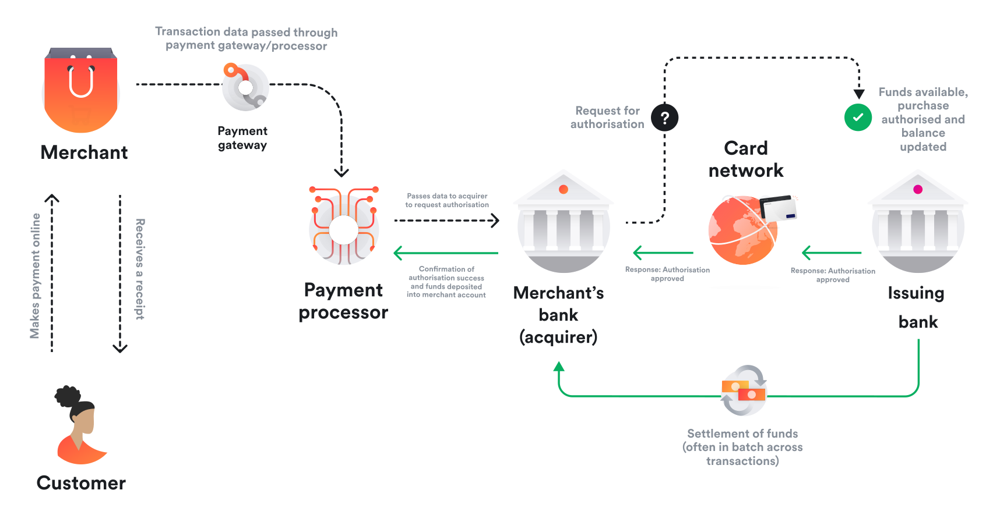

I joined **Airwallex** as a Product Management Intern at a time when the company was scaling rapidly across regions and customer segments.

Airwallex’s core promise was clear:
**make global payments feel local**.

Instead of routing money through slow and expensive correspondent banking networks, Airwallex invested heavily in:

* Local payment rails (ACH, SEPA, Faster Payments, etc.)
* Multi-currency accounts
* A unified internal ledger powering collections, FX, payouts, and cards

From the outside, this looks like a clean, modern alternative to traditional banks.
From the inside, I quickly learned that global payments are a constant negotiation between **ideal architecture** and **real-world constraints**.

That tension is exactly where my internship project sat.

---

## **The context: when local rails aren’t enough**

As Airwallex expanded into more markets and served larger, more complex customers, a recurring question surfaced in sales, onboarding, and support conversations:

> *“Can I pay suppliers in this country?”*

For many destinations, the answer was yes - via local rails.
But for long-tail corridors, specific currencies, and certain regulatory environments, **SWIFT was the only viable option**.

This created a product dilemma:

* Not supporting SWIFT meant incomplete global coverage
* Supporting it naively risked higher failure rates, opaque timelines, and operational overhead

Enterprise customers, in particular, needed **coverage guarantees**, not best-effort transfers.

---

## **The problem: SWIFT unlocks reach, but introduces risk**

SWIFT is powerful precisely because it is universal - but that universality comes at a cost.

From a product perspective, SWIFT payments had several challenges:

* Corridor-specific formatting and regulatory requirements
* Higher rejection and repair rates
* Limited transparency once a payment left our system
* Increased support load from delayed or failed transfers

Unlike local rails, failures were:

* Slow to diagnose
* Expensive to fix
* Difficult for customers to self-correct

The question wasn’t whether to support SWIFT.
It was **how to do it without eroding trust in the Airwallex experience**.

---

## **Reframing the challenge: SWIFT as a product problem**

Rather than treating SWIFT as “legacy infrastructure,” the team reframed the work as a **product quality and reliability problem**.

The guiding principle became:

> **Move failure upstream.**
> If a payment is going to fail, it should fail immediately - before entering the SWIFT network.

This reframing shaped everything that followed.

---

## Strategic Decision Framework

### Decision Tree: Support SWIFT or Not

| Path | Customer Outcome | Business Impact | Decision |
| --- | --- | --- | --- |
| Do not support SWIFT | Limited corridor coverage | Lost enterprise deals | Not acceptable |
| Support SWIFT without validation | Higher failure rate and support load | Trust erosion | Not acceptable |
| Support SWIFT with smart validation | Higher success rate with manageable ops | Scalable coverage | Chosen |

### Quantified Impact Model

I modeled the impact using a simple reliability equation so we could set clear targets.

**First-pass success** = 1 - failure rate
**Support load** = payment volume * failure rate * tickets per failure
**Failure cost** = support load * cost per ticket + delay penalties

**Targets for v1 validation:**
- Reduce failure rate by 30% in top corridors
- Cut average support handling time by 25%
- Achieve 60% self-serve correction rate for fixable errors

### Risk-Reward Analysis: Validation Strictness

| Validation Level | Reward | Risk | Decision Logic |
| --- | --- | --- | --- |
| Too strict | Lower downstream failure | Higher false blocks | Apply only to high-risk corridors |
| Balanced | Stable success rate | Moderate ops load | Default policy |
| Too loose | Higher conversion | High failure and support cost | Avoid |

## **What we built: validation as a growth strategy**

The core of the SWIFT expansion was not simply adding more countries or banks.
It was designing **intelligent validation** that balanced coverage, compliance, and conversion.

### **1. Corridor-aware validation**

SWIFT requirements vary widely by destination. We introduced dynamic rules based on:

* Destination country and currency
* Required beneficiary and bank details
* Intermediary bank constraints

This prevented payments that were technically valid but operationally doomed.

---

### **2. Bank identifier intelligence**

We strengthened checks around:

* BIC/SWIFT code structure and country alignment
* Deprecated or unsupported banks
* IBAN validation where applicable

A key insight:
**Passing format checks doesn’t guarantee acceptance downstream.**

---

### **3. Compliance embedded in the product flow**

Certain corridors require explicit purpose-of-payment or regulatory context.

Instead of handling this after submission, we worked with Compliance to surface these requirements **during payment creation**, reducing retries and manual intervention.

---

### **4. Actionable failure feedback**

SWIFT error messages are often opaque. We analyzed historical failures and:

* Grouped errors into fixable vs non-fixable categories
* Mapped bank responses into customer-understandable messages
* Enabled faster, more confident retries

This turned support-heavy failures into self-serve corrections.

---

## **The hardest tradeoff: precision vs conversion**

The biggest product tension was deciding **how strict validations should be**.

* Too strict → block legitimate payments
* Too loose → push failures downstream

We prioritized:

* High-frequency failure modes
* Errors customers could realistically fix
* Validations with the highest operational leverage

This allowed us to improve reliability without materially harming conversion.

---

## **Impact**

While metrics varied by corridor, the outcomes were consistent:

* Expanded payout coverage via SWIFT where no local rails existed
* Reduced repair and rejection rates
* Lower operational and support burden
* Enabled enterprise customers to consolidate global payouts on Airwallex

Most importantly, SWIFT became a **controlled fallback rail**, not a source of unpredictable failures.

---

## **What I learned as a PM intern**

This project shaped how I think about platform products:

1. Infrastructure becomes product the moment customers feel its failure
2. Coverage unlocks revenue, even when efficiency unlocks margin
3. Validation is a judgment call, not a checklist
4. The best payments experience is the one where nothing happens at all

---

## **Closing reflection**

Local rails power scale.
SWIFT powers reach.

The real product challenge is knowing **when and how to combine them** without compromising trust.

That balance - between ideal systems and messy reality - is where some of the most meaningful product work lives.
