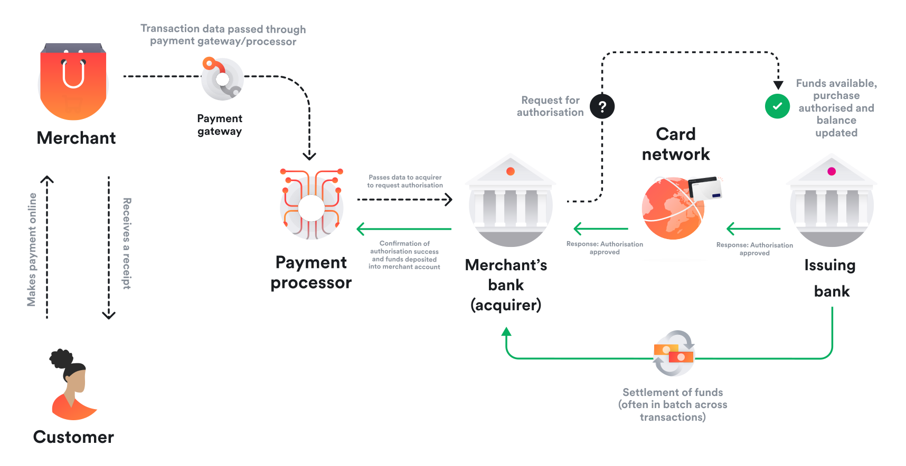

Airwallex invests heavily in local payment rails (ACH, SEPA, Faster Payments) to make global payments feel local. For most corridors, this works. For long-tail destinations, specific currencies, and regulated markets, SWIFT is the only viable option.

Supporting SWIFT meant global coverage, which enterprise customers demanded. It also meant higher failure rates, opaque timelines, and a support burden that scaled linearly with volume. I owned the product work to close that gap.

---

## The Problem

Unlike local rail failures, which surface immediately with clear error codes, SWIFT failures are slow to diagnose, expensive to fix, and difficult for customers to self-correct. A single failed SWIFT payment can generate multiple support tickets, manual investigation across banking partners, and days of customer uncertainty.

I analyzed one month of SWIFT-related support tickets and found that payment formatting errors and missing regulatory fields accounted for over 60% of all failures. These were preventable errors, caught only after the payment had already entered the correspondent banking network, where correction is slow and costly.

The problem was hard to see initially because the failures were distributed across teams. Sales saw a coverage gap. Support saw a ticket volume problem. Engineering saw a formatting issue. Nobody owned the full picture.

---

## Reframing: Move Failure Upstream

The obvious approach would have been to expand corridor coverage and handle failures reactively. That path scales the support burden proportionally with volume, making SWIFT increasingly expensive to operate as adoption grows.

I reframed the work as a reliability problem with one guiding principle:

> **If a payment is going to fail, it should fail immediately, before entering the SWIFT network, with a clear explanation the customer can act on.**

This reframing changed the conversation across teams. Engineering shifted from "how do we route more payments" to "how do we validate before routing." Compliance shifted from post-failure review to pre-submission surfacing. Support shifted from reactive investigation to self-serve enablement.

### Decision Framework

| Path | Customer Outcome | Business Impact | Decision |
|------|-----------------|-----------------|----------|
| Do not support SWIFT | Limited corridor coverage | Lost enterprise deals | Not acceptable |
| Support SWIFT without validation | Higher failure rate, higher support load | Trust erosion over time | Not acceptable |
| Support SWIFT with smart validation | Higher success rate, manageable ops | Scalable coverage | Chosen |

### Quantified Impact Model

I set clear targets using a simple reliability equation:

**First-pass success** = 1 - failure rate.
**Support load** = payment volume × failure rate × tickets per failure.
**Failure cost** = support load × cost per ticket + delay penalties.

Targets for v1: reduce failure rate by 30% in top corridors, cut average support handling time by 25%, achieve 60% self-serve correction rate for fixable errors.

---

## What We Built

### 1. Corridor-Aware Validation

SWIFT requirements vary by destination. A payment to India requires different beneficiary fields than a payment to Brazil. Intermediary bank requirements change by currency pair. We introduced dynamic validation rules based on destination country and currency, covering required beneficiary and bank details and intermediary bank constraints. This prevented payments that were technically valid in format but operationally doomed to fail at the correspondent bank level.

The key insight: passing format checks does not guarantee acceptance downstream. A structurally valid BIC code can still route to a bank that no longer processes the relevant currency, causing a silent failure days later. We built logic to catch these cases before submission.

### 2. Bank Identifier Intelligence

We strengthened checks around BIC/SWIFT code structure and country alignment, deprecated or unsupported bank routing, and IBAN validation where applicable. Historical failure analysis revealed that structurally valid identifiers routinely caused downstream rejections, confirming that format-only validation was insufficient.

### 3. Compliance Embedded in the Product Flow

Certain corridors require explicit purpose-of-payment codes or regulatory context that varies by jurisdiction. Previously, these requirements surfaced after submission: a payment would fail, support would identify the missing field, the customer would resubmit.

I worked with Compliance to map regulatory requirements by corridor and surface them during payment creation. This required negotiation. Compliance initially preferred post-submission review for audit trail reasons. We reached alignment by ensuring pre-submission surfacing still generated a complete audit log, satisfying their requirements while reducing customer friction.

### 4. Actionable Failure Feedback

SWIFT error messages from correspondent banks are opaque. "FIELD 59 INVALID" tells a customer nothing useful.

I analyzed the historical failure corpus, grouped errors into fixable versus non-fixable categories, and worked with UX to map bank response codes into customer-understandable messages with clear next steps. This turned support-heavy failures into self-serve corrections, allowing customers to fix and resubmit without opening a ticket.

---

## The Hardest Tradeoff: Precision vs. Conversion

Overly strict validation blocks legitimate payments and reduces conversion. Overly loose validation pushes failures downstream and generates support tickets. The product tension was real, and navigating it required explicit prioritization decisions.

First, we targeted high-frequency failure modes. The top 10 failure patterns accounted for over 70% of SWIFT rejections. Covering every edge case would have delayed launch without proportional impact.

Second, we only hard-blocked payments for errors that customers could realistically fix through self-serve (missing fields, incorrect bank codes). For ambiguous cases where we were unsure whether the validation was correct, we surfaced warnings rather than hard blocks.

Third, we prioritized by operational leverage: the rules that eliminated the most support tickets per implementation effort came first.

We tracked both failure rate and conversion weekly, with a 3% conversion drop as the hard ceiling for any individual validation rule. Any rule that exceeded that threshold was relaxed or converted from a block to a warning.

### Metrics-Driven Iteration

Validation rules were treated as experiments, not permanent fixtures. We A/B tested strictness by corridor, tuned error messaging for self-serve correction, and maintained three rollback triggers: corridor-level failure spikes, conversion drops beyond 3%, and support ticket volume rising above target.

---

## Impact

| Metric | Before | After | Change |
|--------|--------|-------|--------|
| SWIFT first-pass success rate | Baseline | +30% in top corridors | Fewer payments entering repair workflows |
| Support ticket volume (SWIFT) | Baseline | 25% reduction | Less manual investigation per failure |
| Self-serve correction rate | Near zero | 60%+ for fixable errors | Customers resolved issues without support |
| Average support handling time | Baseline | 25% reduction | Clearer error context reduced diagnosis time |

The strategic impact went beyond efficiency. SWIFT coverage expanded to corridors where no local rails existed, directly unblocking enterprise deals that required global payout guarantees. Enterprise customers could consolidate global payouts on Airwallex rather than maintaining separate banking relationships per region.

SWIFT shifted from being a source of unpredictable failures to a controlled fallback rail with known reliability characteristics. The operations team could forecast support load by corridor. The sales team could confidently quote coverage without qualifying it with risk caveats.

---

## What I Took Away

Infrastructure becomes a product problem the moment customers feel its failure. Enterprise customers do not adopt a payments platform for the corridors that already work well. They adopt it because they trust it will handle the corridors that are hard.

Every validation rule is a product decision that trades conversion against reliability. Treating validation as purely an engineering concern ignores the business consequences of both false blocks and false passes. The highest-impact work in payments makes complexity invisible: the best payment experience is the one where nothing goes wrong.
