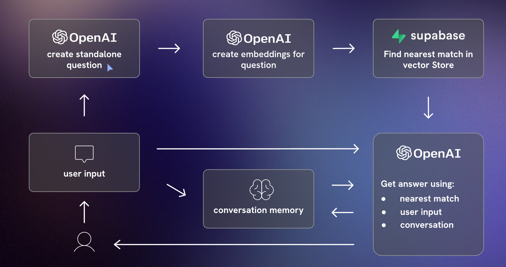
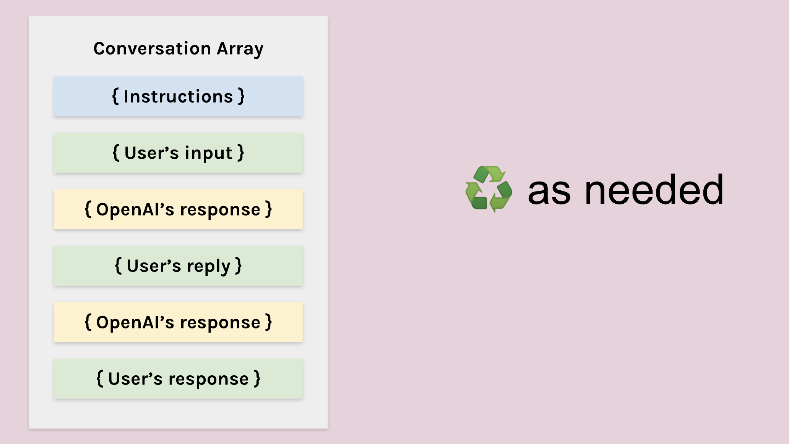
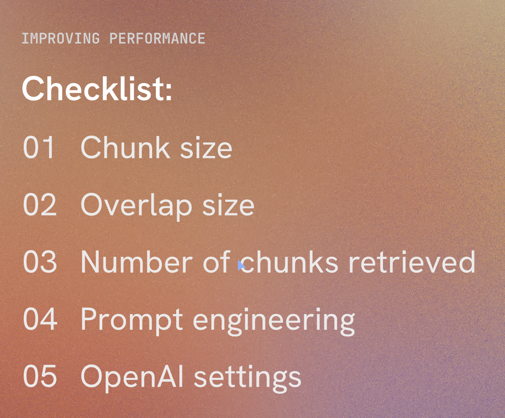

Over the past year building generative AI capabilities inside Volvo Cars' procurement organization, I confronted a fundamental challenge: how do you deploy generative AI in a high-stakes environment where mistakes carry legal, financial, and compliance consequences? The answer wasn't better models or more features. It was turning an inherently uncertain technology into a controllable decision system.

This reflection documents how I approach building AI products for enterprise environments where risk is non-negotiable. It captures the frameworks I developed for categorizing risk, defining decision boundaries, designing human-in-the-loop workflows, and allowing systems to degrade safely when uncertainty exceeds acceptable thresholds. This is not about building powerful AI. This is about building trustworthy decision systems that operate predictably under constraint.

A recent article on [Builder.io](https://www.builder.io/blog/build-ai) emphasized the importance of crafting unique AI products that stand out in an increasingly crowded field.

---

**Start With the Workflow, Not the Model**

When I began exploring how AI could improve procurement, the first instinct from many teams was to ask, “Which model should we use - GPT-4, GPT-3.5, or a fine-tuned alternative?” But I quickly realized none of those questions mattered until I deeply understood the workflow. So instead of opening an LLM playground, I started sitting with buyers and watching how they actually worked.

I noticed how they bounced between VGS, SI+, and VPC. I watched them dig through PDFs, reconcile price changes, hunt down attachments, and sometimes ask a colleague just to validate a detail. It became clear that the true problem wasn’t lack of functionality. It was cognitive load - the mental burden of connecting fragmented information scattered across three systems.

That insight fundamentally changed how I framed the project. Instead of “building an AI tool,” I focused on redesigning a workflow where AI acts as the semantic layer that unifies system knowledge and reduces uncertainty. AI became valuable not because it was clever, but because it removed friction that humans were never meant to carry.

---
**How I Frame Risk: Building Decision Boundaries Before Building Features**

Before writing a single line of code, I mapped procurement decisions across three dimensions: impact (financial/legal consequences), reversibility (can errors be caught and corrected), and scale (how many decisions per day). This risk matrix became the foundation for every design decision that followed.

**High Impact × Low Reversibility × High Scale = No Automation**
Contract compliance interpretations, pricing approvals above threshold, and supplier obligation assessments fell into this category. These decisions required mandatory human review. The AI system could surface relevant information and highlight risk factors, but could never make the final decision.

**Medium Impact × Medium Reversibility = AI-Assisted with Human-in-the-Loop**
Contract clause summarization, historical price comparisons, and amendment tracking fell here. The AI could generate outputs, but humans retained override authority. Every AI-generated answer included source citations, confidence signals, and an explicit escalation path.

**Low Impact × High Reversibility = Automation with Monitoring**
Document metadata extraction, clause categorization, and basic entity recognition could be automated. However, we implemented drift detection and periodic human audits to catch model degradation early.

**What Must Never Be Automated**
I established clear boundaries that protected both the business and users:
- Legal interpretation that could affect contractual obligations
- Pricing decisions above defined spend thresholds
- Supplier relationship assessments
- Any decision where the AI confidence score fell below our calibrated threshold
- Ambiguous queries that could be interpreted multiple ways

These boundaries were not technical limitations. They were strategic choices about where uncertainty was acceptable and where it was not.

---
**Reduce Risk Before Adding Intelligence**

Procurement work has legal, financial, and compliance implications. Mistakes have real costs. That meant I couldn’t approach the project by asking only what AI could do - I had to ask what AI should never do. This shift in perspective made risk-mitigation a strategic pillar rather than an afterthought.

Before designing any feature, I mapped potential failure points: where hallucinations might mislead buyers, which questions were too ambiguous for an LLM to answer confidently, and which contract interpretations must always remain grounded in source documents. By defining the “no-go zones” early, I ensured intelligence was layered into the system only where it could operate safely.

This taught me that discipline is far more important than ambition in enterprise AI. A safe, predictable system outperforms a “smart” but unreliable one every time.

---

**Safety Is Not a Feature - It’s a Multi-Layered Design Philosophy**

People often think AI safety is purely technical. But I now see it as a deeply cross-functional product challenge. For our procurement solution, I embraced a layered approach: selecting the right model, activating Azure OpenAI’s platform-level safety filters, designing strong retrieval and grounding workflows, and shaping the user experience so that misuse becomes harder than correct use.

Each layer solved a different part of the risk landscape. The model layer ensured we weren’t over-engineering; the safety system layer handled guardrails and logging; the grounding layer ensured every answer was traceable to the original contract; and the UX layer guided buyers into asking the right questions in the right way.

The cumulative effect was profound. The model didn’t feel magical - it felt trustworthy. And trust, I realized, is the most important product outcome in enterprise AI.

---

**The Four-Layered Approach to Harm Mitigation**

Developing safe generative AI solutions requires a structured approach. Here's how I applied this approach in our procurement AI project:

### 1. The Model Layer

Choosing the right model is crucial. While GPT-4 is powerful, a simpler model might suffice for specific tasks, reducing the risk of harmful content. I fine-tuned our model with procurement-specific data to ensure relevant and safe outputs.

**Example:**
- **Problem Identified:** Risk of generating inaccurate procurement contract details.
- **Solution:** Fine-tune GPT-4 with procurement-specific data to understand the nuances of contracts and queries.

### 2. The Safety System Layer

Platform-level configurations help mitigate harm. I used Azure OpenAI Service’s content filters to manage content severity and implemented abuse detection algorithms and alert systems to prevent misuse and respond promptly to any harmful behavior.

**Example:**
- **Problem Identified:** Potential for generating inappropriate responses.
- **Solution:** Implement content filters and abuse detection systems to monitor and flag inappropriate content.

### 3. The Metaprompt and Grounding Layer

Constructing prompts is critical. I used metaprompts to define behavioral parameters and applied prompt engineering to ensure safe outputs. Retrieval augmented generation (RAG) was used to pull contextual data from trusted sources, enhancing prompt quality and safety.

**Example:**
- **Problem Identified:** Ambiguity in user queries leading to harmful responses.
- **Solution:** Use metaprompts and RAG to provide clear, contextually relevant instructions, pulling data from reliable sources.

### 4. The User Experience Layer

This layer covers the application interface and user documentation. I designed user interfaces to limit inputs to specific subjects and types, validating inputs and outputs to reduce the risk of harmful responses. Transparent documentation about the system’s capabilities and limitations was also crucial.

**Example:**
- **Problem Identified:** Users inputting vague queries leading to misleading responses.
- **Solution:** Design interfaces guiding precise queries and provide thorough documentation on system use and limitations.

---

## Human-in-the-Loop as First-Class Design

One of the most critical insights from this project is that human oversight is not a fallback—it is the primary control mechanism. I designed the system so that humans and AI operate as partners in a structured decision workflow, with clear roles, feedback loops, and trust calibration mechanisms.

**Reviewer Workflows**

When the AI generates a contract interpretation or pricing analysis, buyers see:
1. The AI-generated summary (collapsed by default)
2. Source document excerpts with highlighted relevant sections
3. Confidence score and uncertainty indicators
4. Accept / Reject / Request Refinement options

Buyers are trained to review source documents first, then validate AI summaries. This inverted review flow prevents anchoring bias and ensures human judgment remains primary.

**Handling Disagreements**

When a buyer rejects an AI output, they must select a reason:
- Incorrect interpretation of contract language
- Missing relevant context
- Hallucinated information not present in source
- Ambiguous query requiring human expertise

These rejection signals feed back into the system in two ways:
- Immediate: Similar queries are routed to human review until the issue is resolved
- Batch: Rejection patterns inform prompt refinement and model retraining priorities

**Acceptance vs Rejection Signals Over Time**

I implemented monitoring dashboards that track:
- Acceptance rate by query type (target: >85% for medium-risk queries)
- Override rate by confidence band (validates calibration)
- Time-to-decision with vs without AI assistance
- False positive rate (AI flagged uncertainty but human found answer acceptable)

After the first month, we observed that acceptance rates increased from 72% to 89% as users learned how to formulate better queries. This validated that both the system and users needed calibration—not just the model.

**Trust Building Through Transparency**

Trust was not assumed. It was built through:
- Explicit confidence scores on every output
- Always-visible source citations
- Clear explanation of what the AI can and cannot do
- Regular communication about system updates and limitations
- Opt-in participation (no forced adoption)

Buyers reported that the system felt trustworthy not because it was always right, but because it was consistently transparent about when it was uncertain.

---

## Product Decisions This Framework Drove

This framework translated into clear product constraints:
- **No LLMs for deterministic tasks** like ID lookups and compliance rules; those stayed in backend logic.
- **Mandatory citations** for any contract interpretation that could affect spend or compliance.
- **Scope-first rollouts** (VGS before VPC/SI+) to protect data quality and user trust.
- **Escalation paths** for ambiguous queries, rather than forcing a confident answer.
- **Human-in-the-loop for all medium and high-risk decisions**, with override authority always retained by buyers.
- **Confidence thresholds tied to decision impact**, not uniform across all query types.
- **Explicit "I don't know" responses** when uncertainty exceeds acceptable bounds.

**Use AI Where It Adds Value - Not Everywhere It Can Fit**

One of the biggest lessons I learned is that not everything needs to be solved with an LLM. Some tasks are much better handled with deterministic rules, structured search, or backend logic. Many AI products fail because they assume a model should sit at the center of everything.

In the procurement project, I intentionally designed a hybrid architecture. The LLM handled reasoning and summarization. RAG handled truth and grounding. Backend logic handled IDs, metadata, and compliance rules. Traditional search handled exact matches. This mix allowed us to optimize for cost, accuracy, and speed - all without turning every interaction into a model call.

Ultimately, this approach helped me see AI not as a replacement for traditional software, but as an orchestrator. It’s the connective tissue that makes existing systems more accessible and intelligent, without overshadowing the strengths of traditional engineering.

---
**Differentiation Comes From Insight, Not Models**

One of the most humbling realizations I had is that access to models is no longer a competitive advantage. Anyone can use GPT-4. Anyone can wire up a RAG pipeline. But not everyone understands the domain deeply enough to design systems that truly solve problems.

What made our procurement AI successful wasn’t the sophistication of the model. It was the specificity of the product insight: how buyers search, what they fear missing, how contracts evolve, the subtle differences between VGS and VPC content types, the edge cases around amendments, and the real-world variation in document formats. These nuances made the solution genuinely defensible - because they came from watching, listening, and learning, not from plugging a model into a template.

---
**Validate With Real Users, Not Demos**

AI demos are thrilling - everything works, everything looks smart, everything is snappy. But the moment you bring real workflows and real documents into the picture, the cracks appear. That’s why I leaned heavily on user testing, both structured and exploratory.

Sometimes the AI responded perfectly; other times it struggled because the prompt was vague or the document structure was messy. But every failure taught us something useful. I discovered that users needed training as much as the model did. I realized that citations and transparency mattered more than conversational polish. And I learned which tasks needed hybrid logic rather than pure AI.

This reinforced a principle I now deeply believe in: AI products live or die in the hands of real users, not in the hands of engineers.

---

**Scoping Narrowly Is a Strategic Advantage**

The most counterintuitive lesson I’ve learned is that the fastest way to scale an AI system is to start with a very small scope. With procurement, I deliberately resisted the temptation to boil the ocean. Instead of integrating all procurement systems at once, I focused on VGS. That constraint allowed the team to validate our assumptions earlier, refine the safety layers quickly, and avoid building a system that was too complex to adopt.

By choosing depth over breadth, the team created a foundation that could scale predictably - and safely. It reminded me that good product strategy is often about protecting the team from over-ambition, not encouraging them to add more features.

---
## What We Intentionally Did NOT Do

Every strategic decision involves trade-offs. Here are the boundaries I consciously chose to protect system integrity, user trust, and sustainable scaling:

**We Did Not Pursue Full Automation**

Why: Procurement decisions involve legal interpretation, supplier relationships, and financial commitments. Fully automated decisions would eliminate accountability and create unacceptable risk exposure.

Trade-off Accepted: Lower throughput efficiency in exchange for error containment and user trust. Buyers spend more time per query than a fully automated system would require, but error rates remain near zero.

**We Did Not Optimize for Recall Early**

Why: In the initial phase, false positives (showing irrelevant contract clauses) were far less harmful than false negatives (missing critical obligations). We deliberately tuned the system for high precision, even if it meant surfacing fewer results.

Trade-off Accepted: Some queries returned "insufficient information" when relevant data existed elsewhere in the contract corpus. This was acceptable during trust-building. We expanded recall only after precision was validated.

**We Did Not Use GPT-4 for All Tasks**

Why: Not all tasks required the reasoning capabilities of GPT-4. For entity extraction, metadata tagging, and structured clause identification, lighter models (and sometimes rule-based logic) were faster, cheaper, and more reliable.

Trade-off Accepted: More complex system architecture with multiple model types. However, this reduced API costs by 60% and improved response latency for low-complexity queries.

**We Did Not Cover Edge Cases Initially**

Why: Procurement contracts have infinite edge cases—multilingual amendments, handwritten annotations, redacted sections, legacy formats. Attempting to handle all variations upfront would have delayed launch indefinitely.

Trade-off Accepted: The system explicitly flagged "unsupported document types" and routed them to human review. We prioritized the 80% common case, then iteratively expanded coverage based on real usage patterns.

**We Did Not Integrate VPC and SI+ Systems in Phase 1**

Why: VGS represented the highest-volume, most structured data source. Adding VPC and SI+ simultaneously would have introduced multiple sources of quality variation, making root cause analysis of failures impossible.

Trade-off Accepted: Users still needed to check VPC and SI+ manually for the first six months. This created workflow friction but allowed us to validate safety mechanisms, calibrate confidence thresholds, and build user trust before expanding scope.

**We Did Not Allow Free-Text Query Inputs Initially**

Why: Unstructured queries increased ambiguity and hallucination risk. Instead, we provided structured query templates ("Find pricing for Supplier X in Contract Y") that constrained the problem space.

Trade-off Accepted: Reduced user flexibility and conversational feel. However, query success rates were 40% higher with structured inputs. We gradually relaxed constraints once users understood system boundaries.

These trade-offs were not compromises. They were deliberate choices about where to invest complexity, where to accept limitations, and how to build trust before scaling.

---

## Evolution Over Time: What Broke, What Drifted, What We Learned

The system I deployed in month one looked very different from the system in month twelve. This section documents the critical adaptations we made as real-world usage exposed gaps in our initial assumptions.

**What Broke: Document Format Drift**

**Initial Assumption:** Procurement contracts follow standardized templates with consistent section headers and clause numbering.

**Reality:** After three months, we encountered contracts with non-standard formatting—merged PDFs, scanned images, multilingual sections, and supplier-specific templates.

**What Happened:** The RAG retrieval system failed to extract relevant sections because it relied on section header patterns that didn't exist in these documents. Similarity scores dropped below threshold, and queries returned "insufficient information" even when answers were present.

**System Adaptation:**
- Implemented fallback retrieval using sliding-window chunking for unstructured documents
- Added document quality scoring at ingestion (flagged low-quality scans for manual review)
- Updated user guidance to indicate which document types had lower AI coverage
- Created a feedback loop where users could flag missed information, triggering manual document reprocessing

**Impact:** Recall improved from 65% to 82% for non-standard documents within two months.

**What Drifted: Confidence Calibration**

**Initial Assumption:** Confidence scores above 0.85 correlate with high human acceptance rates.

**Reality:** After analyzing six months of override data, we discovered that confidence calibration degraded over time. Queries about pricing and amendments had higher rejection rates than queries about supplier metadata, even at identical confidence levels.

**What Happened:** The initial calibration was based on synthetic test cases, not real user behavior. As the query distribution shifted (more complex pricing questions, fewer simple lookups), the confidence-to-accuracy mapping became misaligned.

**System Adaptation:**
- Introduced query-type-specific confidence thresholds (pricing queries required 0.90, metadata queries required 0.80)
- Implemented quarterly recalibration using actual acceptance/rejection data
- Added confidence band visualization showing historical acceptance rates per band

**Impact:** False confidence (high score + user rejection) dropped from 18% to 6%.

**What Changed: Automation Boundaries**

**Initial Assumption:** Buyers would use the system primarily for quick lookups ("What is the lead time for Part X?").

**Reality:** Buyers increasingly asked complex multi-document questions ("Compare pricing across three suppliers for this component family over the last two years").

**What Happened:** These queries required reasoning across multiple contracts, which exceeded the system's initial design. Early attempts to answer resulted in incomplete or misleading summaries.

**System Adaptation:**
- Explicitly flagged multi-document queries as "complex analysis required" and routed to human analysts
- Built a secondary workflow where AI pre-aggregated relevant contract sections, but humans performed the final synthesis
- Added a "request detailed analysis" option that triggered an async workflow with human review

**Impact:** User satisfaction increased because expectations were properly set. Complex queries took longer but produced accurate results. Simple queries remained fast.

**What We Learned: User Behavior Evolves**

**Month 1-3:** Users treated the system as a search engine. Queries were short and transactional.

**Month 4-6:** Users began testing boundaries, asking increasingly complex questions to see what the system could handle.

**Month 7-12:** Power users developed sophisticated query strategies, while new users still needed basic training. This created a bifurcation in usage patterns.

**System Adaptation:**
- Implemented user segmentation (novice vs power user modes)
- Added contextual help that adapted based on user experience level
- Created a query suggestion feature that guided novice users toward well-supported question types

**Impact:** Onboarding time reduced by 40%. Power users gained flexibility without overwhelming new users.

**Key Lesson: Static Systems Fail in Dynamic Environments**

The most valuable realization was that trust in AI systems is not earned once—it is continuously maintained. Every month brought new edge cases, shifting user expectations, and evolving document formats. The system survived because it was designed to adapt, not to be perfect on day one.

---
Closing Reflection

Building AI for procurement at Volvo Cars taught me that the hardest problems in enterprise AI are not technical—they are problems of control under uncertainty. How do you deploy generative models in environments where errors have legal consequences? How do you maintain trust when the technology is inherently probabilistic? How do you build systems that degrade gracefully instead of failing catastrophically?

The answer is not better models. It is better decision architectures.

Today, when I design AI systems, I start by mapping risk, defining boundaries, and designing for failure modes. I ask where automation stops, where humans must remain in control, and how the system should behave when confidence is low. I prioritize transparency over cleverness, constraints over flexibility, and evolution over perfection.

This is the discipline that separates AI experiments from production systems. It is the difference between building features and building trust.

The AI products I build feel predictable, transparent, and sometimes boring. They do not surprise users. They do not make decisions autonomously when uncertainty is high. They degrade safely. They earn trust through consistency.

Because in high-stakes environments, the most valuable AI systems are the ones that turn ambiguous, risky problems into controllable, auditable decisions—every time, for every user, without surprises.

---

## Appendix

### User Study and Implementation

A thorough user study was vital in identifying and addressing potential problems:
- **User Onboarding:** Training users on how to interact with the AI tool, emphasizing prompt construction.
- **Controlled Experiments:** Structured scenario-based testing to ensure functionalities and safety measures.
- **Exploratory Testing:** Open-ended user engagement to provide feedback on usability and potential harms.

**Findings:**
- Users initially struggled with prompt specificity, leading to irrelevant outputs. Training improved this.
- Content filters effectively flagged inappropriate responses, enhancing safety.
- Feedback highlighted the importance of clear documentation and user guidance to prevent misuse.

### Avoiding Common Pitfalls in AI Product Development

Reflecting on Builder.io’s article, here are some pitfalls to avoid and strategies to develop effective AI applications:

### 1. **Lack of Unique Features**
Many AI products are mere extensions of existing models like ChatGPT. This easy route often leads to products lacking distinctiveness, rendering them easily replicable and undifferentiated.

Even if you develop substantial technology with LLMs where OpenAI plays a minor yet vital role, you might still face two significant challenges.

### 2. **Cost and Customization Constraints**
Large Language Models (LLMs) are not only costly and slow but also often include irrelevant data for specific applications, offering limited customization. For instance, GitHub Copilot, as reported by the Wall Street Journal, was [operating at a loss per user](https://www.wsj.com/tech/ai/ais-costly-buildup-could-make-early-products-a-hard-sell-bdd29b9f), indicating a mismatch between user willingness to pay and the cost of running services on top of LLMs.

Moreover, while fine-tuning can help, it falls short of providing the level of customization needed for specific use cases.

### 3. **Performance Limitations**
The slow response time of LLMs is a significant drawback, especially in applications where immediate feedback is crucial.

### A More Effective AI Development Strategy

### 1. **Develop a Custom Toolchain**
Instead of solely depending on pre-trained models, consider creating a bespoke toolchain. This method, which combines a fine-tuned LLM with custom compilers and models, can yield faster, more reliable, and cost-effective solutions.

### 2. **Begin with Non-AI Solutions**
Start by addressing the problem with standard programming techniques. This approach helps pinpoint where AI can truly add value, avoiding the pitfall of over-relying on AI for solvable issues through traditional coding.

### 3. **Employ Specialized AI Models**
Use AI models specifically where they fill distinct gaps. For example, object detection models can be efficiently trained for specific tasks using platforms like Google's Vertex AI or LangChain for highly customized applications.

### 4. **Merge Code with AI**
A balanced mix of hand-coded logic and specialized AI models can lead to efficient and impactful solutions. This hybrid approach fosters the creation of responsive, high-quality products.

### Harnessing LangChain and Vector Stores

LangChain is a framework that simplifies the development of applications using large language models, ideal for tasks like document analysis and chatbots. Vector stores, meanwhile, are crucial for managing and retrieving vector data, essential in machine learning applications.
