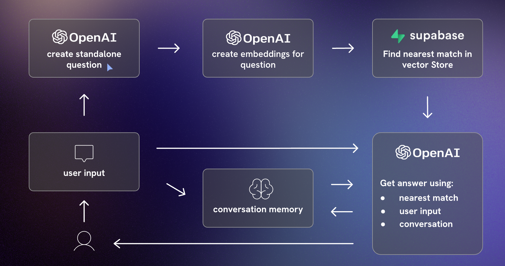
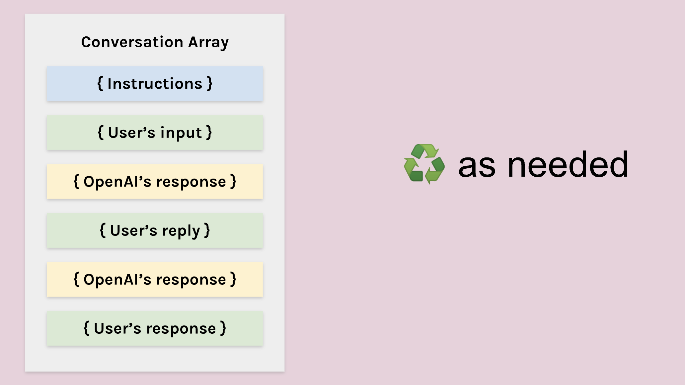
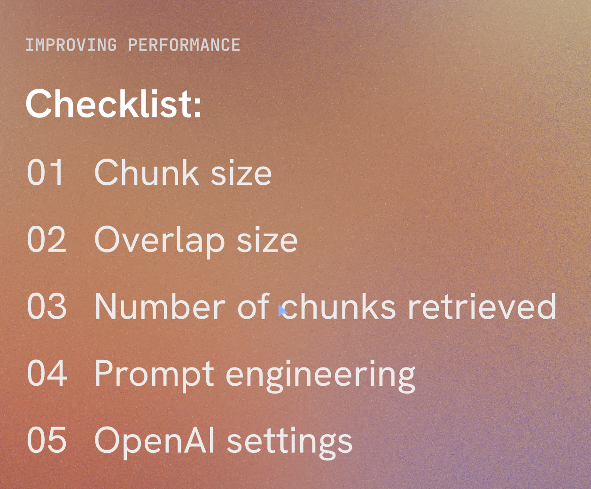

Over the past year building generative AI inside Volvo Cars' procurement organization, I confronted a design problem that most AI product literature skips: how do you make an inherently uncertain technology behave predictably in an environment where mistakes carry legal, financial, and compliance consequences?

The answer is a layered architecture where each layer catches failures the others miss. Control and trustworthiness are the product outcomes here, not model capability in isolation.

A recent article on [Builder.io](https://www.builder.io/blog/build-ai) made a related argument: AI product differentiation comes from specific product insight. In enterprise settings, risk design has the same weight.

---

## Start With the Workflow, Not the Model

The first instinct from many teams was to ask which model to use: GPT-4, GPT-3.5, or a fine-tuned alternative. Those questions only matter after you understand the workflow.

I started by sitting with buyers and watching how they worked. They bounced between VGS, SI+, and VPC. They dug through PDFs, reconciled price changes, hunted down attachments, and asked colleagues to validate details. The true problem was cognitive load: the mental burden of connecting fragmented information across three systems.

That insight changed the project framing. Instead of "building an AI tool," I focused on redesigning a workflow where AI acts as the connective tissue that unifies system knowledge and reduces uncertainty. AI became valuable by removing friction that humans were never meant to carry, regardless of whether the model felt clever in the moment.

---

## Risk Framing: Decision Boundaries Before Features

Before writing any code, I mapped procurement decisions across three dimensions: impact (financial and legal consequences), reversibility (can errors be caught and corrected), and scale (how many decisions per day).

**High Impact × Low Reversibility × High Scale = No Automation.** Contract compliance interpretations, pricing approvals above threshold, and supplier obligation assessments. The AI could surface relevant information and highlight risk factors but could never make the final decision.

**Medium Impact × Medium Reversibility = AI-Assisted with Human-in-the-Loop.** Contract clause summarization, historical price comparisons, amendment tracking. AI could generate outputs; humans retained override authority. Every answer included source citations, confidence signals, and an escalation path.

**Low Impact × High Reversibility = Automation with Monitoring.** Document metadata extraction, clause categorization, basic entity recognition. Automated, but with drift detection and periodic human audits.

The boundary list that followed was explicit. Legal interpretation affecting contractual obligations: never automated. Pricing decisions above defined spend thresholds: never automated. Supplier relationship assessments: never automated. Any query where AI confidence fell below the calibrated threshold: never automated. Ambiguous queries interpretable in multiple ways: never automated.

These boundaries were strategic choices about where uncertainty was acceptable and where it had to stay out of the system entirely.

---

## The Four Layers

Safety in enterprise AI is a cross-functional product challenge, not a purely technical one. The procurement system uses four layers, each addressing a different failure mode. No single layer is sufficient. The cumulative effect is what makes the system trustworthy.

### Layer 1: Model Selection

The model layer is about using the right tool for each task, not defaulting to the most powerful option available. Not every task in the procurement system needed GPT-4's reasoning capabilities. For entity extraction, metadata tagging, and structured clause identification, lighter models and sometimes rule-based logic were faster, cheaper, and more reliable.

In practice, the system used a hybrid architecture. The LLM handled reasoning and summarization tasks where natural language understanding was essential. RAG handled truth and grounding by retrieving from actual contract documents. Backend logic handled supplier IDs, metadata lookups, and compliance rules that are deterministic by nature. Traditional search handled exact-match queries.

This mix reduced API costs by 60% and improved response latency for low-complexity queries. The principle: many problems are better solved without an LLM at the center. AI products fail when they assume a model should sit at the center of everything.

As [Builder.io](https://www.builder.io/blog/build-ai) argued, beginning with non-AI solutions for solvable problems and layering specialized models only where they fill distinct gaps yields faster, more reliable, and more cost-effective products than wrapping everything in a single large model. GitHub Copilot was [reported operating at a loss per user](https://www.wsj.com/tech/ai/ais-costly-buildup-could-make-early-products-a-hard-sell-bdd29b9f), illustrating the mismatch between user willingness to pay and the cost of running every interaction through a frontier model.

### Layer 2: Platform Safety Systems

Platform-level configurations handle categories of harm that are orthogonal to product logic. The system used Azure OpenAI Service's content filters to manage content severity across categories. Abuse detection algorithms and alert systems monitored for misuse patterns and flagged anomalous behavior.

These guardrails operated independently of the application logic. If the content filters flagged a response, it was blocked regardless of whether the RAG pipeline considered it a valid answer. This independence matters: a grounding failure that produces a technically relevant but harmful response still gets caught.

The platform layer also provided logging infrastructure. Every interaction was logged with the query, retrieved documents, generated response, confidence score, and user feedback. This audit trail served both compliance requirements and system improvement.

### Layer 3: Metaprompt and Grounding

The grounding layer is where most of the product-specific safety engineering happens. It determines what the system can say and what it must refuse to say.

Metaprompts defined behavioral parameters: the system operates in retrieval-only mode, never generates legal text, always cites sources, and states uncertainty explicitly when confidence is low. These constraints were encoded in the system prompt, not left as aspirational guidelines.

RAG provided the grounding mechanism. Every response was anchored in retrieved contract documents. If the retrieval step returned no relevant documents or documents below the relevance threshold, the system responded with "No confident answer available" rather than generating a plausible-sounding answer from parametric knowledge.

When retrieved sources contradicted each other, the system surfaced the conflict and routed to human judgment rather than choosing one interpretation. This was critical for procurement, where two contract versions might contain different pricing terms, and choosing the wrong one has direct financial consequences.

The confidence threshold (0.85 for most queries, 0.90 for pricing queries) acted as a quality gate. Queries below threshold were routed to manual search with logging for analysis. Over time, these thresholds became query-type-specific based on observed acceptance rates, because a 0.85 confidence on a metadata lookup meant something different from a 0.85 on a contract interpretation.

### Layer 4: User Experience

The UX layer is the last line of defense and the most underappreciated. Its goal: make misuse harder than correct use.

Initially, the system did not accept free-text queries. Instead, it provided structured query templates ("Find pricing for Supplier X in Contract Y") that constrained the problem space. Query success rates were 40% higher with structured inputs. Free-text was introduced gradually as users understood system boundaries.

Every response displayed source citations before the AI-generated summary. The summary was collapsed by default; the source excerpts were visible first. This inverted review flow prevented anchoring bias: buyers saw the evidence before the AI's interpretation, ensuring human judgment remained primary.

Confidence scores were visible on every output. The system's capabilities and limitations were documented and linked from the interface. Participation was opt-in; no forced adoption.

The UX also handled graceful degradation visibly. When the system could not answer confidently, it displayed an explicit "I don't know" message with a link to the manual search path. When a document type was unsupported, it said so and routed to human review. This transparency built trust: buyers reported that the system felt reliable precisely because it was honest about its limitations.

---

## Human-in-the-Loop as First-Class Design

Human oversight is the primary control mechanism, with the same weight as any model choice. The system was designed so that humans and AI operate as partners in a structured decision workflow.

When the AI generates a response, buyers see the AI-generated summary (collapsed by default), source document excerpts with highlighted relevant sections, a confidence score with uncertainty indicators, and Accept / Reject / Request Refinement options. Buyers are trained to review source documents first, then validate AI summaries.

When a buyer rejects an output, they must select a reason: incorrect interpretation of contract language, missing relevant context, hallucinated information not present in source, or ambiguous query requiring human expertise. These rejection signals feed back in two ways. Immediately: similar queries route to human review until the issue is resolved. In batch: rejection patterns inform prompt refinement and retrieval tuning priorities.

Monitoring dashboards track acceptance rate by query type (target: >85% for medium-risk queries), override rate by confidence band (validates calibration), time-to-decision with vs. without AI assistance, and false positive rate (AI flagged uncertainty but human found the answer acceptable).

After the first month, acceptance rates increased from 72% to 89% as users learned to formulate better queries. This validated that both the system and users needed calibration alongside the model.

Trust was built deliberately: explicit confidence scores, always-visible citations, clear explanation of capabilities and limits, regular communication about updates, and opt-in participation. Buyers reported that the system felt trustworthy when it stayed transparent about uncertainty, even on imperfect answers.

---

## Product Decisions This Framework Drove

The four-layer framework translated into concrete product constraints:

No LLMs for deterministic tasks. ID lookups and compliance rules stayed in backend logic.

Mandatory citations for any interpretation that could affect spend or compliance.

Scope-first rollouts: VGS before VPC and SI+, to protect data quality and user trust.

Escalation paths for ambiguous queries, rather than forcing a confident answer.

Human-in-the-loop for all medium and high-risk decisions, with override authority always retained by buyers.

Confidence thresholds that vary by decision impact: stricter bars for pricing than for metadata lookups.

Explicit "I don't know" responses when uncertainty exceeds acceptable bounds.

---

## What Differentiation Actually Looks Like

Access to models is no longer a competitive advantage on its own. Anyone can use GPT-4 or wire up a RAG pipeline. Fewer people understand the domain deeply enough to design systems that solve problems.

What made the procurement AI defensible was the specificity of the product insight: how buyers search, what they fear missing, how contracts evolve, the differences between VGS and VPC content types, the edge cases around amendments, the real-world variation in document formats. Those nuances came from watching, listening, and learning. They made the system genuinely differentiated compared with dropping a model into a generic template.

AI demos are compelling: everything works, everything looks smart. The moment you bring real workflows and real documents, the cracks appear. Users need training as much as the model does. Citations and transparency matter more than conversational polish. Some tasks need hybrid logic rather than pure AI. AI products live or die in the hands of real users, not in engineering demos.

---

## What Changed Over Twelve Months

The system deployed in month one looked different from the system in month twelve. Three categories of adaptation illustrate why static AI systems fail in dynamic environments.

**Document format drift.** The initial assumption was that contracts follow standardized templates. After three months, the system encountered merged PDFs, scanned images, multilingual sections, and supplier-specific templates. The RAG system relied on section header patterns that did not exist in these documents. Fix: fallback retrieval using sliding-window chunking, document quality scoring at ingestion, and a feedback loop where users flag missed information. Recall for non-standard documents improved from 65% to 82% within two months.

**Confidence calibration decay.** Confidence scores above 0.85 initially correlated with high acceptance rates. After six months, pricing and amendment queries had higher rejection rates than metadata queries at identical confidence levels. The initial calibration relied on synthetic test cases that did not match real query distributions. Fix: query-type-specific thresholds, quarterly recalibration using acceptance/rejection data, and confidence band visualizations showing historical acceptance rates. False confidence (high score plus user rejection) dropped from 18% to 6%.

**User behavior evolution.** Month 1 through 3: users treated the system as a search engine with short, transactional queries. Month 4 through 6: users tested boundaries with increasingly complex questions. Month 7 through 12: power users developed sophisticated strategies while new users still needed basic guidance. Fix: user segmentation (novice vs. power user modes), contextual help adapted to experience level, and query suggestions that guided novice users toward well-supported question types. Onboarding time dropped by 40%.

The most valuable realization: trust must be maintained continuously. Every month brought new edge cases, shifting expectations, and evolving document formats. The system survived because it was designed to adapt from day one.

---

## What Actually Matters

The hardest problems in enterprise AI are problems of control under uncertainty, not technical novelty. How do you deploy generative models where errors have legal consequences? How do you maintain trust when the technology is inherently probabilistic? How do you build systems that degrade gracefully instead of failing catastrophically?

The durable answer is better decision architectures, not incrementally better models alone.

The AI products I build feel predictable, transparent, and sometimes boring. They do not surprise users. They do not make decisions autonomously when uncertainty is high. They degrade safely. They earn trust through consistency.
