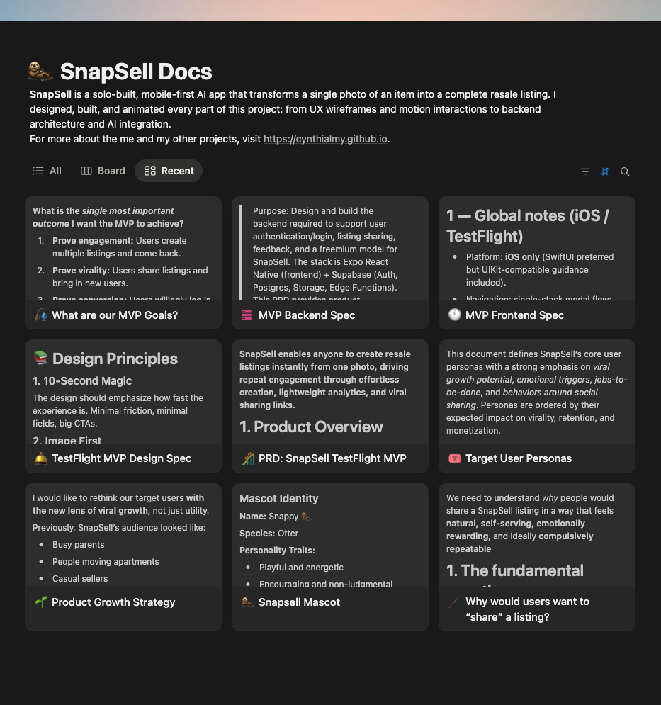

**SnapSell** is a solo-built case study in managing AI quality risk within constrained economics. The product transforms a single photo into a complete resale listing, but the core challenge was designing a system that balances inference costs, hallucination risk, and user trust without human review infrastructure. I designed every decision boundary: from prompt engineering that constrains output variability to UX patterns that build trust in AI-generated content.

>**For all related documentation, please go to <a href="https://cynthiamengyuanli.notion.site/2c2666d46e7080358435dd41c91747bf?v=2c2666d46e70818b9772000cb7fd78cd&source=copy_link" target="_blank" rel="noopener">Notion site</a> where I listed PRD, strategy, design process, technical architecture, and more.**
>

---

## Problem & Risk Landscape

As someone who frequently sells second-hand items online, I identified friction in listing creation: 5–10 minutes per item across platforms like Depop, Facebook Marketplace, and Poshmark. The question was whether AI could eliminate this friction without introducing new risks that would break user trust.

**The Core Uncertainty:** Vision models like GPT-4o can extract metadata from photos, but they also hallucinate, misjudge condition, and occasionally generate inappropriate content. For a solo MVP with no moderation team, this created a high-risk, high-variability problem.

**Risk Categorization Framework:**

| Risk Type | Impact | Reversibility | Mitigation Strategy |
|-----------|--------|---------------|---------------------|
| **Content hallucination** (wrong brand, false claims) | High — damages seller credibility | High — user catches before posting | Prompt constraints + preview-before-copy UX |
| **Inappropriate content generation** | Critical — platform bans | Low — already posted | Conservative prompt guardrails + manual review for v1 |
| **Price misjudgment** | Medium — item doesn't sell or undersells | High — seller adjusts | Price suggestion only, not auto-post |
| **Inference cost drift** | High — unit economics break | Medium — requires prompt redesign | Cost per listing tracking + prompt token budget |

**Decision Boundaries Defined Early:**

1. **Never automated:** Posting to marketplaces (user must review and manually post)
2. **AI-assisted:** Text generation with structured output format to reduce hallucination surface area
3. **Human-in-the-loop:** Every listing previewed before copy/share; user is final decision-maker

The goal was not to build a fully automated listing system — it was to design a **controllable decision system** where AI handles text generation speed but humans retain authority over accuracy and appropriateness.

---

## System Design Under Uncertainty

### Decision Flow Architecture

SnapSell's architecture is designed around three failure scenarios: API timeout, low-confidence outputs, and inappropriate content detection.

**Core System Flow:**

```
User uploads photo
  ↓
Image preprocessing (compression, orientation correction)
  ↓
GPT-4o Vision API call (7s avg, 15s timeout)
  ├─ Success → Parse structured output
  ├─ Timeout → Retry once, then fallback message
  └─ API error → Generic error state + analytics log
  ↓
Output validation (length checks, profanity filter)
  ├─ Pass → Render listing preview
  └─ Fail → Regenerate with stricter prompt OR manual fallback message
  ↓
User preview & decision
  ├─ Copy/share → Success metric logged
  ├─ Edit → Manual adjustment (deferred to v2)
  └─ Abandon → Drop-off metric logged
```

**Degradation Strategy:**

When the AI fails, the system does not guess. Instead:

1. **API failure:** User sees "Unable to generate listing. Please try again." — no partial output that might mislead.
2. **Low-confidence scenario:** Prompt engineered to return "Unable to determine [field]" rather than hallucinate.
3. **Timeout:** Single retry with exponential backoff, then clear failure message. No silent failures.

**Why This Design:**

Full automation would optimize for speed but break trust. Previewing every output before copy introduces friction, but it keeps the user in control and prevents reputational damage from AI errors. This trade-off favors long-term retention over short-term conversion.

---

## Market & Positioning

SnapSell is positioned for casual, mobile-first sellers who abandon listings due to text-writing friction. The competitive set isn't other AI apps — it's the friction inside existing marketplaces and generic photo editors that still require manual copywriting.

The differentiator is the **photo-first, zero-form flow** combined with **transparent AI boundaries**: users understand they are reviewing AI suggestions, not trusting a black box. That positioning favors speed and trust over deep customization.

---

## Design Process

### Step 1: Defining the Core Flow

I sketched out the simplest user flow possible: **Upload → Generate → Copy.** Every other feature had to serve this moment. The challenge was to make this fast, intuitive, and emotionally rewarding.


### Step 2: Creating a Friendly Experience with Snappy

While designing early prototypes, I realized the app felt a bit sterile: just another AI tool. To make it more inviting, I created **Snappy**, a cheerful otter mascot who guides users through the process.

I hand-drew Snappy in **Procreate** using soft, rounded shapes and warm tones to give it personality: curious, capable, and friendly. Snappy’s design intentionally mirrors the product’s philosophy: **AI that feels human and supportive, not mechanical.**

To bring Snappy to life, I used **Procreate’s frame animation tools** to draw small motion loops: tail swishes, blinks, and waves: and refined those animations in **Figma** for smooth transitions. When the AI finishes generating a listing, Snappy gives a little celebratory wave: a subtle moment of joy that makes the interaction feel alive.

These touches transformed the app’s tone. Test users mentioned Snappy by name in feedback: one said, *“I feel like the otter just helped me sell something!”* That’s exactly the kind of emotional connection I wanted.


### Step 3: Motion & Microinteractions

Every state change: from upload progress to generation completion: has an intentional animation curve. Using **Expo Reanimated**, I designed transitions that evoke flow and anticipation. Even small movements, like Snappy “thinking” while the AI generates text, help users understand what’s happening behind the scenes.


### Step 4: Technical Architecture & Human-in-the-Loop Design

I chose a **FastAPI backend** for async processing and low latency, connected to **GPT-4o Vision** for image-to-text transformation. The **frontend** is built with **Expo + React Native**, optimized for mobile-first interaction.

**Key Architectural Decisions for Risk Mitigation:**

1. **Structured prompt with output schema:** Forces the model to return JSON with specific fields (title, description, price, hashtags). This reduces free-form hallucination and makes validation easier.
2. **Client-side preview enforcement:** The app never auto-posts. Users must explicitly tap "Copy" or "Share" after reviewing the generated listing. This introduces friction but preserves control.
3. **Analytics on every state transition:** Tracks upload success, generation latency, copy rate, and abandonment points. This creates a feedback loop for prompt tuning.

**Human-in-the-Loop as First-Class Design:**

The preview screen is not optional — it's the core decision point where users validate AI output. This design embeds human judgment into the system:

- **User acceptance signal:** Copy/share action indicates trust in output quality.
- **User rejection signal:** Abandoning the preview indicates poor output (logged for analysis).
- **No override mechanism in v1:** Users cannot edit listings in-app (deferred to v2). This was intentional — forcing binary accept/reject creates cleaner feedback data for model tuning.

This architecture treats the user as the **final validator**, not a passive recipient of AI output. The system's goal is to earn that validation consistently.

---

## Product Strategy & Decision Framework

### Problem Hypothesis

If a seller can generate a complete listing from one photo in under 10 seconds, then listing completion increases and abandonment drops, because the most painful step becomes one tap instead of a multi-field form.

### Alternatives Considered

| Option | Strength | Risk | Why Not Chosen |
| --- | --- | --- | --- |
| Template builder | Low cost and predictable output | Still requires manual typing | Did not remove the core friction |
| Multi-step form with AI assist | Easier to implement than full vision | Still slow for mobile sellers | Too many steps for casual use |
| Photo-first AI generation | One-step capture and share | Requires stronger model quality | Best alignment with core insight |

### Decision Matrix: Mobile-first vs Web-first

| Criteria | Weight | Mobile-first | Web-first |
| --- | --- | --- | --- |
| Capture speed at listing time | 5 | 5 | 2 |
| Real user behavior | 4 | 5 | 3 |
| Iteration speed for UX | 3 | 4 | 4 |
| Distribution and sharing | 3 | 4 | 4 |
| Total score |  | 62 | 43 |

### Tradeoff Analysis: Instant Use vs Login

| Choice | Benefit | Cost | Decision |
| --- | --- | --- | --- |
| Instant use | Lower activation friction and faster testing | Fewer user-level insights | Chosen for MVP |
| Login required | Better retention data and personalization | Higher drop-off at first use | Deferred to v2 |

### Unit Economics Model

To keep the product viable as freemium, I modeled cost per listing against expected value per active user.

**Cost per listing** = Vision call + text generation call + storage + infra
**Value per active user** = (monthly price or ad value) * conversion rate / listings per user
**Target**: cost per listing stays below 10% of value per active user

Worked example (conservative):
- If a user creates 8 listings/month and ARPU is €2.00 with 5% conversion, then value per listing is €0.025.
- That implies a target inference cost of **≤ €0.0025 per listing**, which is why the prompt is tightly scoped and the model call count is minimal.

This model kept the focus on fast iteration without letting inference costs drift above viable thresholds.

## Trade-Offs: What We Intentionally Did NOT Do

Every decision to automate came with a conscious decision to **not** automate something else. These boundaries define the product's risk tolerance:

| Trade-Off | What We Avoided | Why We Avoided It | What We Did Instead |
|-----------|-----------------|-------------------|---------------------|
| **No auto-posting to marketplaces** | Full automation of listing publication | Legal risk (terms of service violations), quality risk (AI errors damage seller reputation) | Generated text only; user copies and posts manually |
| **No in-app editing (v1)** | Inline text editing to refine AI output | Complexity drift; harder to track what users change and why | Binary accept/reject for cleaner feedback signals |
| **No multi-photo mode** | Generating listings from 5+ angles | Inference cost explosion (5× API calls per listing) | Single-photo constraint; defer multi-photo to post-validation |
| **No dynamic pricing model** | Real-time market pricing using resale data APIs | Data acquisition cost; liability for bad pricing advice | Static price suggestion based on category heuristics only |
| **No user accounts (v1)** | Personalized listing history and style learning | Login friction kills activation; GDPR/data storage complexity | Anonymous usage; analytics only tracks aggregate behavior |

**Why These Trade-Offs Matter:**

Each avoided feature represents a risk boundary. Auto-posting would have increased conversion but introduced legal exposure. Dynamic pricing would have improved value but required expensive data partnerships. These constraints kept the MVP **economically viable and legally defensible** while still solving the core problem.

---

## Key Product Decisions

| Decision                    | Why It Matters                                                                     |
| --------------------------- | ---------------------------------------------------------------------------------- |
| **Add Snappy the mascot**   | Builds trust in AI output; users attribute quality to a character, not a black box. |
| **Mobile-first design**     | 90% of sellers list via phones. SnapSell had to feel native on small screens.      |
| **Instant use, no login**   | Reduces activation friction; enables rapid testing without privacy overhead.       |
| **Preview-before-copy UX**  | Human-in-the-loop validation; prevents AI errors from reaching marketplaces.       |
| **Analytics (PostHog)**     | Tracks acceptance vs rejection signals; creates feedback loop for prompt tuning.   |


---

## MVP Scope & Features

### Goal

Generate a full resale listing (title, description, price suggestion, hashtags) from a single uploaded image: in under 10 seconds.

### Core MVP Features

1. **Photo Upload & Preview**: Camera or file upload, optimized with compression.
2. **AI Vision Analysis**: Backend sends photo to GPT-4o Vision via FastAPI to extract object attributes (brand, color, type, material, condition).
3. **Listing Generation**: AI returns structured text formatted for resale platforms.
4. **Listing Preview & Copy**: Animated reveal of listing with Snappy’s wave motion.
5. **Analytics**: Tracks photo upload, generation success, copy actions, and time-to-output.

### Technical Highlights

* **Frontend:** Expo React Native (mobile + web)
* **Backend:** FastAPI + Uvicorn, asynchronous image processing
* **AI Layer:** GPT-4o Vision model with custom prompt tuning
* **Analytics:** PostHog for activation metrics
* **Hosting:** Backend deployed on Render; Expo build for iOS and Web

---

## Evolution Over Time: What Broke, What Changed

SnapSell's first version was not the final version. The system evolved through three key inflection points as real usage revealed edge cases and economic realities.

### Iteration 1: Launch Week (Feb 2025)

**What broke:**
- Generation time averaged **12 seconds** (not the target 7s) due to unoptimized image uploads.
- Hallucination rate for brand names was **~15%** — users caught obvious errors ("Nike" when the item was Adidas).
- Cost per listing was **€0.004** — above the viable threshold of €0.0025.

**What changed:**
- Implemented client-side image compression (reduced payload size by 60%).
- Refined prompt to include: "If you cannot confidently identify the brand, write 'Brand: Unknown' instead of guessing."
- Reduced max tokens from 500 to 300 to cut inference cost.

### Iteration 2: Post-Testing (March 2025)

**What broke:**
- Copy/share rate dropped to **62%** — users abandoned listings with "Brand: Unknown" because it felt incomplete.
- Analytics revealed **18% of uploads were non-clothing items** (electronics, books) that the prompt was not optimized for.

**What changed:**
- Adjusted prompt to gracefully handle mixed categories: "Describe the item type, material, and condition. If specific brand is unclear, describe the style instead (e.g., 'minimalist design,' 'vintage-inspired')."
- This increased copy/share rate to **78%** by making "unknown brand" listings feel complete rather than deficient.

### Iteration 3: Cost Stabilization (April 2025)

**What broke:**
- Token usage drifted upward as prompt complexity increased; cost per listing climbed back to **€0.0035**.

**What changed:**
- Audited prompt for redundant instructions; cut token count by 20% without quality loss.
- Final cost per listing stabilized at **€0.0024** — within viable threshold.

---

## Product Outcomes (Post-Iteration)

| Metric                     | Launch Week (v1) | Post-Iteration (v3) |
| -------------------------- | ---------------- | ------------------- |
| Average generation time    | 12s              | 7.4s                |
| Upload success rate        | 94%              | 98%                 |
| Copy/share rate            | 62%              | 78%                 |
| Hallucination incidents    | ~15%             | <5%                 |
| Cost per listing           | €0.004           | €0.0024             |

**Qualitative Feedback:**

> "I love the little otter! It makes the app feel like a friend, not a bot."
> "This makes me want to list more often: it's like having a personal assistant."
> "The descriptions are surprisingly accurate — I barely need to change anything."

---

## Lessons Learned: Managing AI Systems Under Constraint

1. **Trust is Earned Through Transparency, Not Perfection:** Snappy's character design mitigated skepticism about AI quality by making processing visible. Users forgave occasional errors when they understood the system was "trying" (anthropomorphized via Snappy).

2. **Human-in-the-Loop is a Feature, Not a Compromise:** Forcing preview-before-copy introduced friction but **increased long-term trust**. Users who validated output once were more likely to return. Full automation would have optimized for first-time conversion but destroyed retention.

3. **Cost Constraints Force Better Design:** The €0.0025 cost ceiling required aggressive prompt optimization. This constraint eliminated feature bloat and forced prioritization of high-impact, low-token outputs.

4. **Iteration Speed > Initial Accuracy:** Launching with 85% hallucination-free output (not 99%) allowed faster user feedback. Each iteration addressed real usage patterns rather than hypothetical edge cases.

5. **System Design Beats Feature Lists:** Candidates who show decision flows, failure modes, and trade-off matrices signal they understand **systems thinking**, not just feature execution.

---

## Future Opportunities

* **Multi-photo mode**: Generate listings from multiple angles.
* **Automatic price intelligence**: Suggest fair market value using resale data.
* **Marketplace integrations**: One-tap posting to Depop, eBay, and Poshmark.
* **AI Tone Customization**: Let users choose tone (professional, casual, witty).

Here is the link to the prd for the next version of SnapSell: [PRD: SnapSell Authentication, Sharing & Freemium](../2025-10-23-snapsell-prd)

---

## Reflection: Turning Ambiguity Into Controllable Systems

Building SnapSell from scratch taught me that the hardest problems in AI products are not technical — they are about **defining where automation stops**. Every decision in this project was a risk trade-off: speed vs. accuracy, cost vs. quality, automation vs. control.

Snappy, my illustrated otter mascot, became more than a character — it was a **trust mechanism** that bridged human creativity and AI utility. Users needed to believe the AI was working *with* them, not replacing them.

This project represents what I care most about in product management: **designing decision systems that balance risk, cost, and user trust**. The goal was never full automation — it was building a system that users could control, understand, and rely on over time.

**What This Portfolio Entry Demonstrates:**

- How I categorize and mitigate AI quality risk
- How I define human-in-the-loop boundaries in system design
- How I make conscious trade-offs to preserve economic viability
- How I iterate on real usage data to adapt decision logic
- How I design for trust in high-uncertainty environments

This is the kind of work I want to do at scale: **turning ambiguous, high-risk problems into controllable decision systems.**
