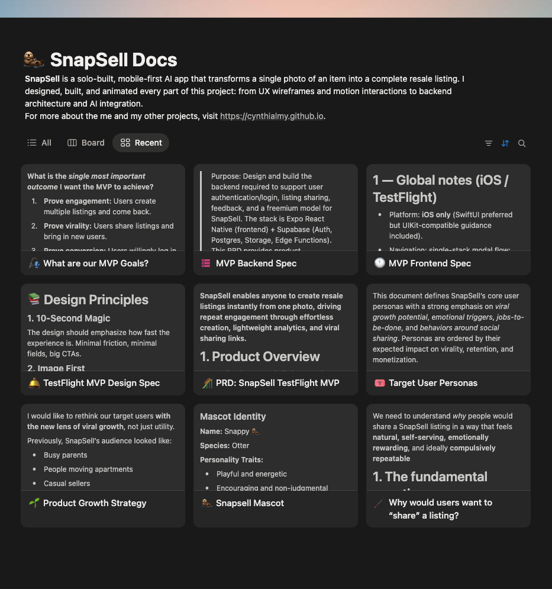
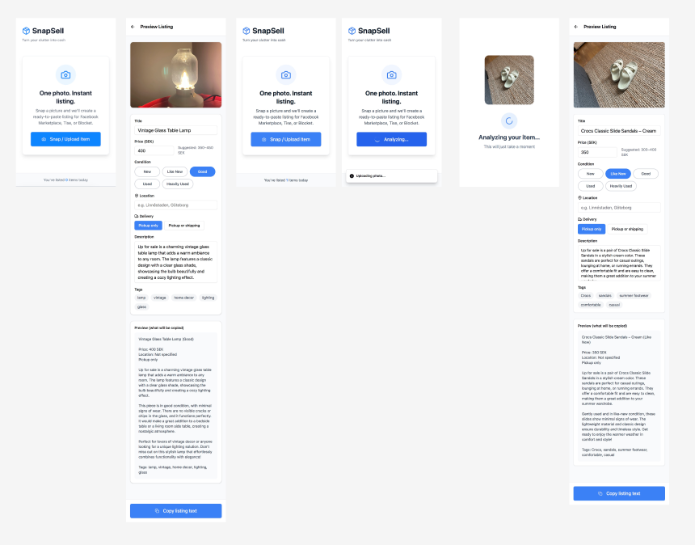
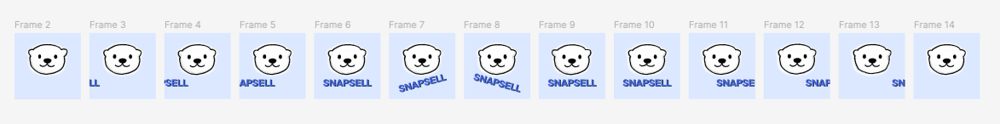
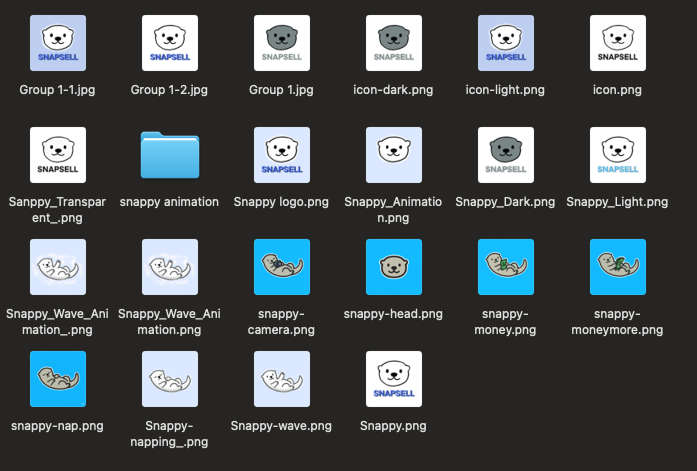

**SnapSell** turns a single photo into a ready-to-post resale listing in under 10 seconds. I built it solo to solve a problem I lived with: spending 5 to 10 minutes writing each listing across Depop, Facebook Marketplace, and Poshmark, and often abandoning the process because the text-writing step felt disproportionate to the item's value.

The generation itself was straightforward. GPT-4o Vision can extract metadata from photos reliably enough. The harder product problem was: how do you ship an AI product when the model hallucinates 15% of brand names, a single API call can break your cost model, and you have no moderation team?

Every design decision in SnapSell traces back to that question. This is a case study in managing AI quality risk within constrained economics.

>**For all related documentation, please go to <a href="https://cynthiamengyuanli.notion.site/2c2666d46e7080358435dd41c91747bf?v=2c2666d46e70818b9772000cb7fd78cd&source=copy_link" target="_blank" rel="noopener">Notion site</a> where I listed PRD, strategy, design process, technical architecture, and more.**
>

---

## Risk Landscape and Decision Boundaries

Before writing any code, I classified the risks by impact and reversibility. This classification determined what the system would automate, what it would surface for human review, and what it would refuse to attempt.

| Risk Type | Impact | Reversibility | Mitigation |
|-----------|--------|---------------|------------|
| **Content hallucination** (wrong brand, false claims) | High: damages seller credibility | High: user catches before posting | Prompt constraints + preview-before-copy UX |
| **Inappropriate content generation** | Critical: platform bans | Low: already posted | Conservative prompt guardrails |
| **Price misjudgment** | Medium: item undersells or sits | High: seller adjusts | Price suggestion only, no auto-post |
| **Inference cost drift** | High: unit economics break | Medium: requires prompt redesign | Per-listing cost tracking + token budget |

Three hard boundaries followed from this table. The system never auto-posts to marketplaces: the reputational risk of publishing AI-generated content without review is too high for a solo MVP with no moderation layer. The system always shows a mandatory preview: users must explicitly copy or share the generated listing before it goes anywhere. And cost per listing is tracked as a first-class metric alongside quality, because an unsustainable product helps no one.

---

## System Design

The architecture is designed around three failure scenarios: API timeout, low-confidence output, and inappropriate content.

```
User uploads photo
  ↓
Image preprocessing (compression, orientation correction)
  ↓
GPT-4o Vision API call (7s avg, 15s timeout)
  ├─ Success → Parse structured output
  ├─ Timeout → Retry once, then fallback message
  └─ API error → Generic error state + analytics log
  ↓
Output validation (length checks, profanity filter)
  ├─ Pass → Render listing preview
  └─ Fail → Regenerate with stricter prompt OR manual fallback
  ↓
User preview & decision
  ├─ Copy/share → Success metric logged
  ├─ Edit → Manual adjustment (deferred to v2)
  └─ Abandon → Drop-off metric logged
```

When the API fails, the system shows "Unable to generate listing. Please try again." No partial output that might mislead. When the model cannot confidently identify an attribute, the prompt forces it to return "Unable to determine [field]" rather than fabricate an answer. When the request times out, one retry with exponential backoff, then a clear failure message.

This design favors trust over conversion. Full automation would optimize first-use speed, but would destroy retention the moment a user posts an AI hallucination to Depop. The mandatory preview screen is the product's core trust mechanism.

---

## Building Trust Through Character Design

Early prototypes felt sterile. Users questioned the output quality without any visual signal that the system was working on their behalf.



I created Snappy, a hand-drawn otter mascot, in Procreate. Soft, rounded shapes and warm tones evoke approachability. The design was functional, not decorative: Snappy "thinks" during API processing to signal work in progress, appears apologetic during error states to reduce frustration, and gives a celebratory wave when the listing is ready. Each state change uses intentional animation curves built with Expo Reanimated.




Test users mentioned Snappy by name in feedback and attributed agency to the character: "I feel like the otter just helped me sell something!" They treated the AI as a collaborative assistant rather than a black box, which measurably lifted copy/share rates.




---

## Technical Architecture and Unit Economics

**Stack**: Expo React Native (mobile + web), FastAPI + Uvicorn (async backend), GPT-4o Vision (image-to-text), PostHog (analytics). Backend deployed on Render; Expo build for iOS and Web.

Three architectural decisions directly mitigate risk. The prompt enforces a structured JSON output schema with specific fields (title, description, price, hashtags), which reduces hallucination surface area by eliminating free-form generation. The client enforces preview before any share action. PostHog tracks every state transition (upload success, generation latency, copy rate, abandonment points), creating a closed feedback loop for prompt tuning.


One deliberate omission in v1: no in-app editing. Users accept or reject the listing in full. Binary accept/reject produces cleaner feedback signals for prompt tuning than partial edits where you cannot isolate what the user changed or why.

### Cost Model

The viability constraint shaped every prompt decision.

**Cost per listing** = vision API call + text generation + storage + infrastructure.
**Value per active user** = (monthly price or ad value) × conversion rate ÷ listings per user.
**Target**: cost per listing stays below 10% of value per active user.

Worked example: if a user creates 8 listings per month and ARPU is €2.00 at 5% conversion, value per listing is €0.025. That implies a target inference cost of €0.0025 or less per listing.

This ceiling drove three specific prompt decisions: max tokens capped at 300 (not 500), single API call per listing (no multi-turn refinement), and tightly scoped instructions that minimize token waste.

---

## Trade-Offs: What We Did Not Do

| What We Avoided | Why | What We Did Instead |
|----------------|-----|---------------------|
| Auto-posting to marketplaces | ToS risk, quality risk, no moderation team | Copy/share only; user posts manually |
| Multi-photo mode | 5× API cost per listing breaks unit economics | Single-photo constraint; multi-photo deferred |
| Dynamic pricing via resale APIs | Data acquisition cost, liability for bad advice | Static price suggestion by category heuristics |
| User accounts (v1) | Login friction kills activation; GDPR complexity | Anonymous usage; aggregate analytics only |
| In-app editing (v1) | Complexity drift; harder to track feedback signals | Binary accept/reject for cleaner data |

Each boundary represents a risk the product was not yet ready to absorb. Auto-posting would have increased first-time conversion but introduced legal and reputational exposure. Multi-photo would have improved listing quality but destroyed cost viability at the current inference price. These constraints kept the MVP economically viable and legally defensible while still solving the core friction.

---

## Evolution: What Broke, What Changed

### Iteration 1: Launch Week (Feb 2025)

Generation time averaged 12 seconds against a 7-second target because image uploads were unoptimized. Brand hallucination rate was approximately 15%. Cost per listing was €0.004, above the €0.0025 viable threshold.

Fixes: client-side image compression reduced payload size by 60%. Prompt refinement added explicit guardrails ("If you cannot confidently identify the brand, write 'Brand: Unknown' instead of guessing"). Max tokens reduced from 500 to 300.

### Iteration 2: Post-Testing (March 2025)

Copy/share rate dropped to 62%. Analytics showed users abandoned listings with "Brand: Unknown" because they felt incomplete. Separately, 18% of uploads were non-clothing items (electronics, books) that the prompt was not optimized for.

Fixes: adjusted the prompt to handle mixed categories gracefully. "If specific brand is unclear, describe the style instead (e.g., 'minimalist design,' 'vintage-inspired')." This made previously deficient listings feel complete. Copy/share rate recovered to 78%.

### Iteration 3: Cost Stabilization (April 2025)

Token usage drifted upward as prompt complexity increased. Cost per listing climbed back to €0.0035.

Fixes: audited prompt for redundant instructions, cut token count by 20% without quality loss. Final cost stabilized at €0.0024, within the viable threshold.

---

## Outcomes

| Metric | Launch Week (v1) | Post-Iteration (v3) |
|--------|------------------|---------------------|
| Average generation time | 12s | 7.4s |
| Upload success rate | 94% | 98% |
| Copy/share rate | 62% | 78% |
| Hallucination incidents | ~15% | <5% |
| Cost per listing | €0.004 | €0.0024 |

User feedback consistently highlighted two things: the mascot created a sense of collaboration ("This makes me want to list more often. It's like having a personal assistant."), and the generated descriptions were accurate enough to use with minimal changes.

---

## What This Project Taught Me

The hardest problem in consumer AI products is defining where automation stops. The €0.0025 cost ceiling forced aggressive prompt optimization and eliminated feature bloat. The mandatory preview screen introduced friction but earned the trust that drove repeat usage. Launching at 85% hallucination-free output (well short of 99%) was the right call: it enabled iteration on real usage patterns rather than hypothetical edge cases.

---

## Future Opportunities

* **Multi-photo mode**: Generate listings from multiple angles.
* **Automatic price intelligence**: Suggest fair market value using resale data.
* **Marketplace integrations**: One-tap posting to Depop, eBay, and Poshmark.
* **AI Tone Customization**: Let users choose tone (professional, casual, witty).

The PRD for the next version of SnapSell (authentication, sharing, and freemium) is currently in draft and will be published as a separate case study.
