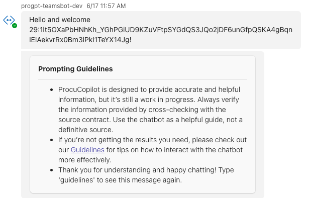
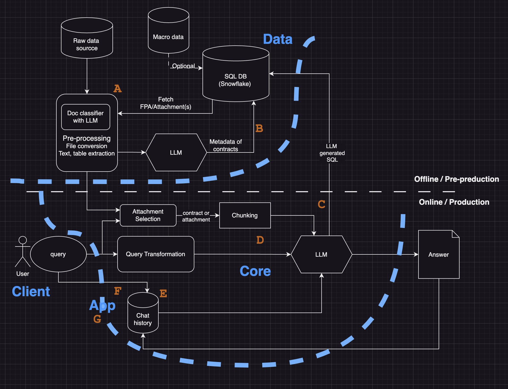
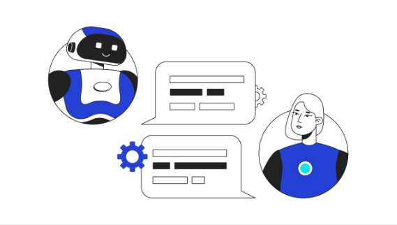

Procurement at Volvo Cars handles thousands of contracts, millions in spend, and complex documentation spread across several legacy systems. The primary goal of our project was to streamline the procurement process by leveraging Gen AI to facilitate contract management and decision-making.

This case study is how I approached the discovery, designed the solution, validated its value, and shaped the organization’s journey toward AI-augmented procurement.

## Discovery

When I started this initiative, I didn’t approach it as an “AI project.”
I approached it as a procurement problem-solving mission.
So instead of thinking about models or tools, my first question was:

“What exactly slows buyers down?”

Sitting With Buyers, Not Assumptions

I spent my first weeks shadowing buyers across commodity teams. I wasn’t looking for feature requests — I was looking for friction. I watched how they navigated VGS, VPC, and SI+, how they searched through attachments, how often they switched screens to confirm information, and how long it took them to feel confident in their answers.

By the third user interview, a pattern was unmistakable:

“We spend more time finding information than using it.”

One buyer walked me through a task: checking a contract clause across systems. It took nearly 15 minutes, and involved:

- searching in VGS
- opening a PDF
- checking a supplier file
- checking VPC for price history
- verifying SI+ for implementation
- confirming with a colleague

This wasn’t an isolated workflow — it was daily reality.

> Insight 1 — The real problem was cognitive load, not system capability.

Buyers weren’t lacking expertise; they were drowning in scattered data.

> The procurement process at Volvo Cars is currently fragmented and heavily manual. Managing over 1,169 suppliers and approximately 7,000 contracts, with numerous attachments in various formats (PDF, Excel, Word, and zip files), is both time-consuming and error-prone. The lack of integration among the VGS, VPC, and SI+ systems exacerbates these inefficiencies, increasing the risk of human error, especially during rapid regulatory changes or detailed contract term monitoring.

---

**Mapping Where Time Really Goes**

To quantify the problem, I broke down each search workflow step-by-step and timed it with multiple buyers. The times varied wildly — sometimes three minutes, sometimes 25 — depending on document formats, attachments, or system quirks.

That variability revealed another truth:

> Insight 2 — There was no single source of truth.

When trust in data is low, people double-check, triple-check, or check with someone else.
This added more wasted time and risk.

---

**Understanding Buyer Psychology — Their Unspoken Jobs to Be Done**

Beyond functionality, I listened for emotional triggers.
The real JTBD that emerged were:

1) “Help me find the correct information quickly.”
2) “Help me avoid making a mistake.”
3) “Help me feel confident in my decision.”

These weren’t system requirements — they were human requirements.
This shaped how I designed:
- transparency
- source citations
- error handling
- UX flows in Teams

Trust would make or break the tool.

---

**Validating the Scale — Is AI the Right Tool?**

I then analyzed one month of procurement support tickets and categorized each query. A Pareto distribution emerged:
~40% of inquiries were repetitive information retrieval.

Things like:
- “Where is this contract?”
- “Which version is the latest?”
- “Where is the implementation record?”

This confirmed something important:

> Insight 3 — A large portion of procurement work was repetitive and suitable for AI automation.

GenAI seems to be a strategic match for the problem.

## Use Case

### Contract Management

- **Natural Language Queries:** Gen AI enables intuitive interaction with contracts through natural language queries. For example:
    - How many suppliers do we have in VGS (both active and inactive)?
    - What are the contents of Contract00627 in VGS?
    - Can you find the contract for part number A in VPC and VGS?
    - What are the price changes for supplier part A over time?

### Change Management

- **Process Assistance:** Using SharePoint web information, PDF, Word, PPTX, and internal instructional videos, Gen AI assists buyers in creating RFQs, contracts, and implementing changes, such as:
    - How to add amendments to existing contracts in VGS.
    - How to handle discrepancies in price information between VPC and SI+.

### Complexity of the Use Case

The use case for Gen AI in contract management at Volvo Cars is moderately complex due to several factors:

1. **Technical Integration:** Ensuring seamless communication between Gen AI, Microsoft Teams, and the procurement systems (VGS, VPC, SI+).
2. **Data Handling:** Managing diverse document formats and data types requires sophisticated data processing capabilities.
3. **Change Management:** Training employees to adapt to new workflows and overcoming potential learning curves.
4. **Compliance and Security:** Adhering to legal standards and maintaining robust data security within the Teams environment.

---

**Deciding What Not to Build**

Great AI products don’t start with “everything.”
They start with a sharp slice.

I evaluated the three main systems:
- VGS — widely used, moderately clean data
- VPC — crucial but more complex
- SI+ — fragmented implementation records

After weighing value, complexity, and risk, I made a pivotal product decision:

Decision — Start with VGS as the first Proof of Value.

It was:

✔ structured enough to test RAG

✔ high-impact for buyers

✔ low-risk in terms of access control

✔ the foundation of procurement workflows

This scoping protected us from overreach and accelerated learning.

## Architecture

**Choosing the Right AI Architecture with Trade-Off Thinking**

Our team compared three approaches:

A. Fine-tune LLM
- Too risky for contract data
- Too slow to update
- Too costly for iterative discovery

B. Traditional enterprise search
- Predictable but inflexible
- No reasoning
- Requires buyers to interpret results

C. RAG (Retrieval Augmented Generation)
- Secure
- Document-grounded
- Scalable across systems
- Explainable through citations

**High-Level Description**

---

**Setting Success Metrics Before Building Anything**

To prevent the solution from becoming a “cool demo,” I defined strict PoV success criteria:
- Search time ↓ 25%
- Error rate ↓ 30%
- User satisfaction > 4.5/5
- Retrieval accuracy > 85%

These metrics anchored the rest of the project.

---

## Solution

Integrating Gen AI with our procurement systems (VGS, VPC, and SI+) enables natural language queries, allowing users to interact with contracts more intuitively. This integration aims to automate many of the manual processes, thereby reducing errors and speeding up decision-making.

## Validation

**Approach**

1. **Technology Integration:** I unified the VGS, VPC, and SI+ systems to work cohesively with Gen AI. This required creating data products and ensuring smooth interaction between Gen AI and Microsoft Teams.
2. **Process Simplification:** The introduction of Gen AI shifted our process from manual search and review to an AI-driven approach. Training the procurement team on these new capabilities and adjusting workflows were essential steps.
3. **Cultural Shift:** Implementing Gen AI required a shift in mindset, emphasizing a technology-first approach for routine tasks, allowing the human workforce to focus on strategic initiatives.

**Validation**

- **Pilot Testing:** I conducted controlled experiments with 10 test users to benchmark metrics with and without the tool.
- **User Feedback:** I collected qualitative feedback through surveys to refine the chatbot’s functionality and user experience.

**Pilot Setup**
- 10 buyers as test users
- Real contract scenarios
- “Before & after” tasks timed and measured

**Quantitative**

| Metric | Result |
|--------|--------|
| Contract search time | ↓ 25% |
| Error rate | ↓ 30–40% |
| User satisfaction | 4.6/5 |
| Annual time savings | 6,800+ hours (projected) |

---

## Impact

**Pilot Execution**

I focused on VGS for the Proof of Value (PoV) due to data quality challenges. The pilot involved:

1. **Data Extraction:** Extracting data from VGS for analysis.
2. **User Testing:** Engaging 8 users from the procurement department to interact with the Gen AI tool.
3. **Feedback Collection:** Gathering feedback through structured scenarios and open-ended interactions to refine the tool.

**Business Case and Impact**

The PoV demonstrated significant potential value, validating the business case for further investment. Key metrics included reduced search times, improved data accuracy, and enhanced user satisfaction.

| Metric | Result |
|--------|--------|
| Hours saved annually | 6,800+ |
| Sourcing savings enabled | 36M SEK |
| Faster procurement cycles | 25% |

The introduction of Gen AI in procurement is expected to bring significant benefits:

- **Efficiency Boost:** A 25% reduction in time spent on contract searches, reviews, and document preparations.
- **Risk Avoidance:** Enhanced AI search capabilities significantly reduce the risk of missing or mishandling contracts, potentially saving millions in financial penalties.
- **Improved Data Quality:** A decrease in errors during contract management reinforces our commitment to legal and financial standards.
- **Future-Proofing:** Gen AI’s adaptability and scalability prepare the procurement department for evolving challenges and growth.
- **Boosting Employee Morale:** By automating routine tasks, employees can focus on more strategic initiatives, improving job satisfaction and productivity.

**What I Learned**

- AI adoption is more change management than model management.
- Users need trust, not just answers.
- Starting narrow accelerates scaling.
- Enterprise AI must be safe, explainable, and grounded.
