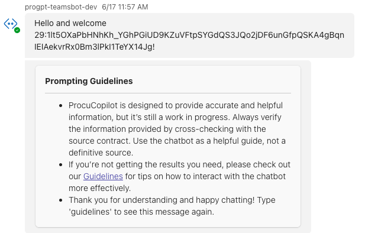
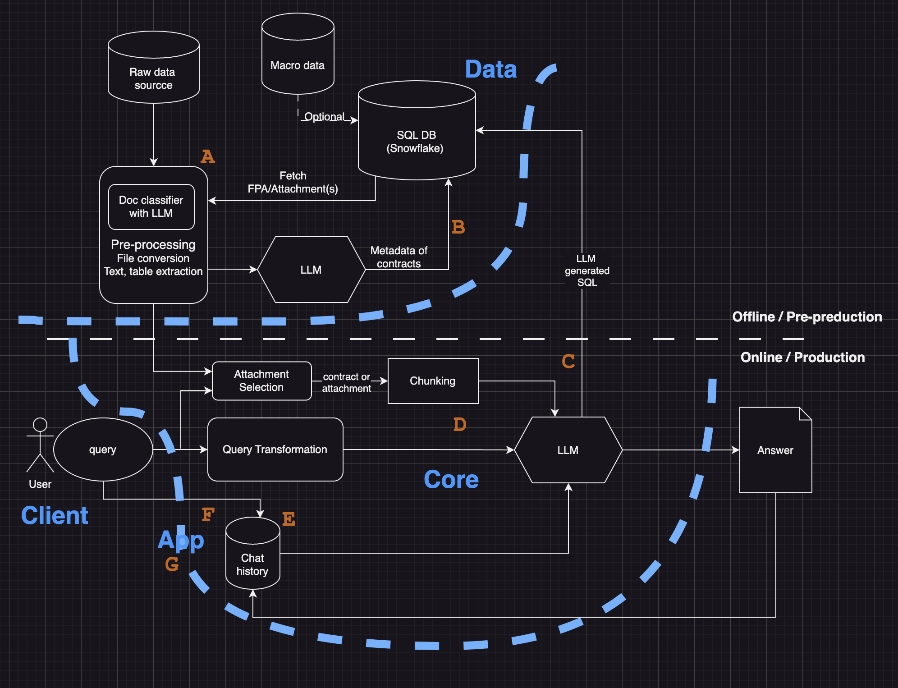
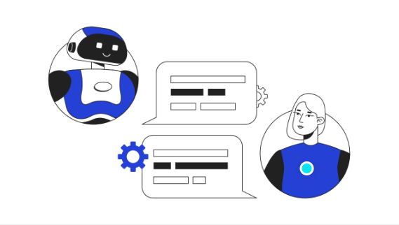

Procurement at Volvo Cars manages 1,169 suppliers, over 7,000 contracts, and millions in annual spend across three fragmented legacy systems: VGS, VPC, and SI+. When I joined this initiative, there was no product brief. The executive mandate was to "explore AI for procurement." The growing backlog of complaints from buyers told a clearer story: they were spending more time searching for information than using it.

The obvious move would have been to build a search tool. But search was a symptom, not the disease. Buyers could not trust any single system to give them a complete, current answer. They compensated by cross-referencing three systems manually, consuming hours daily and introducing errors with legal and financial consequences in a regulated automotive procurement environment.

Before evaluating any AI model, I asked a more fundamental question: what decisions do buyers actually make, where does friction prevent them from making those decisions confidently, and which friction points can be safely automated?

---

## 1. Risk Framing Before Solution Design

Introducing AI into procurement carries legal, financial, and compliance implications that differ sharply in severity. Before defining any solution, I mapped risks across three dimensions: impact on business outcomes, reversibility of errors, and sensitivity of the underlying data.

| Risk Category | Impact | Reversibility | Mitigation Strategy |
|---|---|---|---|
| Wrong contract retrieved | High | Low | Human verification required, source citations mandatory |
| Hallucinated clause interpretation | Critical | Low | Never generate legal text; retrieval-only mode |
| Outdated information surfaced | Medium | Medium | Document freshness signals, timestamp validation |
| Unauthorized data access | Critical | None | Role-based filtering, pre-retrieval permission checks |
| Search returns no results | Low | High | Graceful degradation to manual search |

This matrix drove a single constraint that shaped everything: the system would never generate or interpret legal text. It would only retrieve and cite existing documents. That eliminated the highest-severity risk category entirely.

From this analysis I defined three automation zones:

**AI-Assisted (Safe Zone).** Contract search, document retrieval, historical data lookup, process guidance. Repetitive, low-risk, high-volume.

**Human-in-the-Loop (Verification Required).** Contract term interpretation, price comparisons across systems, supplier evaluation. AI can support but not replace contextual judgment.

**Human-Only (No Automation).** Contract approval, negotiation decisions, exception handling, legal interpretation. Consequences demand human accountability.

This framework became the shared language for every design decision that followed. Legal and compliance stakeholders could see exactly what the system would and would not do. That clarity was more valuable than any demo.

---

## 2. Discovery: Sitting With Buyers

I framed this as a procurement problem requiring structured investigation, not an "AI project." My first question was operational: what exactly slows buyers down?

I spent two weeks shadowing buyers across commodity teams. I watched how they navigated VGS, VPC, and SI+. I observed screen switches, attachment searches, and the frequent interruptions to confirm a detail with a colleague. By the third interview, the pattern was unmistakable. One buyer described it plainly: "We spend more time finding information than using it."

One buyer walked me through a routine task: checking a contract clause across systems. It took nearly 15 minutes. Search in VGS, open a PDF, check a supplier file, check VPC for price history, verify SI+ for implementation records, confirm with a colleague. This workflow repeated daily for every buyer on the team.

The real problem was cognitive load. Buyers had expertise but were drowning in scattered data across three systems with no integration. Managing over 1,169 suppliers and approximately 7,000 contracts, with attachments in PDF, Excel, Word, and zip formats, was both time-consuming and error-prone. The lack of integration among VGS, VPC, and SI+ compounded these inefficiencies and increased the risk of human error.

### Quantifying the Friction

To move from anecdotes to evidence, I timed each step of the search workflow with multiple buyers. Some searches took three minutes; others took 25. The variance depended on document formats, attachment structures, and system quirks.

That variability revealed something deeper: there was no single source of truth. When trust in data is low, people double-check, triple-check, or ask a colleague to verify. This redundant verification was both the largest time sink and a source of miscommunication risk.

### The Unspoken Jobs to Be Done

Beyond functionality, I listened for emotional triggers. The real jobs centered on human needs:

1. "Help me find the correct information quickly."
2. "Help me avoid making a mistake."
3. "Help me feel confident in my decision."

Those needs map directly to product requirements: mandatory source citations, explicit error handling, and a familiar delivery surface (Microsoft Teams). Trust would determine adoption. Accuracy without verifiability was worthless.

### Validating That AI Was the Right Tool

I analyzed one month of procurement support tickets. Approximately 40% were repetitive information retrieval: "Where is this contract?", "Which version is latest?", "Where is the implementation record?" This Pareto distribution confirmed that a large portion of work was repetitive, structured, and suitable for AI assistance. AI was a strategic match for the problem, not a technology looking for a use case.

---

## 3. Scoping: What to Build and What to Reject

### Use Cases That Made the Cut

The primary use case was natural language queries over contracts. Buyers could ask questions like:

- How many suppliers do we have in VGS, both active and inactive?
- What are the contents of Contract00627 in VGS?
- Can you find the contract for part number A in VPC and VGS?
- What are the price changes for supplier part A over time?

A secondary use case covered process assistance: using SharePoint documentation, PDF guides, Word documents, PPTX presentations, and internal instructional videos to answer procedural questions such as how to add amendments to existing contracts in VGS or how to handle discrepancies in price information between VPC and SI+.

The use case was moderately complex due to four intersecting challenges. Technical integration required reliable communication between the AI system, Microsoft Teams, and three procurement systems. Data handling demanded processing across diverse document formats. Change management meant overcoming skepticism about AI in a traditionally manual domain. Compliance and security required adherence to legal standards and strong data security within the Teams environment.

### What I Explicitly Decided Not to Build

I evaluated three systems and chose to start with VGS only. VGS was structured enough to test RAG, high-impact because it anchored daily workflows, and low-risk in terms of access control. I rejected VPC in the initial scope because its data complexity would have introduced integration risk before the core approach was validated. I rejected SI+ entirely because its data was fragmented, lacked clear ownership, and had inconsistent structure.

This scoping discipline protected the pilot from overreach and accelerated time to validated insight.

---

## 4. Architecture: Three Options Evaluated

I evaluated three approaches against the problem's constraints: data sensitivity, compliance requirements, trust needs, and iteration speed.

**Option A: Fine-tuned LLM.** Embedding contract knowledge directly into the model. Rejected because fine-tuning on contract data introduced unacceptable hallucination risk for legal content, updates required retraining, and costs were prohibitive for a proof of value.

**Option B: Traditional enterprise search.** Keyword-based retrieval with predictable behavior. Rejected because it lacked reasoning capability, required buyers to interpret raw results, and could not handle natural language questions.

**Option C: Retrieval-Augmented Generation.** Retrieving documents and using them to generate grounded, cited answers. Chosen because it kept the model grounded in actual documents, supported citations, scaled across systems without retraining, and preserved explainability for compliance review.

| Criteria | Weight | Fine-tune | Enterprise Search | RAG |
|---|---|---|---|---|
| Data sensitivity and compliance | 5 | 2 | 4 | 5 |
| Explainability and trust | 4 | 2 | 3 | 5 |
| Iteration speed | 4 | 2 | 4 | 4 |
| Retrieval accuracy | 5 | 3 | 3 | 5 |
| **Total score** | | **41** | **60** | **74** |

### System Design for Safe Degradation

The architecture operates through four stages, each with explicit failure modes and fallbacks.

**Stage 1: Query Classification** (confidence threshold 0.85). Queries below threshold route to manual search with logging for analysis.

**Stage 2: Retrieval and Grounding** (minimum 2 source documents). If no results meet relevance thresholds or documents are stale, the system responds with "No confident answer available" rather than guessing.

**Stage 3: Response Generation with Citations.** Every response includes source citations. If sources contradict each other, the system surfaces the conflict and routes to human judgment.

**Stage 4: Human Verification.** Every response offers Accept, Reject, or Escalate. High rejection rates on specific query types trigger reclassification.

Escalation paths route buyer uncertainty to a senior procurement lead, legal queries directly to the legal team with logged interactions, and system errors to operations alerts with automatic fallback to the legacy system. If the entire RAG system fails, buyers access source systems directly. The AI was positioned as an assistant that preserves operational continuity, not a replacement.

---

## 5. Cross-Functional Alignment Without Authority

This project required alignment across groups with fundamentally different incentives. I had no organizational authority over any of them.

**Procurement buyers** were skeptical because past technology initiatives had promised automation but delivered complexity. The shadowing process was my entry point: it demonstrated that I understood their daily pain before proposing any solution.

**Legal and compliance** needed assurance that AI would never generate legal text, that outputs would include source citations, and that an audit trail would exist. I designed the retrieval-only mode and the automation boundary list before presenting any architecture. They approved because they could see exactly what the system would and would not do.

**Engineering** wanted a maintainable architecture that would not require constant patching. The multi-stage decision flow with explicit failure modes gave them confidence that edge cases would degrade safely.

**Executive sponsors** wanted measurable ROI. I built the business case before requesting development resources.

The hardest alignment moment came when engineering pushed to integrate VPC in Phase 1 to demonstrate cross-system capability. Legal pushed back because VPC contained pricing data with stricter access controls. I resolved it using the risk matrix: VPC integration increased the severity profile from "information retrieval" to "financial data exposure." That reclassification made the Phase 2 deferral a shared decision rather than a unilateral product call. When these groups disagreed, the risk matrix served as a shared decision framework. Every debate about scope, features, or timeline could be resolved by asking: "What is the risk classification, and who owns it?"

---

## 6. AI as a System Component

The AI serves a bounded purpose: reducing search time so buyers can focus on decisions. The product is confident, fast procurement decisions; the AI is the mechanism.

Every response includes clickable links to original documents. Buyers see exactly where the answer came from and can verify with one click. This transparency was the single most important trust-building feature. When the system cannot provide a confident answer, it says so and routes the buyer to the appropriate human resource. The system never guesses. This behavior mattered more for adoption than answer accuracy.

I designed the system assuming AI outputs would require human verification. Buyers review sources through one-click access, then provide explicit feedback: Accept, Reject, or Escalate. Override reasons are categorized (wrong source, outdated information, incomplete answer), and queries with high override rates trigger manual review.

| Metric | Baseline (Month 1) | Month 3 | Interpretation |
|---|---|---|---|
| Acceptance Rate | 68% | 82% | Trust increased as retrieval quality improved |
| Override with Justification | 22% | 14% | Fewer disagreements as system learned from feedback |
| Escalations to Legal | 10% | 4% | Better routing reduced unnecessary escalations |
| Time Spent Verifying Sources | 4.2 min | 2.8 min | Buyers grew confident in citations |

Rejected answers were analyzed weekly to identify retrieval gaps. High-frequency queries with low confidence were flagged for data improvements. Buyer feedback directly influenced retrieval tuning and prompt refinements. This turned users from passive consumers into active system trainers.

---

## 7. Success Metrics and ROI

I defined strict success criteria before writing any code to prevent the project from drifting into a demo that could not justify continued investment.

**ROI Model:** Annual value = hours saved multiplied by fully loaded cost per hour. The projected 6,800 hours saved annually provided the anchor.

| Hypothesis | Metric | Success Threshold | Method |
|---|---|---|---|
| AI reduces search time | Average search time | 25% reduction | Before-and-after task timing |
| AI improves accuracy | Error rate | 30% reduction | Controlled test scenarios |
| Buyers trust AI answers | Satisfaction score | 4.5 or higher | Post-task survey |
| Retrieval is reliable | Accuracy | 85% or higher | Ground-truth validation |

---

## 8. Pilot and Results

Validation required alignment across three dimensions. Technology integration connected the AI to Microsoft Teams and VGS, with handoffs designed so VPC and SI+ could follow later. Process simplification shifted procurement from manual search to AI-assisted retrieval with mandatory human verification. Cultural shift positioned the system as a decision-support tool rather than a decision-maker.

I ran a controlled pilot with 10 buyers using real contract scenarios. Each participant completed tasks with and without the AI tool.

| Metric | Result |
|---|---|
| Contract search time | 25% reduction |
| Error rate | 30 to 40% reduction |
| User satisfaction | 4.6 out of 5 |
| Annual time savings | 6,800+ hours (projected) |

---

## 9. Business Impact

| Metric | Result | Why It Matters |
|---|---|---|
| Hours saved annually | 6,800+ | Direct labor cost reduction |
| Sourcing savings enabled | 36M SEK | Faster cycles enabled earlier negotiation |
| Procurement cycle time | 25% faster | Reduced time from requisition to execution |
| Error rate | 30 to 40% reduction | Fewer compliance risks and rework |
| User satisfaction | 4.6 out of 5 | High adoption confidence for scaling |

Beyond the numbers: improved data accuracy reinforced compliance in a regulated environment. Reduced contract handling risk lowered exposure to financial penalties. Automating routine retrieval freed buyers for strategic work like supplier negotiation, improving both job satisfaction and procurement outcomes.

---

## 10. Evolution: What Broke and How the System Adapted

This system did not succeed on the first iteration. Every month surfaced failure modes that required design changes.

**Month 1: Overly Conservative Thresholds.** 32% of queries returned "no confident answer" because confidence was set at 0.90. I lowered it to 0.85 and added partial-match suggestions. The lesson: calibrate thresholds against real traffic, not synthetic test cases.

**Month 2: Complex Queries.** Improved recall led buyers to ask multi-part questions ("compare terms across suppliers A, B, and C"). The retrieval logic expected single-topic queries. I added query decomposition that breaks complex requests into sub-queries, retrieves results for each, and synthesizes a combined response.

**Month 3: Cross-System Integration.** VPC integration introduced inconsistent data formats. 18% of cross-system queries failed. I built a normalization layer that standardizes supplier IDs and contract references before retrieval.

**Month 4: The Trust Drift Incident.** A buyer escalated a case where the AI cited an outdated contract version, causing a pricing discrepancy. Root cause: VGS updates were not syncing to the vector database in real time. I implemented daily re-indexing and added "last updated" timestamps to all responses. Document freshness should have been in the product spec from day one.

**Month 5: Legal Query Rejection Rates.** Legal queries had a 45% rejection rate because buyers did not trust AI for interpretation. I reclassified all legal queries as "human-only." The AI now states "This requires legal review" and surfaces relevant clauses without interpretation.

### Key Assumption Changes

I started with the assumption that buyers would trust AI if answers were accurate. Reality was different: buyers trusted AI only when they could verify sources quickly. I made citations one-click accessible and added document previews in the chat interface.

The routing logic evolved from binary (AI vs. human) to three tiers (AI-assisted, human-verified, human-only). Confidence thresholds became query-category-specific: higher for interpretation, lower for simple retrieval. Feedback loops went from monthly to weekly as usage scaled.

### What These Incidents Taught Me

Precision matters more than recall in high-stakes environments. One wrong answer costs more trust than ten "I don't know" responses. Query classification is never finished because user behavior evolves continuously. Transparency builds trust faster than accuracy: showing sources mattered more to buyers than generating perfect summaries.

---

## 11. Trade-Offs

Every decision below was a deliberate risk management choice.

I did not pursue full automation. Contract decisions carry legal consequences that require human judgment. The cost was longer workflows; the benefit was near-zero consequential errors.

I prioritized precision over recall. A missed result is recoverable; a wrong result erodes trust permanently. Some queries returned "no confident answer" during the pilot. That was acceptable because it signaled honesty.

I started with GPT-3.5-turbo instead of GPT-4. Latency, cost, and stability concerns outweighed the reasoning improvement for retrieval tasks. The trade-off was slightly lower answer quality for faster response times and predictable costs.

I used off-the-shelf embeddings from OpenAI and Cohere rather than custom models. Custom models would have delayed launch by months for marginal accuracy gains.

I did not cover edge cases initially. Multilingual contracts, scanned PDFs, and handwritten amendments represented under 5% of queries but would have consumed over 40% of engineering effort. Explicit "unsupported query" messages with manual escalation paths served as the interim solution.

To keep scope tight and learning velocity high, I deferred SI+ deep integration until data quality issues are resolved, excluded automated approvals because they require legal workflow redesign, and deferred pricing optimization because it requires cleaner spend data and cross-functional buy-in from finance.

---

## What Sticks

AI adoption in enterprise procurement depends on change management as much as model selection. Trust is built through transparency, not perfection. Starting narrow with clear risk boundaries accelerates scaling more than launching broadly with loose constraints.

The most impactful product work in this domain is designing decision boundaries, anticipating failure modes, and building systems that degrade safely under uncertainty. The AI is a component. The product is the decision system that surrounds it.
