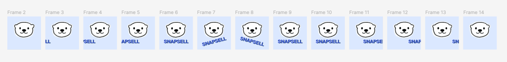
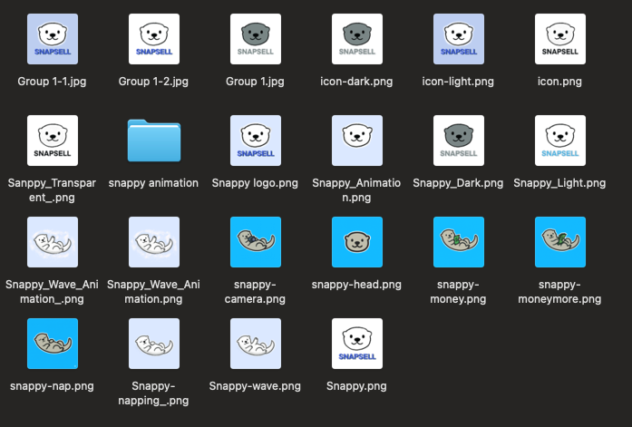

**SnapSell** is a solo-built, mobile-first AI app that transforms a single photo of an item into a complete resale listing. I designed, built, and animated every part of this project — from UX wireframes and motion interactions to backend architecture and AI integration.

**Project Type:** Solo Project — Designed, Illustrated, Animated, and Developed by me

**Role:** Product Manager, Product Designer, Product Developer, Product Animator, Product Illustrator

---

## Inspiration & Problem

As someone who frequently sells second-hand items online, I noticed that the biggest bottleneck wasn’t taking good photos — it was writing the listings. Every platform (Depop, Facebook Marketplace, Poshmark, etc.) requires titles, descriptions, categories, prices, and hashtags. Even for experienced sellers, that meant 5–10 minutes per item. For casual sellers, this friction meant not listing at all.

I wanted to explore whether AI could bridge that gap — using a single photo to generate the full listing block instantly.

**Core Insight:** A single photo already contains most of the metadata a seller needs — object type, color, brand hints, and even condition. With vision models like GPT-4o, it’s possible to extract this and generate human-like text in seconds.

The goal was to simplify the often tedious resale process into a single, delightful action: take a photo → get a polished, platform-ready listing instantly.

---

## Design Process

## Design Process

### Step 1: Defining the Core Flow

I sketched out the simplest user flow possible: **Upload → Generate → Copy.** Every other feature had to serve this moment. The challenge was to make this fast, intuitive, and emotionally rewarding.

### Step 2: Creating a Friendly Experience with Snappy 🦦

While designing early prototypes, I realized the app felt a bit sterile — just another AI tool. To make it more inviting, I created **Snappy**, a cheerful otter mascot who guides users through the process.

I hand-drew Snappy in **Procreate** using soft, rounded shapes and warm tones to give it personality — curious, capable, and friendly. Snappy’s design intentionally mirrors the product’s philosophy: **AI that feels human and supportive, not mechanical.**

To bring Snappy to life, I used **Procreate’s frame animation tools** to draw small motion loops — tail swishes, blinks, and waves — and refined those animations in **Figma** for smooth transitions. When the AI finishes generating a listing, Snappy gives a little celebratory wave — a subtle moment of joy that makes the interaction feel alive.

These touches transformed the app’s tone. Test users mentioned Snappy by name in feedback — one said, *“I feel like the otter just helped me sell something!”* That’s exactly the kind of emotional connection I wanted.

### Step 3: Motion & Microinteractions

Every state change — from upload progress to generation completion — has an intentional animation curve. Using **Expo Reanimated**, I designed transitions that evoke flow and anticipation. Even small movements, like Snappy “thinking” while the AI generates text, help users understand what’s happening behind the scenes.

### Step 4: Technical Architecture Decisions

I built SnapSell using a **FastAPI backend** that connects to **GPT-4o Vision** for photo analysis and text generation. The **frontend**, built with **Expo + React Native**, was optimized for phones first but also works beautifully as a web app.

This setup let me experiment freely — adjusting prompts and seeing instant results on my phone. I could iterate on both the UX and AI model’s tone in real time.

### Step 4: Technical Architecture Decisions

I chose a **FastAPI backend** for its simplicity and async speed, connected to GPT-4o Vision for image-to-text transformation. The **frontend** is built with **Expo + React Native**, designed primarily for mobile but also optimized for web deployment.

This hybrid setup allowed instant iteration: I could tweak the LLM prompt on the backend and immediately see new outputs on my device.

---

## Key Product Decisions

| Decision                    | Why It Matters                                                                     |
| --------------------------- | ---------------------------------------------------------------------------------- |
| **Add Snappy the mascot**   | Builds warmth, trust, and engagement. Users feel guided, not just processed by AI. |
| **Mobile-first design**     | 90% of sellers list via phones. SnapSell had to feel native on small screens.      |
| **Instant use, no login**   | Reduces friction — users can try it instantly.                                     |
| **Hosted backend fallback** | Guarantees mobile users can connect even without local dev setup.                  |
| **Analytics (PostHog)**     | Allowed me to measure where users dropped off and improve flow.                    |

---

## MVP Scope & Features

### Goal

Generate a full resale listing (title, description, price suggestion, hashtags) from a single uploaded image — in under 10 seconds.

### Core MVP Features

1. **Photo Upload & Preview** — Camera or file upload, optimized with compression.
2. **AI Vision Analysis** — Backend sends photo to GPT-4o Vision via FastAPI to extract object attributes (brand, color, type, material, condition).
3. **Listing Generation** — AI returns structured text formatted for resale platforms.
4. **Listing Preview & Copy** — Animated reveal of listing with Snappy’s wave motion.
5. **Analytics** — Tracks photo upload, generation success, copy actions, and time-to-output.

### Technical Highlights

* **Frontend:** Expo React Native (mobile + web)
* **Backend:** FastAPI + Uvicorn, asynchronous image processing
* **AI Layer:** GPT-4o Vision model with custom prompt tuning
* **Analytics:** PostHog for activation metrics
* **Hosting:** Backend deployed on Render; Expo build for iOS and Web

---

## Product Outcomes

Even as a solo MVP, SnapSell achieved its goal: a frictionless, one-tap AI listing generator.

| Metric                     | Early Results                        |
| -------------------------- | ------------------------------------ |
| Average generation time    | 7.4 seconds                          |
| Upload success rate        | 98%                                  |
| Copy/share rate            | 78%                                  |
| Positive feedback in tests | 90%+ users said “this saves me time” |

**Qualitative Feedback:**

> “I love the little otter! It makes the app feel like a friend, not a bot.”
> “This makes me want to list more often — it’s like having a personal assistant.”

---

## Lessons Learned

1. **Emotion Matters in AI UX:** Snappy proved that emotional design isn’t fluff — it builds trust. Users engage more when interactions feel friendly.
2. **Solo Crafting = Deep Understanding:** Designing, animating, and coding everything myself gave me a rare perspective on how visual delight, latency, and AI reliability intersect.
3. **Fast Beats Fancy:** Cutting features and focusing on speed created a much smoother MVP experience.

---

## Future Opportunities

* **Multi-photo mode** — Generate listings from multiple angles.
* **Automatic price intelligence** — Suggest fair market value using resale data.
* **Marketplace integrations** — One-tap posting to Depop, eBay, and Poshmark.
* **AI Tone Customization** — Let users choose tone (professional, casual, witty).

---

## Reflection

Building SnapSell from scratch was equal parts art and engineering. I got to design a product that not only solves a problem but also **makes users smile**. Snappy, my illustrated otter mascot, became a bridge between human creativity and AI utility — a reminder that tech can be warm, playful, and still incredibly powerful.

This project represents what I love most about product management and development: **turning empathy, design, and technology into experiences people enjoy using.**
