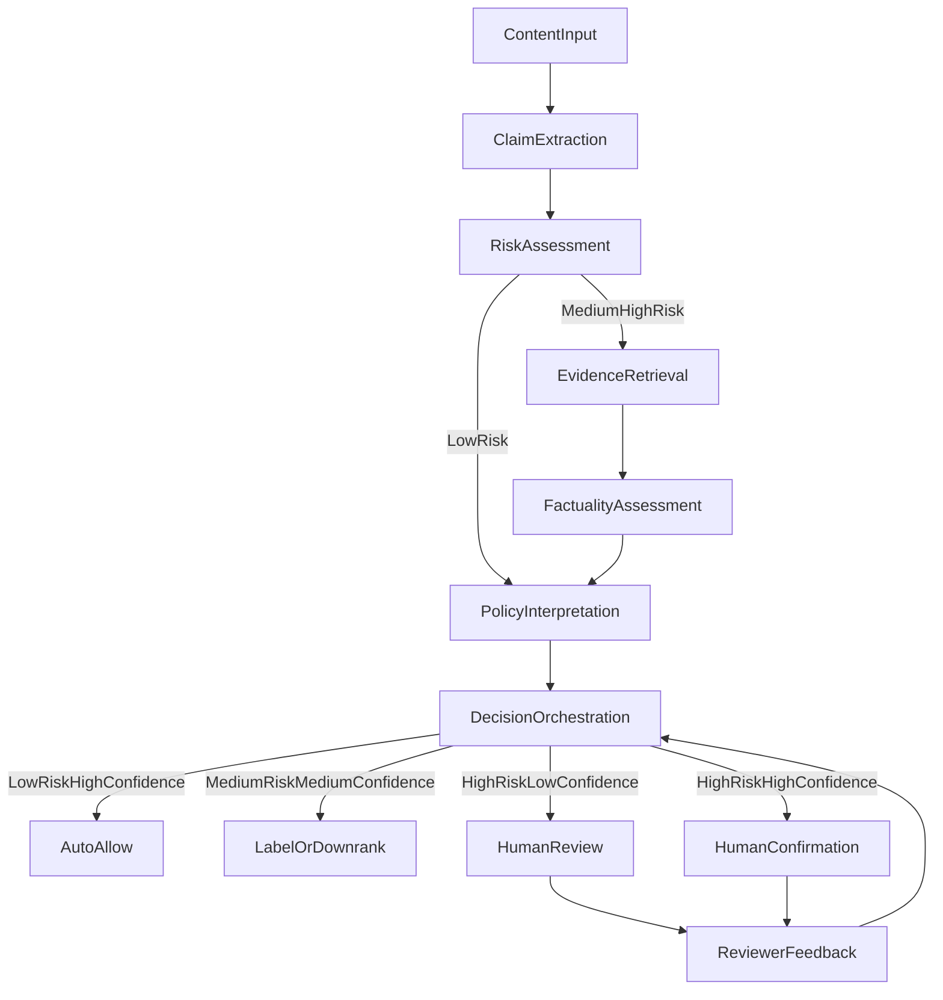

Content moderation at scale is one of the hardest problems in modern tech. When platforms like TikTok, YouTube, or Facebook need to make decisions about billions of pieces of content daily, they cannot just build a better AI model and call it solved. The real challenge is not only detecting misinformation, it is making responsible decisions under genuine uncertainty.

This demo explores how agentic AI workflows can approach this challenge through deliberate escalation and policy-aware decision design. The project, deployed at [llm-misinformation.streamlit.app](https://llm-misinformation.streamlit.app/), demonstrates how multiple specialized AI agents can work together within policy constraints, while keeping humans firmly in the loop for high-stakes decisions.

## Product Framing: Agents Propose, Policies Constrain, Humans Decide

Most AI moderation demos fall into one of two traps: either they are fully autonomous truth oracles that claim to know what is true, or they are simple binary classifiers that ignore the messy reality of content policy.

This system takes a different approach. It is built on a simple principle: **AI agents should propose analysis and recommendations, policy frameworks should constrain what is actionable, and humans should make final decisions when stakes are high.**

Think of it like a well-designed organization. You would not want junior analysts making final calls on edge cases, but you also do not want senior leadership drowning in routine decisions. The system is designed to escalate intelligently, automate the clear cases, surface the ambiguous ones, and always provide full reasoning for review.

## System Flow Chart

## Example Flow: High-Risk Health Claim

**Transcript input:**
"Andrew Huberman said Apple will make people healthy and live forever. If you eat 30 apples a day, you will be able to beat cancer."

**Routing Decision**
Risk tier: High
Routing: High or medium risk to Evidence Agent
Risk confidence: 0.85

**AI found something interesting and conflicting:**
External search triggered due to high novelty. It surfaced a general study about apples and cancer risk that does not support the extreme claim. The system treated this as conflicting context rather than proof.

**Final Decision**
Action: Human Confirmation
Confidence: 0.95
Rationale: High risk content with high policy confidence requires human confirmation before action.

## How It Works: A Pipeline of Specialized Agents

When you submit a piece of content like a social media transcript, it flows through a cascade of specialized agents.

### 1. Claim Extraction (Groq)

A fast language model extracts factual claims from the content. This is not about judging truth yet, it is about identifying statements that can be verified. Each claim is tagged by domain, because different domains require different evidentiary standards.

### 2. Risk Assessment (Zentropi)

Before doing expensive fact-checking, a smaller model assesses preliminary risk based on potential harm, likely exposure, and vulnerable populations. This is where the system decides whether to invest in deep analysis or fast-track low-risk content.

### 3. Evidence Retrieval (RAG and Search)

For medium and high-risk content, the system retrieves evidence. It starts with an internal knowledge base, then searches external sources when it encounters novel claims. The evidence agent returns supporting and contradicting information, because real fact-checking requires seeing both sides.

### 4. Factuality Assessment (Azure OpenAI)

A frontier model assesses whether claims are likely true, likely false, or uncertain. Factuality is not the same as a policy violation. Something can be false and still be allowed.

> **Design Decision: Separating Factuality from Policy Interpretation**
>
> This system intentionally separates factuality assessment from policy interpretation. In early designs, combining these steps caused the system to become overconfident in gray-area health claims—false claims were treated as automatically violative, even when policy guidance was ambiguous or evolving.
>
> This increased false positives and pushed the system toward over-enforcement. By isolating factuality as a non-enforcement signal, the system can acknowledge uncertainty without prematurely triggering action.

### 5. Policy Interpretation (Zentropi with Fallback)

A specialized agent reads the platform policy and determines whether the content violates it. The policy text is treated as input, not hard-coded rules, which allows adaptation to different policy frameworks.

### 6. Decision Orchestration

The system combines risk assessment and policy confidence to decide:
- **Low risk and high confidence** leads to automatic allow
- **Medium risk and medium confidence** leads to warning or downranking
- **High risk and low confidence** leads to human review
- **High risk and high confidence** still requires human confirmation

## Why This Design vs Simpler Baselines

I considered simpler baselines and rejected them for specific failure modes:
- **Single-model classifiers** were faster, but collapsed policy nuance into a binary label and hid evidence quality.
- **Trust-score-only systems** were cheaper, but produced confident-looking outputs with weak justification, increasing false positives.
- **Human-only review** was safest, but overloaded reviewers and created unacceptable latency for low-risk content.

The multi-agent design keeps the core tradeoff visible: pay more compute only when risk is high, and always preserve the evidence trail for accountable decisions.

## Decision Economics: Matching Cost and Confidence to Risk

Instead of defaulting to a single powerful model, the system allocates compute based on decision criticality.

For low-risk, reversible steps like claim extraction, speed and cost efficiency matter more than perfect reasoning. For high-stakes factual judgments that could influence enforcement or user trust, the system intentionally escalates to stronger models.

This design treats model accuracy as a *scarce resource* to be spent where mistakes are most expensive, rather than optimizing for uniform model quality across the pipeline.

In practice, this means using fast, low-cost models where mistakes are cheap, and reserving frontier models for decisions with real trust impact.

## What Makes This Different: Embracing Uncertainty

Most AI demos hide their limitations. This system makes uncertainty explicit.

- Conflicting evidence is preserved, not collapsed into one truth
- Low confidence triggers escalation, not automated action
- Policy ambiguity is flagged, not hidden
- Human review is treated as a feature, not a failure mode

The dashboard tracks metrics that matter for trust: human AI disagreement rates, review load concentration, and appeal reversal proxies.

## How I Measure Success

This system is not optimized for raw accuracy. Instead, success is defined by whether it improves trust outcomes at scale. I focus on three primary metrics:

**1. High-risk misinformation exposure**
The share of user views that contain high-risk misinformation. This reflects what users actually experience, not just what the system flags.

**2. Over-enforcement proxy**
Human overrides, appeal reversals, and disagreement between automated decisions and reviewers. Rising over-enforcement is treated as a failure signal, even if model confidence is high.

**3. Human review concentration**
The percentage of human review capacity spent on high-risk, high-uncertainty cases. If reviewers are overloaded with low-impact content, the system is misallocating attention.

Precision and recall are tracked internally as guardrail metrics, but they are not the optimization target. The goal is not to be "right" on every item—it is to make the *right mistakes* less often, and only where they are recoverable.

## Human Review: The Safety Net

When content gets escalated, human reviewers see the full chain of reasoning, all evidence, the policy interpretation and confidence level, and similar prior decisions. Reviewers can override recommendations and provide rationale. This feedback loop surfaces edge cases and policy gaps.

## The Governance Layer: Built for Accountability

Every decision is logged with versioning:
- Policy version used
- Models and prompts used
- Evidence available at the time
- Whether it was automated or human-reviewed

This enables re-evaluation when policies or evidence change, which is critical for evolving domains.

## What I Learned

1. **Confidence gating is essential.** Small, fast models can handle most decisions if they can defer to stronger models when uncertain.
2. **Policy as input beats policy as code.** Hard-coded rules are brittle. Natural language policies are adaptable.
3. **Escalation design matters more than raw accuracy.** Smart routing builds trust faster than a marginal accuracy gain.
4. **Factuality and moderation are different problems.** False content can be policy-compliant and true content can still violate policy.
5. **Observability is everything.** In production, you need to know why a decision was made, not only what it was.
6. **Tradeoffs must be explicit.** I tuned thresholds to balance reviewer load, latency, and policy coverage, prioritizing high-risk recall over low-risk throughput.

## What This System Is Designed *Not* To Do

This system is intentionally conservative in several ways:

– It does **not** aim to make instant decisions on ambiguous, high-risk content. In these cases, it prioritizes human judgment over speed.
– It does **not** optimize for maximum automation. Reversibility and trust recovery are valued more than throughput.
– It does **not** attempt to collapse uncertainty into a single score. Conflicting evidence and policy ambiguity are preserved and surfaced.

These constraints are deliberate. In content moderation, the most damaging failures come not from being uncertain, but from being confidently wrong at scale.

## Try It Yourself

The demo is live at [llm-misinformation.streamlit.app](https://llm-misinformation.streamlit.app/). You can paste in content, watch the agent pipeline in action, see the decision flow, and explore how different risk levels and policy interpretations lead to different outcomes.

The full source code and architecture documentation are available in the repository at [github.com/cynthialmy/llm-decision-flow](https://github.com/cynthialmy/llm-decision-flow). It is designed to be inspectable and educational.

## The Bigger Picture

This demo is intentionally designed to explore decision-making patterns in high-stakes domains. Real-world content moderation requires multilingual support, multimedia understanding, real-time processing at scale, and adversarial robustness.

The patterns here apply beyond misinformation to any domain where AI needs to help humans make better decisions under uncertainty.

Whether you are building content moderation, compliance review, medical triage, or fraud detection systems, the core challenge is the same. How do you combine AI pattern recognition with human judgment and accountability?

This project is one attempt at an answer. The code is open, the architecture is documented, and I would love to hear what you think.

---

Want to explore the technical details? Check out the [architecture documentation](https://github.com/yourusername/llm-misinformation) and [API usage guide](https://github.com/yourusername/llm-misinformation/blob/main/API_Usage_Explanation.md). The demo is running at [llm-misinformation.streamlit.app](https://llm-misinformation.streamlit.app/).
