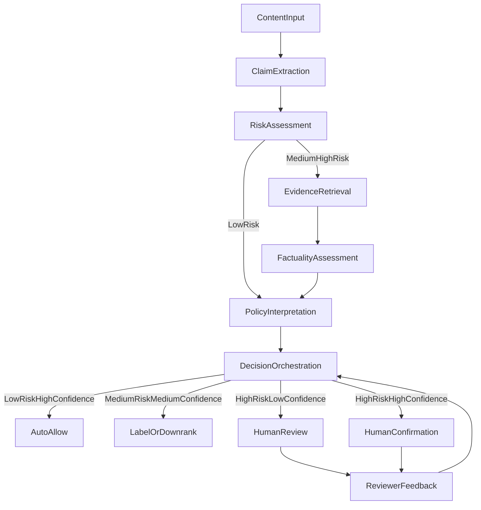
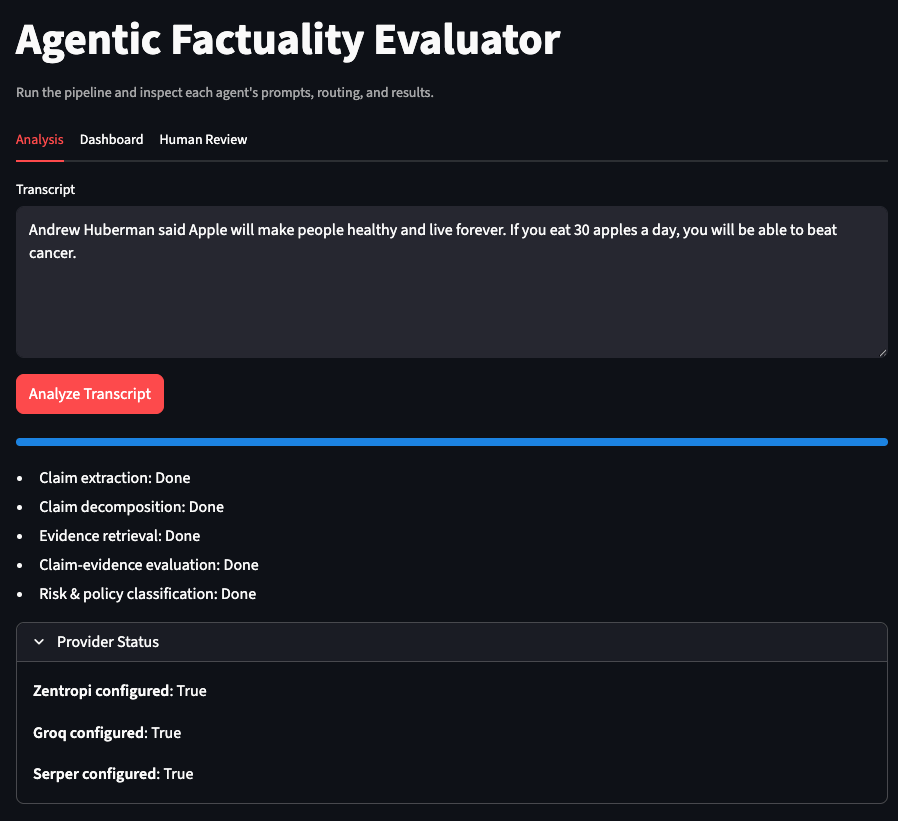
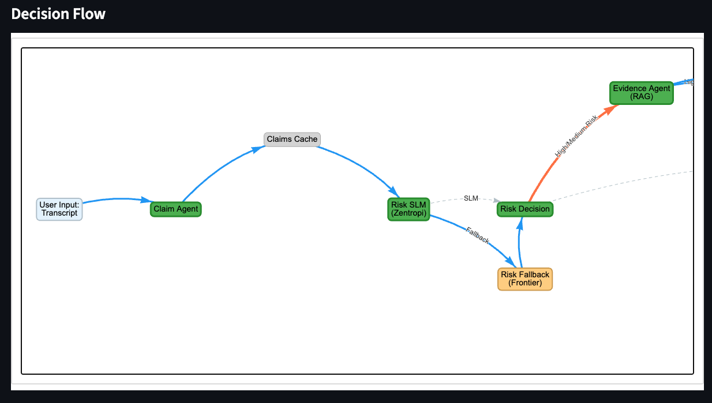
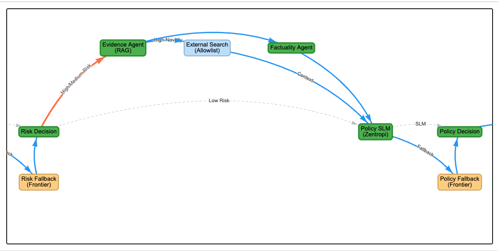
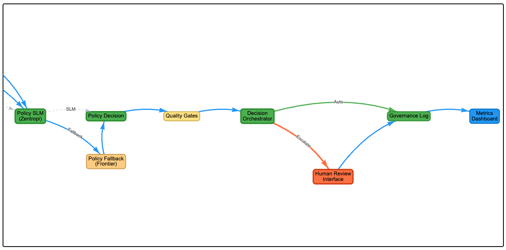
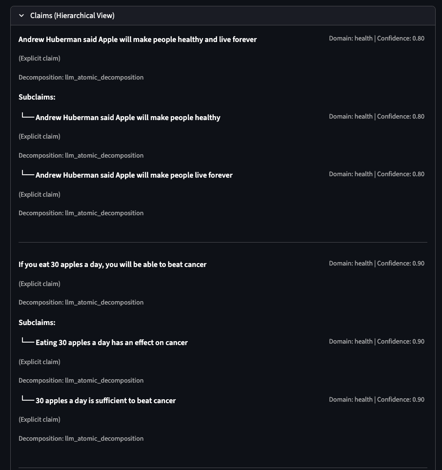
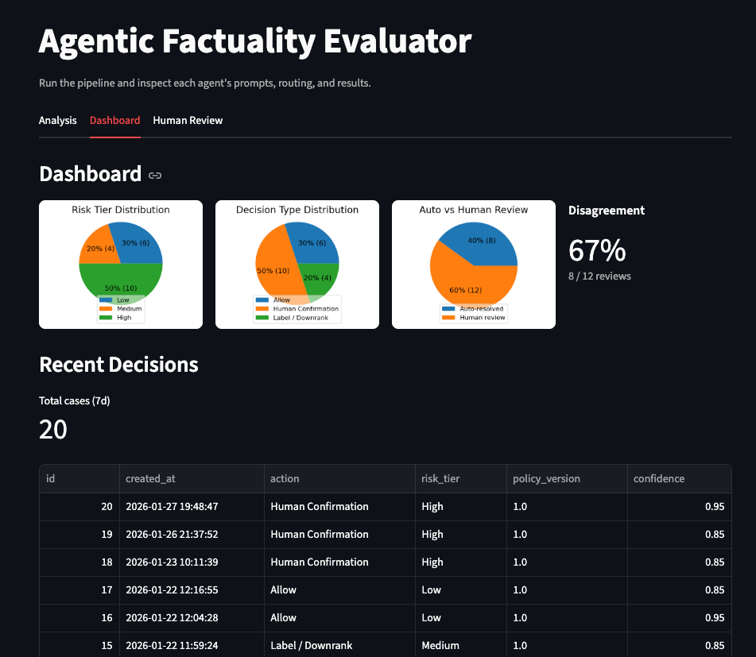

Content moderation at scale is one of the hardest problems in modern tech. When platforms like TikTok, YouTube, or Facebook need to make decisions about billions of pieces of content daily, they cannot just build a better AI model and call it solved. The real challenge is not only detecting misinformation, it is making responsible decisions under genuine uncertainty.

I built a demo system to explore how agentic AI workflows can approach this challenge with a specific focus on factuality checking. The project, deployed at [llm-misinformation.streamlit.app](https://llm-misinformation.streamlit.app/), demonstrates how multiple specialized AI agents can work together within policy constraints, while keeping humans firmly in the loop for high-stakes decisions.

## Product Framing: Agents Propose, Policies Constrain, Humans Decide

Most AI moderation demos fall into one of two traps: either they are fully autonomous truth oracles that claim to know what is true, or they are simple binary classifiers that ignore the messy reality of content policy.

This system takes a different approach. It is built on a simple principle: **AI agents should propose analysis and recommendations, policy frameworks should constrain what is actionable, and humans should make final decisions when stakes are high.**

Think of it like a well-designed organization. You would not want junior analysts making final calls on edge cases, but you also do not want senior leadership drowning in routine decisions. The system is designed to escalate intelligently, automate the clear cases, surface the ambiguous ones, and always provide full reasoning for review.

## System Flow Chart

## Example Flow: High-Risk Health Claim

**Transcript input:**
"Andrew Huberman said Apple will make people healthy and live forever. If you eat 30 apples a day, you will be able to beat cancer."

**Routing Decision**
Risk tier: High
Routing: High or medium risk to Evidence Agent
Risk confidence: 0.85

**AI found something interesting and conflicting:**
External search triggered due to high novelty. It surfaced a general study about apples and cancer risk that does not support the extreme claim. The system treated this as conflicting context rather than proof.

**Final Decision**
Action: Human Confirmation
Confidence: 0.95
Rationale: High risk content with high policy confidence requires human confirmation before action.

## How It Works: A Pipeline of Specialized Agents

When you submit a piece of content like a social media transcript, it flows through a cascade of specialized agents.

### 1. Claim Extraction (Groq)

A fast language model extracts factual claims from the content. This is not about judging truth yet, it is about identifying statements that can be verified. Each claim is tagged by domain, because different domains require different evidentiary standards.

### 2. Risk Assessment (Zentropi)

Before doing expensive fact-checking, a smaller model assesses preliminary risk based on potential harm, likely exposure, and vulnerable populations. This is where the system decides whether to invest in deep analysis or fast-track low-risk content.

### 3. Evidence Retrieval (RAG and Search)

For medium and high-risk content, the system retrieves evidence. It starts with an internal knowledge base, then searches external sources when it encounters novel claims. The evidence agent returns supporting and contradicting information, because real fact-checking requires seeing both sides.

### 4. Factuality Assessment (Azure OpenAI)

A frontier model assesses whether claims are likely true, likely false, or uncertain. Factuality is not the same as a policy violation. Something can be false and still be allowed.

### 5. Policy Interpretation (Zentropi with Fallback)

A specialized agent reads the platform policy and determines whether the content violates it. The policy text is treated as input, not hard-coded rules, which allows adaptation to different policy frameworks.

### 6. Decision Orchestration

The system combines risk assessment and policy confidence to decide:
- **Low risk and high confidence** leads to automatic allow
- **Medium risk and medium confidence** leads to warning or downranking
- **High risk and low confidence** leads to human review
- **High risk and high confidence** still requires human confirmation

## Tool Selection: Right Tool for the Job

One key insight from building this system is that you do not always need the most powerful model.

- **Groq Llama** for claim extraction, ultra-fast and good enough
- **Zentropi small model** for risk and policy classification, cheap and fast with confidence-gated fallback
- **Azure OpenAI** for factuality assessment, highest-stakes reasoning
- **External search** only when internal evidence is insufficient

This layered approach keeps costs reasonable and latency low while reserving expensive compute for decisions that matter most.

## What Makes This Different: Embracing Uncertainty

Most AI demos hide their limitations. This system makes uncertainty explicit.

- Conflicting evidence is preserved, not collapsed into one truth
- Low confidence triggers escalation, not automated action
- Policy ambiguity is flagged, not hidden
- Human review is treated as a feature, not a failure mode

The dashboard tracks metrics that matter for trust: human AI disagreement rates, review load concentration, and appeal reversal proxies.

## Human Review: The Safety Net

When content gets escalated, human reviewers see the full chain of reasoning, all evidence, the policy interpretation and confidence level, and similar prior decisions. Reviewers can override recommendations and provide rationale. This feedback loop surfaces edge cases and policy gaps.

## The Governance Layer: Built for Accountability

Every decision is logged with versioning:
- Policy version used
- Models and prompts used
- Evidence available at the time
- Whether it was automated or human-reviewed

This enables re-evaluation when policies or evidence change, which is critical for evolving domains.

## What I Learned

1. **Confidence gating is essential.** Small, fast models can handle most decisions if they can defer to stronger models when uncertain.
2. **Policy as input beats policy as code.** Hard-coded rules are brittle. Natural language policies are adaptable.
3. **Escalation design matters more than raw accuracy.** Smart routing builds trust faster than a marginal accuracy gain.
4. **Factuality and moderation are different problems.** False content can be policy-compliant and true content can still violate policy.
5. **Observability is everything.** In production, you need to know why a decision was made, not only what it was.

## Try It Yourself

The demo is live at [llm-misinformation.streamlit.app](https://llm-misinformation.streamlit.app/). You can paste in content, watch the agent pipeline in action, see the decision flow, and explore how different risk levels and policy interpretations lead to different outcomes.

The full source code and architecture documentation are available in the repository. It is designed to be inspectable and educational.

## The Bigger Picture

This is a demo, not a production system. Real-world content moderation requires multilingual support, multimedia understanding, real-time processing at scale, and adversarial robustness.

But it demonstrates how to think systematically about AI-assisted decision-making in high-stakes domains. The patterns here apply beyond misinformation to any domain where AI needs to help humans make better decisions under uncertainty.

Whether you are building content moderation, compliance review, medical triage, or fraud detection systems, the core challenge is the same. How do you combine AI pattern recognition with human judgment and accountability?

This project is one attempt at an answer. The code is open, the architecture is documented, and I would love to hear what you think.

---

Want to explore the technical details? Check out the [architecture documentation](https://github.com/yourusername/llm-misinformation) and [API usage guide](https://github.com/yourusername/llm-misinformation/blob/main/API_Usage_Explanation.md). The demo is running at [llm-misinformation.streamlit.app](https://llm-misinformation.streamlit.app/).
