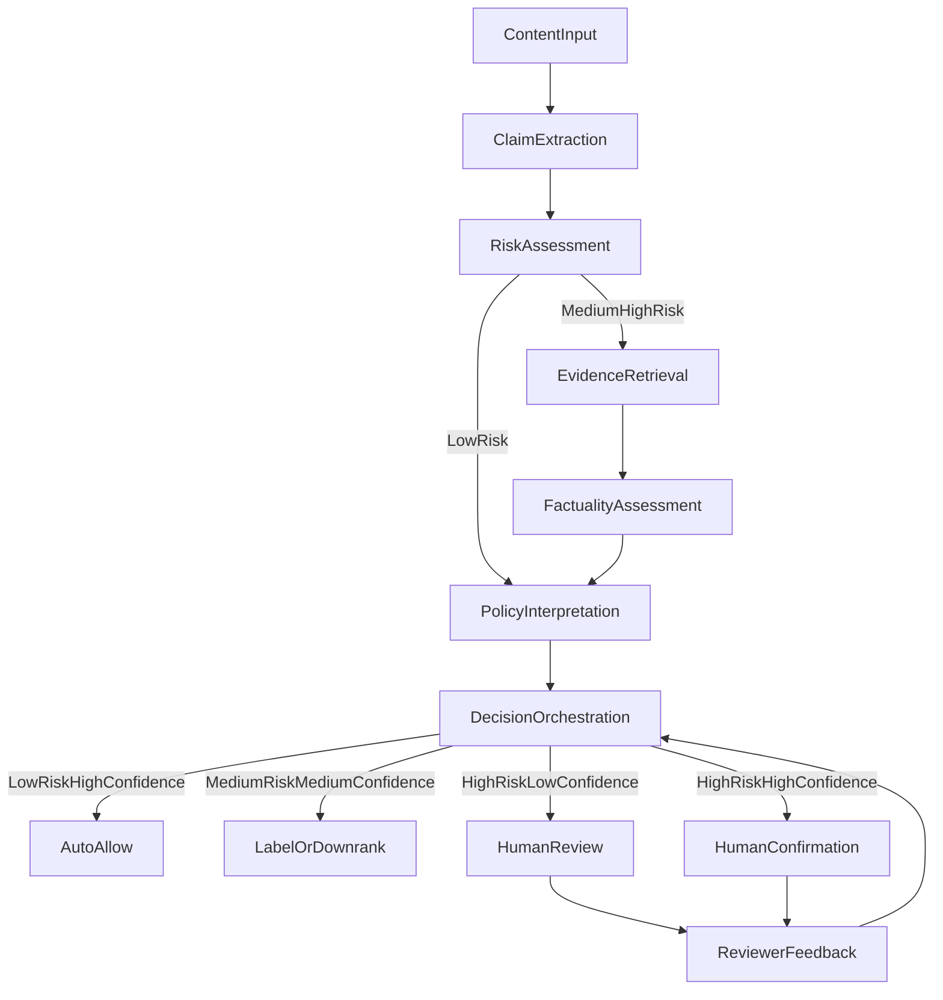
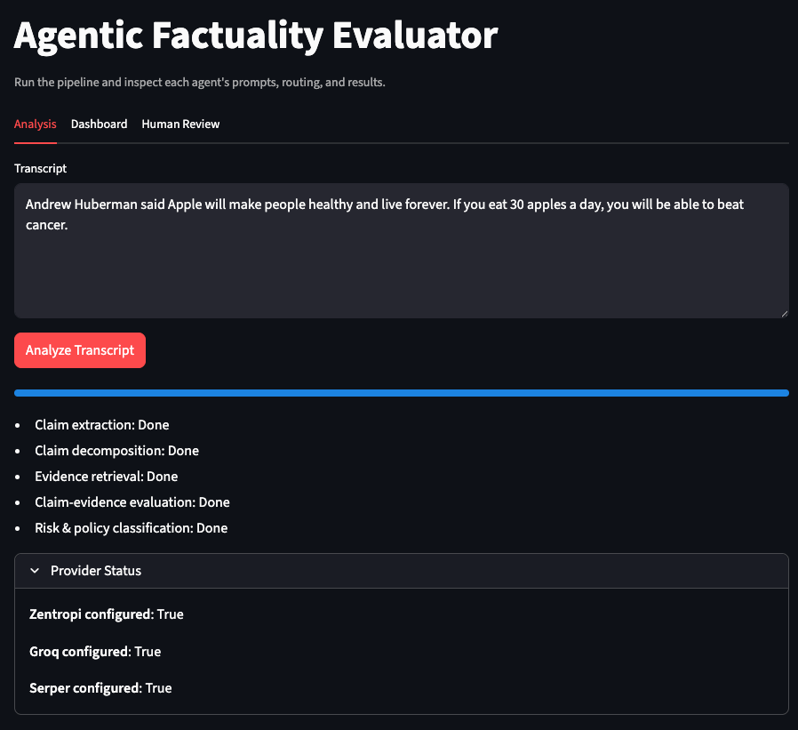
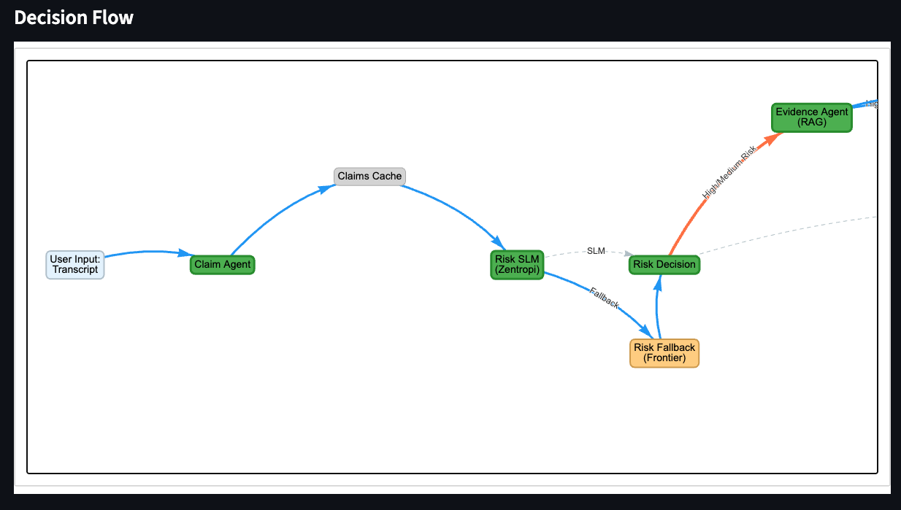
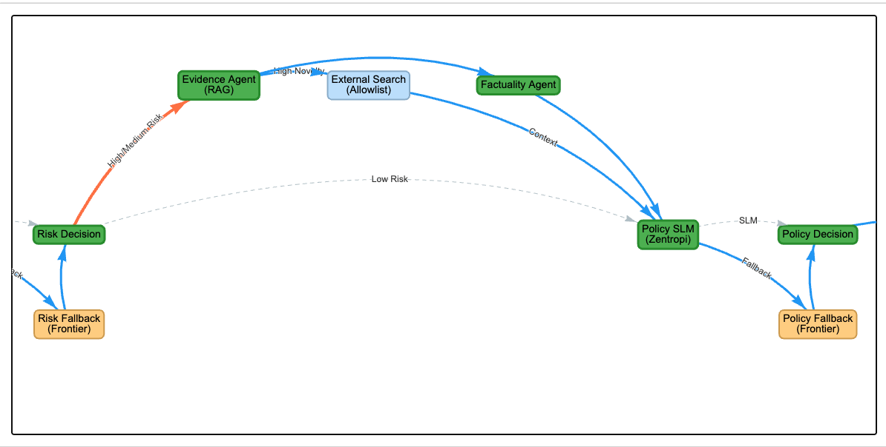
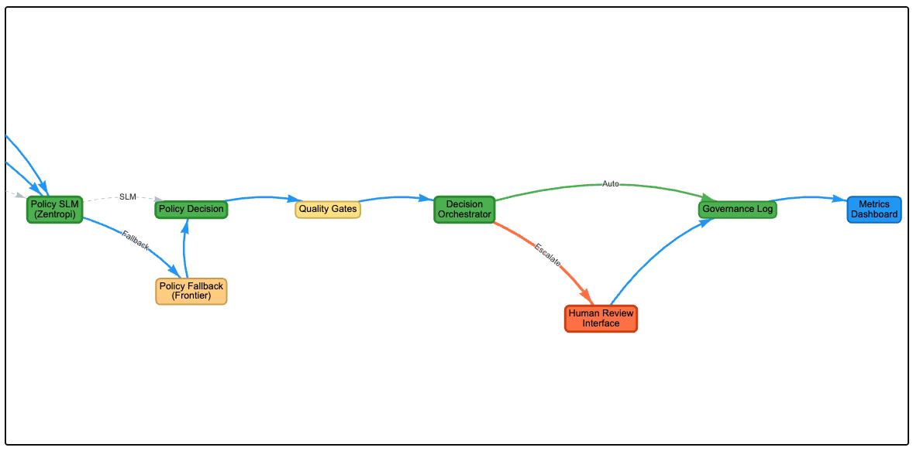
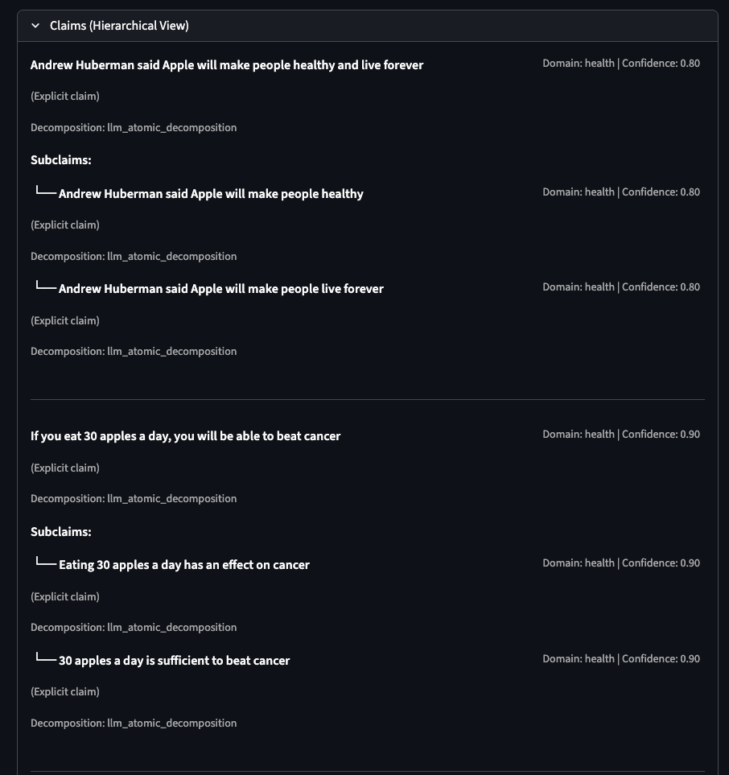
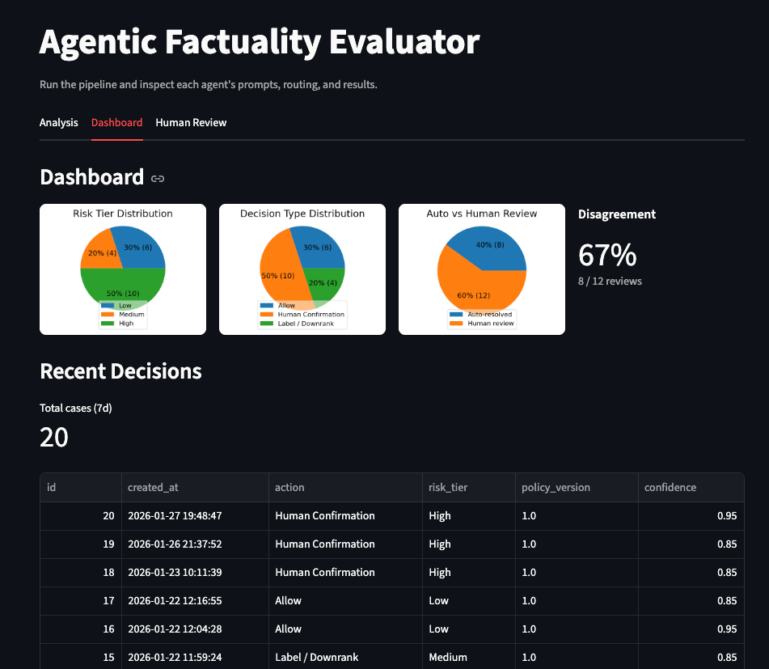

I built a proof-of-concept for policy-aware content moderation: a multi-agent pipeline where AI proposes, policy constrains, and humans decide. The demo is live at [llm-misinformation.streamlit.app](https://llm-misinformation.streamlit.app/).

The system is intentionally scoped as a design exploration, not a production deployment. Its purpose is to validate a specific hypothesis: that separating factuality assessment from policy enforcement, and routing decisions by risk tier, produces fewer false positives than single-model classifiers or combined fact-check-and-enforce pipelines. This post walks through the design, the tradeoffs I encountered while building it, and the measurement framework I would use in production.

## The Core Design Principle

Content moderation has a structural problem that better models alone cannot solve. A claim can be factually false yet policy-compliant ("the earth is flat" on most platforms). A claim can be factually true yet policy-violative (doxxing with accurate information). Any system that collapses factuality and policy into a single score will either over-enforce or under-enforce depending on which signal dominates.

This system keeps them separate. **AI agents propose analysis. Policy frameworks constrain what actions are available. Humans make final calls when stakes are high.** The pipeline allocates compute proportional to risk: low-risk content gets fast-tracked, high-risk content gets deep analysis and mandatory human review.

## System Flow

```mermaid
flowchart TD
  input[ContentInput] --> claims[ClaimExtraction]
  claims --> risk[RiskAssessment]
  risk -->|LowRisk| policy[PolicyInterpretation]
  risk -->|MediumHighRisk| retrieval[EvidenceRetrieval]
  retrieval --> factuality[FactualityAssessment]
  factuality --> policy
  policy --> decision[DecisionOrchestration]
  decision -->|LowRiskHighConfidence| allow[AutoAllow]
  decision -->|MediumRiskMediumConfidence| warn[LabelOrDownrank]
  decision -->|HighRiskLowConfidence| review[HumanReview]
  decision -->|HighRiskHighConfidence| confirm[HumanConfirmation]
  review --> feedback[ReviewerFeedback]
  confirm --> feedback
  feedback --> decision
```

## Example: High-Risk Health Claim

**Input transcript:**
"Andrew Huberman said Apple will make people healthy and live forever. If you eat 30 apples a day, you will be able to beat cancer."

**Risk routing.** The risk agent flags this as high-tier: health domain, vulnerable population exposure, specific causal claim about disease. Confidence 0.85. The claim gets routed to evidence retrieval.

**Evidence retrieval surfaces conflicting signals.** External search finds a general study about apples and cancer risk reduction. The study weakly supports "apples may have health benefits" but directly contradicts "30 apples a day will beat cancer." The system logs both the supporting and contradicting evidence without collapsing them into a single verdict.

**Final decision: human confirmation required.** Policy confidence is 0.95 (the claim clearly falls within health misinformation policy scope), but the system still routes to a human reviewer. High risk content with high policy confidence gets human confirmation, not auto-enforcement. The reviewer sees the full evidence chain, the factuality assessment, and the policy interpretation before acting.

## Pipeline Architecture and Design Decisions

The pipeline has six stages. Each uses a different model, chosen by the cost and consequence profile of that step.

### 1. Claim Extraction → Groq

A fast, low-cost model extracts verifiable factual claims and tags each by domain (health, finance, politics). Speed matters here; precision on claim boundaries is less critical because downstream stages re-evaluate everything. In the demo, this step runs in under 500ms per input.

### 2. Risk Assessment → Zentropi

A smaller model scores preliminary risk based on harm potential, likely exposure, and vulnerable populations. This is the routing gate: it determines how much compute the rest of the pipeline spends.

> **Design Decision: Risk-gated compute allocation**
>
> Early versions ran every claim through the full pipeline. The result was a system that spent frontier-model tokens on obvious low-risk content ("the weather in Paris is nice today") while adding latency to everything. Moving risk assessment upstream cut per-claim cost by roughly 60% in the demo, because most content is low-risk and skips evidence retrieval and factuality assessment entirely.

### 3. Evidence Retrieval → RAG + Web Search

For medium and high-risk claims, the system retrieves evidence from an internal knowledge base first, then triggers external search for novel claims. Both supporting and contradicting sources are returned. The evidence agent does not judge; it surfaces.

### 4. Factuality Assessment → Azure OpenAI

A frontier model evaluates whether each claim is likely true, likely false, or uncertain. This is the most expensive step, reserved for claims that passed the risk gate.

> **Design Decision: Separating factuality from policy enforcement**
>
> In early iterations, a single agent handled both factuality and policy interpretation. The failure mode was predictable: the model treated "false" as synonymous with "violative." Gray-area health claims (exaggerated but partially grounded) were flagged as policy violations even when the platform policy only prohibits demonstrably dangerous medical advice. This pushed the system toward over-enforcement.
>
> Splitting factuality and policy into independent stages fixed this. The factuality agent can output "likely false, low confidence" without triggering any action. The policy agent evaluates independently whether the content crosses the enforcement threshold. The result: false positives on health claims dropped significantly in my testing.

### 5. Policy Interpretation → Zentropi with Fallback

The policy agent reads the platform's content policy as natural language input and determines whether the content violates it. Policy text is a runtime parameter, not hard-coded logic.

> **Design Decision: Policy as input, not code**
>
> I initially encoded policy rules as conditional logic (if health_claim and confidence > 0.8, then flag). This broke immediately when I tested against a second platform's policy with different thresholds and category definitions. Treating policy as natural language input means the same pipeline works across different policy frameworks. The tradeoff: the policy agent can misinterpret ambiguous policy language, which is why high-risk decisions still require human confirmation.

### 6. Decision Orchestration

The orchestrator combines risk tier and policy confidence into a routing decision:

- **Low risk, high confidence** → auto-allow
- **Medium risk, medium confidence** → label or downrank
- **High risk, low confidence** → human review (system is unsure, needs human judgment)
- **High risk, high confidence** → human confirmation (system is confident, but stakes are too high for full automation)

The last category is the key design choice. Even when the system is confident about a high-risk violation, it routes to a human. This deliberately sacrifices throughput for reversibility.

## Why Multi-Agent, Not Single-Model

I tested simpler baselines and found specific failure modes:

**Single-model classifier.** Faster, but collapsed policy nuance into a binary label. A GPT-4 classifier asked "is this misinformation? yes/no" produced confident answers with hidden reasoning. When it was wrong, there was no evidence trail to diagnose why.

**Trust-score-only system.** Cheaper, but confidence scores without supporting evidence created a false sense of reliability. A score of 0.92 looks authoritative until you realize it was derived from a single paraphrased source.

**Human-only review.** Accurate, but the queue grows faster than reviewers can process. In any production setting, low-risk content needs automated handling so human capacity is preserved for genuinely ambiguous cases.

The multi-agent design addresses each failure mode: evidence stays visible, reasoning is decomposed into auditable steps, and human capacity is allocated where it has the most impact.

## Measurement Framework

If this system were deployed, I would track three primary metrics. These reflect what I consider the actual optimization targets for content moderation, distinct from model-level precision/recall.

**1. High-risk misinformation exposure.** The share of user impressions containing high-risk misinformation. This measures what users actually experience in the feed. Internal flag counts alone can mask exposure if flagged content has already been widely distributed.

**2. Over-enforcement rate.** Human overrides of automated decisions, appeal reversals, and disagreement rates between the system and reviewers. Rising over-enforcement is a failure signal even when model confidence is high. In practice, this is the metric most moderation systems under-invest in tracking.

**3. Human review concentration.** The share of reviewer capacity spent on high-risk, high-uncertainty cases. If reviewers spend most of their time on content the system could have auto-allowed, the routing logic is wasting their attention. The target is the inverse: maximize the proportion of human review time spent on genuinely difficult decisions.

Precision and recall are guardrail metrics, tracked but not optimized directly. The optimization target sits above them: keep errors in zones where humans can catch and reverse them.

## Governance and Auditability

Every decision is logged with full context:

- Policy version used at decision time
- Model and prompt versions for each agent
- Evidence available when the decision was made
- Whether the decision was automated or human-reviewed
- If human-reviewed, the reviewer's override rationale

This audit trail enables retroactive re-evaluation. When a policy changes or new evidence emerges, operators can identify which past decisions were made under the old policy and assess whether they would change under the new one.

## Limitations and Production Gap

This is a demo. Several things would need to change for production deployment.

**Latency.** The full pipeline takes 8-15 seconds end-to-end in the demo. A production system processing millions of items daily would need async processing, pre-computed risk scores, and cached evidence retrieval. The current synchronous architecture is designed for explainability, not throughput.

**Threshold calibration.** The risk tiers and confidence thresholds in the demo are hand-tuned on a small number of test cases. Production deployment would require calibration against labeled datasets with known ground truth, and ongoing recalibration as content patterns shift.

**Evidence quality.** The demo's evidence retrieval uses web search and a small knowledge base. At production scale, evidence sourcing would need authoritative source ranking, recency weighting, and handling of conflicting expert consensus. The current setup does not distinguish between a peer-reviewed study and a blog post.

**Adversarial robustness.** The demo has no defense against adversarial inputs designed to game the risk assessment or factuality stages. Production content moderation must account for deliberate evasion.

These gaps are tractable engineering problems, not fundamental design flaws. The demo validates the design hypothesis; closing these gaps is the work of productionization.

## Design Principles

Six principles emerged from building this system.

**Confidence gating makes model cost manageable.** Small, fast models handle the majority of decisions. Frontier models are reserved for cases where the small model's confidence falls below threshold. In the demo, roughly 70% of inputs skip the expensive factuality assessment entirely.

**Factuality and enforcement are independent axes.** False content can be policy-compliant. True content can violate policy. Any system that conflates these two signals will systematically misclassify content in the quadrants where they diverge.

**Escalation design matters more than marginal accuracy.** A system that routes uncertain cases to humans builds more operational trust than a system with 2% higher accuracy that occasionally makes confident, irreversible mistakes.

**Policy encoded as natural language is more adaptable than policy encoded as code.** Hard-coded rules break when policy language changes. Natural language policy input lets the same pipeline serve different platforms and adapt to policy revisions without code changes.

**Observability is a prerequisite, not a feature.** Operators need the full reasoning chain: inputs, intermediate scores, thresholds applied, policy version, and evidence used. Without this, debugging a bad decision requires reverse-engineering the entire pipeline.

**Conservative defaults protect trust.** The system favors human review over automated enforcement for ambiguous, high-risk content. It favors keeping uncertainty visible over collapsing it into a clean score. The most damaging failure mode in content moderation is a confident wrong decision at scale. Visible uncertainty is recoverable; silent overconfidence is not.

## Try It

The demo is live at [llm-misinformation.streamlit.app](https://llm-misinformation.streamlit.app/). Paste in any content, watch the agent pipeline process it, and explore how different risk levels and policy interpretations produce different routing decisions.

Source code: [github.com/cynthialmy/llm-misinformation](https://github.com/cynthialmy/llm-misinformation) ([architecture overview](https://github.com/cynthialmy/llm-misinformation), [API usage](https://github.com/cynthialmy/llm-misinformation/blob/main/API_Usage_Explanation.md)). The decision-flow write-up is at [github.com/cynthialmy/llm-decision-flow](https://github.com/cynthialmy/llm-decision-flow).
