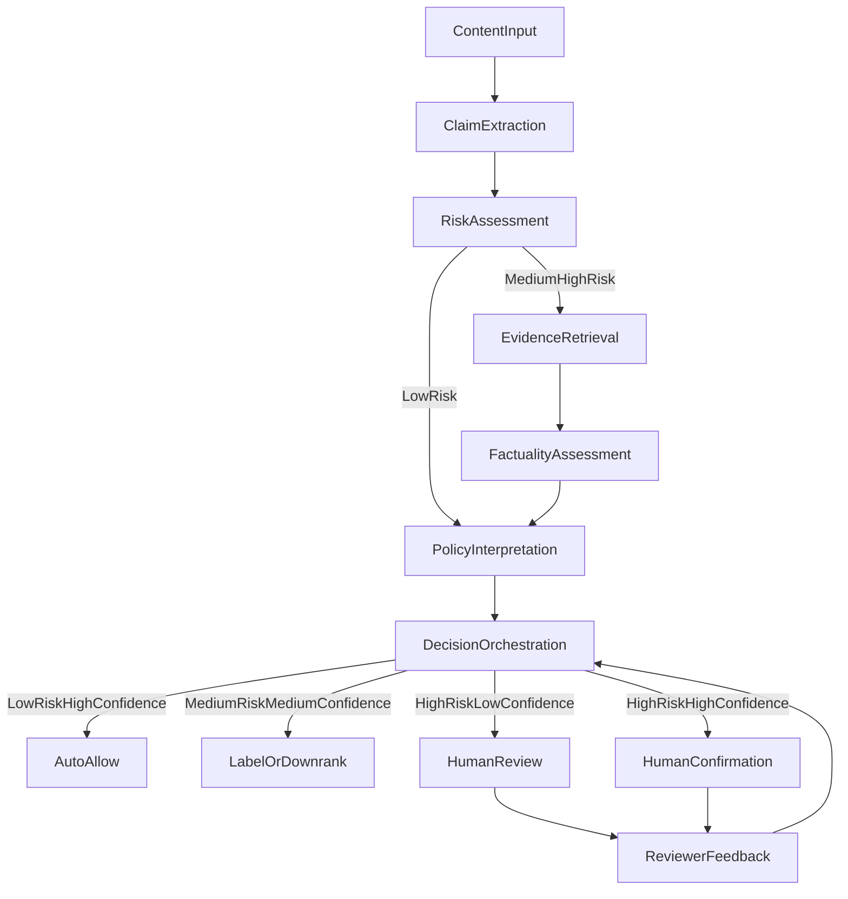

Content moderation at scale is one of the hardest problems in modern tech. When platforms like TikTok, YouTube, or Facebook need to make decisions about billions of pieces of content daily, a stronger model alone does not finish the job. The real challenge is making responsible decisions under genuine uncertainty while still catching harmful content at scale.

I built a demo, live at [llm-misinformation.streamlit.app](https://llm-misinformation.streamlit.app/), that shows how agentic AI workflows can approach this challenge through deliberate escalation and policy-aware decision design. Multiple specialized agents work together within policy constraints, with humans in the loop for high-stakes decisions.

## Product Framing: Agents Propose, Policies Constrain, Humans Decide

Most AI moderation demos fall into one of two traps: either they are fully autonomous truth oracles that claim to know what is true, or they are simple binary classifiers that ignore the messy reality of content policy.

This system takes a different approach. It is built on a simple principle: **AI agents should propose analysis and recommendations, policy frameworks should constrain what is actionable, and humans should make final decisions when stakes are high.**

Think of it like a well-designed organization. Junior analysts handle volume; edge cases rise to senior review. The system is designed to escalate intelligently, automate the clear cases, surface the ambiguous ones, and always provide full reasoning for review.

## System Flow Chart

```mermaid
flowchart TD
  input[ContentInput] --> claims[ClaimExtraction]
  claims --> risk[RiskAssessment]
  risk -->|LowRisk| policy[PolicyInterpretation]
  risk -->|MediumHighRisk| retrieval[EvidenceRetrieval]
  retrieval --> factuality[FactualityAssessment]
  factuality --> policy
  policy --> decision[DecisionOrchestration]
  decision -->|LowRiskHighConfidence| allow[AutoAllow]
  decision -->|MediumRiskMediumConfidence| warn[LabelOrDownrank]
  decision -->|HighRiskLowConfidence| review[HumanReview]
  decision -->|HighRiskHighConfidence| confirm[HumanConfirmation]
  review --> feedback[ReviewerFeedback]
  confirm --> feedback
  feedback --> decision
```

## Example Flow: High-Risk Health Claim

**Transcript input:**
"Andrew Huberman said Apple will make people healthy and live forever. If you eat 30 apples a day, you will be able to beat cancer."

**Routing Decision**
Risk tier: High
Routing: High or medium risk to Evidence Agent
Risk confidence: 0.85

**AI found something interesting and conflicting:**
External search triggered due to high novelty. It surfaced a general study about apples and cancer risk that weakens the extreme claim. The system treated this as conflicting context, stopping short of treating any single source as definitive proof.

**Final Decision**
Action: Human Confirmation
Confidence: 0.95
Rationale: High risk content with high policy confidence requires human confirmation before action.

## How It Works: A Pipeline of Specialized Agents

When someone submits a piece of content like a social media transcript, it flows through a cascade of specialized agents.

### 1. Claim Extraction (Groq)

A fast language model extracts factual claims from the content. At this step the focus is on identifying statements that can be verified; truth judgments come later. Each claim is tagged by domain, because different domains require different evidentiary standards.

### 2. Risk Assessment (Zentropi)

Before doing expensive fact-checking, a smaller model assesses preliminary risk based on potential harm, likely exposure, and vulnerable populations. This is where the system decides whether to invest in deep analysis or fast-track low-risk content.

### 3. Evidence Retrieval (RAG and Search)

For medium and high-risk content, the system retrieves evidence. It starts with an internal knowledge base, then searches external sources when it encounters novel claims. The evidence agent returns supporting and contradicting information, because real fact-checking requires seeing both sides.

### 4. Factuality Assessment (Azure OpenAI)

A frontier model assesses whether claims are likely true, likely false, or uncertain. Factuality and policy violation are separate signals. Something can be false and still be allowed.

> **Design Decision: Separating Factuality from Policy Interpretation**
>
> This system intentionally separates factuality assessment from policy interpretation. In early designs, combining these steps caused the system to become overconfident in gray-area health claims. False claims were treated as automatically violative, even when policy guidance was ambiguous or evolving.
>
> This increased false positives and pushed the system toward over-enforcement. By isolating factuality as a non-enforcement signal, the system can acknowledge uncertainty without prematurely triggering action.

### 5. Policy Interpretation (Zentropi with Fallback)

A specialized agent reads the platform policy and determines whether the content violates it. The policy text is treated as flexible input, which allows adaptation to different policy frameworks without encoding every rule in code.

### 6. Decision Orchestration

The system combines risk assessment and policy confidence to decide:
- **Low risk and high confidence** leads to automatic allow
- **Medium risk and medium confidence** leads to warning or downranking
- **High risk and low confidence** leads to human review
- **High risk and high confidence** still requires human confirmation

## Why This Design vs Simpler Baselines

I considered simpler baselines and rejected them for specific failure modes:
- **Single-model classifiers** were faster, but collapsed policy nuance into a binary label and hid evidence quality.
- **Trust-score-only systems** were cheaper, but produced confident-looking outputs with weak justification, increasing false positives.
- **Human-only review** was safest, but overloaded reviewers and created unacceptable latency for low-risk content.

The multi-agent design keeps the core tradeoff visible: pay more compute only when risk is high, and always preserve the evidence trail for accountable decisions.

## Decision Economics: Matching Cost and Confidence to Risk

Instead of defaulting to a single powerful model, the system allocates compute based on decision criticality.

For low-risk, reversible steps like claim extraction, speed and cost efficiency matter more than perfect reasoning. For high-stakes factual judgments that could influence enforcement or user trust, the system intentionally escalates to stronger models.

This design treats model accuracy as a *scarce resource* to be spent where mistakes are most expensive. Cheaper steps can tolerate lighter models; the pipeline saves frontier capacity for trust-critical judgments.

In practice, this means using fast, low-cost models where mistakes are cheap, and reserving frontier models for decisions with real trust impact.

## What Makes This Different: Embracing Uncertainty

Most AI demos hide their limitations. This system makes uncertainty explicit.

- Conflicting evidence stays visible in the record
- Low confidence routes to escalation before any automated action
- Policy ambiguity surfaces explicitly in the UI
- Human review is a first-class outcome with full context

The dashboard tracks metrics that matter for trust: human AI disagreement rates, review load concentration, and appeal reversal proxies.

## How I Measure Success

Success here means improving trust outcomes at scale more than maximizing raw accuracy on a leaderboard. I focus on three primary metrics:

**1. High-risk misinformation exposure**
The share of user views that contain high-risk misinformation. This reflects what users actually experience in the feed, beyond internal flag counts alone.

**2. Over-enforcement proxy**
Human overrides, appeal reversals, and disagreement between automated decisions and reviewers. Rising over-enforcement is treated as a failure signal, even if model confidence is high.

**3. Human review concentration**
The percentage of human review capacity spent on high-risk, high-uncertainty cases. If reviewers are overloaded with low-impact content, the system is misallocating attention.

Precision and recall are tracked internally as guardrail metrics. The optimization target sits above them: reduce *recoverable* errors first, accept that perfection on every item is unrealistic, and keep mistakes in zones where humans can fix them.

## Human Review: The Safety Net

When content gets escalated, human reviewers see the full chain of reasoning, all evidence, the policy interpretation and confidence level, and similar prior decisions. Reviewers can override recommendations and provide rationale. This feedback loop surfaces edge cases and policy gaps.

## The Governance Layer: Built for Accountability

Every decision is logged with versioning:
- Policy version used
- Models and prompts used
- Evidence available at the time
- Whether it was automated or human-reviewed

This enables re-evaluation when policies or evidence change, which is critical for evolving domains.

## What I Learned

1. **Confidence gating is essential.** Small, fast models can handle most decisions if they can defer to stronger models when uncertain.
2. **Policy as input beats policy as code.** Hard-coded rules are brittle. Natural language policies are adaptable.
3. **Escalation design matters more than raw accuracy.** Smart routing builds trust faster than a marginal accuracy gain.
4. **Factuality and moderation are different problems.** False content can be policy-compliant and true content can still violate policy.
5. **Observability is everything.** In production, operators need the full rationale behind each decision, including inputs, thresholds, and policy version.
6. **Tradeoffs must be explicit.** I tuned thresholds to balance reviewer load, latency, and policy coverage, prioritizing high-risk recall over low-risk throughput.

## Conservative by design

This system is intentionally conservative in several ways:

- On ambiguous, high-risk content, it favors human judgment and accepts slower turnaround.
- It trades maximum automation for reversibility and trust recovery; throughput is secondary.
- It keeps uncertainty visible: conflicting evidence and policy ambiguity stay in the record instead of collapsing into one opaque score.

These constraints are deliberate. In content moderation, the most damaging failures are confident wrong answers at scale; healthy uncertainty is easier to recover from.

## Try It Yourself

The demo is live at [llm-misinformation.streamlit.app](https://llm-misinformation.streamlit.app/). You can paste in content, watch the agent pipeline in action, see the decision flow, and explore how different risk levels and policy interpretations lead to different outcomes.

Code and reference docs: [github.com/cynthialmy/llm-misinformation](https://github.com/cynthialmy/llm-misinformation) ([architecture overview](https://github.com/cynthialmy/llm-misinformation), [API usage](https://github.com/cynthialmy/llm-misinformation/blob/main/API_Usage_Explanation.md)). The decision-flow write-up and layout also live at [github.com/cynthialmy/llm-decision-flow](https://github.com/cynthialmy/llm-decision-flow).
