In early 2026, an open-source project called [OpenClaw](https://github.com/openclaw/openclaw) exploded onto the scene, surpassing 230,000 GitHub stars within weeks. It represented a fundamental shift in how we think about AI assistants: not as stateless chatbots, but as persistent, context-aware digital coworkers that run on your own hardware.

I was fascinated by OpenClaw's architecture, particularly its layered design (Gateway, Agents, Memory, Skills, Heartbeat) and its emphasis on local-first ownership. But as a product manager who primarily works inside a code editor, I did not need a full multi-channel platform with WhatsApp, Telegram, and Docker sandboxing. What I needed was something much lighter: an AI assistant that lives in my IDE, remembers what I care about, and gets better at helping me over time.

This post covers two independent projects I built that share a common design philosophy. **Daily Assistant** is a lightweight, OpenClaw-inspired personal AI system that runs entirely as Markdown files and Cursor IDE rules. No servers. No daemons. No external dependencies. Just files, rules, and a structured evolution workflow. **[bip](https://github.com/cynthialmy/build-in-public-automate)** is a separate CLI tool that reads your git commits, generates platform-tailored posts with Claude AI, and publishes them to X, LinkedIn, Reddit, and HackerNews. Both are local-first and Claude-powered. Both store all state as plain files. But they are architecturally independent tools that complement each other in a developer's daily workflow.

---

## What OpenClaw Gets Right

Before diving into what I built, it is worth understanding the system that inspired it.

OpenClaw is a self-hosted AI assistant platform created by Peter Steinberger. It runs on your own hardware (a laptop, Mac Mini, VPS, or Docker container) and connects large language models to the messaging apps you already use. The fundamental shift it represents is treating your AI assistant not as a prompt engineering challenge, but as an infrastructure problem.

### OpenClaw's Architecture

OpenClaw follows a hub-and-spoke architecture where the Gateway acts as the central hub, routing messages from any channel into a shared agent and memory backend:

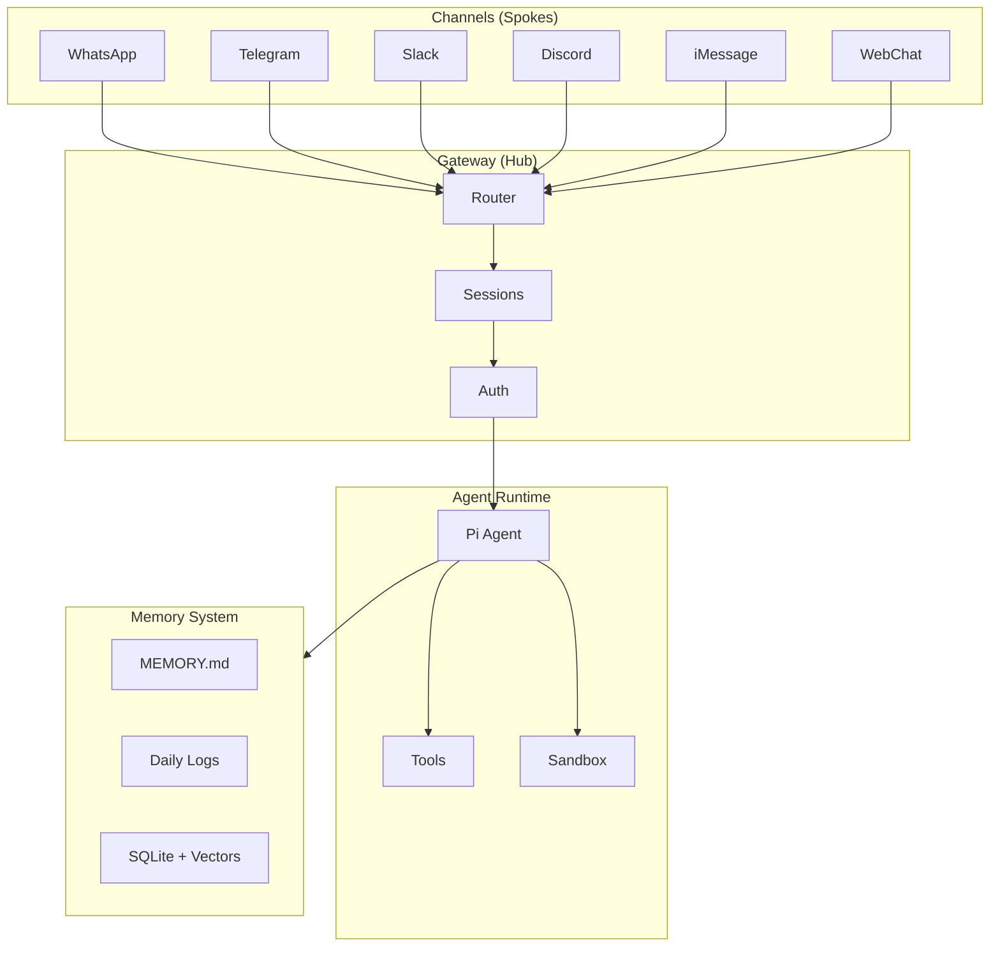

| Layer | Component | Responsibility |
|-------|-----------|----------------|
| Interface | Gateway | WebSocket control plane, message routing, authentication |
| Orchestration | Hub | State machine, message queue, single source of truth |
| Intelligence | Agent | Intent understanding, task planning, tool calling (ReAct loop) |
| Execution | Skills | Concrete tool invocations via MCP protocol |

Cross-cutting: the **Memory system** (Markdown files as canonical source, SQLite with vector embeddings as derived index) provides context across all layers.

### Key OpenClaw Features

- **50+ integrations**: WhatsApp, Telegram, Discord, Slack, Signal, iMessage, Microsoft Teams, and more
- **Heartbeat system**: Agents run 24/7, proactively monitoring tasks at configurable intervals
- **Cron jobs**: Persistent scheduler for precise timing (daily reports, health checks)
- **Multi-agent orchestration**: Multiple isolated agents with separate workspaces and sessions
- **ClawHub marketplace**: 5,700+ community-built skills with semantic search
- **Security model**: DM pairing, Docker sandboxing, exec approval chains, Tailscale integration
- **SOUL.md**: A personality definition file that shapes agent behavior across sessions

---

## Why I Built My Own Instead of Using OpenClaw Directly

This was a deliberate product decision, not a case of "not invented here" syndrome. The reasoning came down to four factors.

### Safety and Transparency

OpenClaw is a powerful platform, but power comes with attack surface. In February 2026, security researchers discovered the "ClawHavoc" incident: 341 malicious skills on ClawHub were stealing user data, and 283 skills (7.1%) had critical security flaws. While OpenClaw responded quickly with VirusTotal scanning and publisher verification, the incident highlighted a real risk.

My system has zero dependency on external skill registries. Every file is a plain Markdown document that I can read, audit, and version-control with git. There is no binary execution, no Docker container orchestration, and no third-party skill marketplace.

### Complexity vs. Need

OpenClaw requires Node.js 22+, a running Gateway daemon (launchd/systemd service), channel configuration (WhatsApp QR pairing, Telegram bot tokens, etc.), and optionally Docker for sandboxing. That is a lot of infrastructure for a single-user, single-device use case.

I work almost exclusively inside Cursor IDE. My assistant does not need to answer WhatsApp messages or manage Discord servers. It needs to remember my preferences, help me think through problems, and improve itself based on how I actually work.

### Full Auditability

Every piece of state in my system is a Markdown file:

- `SOUL.md` defines the assistant's personality. I can read it in 30 seconds.
- `MEMORY.md` contains everything the assistant "knows" about me. I can edit or delete any line.
- `evolution/CHANGELOG.md` tracks every self-modification with timestamps and rationale.

Compare this to OpenClaw, where state is distributed across `~/.openclaw/` in JSON configs, SQLite databases, credential stores, and session files. That is more powerful, but also harder to audit quickly.

### Evolution as a First-Class Concept

OpenClaw has the infrastructure for agents to learn (memory files, SOUL.md, workspace skills), but it does not prescribe a structured evolution workflow. My system makes self-improvement an explicit, trackable process with dedicated directories, reflection templates, and a changelog.

---

## Daily Assistant: System Design

### Design Philosophy

The core insight is that Cursor IDE already provides two of OpenClaw's four layers for free:

- **Gateway** = Cursor itself (it handles the user interface, message routing, and tool orchestration)
- **Agent Runtime** = Cursor's built-in AI agent (it does the LLM reasoning, tool calling, and streaming)

What Cursor does not provide out of the box is the "operating system" layer around the agent: persistent identity, structured memory, and self-improvement mechanisms. That is what Daily Assistant builds.

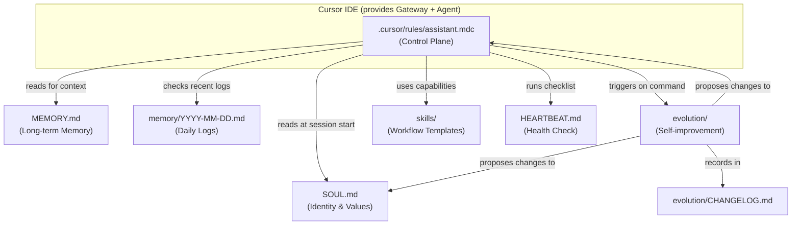

### Project Structure

```
daily-assistant/
|
+-- .cursor/
|   +-- rules/
|       +-- assistant.mdc           # The control plane: boot sequence,
|                                    # ReAct loop, memory rules,
|                                    # evolution workflow, heartbeat
|
+-- SOUL.md                          # Identity, communication style,
|                                    # values, boundaries, growth mindset
|
+-- MEMORY.md                        # Long-term curated facts: user
|                                    # profile, preferences, projects,
|                                    # conventions
|
+-- HEARTBEAT.md                     # On-demand health check checklist:
|                                    # memory hygiene, open loops,
|                                    # tool status, friction points
|
+-- memory/                          # Daily interaction logs
|   +-- 2026-02-27.md               # (append-only, one file per day)
|   +-- 2026-02-28.md
|   +-- ...
|
+-- evolution/
|   +-- CHANGELOG.md                 # Append-only log of every
|   |                                # self-modification (date, files
|   |                                # touched, rationale)
|   +-- reflections/
|       +-- 2026-02-27.md           # Deeper self-analysis notes from
|       +-- ...                      # explicit "evolve" sessions
|
+-- skills/                          # Reusable workflow templates
|   +-- (Markdown guides added       # e.g. research workflow,
|    over time)                      # writing workflow, review checklist
|
+-- workflows/                       # Longer structured process templates
|   +-- research.md
|
+-- config/
|   +-- mcporter.json                # External tool config (Exa search)
|
+-- openclaw-design-deep-dive.md     # Reference: OpenClaw architecture
+-- README.md                        # Project documentation
```

### Component Deep Dive

#### 1. The Control Plane: `.cursor/rules/assistant.mdc`

This is the single most important file in the system. It is a Cursor project rule that gets automatically loaded whenever the project is opened. It functions as the "Gateway" of the system, defining:

**Boot Sequence**: At the start of every session, the assistant reads `SOUL.md` (identity), `MEMORY.md` (long-term context), and the most recent daily logs and reflections. This gives it continuity across conversations.

**ReAct Working Loop**: For non-trivial tasks, the assistant follows a structured Reason, Act, Observe, Iterate cycle. It prefers fixing root causes over symptoms and verifies its own work.

**Memory Responsibilities**: Clear rules for what goes where. Stable facts go to `MEMORY.md`. Session-specific notes go to daily logs. The assistant actively proposes promoting important daily log entries to long-term memory.

**Evolution Triggers**: Defines the exact conditions under which the assistant can propose self-modifications, and the approval workflow it must follow.

**Heartbeat Protocol**: Maps user commands like "health check" to the structured checklist in `HEARTBEAT.md`.

#### 2. Identity Layer: `SOUL.md`

Inspired directly by OpenClaw's SOUL.md concept. This file defines five core values:

1. **Correctness over speed**: Verify before assuming
2. **Root-cause thinking**: Hypothesize and test, do not patch symptoms
3. **Local-first and privacy**: Keep data on-device, explain any external calls
4. **Evolvability**: Treat own behavior as refactorable code
5. **Honesty about uncertainty**: Label guesses as guesses

It also defines explicit boundaries: no destructive commands without confirmation, no silent changes to core files, no fabricated facts.

#### 3. Memory System: `MEMORY.md` + `memory/`

A two-tier memory architecture:

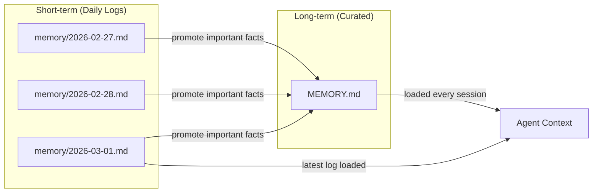

- **Daily logs** (`memory/YYYY-MM-DD.md`): Append-only, one file per day. Captures decisions, TODOs, experiments, and session notes. High volume, moderate signal.
- **Long-term memory** (`MEMORY.md`): Curated, stable facts. User profile, preferences, project context, conventions. Low volume, high signal. Updated only when daily log entries prove to be persistent.

This mirrors OpenClaw's approach (Markdown files as canonical source) but skips the SQLite vector index. For a single-user system where the assistant reads files directly, full-text file reading is sufficient.

#### 4. Health Checks: `HEARTBEAT.md`

A structured checklist with five sections:

1. **Memory Health**: Is `MEMORY.md` current? Any daily log facts to promote? Any stale entries?
2. **Open Loops**: Unresolved TODOs, parked questions, temporary decisions that became permanent
3. **Tools and Integrations**: Verify external tool configurations and API access
4. **Workflows and Friction**: Identify repeated manual steps, propose automation
5. **Evolution Hooks**: Flag patterns that warrant a full reflection session

Unlike OpenClaw's Heartbeat (which runs on a timer, e.g. every 30 minutes), this is pull-based. The user triggers it when they want a status check. This is a deliberate trade-off: no background process needed, but no proactive monitoring either.

#### 5. Self-Evolution: `evolution/`

This is the most distinctive component of the system. The evolution workflow follows a structured five-step process:

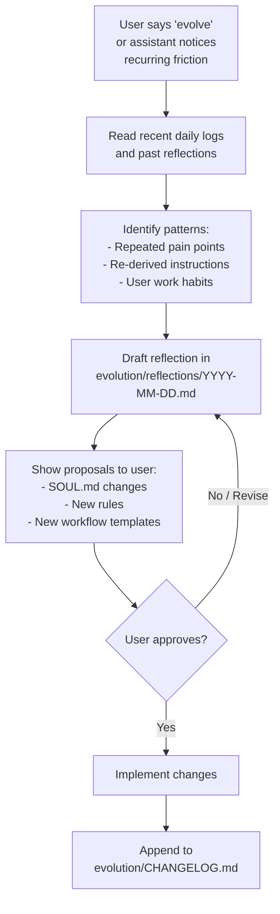

Key design principle: **the assistant never silently changes its own identity or rules.** Every modification goes through explicit user approval and gets logged with a timestamp and rationale. This creates a fully auditable evolution trail.

---

## bip: Build in Public CLI

While Daily Assistant focuses on thinking, planning, and remembering inside the IDE, **[bip](https://github.com/cynthialmy/build-in-public-automate)** focuses on sharing what you ship. It is a standalone Node.js CLI tool, installed separately via npm, that reads your git activity, generates platform-tailored posts with Claude AI, and publishes them with a single command.

bip and Daily Assistant are architecturally independent. bip does not read `MEMORY.md` and Daily Assistant does not invoke `bip`. They share a design philosophy (local-first, file-based, Claude-powered) and they complement each other naturally in a developer's daily workflow, but each runs on its own.

### How bip Works

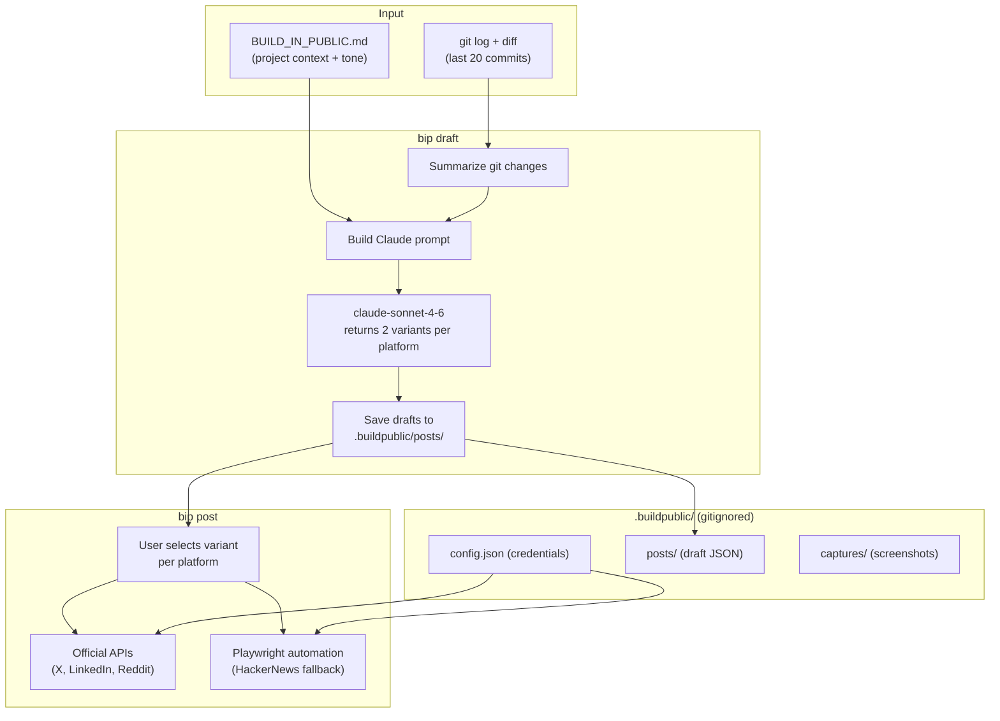

### Key Commands

```bash
npm install -g build-in-public   # install once

bip init                         # scaffold .buildpublic/ and BUILD_IN_PUBLIC.md
bip auth x                       # save platform credentials
bip draft                        # analyze git and generate post variants
bip post                         # publish selected drafts
bip post --dry-run               # preview with character counts, no API calls
bip doctor                       # diagnose credential and config issues
bip status                       # platform status and recent drafts at a glance
bip history                      # browse past drafts with previews
```

### Project Structure

```
your-project/
|
+-- BUILD_IN_PUBLIC.md           # Project context, audience, post style
|                                # (edit this to improve generated posts)
|
+-- .buildpublic/                # All bip data (gitignored)
    +-- config.json              # Platform credentials
    +-- posts/                   # Draft JSON files (one per run)
    +-- captures/                # Screenshots and session recordings
    +-- hn-state.json            # HackerNews browser session cookies
```

bip is installed globally and can be used in any project that has a git history. Running `bip init` creates the `BUILD_IN_PUBLIC.md` template in the current repo. Everything bip needs lives inside that repo's `.buildpublic/` directory.

---

## Feature Comparison

### Daily Assistant vs. OpenClaw

| Capability | Daily Assistant | OpenClaw |
|------------|----------------|----------|
| **Interface** | Cursor IDE only | 15+ channels (WhatsApp, Telegram, Slack, Discord, iMessage, etc.) |
| **Deployment** | Zero setup (just open the project) | Node 22+ daemon, channel config, optional Docker |
| **Background execution** | None (pull-based) | 24/7 Gateway with Heartbeat and Cron |
| **Memory format** | Plain Markdown (human-readable) | Markdown + SQLite + vector embeddings |
| **Memory search** | File reading (sequential) | Hybrid: vector similarity + BM25 keyword |
| **Skill ecosystem** | Local Markdown workflow templates | ClawHub marketplace (5,700+ skills) |
| **Multi-agent** | Single agent | Multiple isolated agents with separate workspaces |
| **Security model** | File-level transparency + boundaries in SOUL.md | DM pairing, Docker sandbox, exec approval, Tailscale |
| **Self-evolution** | First-class workflow with reflection, approval, and changelog | Ad-hoc (no prescribed evolution process) |
| **Voice / Canvas** | Not supported | Voice Wake, Talk Mode, Live Canvas |
| **Mobile integration** | Not supported | iOS and Android nodes (camera, screen, location) |
| **Setup time** | About 2 minutes | 15 to 60 minutes depending on channels |

### bip vs. Manual Build-in-Public

| Capability | bip | Manual approach |
|------------|-----|-----------------|
| **Post generation** | Claude reads git context and generates platform-tailored variants | Write from scratch each time |
| **Platform coverage** | X, LinkedIn, Reddit, HackerNews in one command | Separate logins and editors per platform |
| **Publishing** | Official APIs with Playwright fallback | Manual copy-paste |
| **Draft history** | JSON files in `.buildpublic/posts/` | Wherever you saved them |
| **Setup** | `npm install -g build-in-public` + `bip init` | None |
| **Local-first** | All data in `.buildpublic/` (gitignored) | Third-party scheduler tools |

### Where Daily Assistant Wins (over OpenClaw)

- **Radical simplicity**: The entire system is about 10 Markdown files. Anyone can understand it in 5 minutes.
- **Total transparency**: Every piece of state is a plain text file. Git diff shows exactly what changed and when.
- **Structured evolution**: Self-improvement has dedicated directories, a formal workflow, and an auditable changelog.
- **IDE-native**: Context-aware about your code, files, and terminal, not just chat messages.
- **Zero attack surface**: No external skill registry, no network listeners, no Docker containers.

### Where OpenClaw Wins

- **Multi-channel reach**: One assistant, accessible from WhatsApp, Telegram, Slack, Discord, iMessage, and more.
- **Always-on proactivity**: Real Heartbeat (runs every 30 minutes) and Cron enable proactive monitoring without user prompting.
- **Deep tool integration**: Browser control (Chromium CDP), Canvas/A2UI, mobile device nodes.
- **Mature security model**: Docker sandboxing per session, exec approval chains, DM pairing for unknown senders.
- **Community ecosystem**: 800+ active developers, 15,000+ daily skill installations, growing marketplace.
- **Scalable memory**: SQLite with vector embeddings enables semantic search over large memory stores.

### What I Deliberately Left Out of Daily Assistant

- No background execution: cannot proactively alert you about anything
- No multi-device access: works only inside Cursor on one machine
- No voice interface: text-only interaction
- Memory search is sequential file reading, which will slow down as daily logs accumulate over months
- No sandboxing: the assistant has the same filesystem access as Cursor itself

These were scoping decisions, not oversights. Each one reduced complexity without reducing value for the target use case: a single user, working in a single IDE, who cares more about transparency and self-improvement than channel reach.

---

## Use Cases and Workflow Examples

### Daily Assistant: Research and Document Synthesis

**Scenario**: I need to research a technical topic, synthesize findings from multiple sources, and produce a structured document.

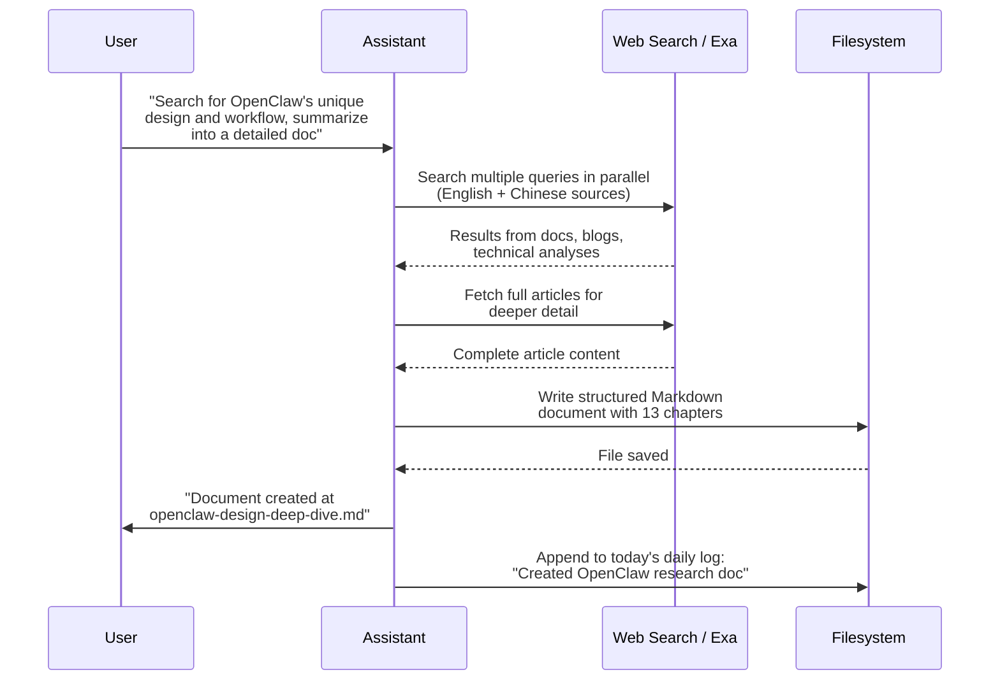

The assistant decomposes the research goal into parallel search queries (English and Chinese), fetches full articles rather than snippets, synthesizes a structured document with diagrams and citations, and logs the session output in the daily memory log.

### Daily Assistant: Project Scaffolding from a Design Reference

**Scenario**: I have a reference architecture document and want to turn it into a working project structure with all the right files and conventions.

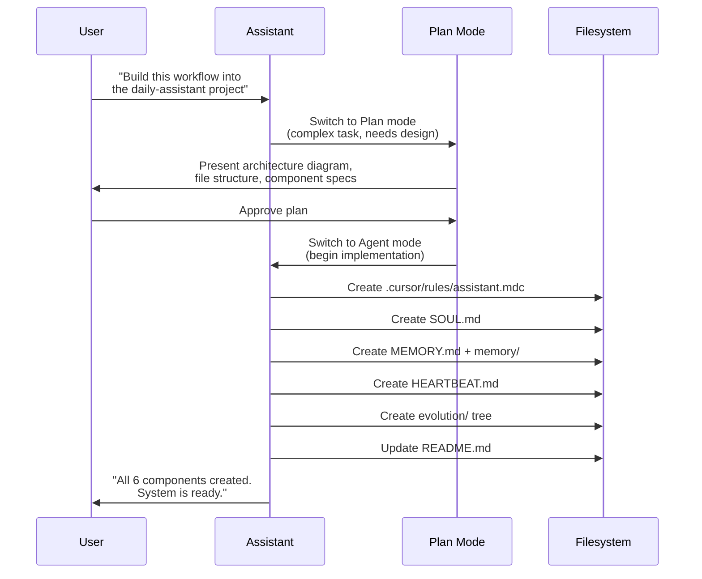

The assistant recognizes this is an architectural task, switches to Plan mode first, presents a structured plan with diagrams for user review, and after approval implements each component systematically while tracking progress via a todo list.

### Daily Assistant: Self-Evolution Session

**Scenario**: After a week of daily use, I ask the assistant to review itself and propose improvements.

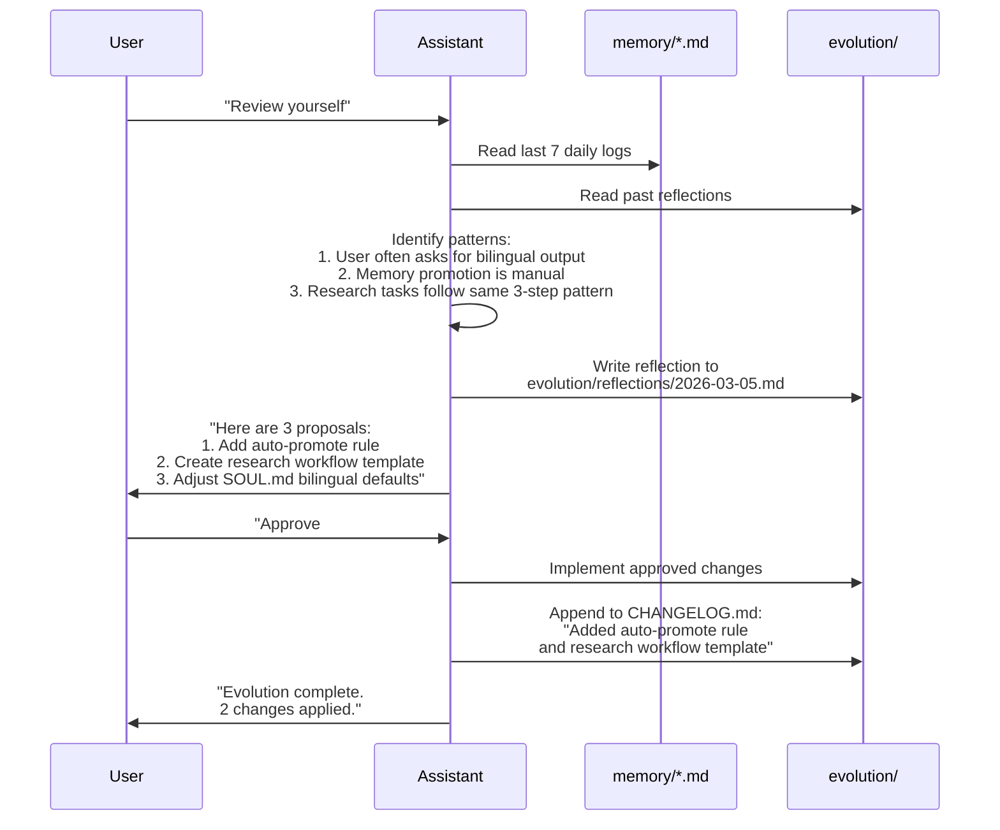

### Daily Assistant: On-Demand Health Check (Heartbeat)

**Scenario**: I want to make sure nothing has fallen through the cracks.

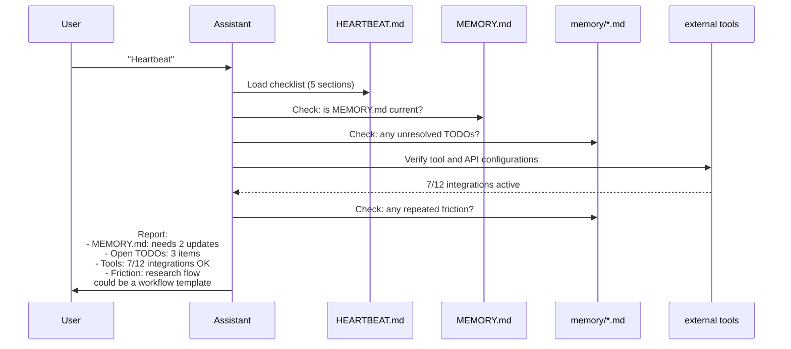

### bip: Shipping a Build-in-Public Update

**Scenario**: I just shipped a meaningful feature and want to share the progress without spending time writing platform-specific posts.

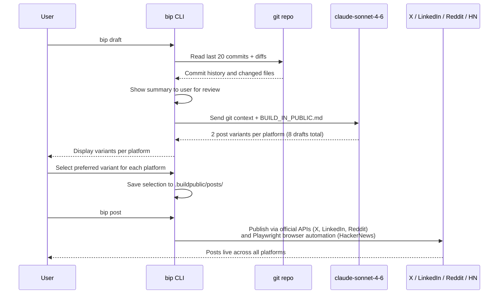

bip handles everything from reading the git context through to publishing. The `BUILD_IN_PUBLIC.md` file is what gives Claude the project context it needs to write good posts. The more detail you put into that file (audience, tone, what you care about), the better the generated variants become. Drafts are saved as JSON in `.buildpublic/posts/` so you can revisit them with `bip history` or republish later.

---

## Roadmap

### Daily Assistant

| Improvement | Description | Status |
|-------------|-------------|--------|
| **Research workflow template** | A reusable `workflows/research.md` that standardizes the multi-source research and synthesis process | Shipped |
| **Auto memory promotion** | A rule that, at the end of each session, scans today's daily log and proposes promoting stable facts to `MEMORY.md` | Shipped |
| **Git integration** | Auto-commit memory and evolution changes so the full history is versioned | Shipped |
| **Weekly review workflow** | A structured template for weekly planning and retrospectives | Near-term |
| **Local cron via launchd** | A small shell script that runs daily, opens Cursor, and triggers a heartbeat check automatically | Medium-term |
| **Semantic memory search** | Add a lightweight local embedding index (e.g., `sqlite-vec`) over `memory/` files so the assistant can search by meaning, not just read sequentially | Medium-term |
| **Multi-workspace support** | Extend the system to work across multiple Cursor projects with a shared `MEMORY.md` | Medium-term |

### bip

| Improvement | Description | Status |
|-------------|-------------|--------|
| **Core draft and post pipeline** | Git context to Claude to platform-specific JSON drafts to published posts | Shipped |
| **Multi-platform support** | X, LinkedIn, Reddit (official APIs), HackerNews (Playwright) | Shipped |
| **Dry-run mode** | Preview posts with character counts before any API calls | Shipped |
| **Draft history** | Browse and republish past drafts with `bip history` | Shipped |
| **Screenshot and recording** | `bip capture screenshot` and `bip capture record` for visual assets | Shipped |
| **Post performance tracking** | Feed engagement data (likes, replies, upvotes) back into the draft pipeline to improve future prompts | Near-term |
| **Multi-project mode** | Separate `BUILD_IN_PUBLIC.md` briefs per repo with shared platform credentials | Medium-term |
| **Scheduled posting** | Queue posts for a specific time via a local daemon | Long-term |

### The Hybrid Vision

Looking further out, these three tools can compose into a coherent local-first developer workflow:

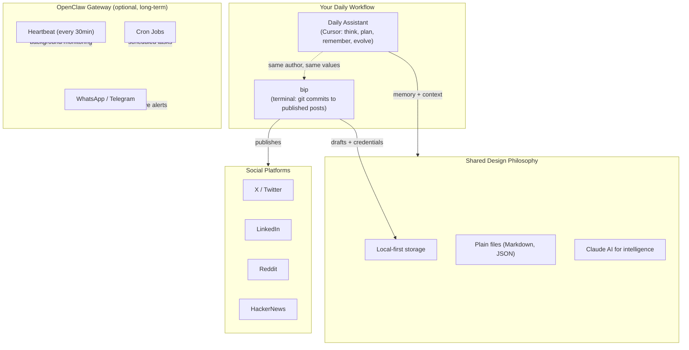

Daily Assistant handles the IDE-centric workflow (coding, research, documentation, reflection). bip handles social sharing from git activity. OpenClaw, if you choose to add it, handles everything that needs to happen when you are away from your computer (proactive notifications, scheduled checks, multi-channel access). They do not share a common data layer today, but all three are designed around plain local files, which keeps future integration tractable.

---

## Lessons Learned

### Start with the workflow, not the technology

I did not start by asking "what framework should I use?" I started by asking "what does my actual daily workflow look like, and where does an AI assistant add the most value?" The answer was: inside my IDE, where I spend 8+ hours a day. That immediately ruled out 80% of OpenClaw's feature set and pointed toward a much simpler solution. The same thinking applied to bip: the bottleneck in building in public is not publishing mechanics, it is having the context to write good posts quickly. Starting from that problem led directly to a git-reading, Claude-powered CLI rather than a scheduling tool.

### Transparency is a feature, not a constraint

Making every piece of state a readable file is not a limitation. It is a product advantage. I can audit Daily Assistant's memory in 30 seconds. I can edit its personality with a text editor. I can see exactly what changed and when by reading `git log`. bip follows the same principle: drafts are plain JSON, credentials are a local config file, and the project brief is a Markdown document. This level of transparency builds trust in a way that opaque services cannot.

### Evolution needs structure, not just capability

OpenClaw gives agents the capability to learn (memory files, personality configs, workspace skills). But capability without process leads to ad-hoc, hard-to-audit changes. By adding a formal evolution workflow with reflections, proposals, approvals, and a changelog, I turned a vague "the AI learns" promise into a concrete, trackable process.

### The best v1 is the one you actually use

A full OpenClaw deployment would have taken a day to set up and would require ongoing maintenance. Daily Assistant took about 2 minutes to set up. bip took one focused session to scaffold (`npm install -g build-in-public` and a few command implementations) and started providing value immediately. The "simpler" technology choice was the better product choice because the tools actually get used every day.

### Design for composability, not completeness

By keeping both systems simple and file-based, the option to integrate them later remains open. Daily Assistant could, in principle, surface a reminder to run `bip draft` after a productive session. bip could, in principle, read notes from `MEMORY.md` to improve post context. Neither integration exists today, but it would be straightforward to add because both tools are built around plain files and clear interfaces. Simple, file-based systems compose well.

---

## Conclusion

Daily Assistant and bip are two different answers to the same underlying question: how do you make AI assistance useful for an individual developer's real daily workflow, without the overhead of a full platform?

OpenClaw is a remarkable piece of engineering with 230,000+ stars for good reason. But for a single user, working in a single IDE, a handful of Markdown files and a well-designed Cursor rule delivers more value per unit of setup time than a full platform deployment. And for building in public consistently, a focused CLI that reads your git history and calls Claude delivers more value than manually opening each social platform and writing from scratch.

The key insight across all three tools is that local-first, file-based design is not a limitation of ambition. It is a deliberate product choice that trades scale for transparency, auditability, and composability. If you are a builder who spends most of your day in a code editor, I would encourage you to try both: fork the Daily Assistant repo, customize `SOUL.md` to your working style, and run `bip init` in your next project. See what happens when your AI assistant starts remembering and evolving alongside you, and every meaningful commit has a chance to become a post.

---

*Daily Assistant repository: [daily-assistant](https://github.com/cynthialmy/daily-assistant)*

*bip repository: [build-in-public-automate](https://github.com/cynthialmy/build-in-public-automate)*

*Inspired by: [OpenClaw](https://github.com/openclaw/openclaw) (235K+ stars)*
