[OpenClaw](https://github.com/openclaw/openclaw) hit 230,000 GitHub stars in early 2026 by treating AI assistants as an infrastructure problem: persistent identity, structured memory, tool orchestration, and 24/7 uptime across 50+ messaging channels. The architecture is impressive. It is also far more than I need.

As a product manager who works primarily inside a code editor, I wanted three things: an AI assistant that remembers what I care about, gets better at helping me over time, and stores all state in files I can read and audit. I did not need WhatsApp integration, Docker sandboxing, or a skill marketplace.

I built two tools. **Daily Assistant** is a lightweight, OpenClaw-inspired system that runs entirely as Markdown files and IDE rules. **[bip](https://github.com/cynthialmy/build-in-public-automate)** is a separate CLI that turns git commits into platform-tailored social posts. Both are local-first and file-based. They are architecturally independent but share a design philosophy: state you can read, audit, and version-control with git.

---

## Why I built my own instead of deploying OpenClaw

OpenClaw follows a hub-and-spoke architecture where a Gateway routes messages from any channel into a shared agent and memory backend:

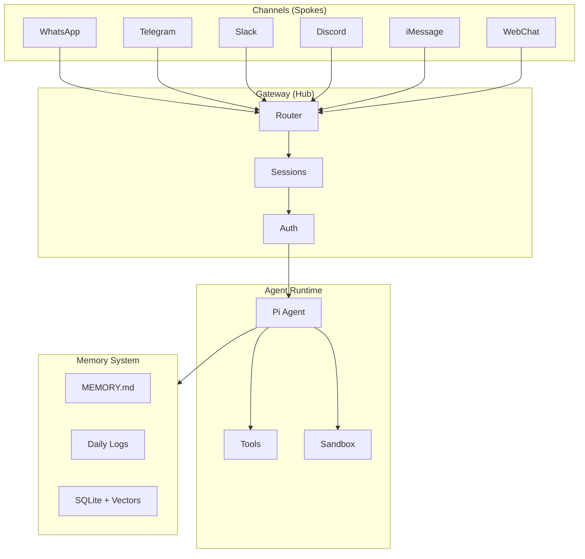
```mermaid
flowchart TB
    subgraph Channels ["Channels (Spokes)"]
        WA["WhatsApp"]
        TG["Telegram"]
        SL["Slack"]
        DC["Discord"]
        IM["iMessage"]
        WC["WebChat"]
    end

    WA & TG & SL & DC & IM & WC --> Router

    subgraph GW ["Gateway (Hub)"]
        Router["Router"]
        Sessions["Sessions"]
        Auth["Auth"]
        Router --> Sessions --> Auth
    end

    Auth --> Core

    subgraph Agent ["Agent Runtime"]
        Core["Pi Agent"]
        Core --> Tools["Tools"]
        Core --> Sandbox["Sandbox"]
    end

    Core --> Memory

    subgraph Memory ["Memory System"]
        MD["MEMORY.md"]
        Logs["Daily Logs"]
        DB["SQLite + Vectors"]
    end
```

The decision came down to three factors.

**Attack surface vs. need.** In February 2026, security researchers discovered the "ClawHavoc" incident: 341 malicious skills on ClawHub were stealing user data, and 283 skills (7.1%) had critical security flaws. My system has zero dependency on external skill registries. Every file is a plain Markdown document I can audit in a text editor.

**Complexity vs. use case.** OpenClaw requires Node.js 22+, a running daemon, channel configuration, and optionally Docker. I work almost exclusively inside one IDE. The 80% of OpenClaw's feature set I would never use was infrastructure I would still need to maintain.

**Auditability.** In OpenClaw, state is distributed across JSON configs, SQLite databases, credential stores, and session files. In my system, `git diff` shows exactly what changed and when. Every piece of state is a Markdown file I can read in 30 seconds.

---

## Daily Assistant: system design

The core insight is that the IDE already provides two of OpenClaw's four layers: the user interface (Gateway) and the LLM reasoning engine (Agent Runtime). What it leaves to you is the "operating system" layer: persistent identity, structured memory, and self-improvement mechanisms.

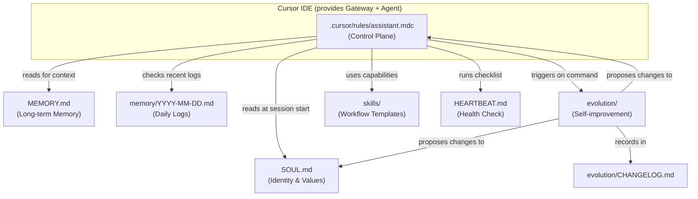
```mermaid
flowchart TB
    subgraph CursorIDE ["Cursor IDE (provides Gateway + Agent)"]
        Rule[".cursor/rules/assistant.mdc<br/>(Control Plane)"]
    end

    Rule -->|"reads at session start"| Soul["SOUL.md<br/>(Identity & Values)"]
    Rule -->|"reads for context"| Memory["MEMORY.md<br/>(Long-term Memory)"]
    Rule -->|"checks recent logs"| DailyLog["memory/YYYY-MM-DD.md<br/>(Daily Logs)"]
    Rule -->|"triggers on command"| Evolution["evolution/<br/>(Self-improvement)"]
    Rule -->|"uses capabilities"| Skills["skills/<br/>(Workflow Templates)"]
    Rule -->|"runs checklist"| Heartbeat["HEARTBEAT.md<br/>(Health Check)"]

    Evolution -->|"proposes changes to"| Soul
    Evolution -->|"proposes changes to"| Rule
    Evolution -->|"records in"| Changelog["evolution/CHANGELOG.md"]
```

The system has five components.

**Control plane** (`.cursor/rules/assistant.mdc`): Loaded automatically when the project opens. Defines boot sequence (read SOUL.md, MEMORY.md, recent logs), the ReAct working loop for non-trivial tasks, memory rules (what goes where), evolution triggers, and heartbeat protocol. This one file is the functional equivalent of OpenClaw's Gateway.

**Identity** (`SOUL.md`): Five core values (correctness over speed, root-cause thinking, local-first privacy, evolvability, honesty about uncertainty) and explicit boundaries (no destructive commands without confirmation, no silent changes to core files). Inspired directly by OpenClaw's SOUL.md concept.

**Memory** (`MEMORY.md` + `memory/`): Two-tier architecture. Daily logs are append-only, one file per day, high volume. Long-term memory is curated, stable facts that get promoted from daily logs when they prove persistent.

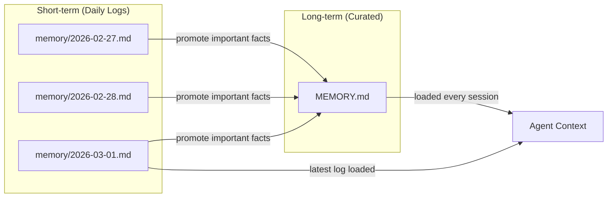
```mermaid
flowchart LR
    subgraph ShortTerm ["Short-term (Daily Logs)"]
        D1["memory/2026-02-27.md"]
        D2["memory/2026-02-28.md"]
        D3["memory/2026-03-01.md"]
    end

    subgraph LongTerm ["Long-term (Curated)"]
        Mem["MEMORY.md"]
    end

    D1 -->|"promote important facts"| Mem
    D2 -->|"promote important facts"| Mem
    D3 -->|"promote important facts"| Mem

    Mem -->|"loaded every session"| Agent["Agent Context"]
    D3 -->|"latest log loaded"| Agent
```

**Health checks** (`HEARTBEAT.md`): A structured checklist covering memory hygiene, open loops, tool status, workflow friction, and evolution hooks. Unlike OpenClaw's timer-based Heartbeat, this is pull-based. Zero background processes.

**Self-evolution** (`evolution/`): The most distinctive component. When triggered, the assistant reads recent daily logs, identifies recurring patterns (repeated pain points, re-derived instructions, emerging work habits), drafts a reflection, and proposes concrete changes to SOUL.md, rules, or workflow templates. Every modification goes through explicit user approval and gets logged with a timestamp and rationale.

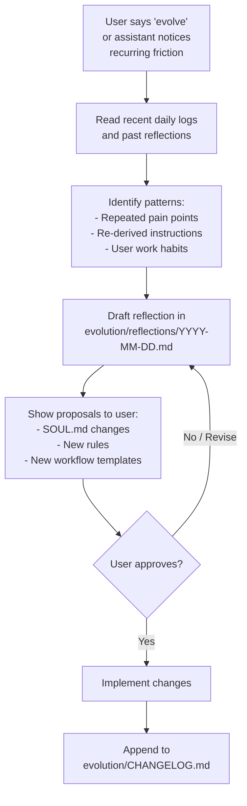
```mermaid
flowchart TD
    Trigger["User says 'evolve'<br/>or assistant notices<br/>recurring friction"]
    ReadLogs["Read recent daily logs<br/>and past reflections"]
    Identify["Identify patterns:<br/>- Repeated pain points<br/>- Re-derived instructions<br/>- User work habits"]
    Draft["Draft reflection in<br/>evolution/reflections/YYYY-MM-DD.md"]
    Propose["Show proposals to user:<br/>- SOUL.md changes<br/>- New rules<br/>- New workflow templates"]
    Approve{"User approves?"}
    Implement["Implement changes"]
    Log["Append to<br/>evolution/CHANGELOG.md"]

    Trigger --> ReadLogs
    ReadLogs --> Identify
    Identify --> Draft
    Draft --> Propose
    Propose --> Approve
    Approve -->|Yes| Implement
    Approve -->|No / Revise| Draft
    Implement --> Log
```

> **Design Decision: Pull Based Evolution vs. Continuous Learning**
>
> OpenClaw agents can modify their own memory and behavior continuously. In early experiments with that approach, changes accumulated without clear rationale, and it became hard to trace why the assistant behaved differently from a week ago. Adding a formal evolution workflow (reflection, proposal, approval, changelog) turned "the AI learns" from a vague promise into a process I can audit. The tradeoff is that the assistant cannot proactively improve between sessions. I accepted that for the auditability gain.

---

## What happened after a month of daily use

After four weeks, the evolution changelog had seven entries. Three were memory promotions (stable preferences moved from daily logs to MEMORY.md). Two were new workflow templates (a research synthesis workflow and a weekly review template) that the assistant proposed after seeing me repeat the same 3-step pattern across multiple sessions. One was a SOUL.md adjustment to default to bilingual output. One was a rule change to auto-suggest memory promotion at the end of each session.

The system did not transform my productivity. It saved 10-15 minutes per session on context re-establishment (the assistant already knew my preferences, project state, and active TODOs) and caught open loops I had forgotten about during health checks. The primary value was consistency: the assistant's behavior improved incrementally and traceably, and I never had to re-explain the same preference twice.

---

## Example: Research and document synthesis

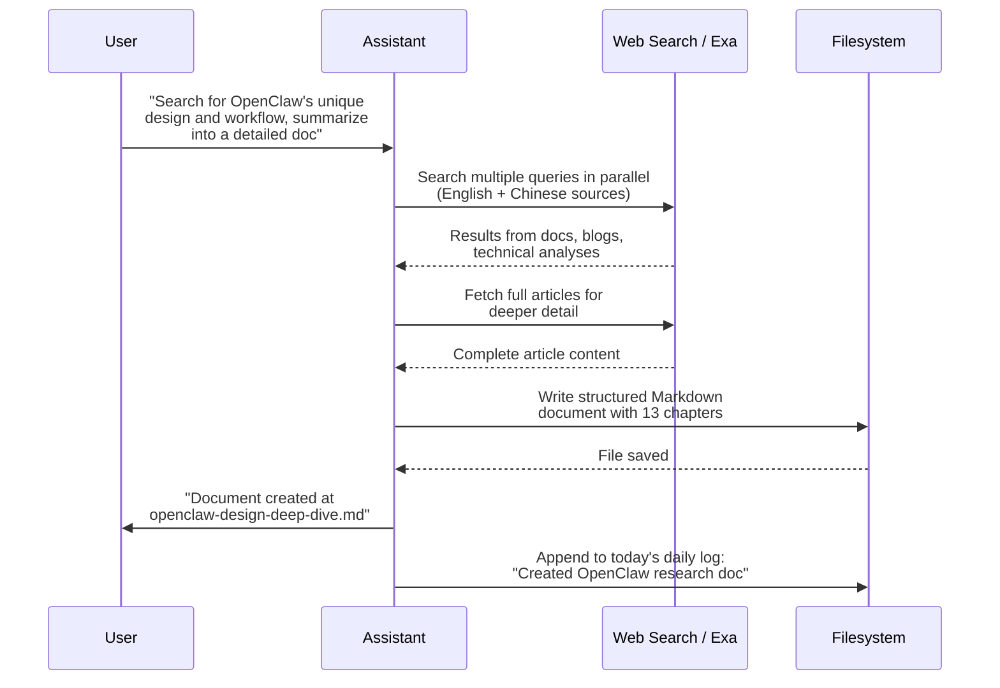
```mermaid
sequenceDiagram
    participant User
    participant Assistant
    participant Web as Web Search / Exa
    participant FS as Filesystem

    User->>Assistant: "Search for OpenClaw's unique<br/>design and workflow, summarize<br/>into a detailed doc"
    Assistant->>Web: Search multiple queries in parallel<br/>(English + Chinese sources)
    Web-->>Assistant: Results from docs, blogs,<br/>technical analyses
    Assistant->>Web: Fetch full articles for<br/>deeper detail
    Web-->>Assistant: Complete article content
    Assistant->>FS: Write structured Markdown<br/>document with 13 chapters
    FS-->>Assistant: File saved
    Assistant->>User: "Document created at<br/>openclaw-design-deep-dive.md"
    Assistant->>FS: Append to today's daily log:<br/>"Created OpenClaw research doc"
```

The assistant decomposes research goals into parallel search queries, fetches full articles, synthesizes a structured document, and logs the session in the daily memory log.

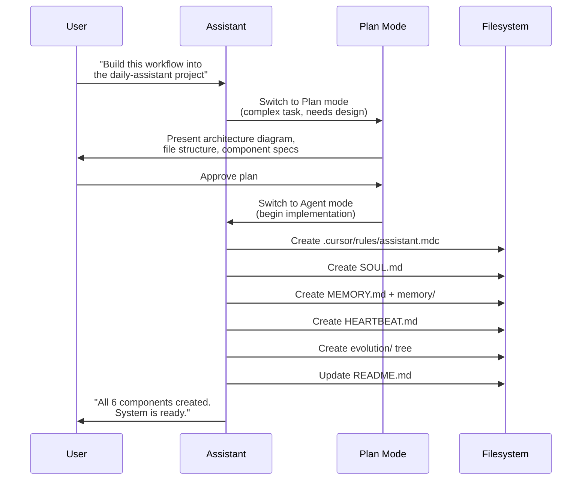
```mermaid
sequenceDiagram
    participant User
    participant Assistant
    participant Plan as Plan Mode
    participant FS as Filesystem

    User->>Assistant: "Build this workflow into<br/>the daily-assistant project"
    Assistant->>Plan: Switch to Plan mode<br/>(complex task, needs design)
    Plan->>User: Present architecture diagram,<br/>file structure, component specs
    User->>Plan: Approve plan
    Plan->>Assistant: Switch to Agent mode<br/>(begin implementation)
    Assistant->>FS: Create .cursor/rules/assistant.mdc
    Assistant->>FS: Create SOUL.md
    Assistant->>FS: Create MEMORY.md + memory/
    Assistant->>FS: Create HEARTBEAT.md
    Assistant->>FS: Create evolution/ tree
    Assistant->>FS: Update README.md
    Assistant->>User: "All 6 components created.<br/>System is ready."
```

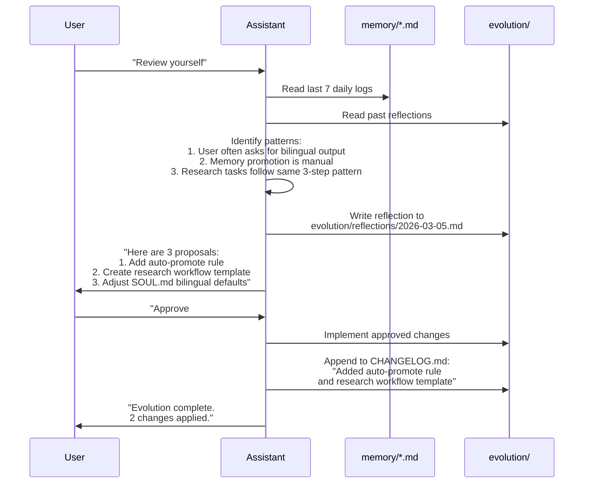
```mermaid
sequenceDiagram
    participant User
    participant Assistant
    participant Logs as memory/*.md
    participant Evo as evolution/

    User->>Assistant: "Review yourself"
    Assistant->>Logs: Read last 7 daily logs
    Assistant->>Evo: Read past reflections
    Assistant->>Assistant: Identify patterns:<br/>1. User often asks for bilingual output<br/>2. Memory promotion is manual<br/>3. Research tasks follow same 3-step pattern
    Assistant->>Evo: Write reflection to<br/>evolution/reflections/2026-03-05.md
    Assistant->>User: "Here are 3 proposals:<br/>1. Add auto-promote rule<br/>2. Create research workflow template<br/>3. Adjust SOUL.md bilingual defaults"
    User->>Assistant: "Approve #1 and #2,<br/>skip #3"
    Assistant->>Evo: Implement approved changes
    Assistant->>Evo: Append to CHANGELOG.md:<br/>"Added auto-promote rule<br/>and research workflow template"
    Assistant->>User: "Evolution complete.<br/>2 changes applied."
```

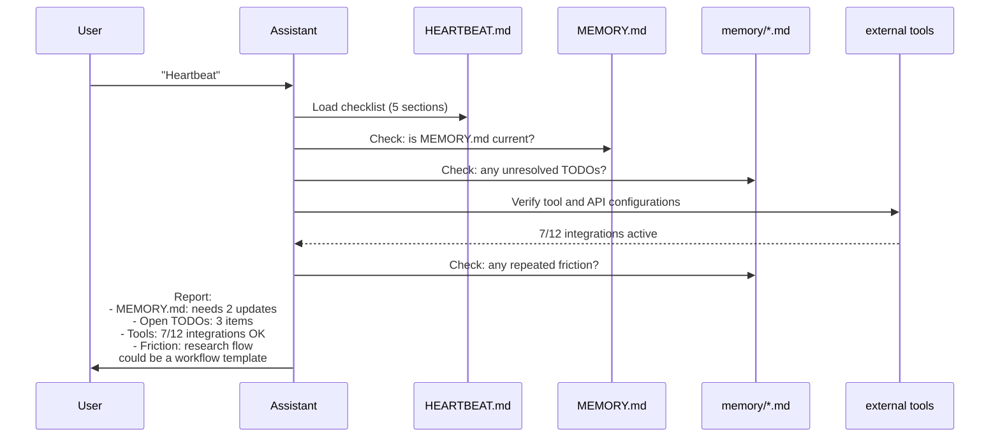
```mermaid
sequenceDiagram
    participant User
    participant Assistant
    participant HB as HEARTBEAT.md
    participant Mem as MEMORY.md
    participant Logs as memory/*.md
    participant Tools as external tools

    User->>Assistant: "Heartbeat"
    Assistant->>HB: Load checklist (5 sections)
    Assistant->>Mem: Check: is MEMORY.md current?
    Assistant->>Logs: Check: any unresolved TODOs?
    Assistant->>Tools: Verify tool and API configurations
    Tools-->>Assistant: 7/12 integrations active
    Assistant->>Logs: Check: any repeated friction?
    Assistant->>User: Report:<br/>- MEMORY.md: needs 2 updates<br/>- Open TODOs: 3 items<br/>- Tools: 7/12 integrations OK<br/>- Friction: research flow<br/>  could be a workflow template
```

---

## bip: Build in Public CLI

**[bip](https://github.com/cynthialmy/build-in-public-automate)** solves a different problem: the friction of sharing what you ship. It reads git history, generates platform-tailored posts with Claude, and publishes to X, LinkedIn, Reddit, and HackerNews in a single command.

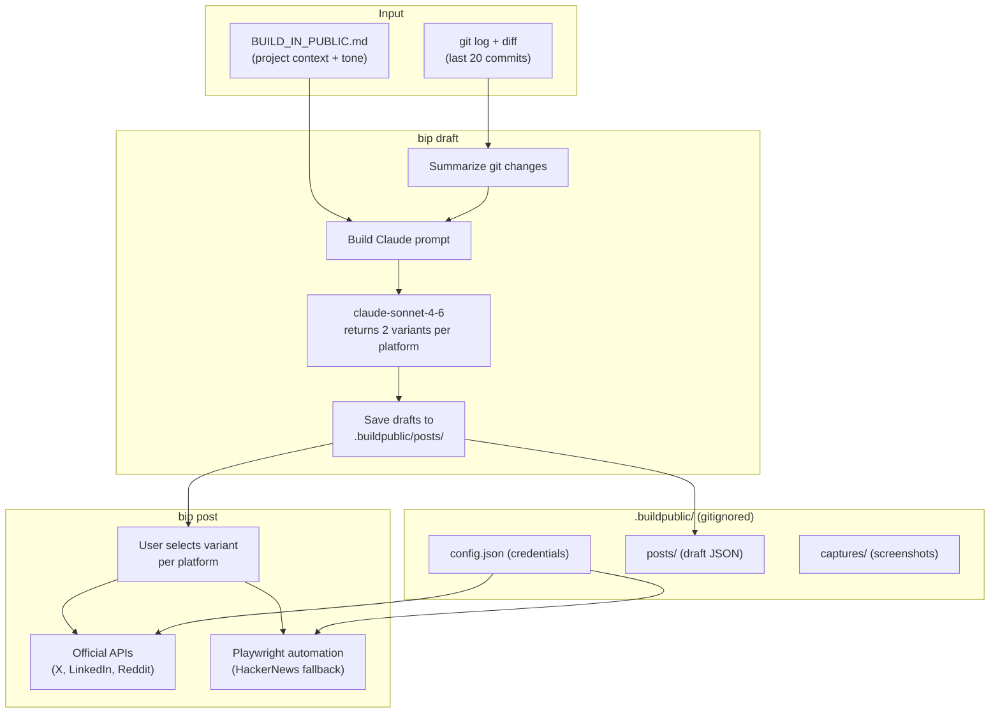
```mermaid
flowchart TB
    subgraph Input ["Input"]
        Git["git log + diff<br/>(last 20 commits)"]
        Brief["BUILD_IN_PUBLIC.md<br/>(project context + tone)"]
    end

    subgraph BipDraft ["bip draft"]
        Summarize["Summarize git changes"]
        Prompt["Build Claude prompt"]
        Generate["claude-sonnet-4-6<br/>returns 2 variants per platform"]
        Save["Save drafts to<br/>.buildpublic/posts/"]
    end

    subgraph BipPost ["bip post"]
        Pick["User selects variant<br/>per platform"]
        PublishAPI["Official APIs<br/>(X, LinkedIn, Reddit)"]
        PublishBrowser["Playwright automation<br/>(HackerNews fallback)"]
    end

    subgraph Local [".buildpublic/ (gitignored)"]
        Config["config.json (credentials)"]
        Posts["posts/ (draft JSON)"]
        Captures["captures/ (screenshots)"]
    end

    Git --> Summarize
    Brief --> Prompt
    Summarize --> Prompt
    Prompt --> Generate
    Generate --> Save
    Save --> Pick
    Pick --> PublishAPI
    Pick --> PublishBrowser
    Config --> PublishAPI
    Config --> PublishBrowser
    Save --> Posts
```

Core commands: `bip init` scaffolds project config. `bip draft` analyzes git and generates post variants. `bip post` publishes selected drafts. `bip post --dry-run` previews with character counts. All state lives in `.buildpublic/` (gitignored).

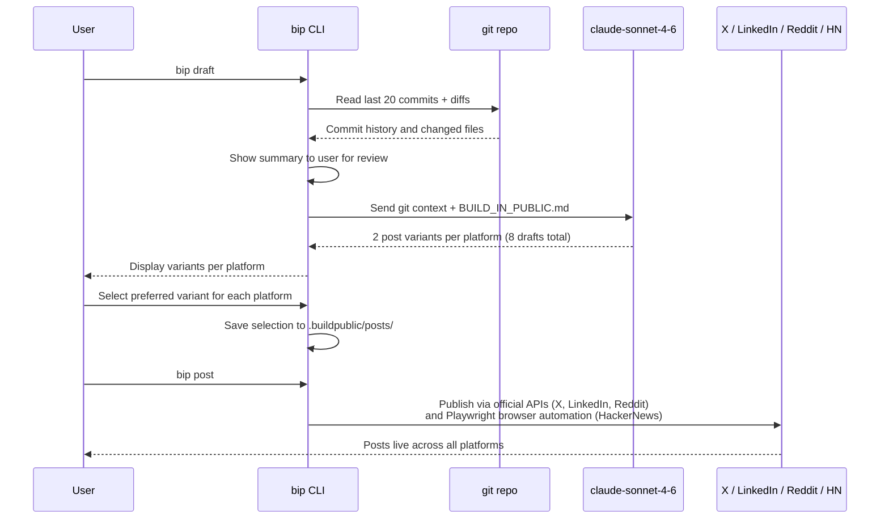
```mermaid
sequenceDiagram
    participant User
    participant BIP as bip CLI
    participant Git as git repo
    participant Claude as claude-sonnet-4-6
    participant Platforms as X / LinkedIn / Reddit / HN

    User->>BIP: bip draft
    BIP->>Git: Read last 20 commits + diffs
    Git-->>BIP: Commit history and changed files
    BIP->>BIP: Show summary to user for review
    BIP->>Claude: Send git context + BUILD_IN_PUBLIC.md
    Claude-->>BIP: 2 post variants per platform (8 drafts total)
    BIP-->>User: Display variants per platform
    User->>BIP: Select preferred variant for each platform
    BIP->>BIP: Save selection to .buildpublic/posts/
    User->>BIP: bip post
    BIP->>Platforms: Publish via official APIs (X, LinkedIn, Reddit)<br/>and Playwright browser automation (HackerNews)
    Platforms-->>User: Posts live across all platforms
```

---

## Honest comparison

| Capability | Daily Assistant | OpenClaw |
|------------|----------------|----------|
| **Interface** | Cursor IDE only | 15+ channels (WhatsApp, Telegram, Slack, Discord, iMessage, etc.) |
| **Deployment** | Zero setup (just open the project) | Node 22+ daemon, channel config, optional Docker |
| **Background execution** | None (pull-based) | 24/7 Gateway with Heartbeat and Cron |
| **Memory format** | Plain Markdown (human-readable) | Markdown + SQLite + vector embeddings |
| **Memory search** | File reading (sequential) | Hybrid: vector similarity + BM25 keyword |
| **Skill ecosystem** | Local Markdown workflow templates | ClawHub marketplace (5,700+ skills) |
| **Multi-agent** | Single agent | Multiple isolated agents with separate workspaces |
| **Security model** | File-level transparency + boundaries in SOUL.md | DM pairing, Docker sandbox, exec approval, Tailscale |
| **Self-evolution** | First-class workflow with reflection, approval, and changelog | Ad-hoc (no prescribed evolution process) |
| **Voice / Canvas** | Not supported | Voice Wake, Talk Mode, Live Canvas |
| **Mobile integration** | Not supported | iOS and Android nodes (camera, screen, location) |
| **Setup time** | About 2 minutes | 15 to 60 minutes depending on channels |

Daily Assistant wins on simplicity, transparency, and structured evolution. OpenClaw wins on channel reach, proactive execution, deep tool integration, and scalable memory. Each omission in Daily Assistant (no background execution, no multi-device access, no voice, no sandboxing) was a deliberate scoping choice that reduced complexity without reducing value for the target use case: a single user, single IDE, who prioritizes transparency over channel reach.

---

## Where these tools compose

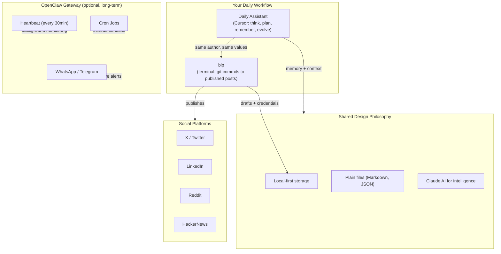
```mermaid
flowchart TB
    subgraph Daily ["Your Daily Workflow"]
        DA["Daily Assistant<br/>(Cursor: think, plan, remember, evolve)"]
        BIP["bip<br/>(terminal: git commits to published posts)"]
    end

    subgraph OC ["OpenClaw Gateway (optional, long-term)"]
        HB["Heartbeat (every 30min)"]
        Cron["Cron Jobs"]
        Channels["WhatsApp / Telegram"]
    end

    subgraph SharedFiles ["Shared Design Philosophy"]
        Local["Local-first storage"]
        PlainFiles["Plain files (Markdown, JSON)"]
        ClaudeAI["Claude AI for intelligence"]
    end

    subgraph Social ["Social Platforms"]
        X["X / Twitter"]
        LI["LinkedIn"]
        RD["Reddit"]
        HN["HackerNews"]
    end

    DA -.->|"same author, same values"| BIP
    DA -->|"memory + context"| SharedFiles
    BIP -->|"drafts + credentials"| Local
    BIP -->|"publishes"| Social
    OC -->|"proactive alerts"| Channels
    HB -->|"background monitoring"| OC
    Cron -->|"scheduled tasks"| OC
```

Daily Assistant handles the IDE-centric workflow (coding, research, documentation, reflection). bip handles social sharing from git activity. OpenClaw, if added later, handles background tasks that run away from the computer. Each tool keeps its own data layer; all three share plain local files as a design philosophy, which keeps future integration tractable.

---

## What I learned

**Start with the workflow, not the technology.** I asked "where does an AI assistant add the most value in my day?" The answer was inside my IDE, where I spend 8+ hours. That immediately ruled out 80% of OpenClaw's feature set.

**Evolution needs structure on top of capability.** OpenClaw gives agents the raw ability to learn. Capability without process led to ad-hoc, hard-to-audit changes in early experiments. Adding a formal workflow (reflection, proposal, approval, changelog) made self-improvement concrete and trackable.

**The best v1 is the one you actually use.** Daily Assistant took 2 minutes to set up. Full OpenClaw deployment would have taken a day plus ongoing maintenance. Lightweight setup made daily use realistic, which mattered more than feature breadth on paper.

**File-based systems compose well.** By keeping both tools simple and file-based, the option to integrate them later remains open. Neither integration exists today, but it would be straightforward because both tools operate on plain files with clear interfaces.

---

*Daily Assistant repository: [daily-assistant](https://github.com/cynthialmy/daily-assistant)*

*bip repository: [build-in-public-automate](https://github.com/cynthialmy/build-in-public-automate)*

*Inspired by: [OpenClaw](https://github.com/openclaw/openclaw) (235K+ stars)*
