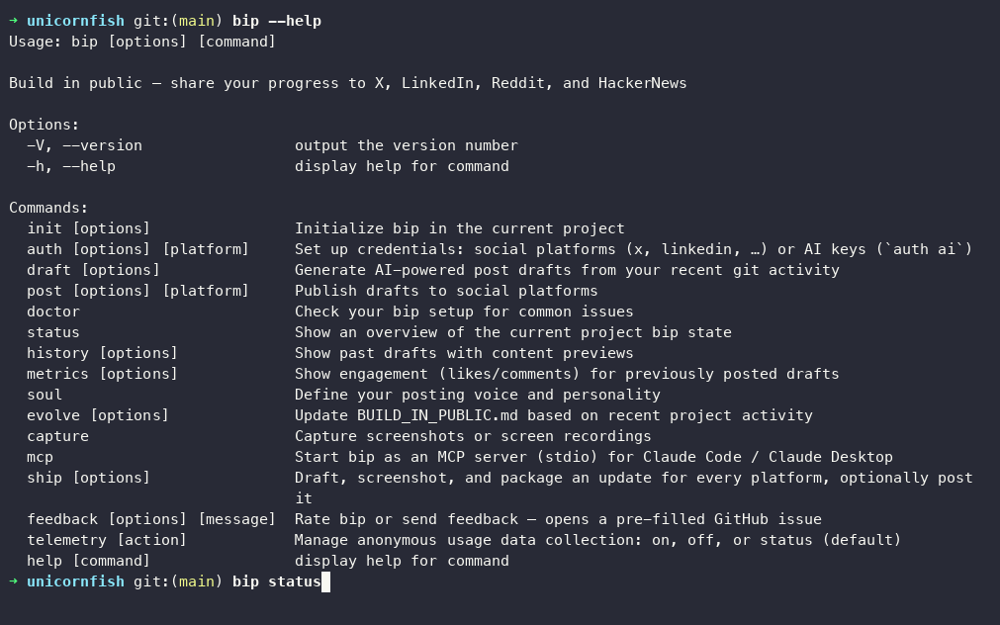

**[bip](https://github.com/cynthialmy/build-in-public-automate)** is a CLI that reads your git activity, drafts a post, and publishes it to X, LinkedIn, Reddit, or HackerNews from the terminal. Most builders I know ship constantly and rarely talk about it in public. bip turns the commits they already made into a first draft.

I wrote the first version in March 2026, published it to npm, and then left it alone for six months. In September I audited it, fixed what was broken, and launched it on LinkedIn. Between September 18 and 21 I shipped ten releases, from 0.4.0 to 0.9.1, and the package passed 1,000 downloads in the three days after the launch post.

Almost none of those releases were on the original roadmap. They came from people using it.

```bash
npm i -g build-in-public
```



---

## The Audit

Coming back to a six-month-old project meant reading it as a stranger would. The test suite was 82% broken on a clean install: 80 of 97 tests failing, two files that did not parse. I rewrote it to match the current code (120 passing) and added CI, which the project had never had.

The more useful findings were product bugs that tests had never covered:

| Bug | Why it mattered |
|-----|-----------------|
| Drafts diffed only the working tree | That tree is empty right after a commit, which is exactly when someone runs `bip draft`. Drafts had almost no context to work from. |
| Thread responses failed to parse | A non-greedy regex stopped at the first nested `]`, so every multi-post thread broke. |
| Screenshots were captured and never attached | The attachment field was written and never read. |

The first bug explains why early drafts felt generic. The model was writing from a commit message and nothing else. The fix was to diff the committed range since the last post, so drafts can name real specifics.

---

## Designing for the First Five Minutes

The original setup path was init, voice questionnaire, LLM key, platform auth, draft, post. Nobody saw a single generated post until they had finished all six steps. I made three changes before launch:

* **`bip draft --preview`** generates one post from your git history with only an LLM key. No init, no social credentials, nothing saved.
* **Archetypes at init.** Instead of a blank voice file, `bip init` offers three starting voices (solo dev, indie SaaS founder, career-visibility engineer). A blank template plus an AI with no voice produces the generic filler the tool is meant to avoid.
* **Manual copy-paste export.** Most people do not have a developer account on X or LinkedIn, and getting one is a project of its own. `bip post` now offers to save a ready-to-paste text file for each platform. I found this one while using bip to write its own launch post.

---

## Where Automation Stops

bip writes content that goes out under a person's name, so I decided early which steps it would never take on its own.

| Boundary | Decision |
|----------|----------|
| Publishing | Always interactive and reviewed. The MCP server exposes ten tools and has no `post` tool, so a coding agent can draft but cannot publish. |
| Reddit | Posting refuses to run until you pick a subreddit. The old default was r/programming, where AI-drafted self-promotion gets people banned. |
| LinkedIn metrics | Reported as unsupported. Personal-post analytics need partner API access, so bip says so instead of returning nothing. |
| Style | The system prompt bans em dashes and stock AI phrasing, and asks every draft to end with something that invites a reply. |

`bip ship`, added later in the week, follows the same rule. It drafts every platform, takes screenshots, and packages a folder, then asks platform by platform before posting anything.

---

## Launch Week

The launch post went up on September 19. Each release after it responded to something a user said, or to something I saw them hit.

| Release | Trigger | Change |
|---------|---------|--------|
| 0.5.0 | "Why does a tool for developers need its own LLM API key?" | Drafting through the coding agent you already run (Claude Code, Cursor, Copilot, Codex). An MCP server, a Claude Code skill installed by `bip init`, and screenshots cropped per platform. |
| 0.6.0 | Recordings came out as webm, which X and LinkedIn reject | Export to mp4 and GIF. |
| 0.7.0 | People hit problems and never opened a GitHub issue | `bip feedback` (a rating takes one command) and opt-out anonymous telemetry. |
| 0.8.0 | Drafting, screenshots, and packaging were separate steps | `bip ship`: draft, screenshot, and package in one pass. |
| 0.8.1 | First `bip ship` on a fresh machine failed every screenshot | Auto-install the Playwright browser on first capture. |
| 0.9.0 | "Does this work for CLI tools?" It did not. | `bip capture terminal` records a live terminal session as a GIF. |
| 0.9.1 | The auto-install from 0.8.1 never ran for a user | Fixed the install check itself. |

The 0.5.0 change mattered most. My original assumption was that every user would bring an API key. The people downloading bip already had a capable model open all day. So I split drafting in two: bip gathers the git activity, project context, voice, and platform strategy, and whichever agent is running writes the text. bip's own API key path still works for anyone without an agent.

### The bug in the fix

0.9.1 is the one I learned the most from. A user on 0.9.0 reported the exact error the 0.8.1 auto-install was supposed to prevent, with no "Installing browser" message anywhere.

The check asked Playwright for the browser's executable path and treated a non-empty answer as "installed." Playwright returns a computed path whether the file exists or not, so the check always passed and the install never ran. `bip doctor` had the same bug and could show a false green checkmark. Both now check that the file exists on disk, and a regression test covers that exact case.

The 0.8.1 tests passed because the mock assumed Playwright throws an error when the browser is missing. It does not. Only a fresh machine caught it.

### Telemetry with a narrow scope

Adding telemetry to a tool that reads your git history needs a clear line. bip records which commands run and the OS, Node, and bip versions, tied to a random install ID. It never sends git content, drafts, file paths, credentials, or email. It is opt-out with `bip telemetry off` or `BIP_TELEMETRY=0`, and the first run shows a one-time notice.

---

## Outcomes

npm counted 1,356 downloads from September 19 to 21, 802 of them on the third day.

| Metric | Before the audit | End of launch week |
|--------|------------------|--------------------|
| Releases | Four, all in March | Ten in four days |
| Passing tests | 17 of 97 | 401 |
| Ways to draft | bip's own API key | Your coding agent, MCP, or bip's own key |

---

## What This Project Taught Me

I would not have predicted most of launch week's roadmap. The API key complaint, the webm problem, and the terminal request each took one real user to surface, and each shipped the same week. That speed is only safe with a working test suite and CI, which is why the audit came before the launch post.

The second lesson is that silent users are the default. Downloads kept climbing while GitHub issues stayed at zero. `bip feedback` and telemetry exist because the people who hit a problem mostly just left.

The third is that an install check can be wrong in the same way as the thing it checks. Now I test the failure path on a clean machine before I call a fix done.

---

## What's Next

* **Scripted terminal capture**, so a demo can be recorded without typing it live.
* **Drafts that learn from reach.** `bip metrics` pulls engagement back, but drafts still learn from how you edit, not from what landed.
* **Validating the roadmap with users.** The phases so far came from my own use and a few direct requests, not structured interviews. Feedback and telemetry are the first real data to test them against.

Try it with `npm i -g build-in-public`, or read the source on [GitHub](https://github.com/cynthialmy/build-in-public-automate).
